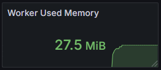

# Observability Construction for Curvine
Curvine as a high-performance distributed cache system has strict requirements for performance, stability, and reliability. To ensure the system maintains optimal performance under various load conditions and to quickly locate and resolve potential issues, we have built a comprehensive monitoring solution based on Prometheus and Grafana. This monitoring system provides deep observability capabilities for Master nodes, Worker nodes, Fuse nodes, and S3 Gateway, enabling real-time monitoring of cache cluster scale, operational status, performance metrics, and resource usage through the collection of key metrics from each component.

## Monitoring Architecture

This monitoring system adopts the following core components:

- **Prometheus**: Responsible for metric collection, storage, and querying
- **Grafana**: Provides data visualization and dashboard display

## Observability Metrics
### Master Node Metrics

As the cluster's metadata management center, Master nodes provide the following key metrics:

#### Capacity Metrics

Capacity metrics are fundamental for evaluating system storage resource usage, crucial for capacity planning, resource optimization, and preventive maintenance. By monitoring these metrics, storage bottlenecks can be identified in a timely manner, capacity requirements can be predicted, and sufficient space can be ensured to handle business growth.

| Metric Name | Description |
|-------------|-------------|
| inode_dir_num | Number of directories |
| inode_file_num | Number of files |
| num_blocks | Total number of blocks |
| blocks_size_avg | Average block size |
| capacity | Total storage capacity |
| available | Available storage space |
| fs_used | File system used space |

#### Resource Metrics

Resource metrics reflect the system's usage of computing resources, significant for performance tuning, resource allocation, and fault prevention. Memory usage directly affects system performance and stability, especially for RocksDB as the core storage engine, whose memory usage needs precise monitoring to avoid memory overflow and performance degradation.

| Metric Name | Description |
|-------------|-------------|
| used_memory_bytes | Used memory in bytes |
| rocksdb_used_memory_bytes | RocksDB memory usage |

#### Cluster Status Metrics

Cluster status metrics provide a real-time view of the overall system health, crucial for ensuring high availability and data consistency. By monitoring Worker node status and replication task execution, node failures, data inconsistencies, and other issues can be quickly identified, ensuring reliable operation of the distributed cache system.

| Metric Name | Description |
|-------------|-------------|
| worker_num | Number of workers (classified by status) |
| replication_staging_number | Number of blocks waiting for replication |
| replication_inflight_number | Number of blocks currently being replicated |
| replication_failure_count | Total cumulative replication failures |

#### Performance Metrics

Performance metrics are core indicators for measuring system responsiveness and processing efficiency, playing a key role in performance optimization and capacity planning. The total count and total time of RPC requests can be used to calculate average response time, directly reflecting system processing capability, while analysis of various operation durations helps identify performance bottlenecks and guide system optimization.

| Metric Name | Description |
|-------------|-------------|
| rpc_request_total_count | Total RPC request count |
| rpc_request_total_time | Total RPC request time |
| operation_duration | Operation duration (classified by type, excluding heartbeat) |

#### Journal System Metrics

The Journal system is a key component for ensuring data consistency and fault recovery, and its performance directly affects system write performance and data reliability. Monitoring Journal queue length and flush performance can help identify write bottlenecks in a timely manner, prevent data loss risks, and ensure system stability in high-concurrency write scenarios.

| Metric Name | Description |
|-------------|-------------|
| journal_queue_len | Journal queue length |
| journal_flush_count | Journal flush count |
| journal_flush_time | Journal flush time |

### Client Metrics (Fuse/S3 Gateway)

Fuse and S3 Gateway metrics are collected through Client

#### Cache Metrics

Cache metrics directly reflect the core value of the cache system - improving access performance. Mount cache hit rate is a key indicator for measuring cache effectiveness, where high hit rates mean fewer backend accesses and faster response speeds. These metrics are crucial for evaluating cache strategy effectiveness and optimizing cache configuration.

| Metric Name | Description |
|-------------|-------------|
| client_mount_cache_hits | Mount cache hit count |
| client_mount_cache_misses | Mount cache miss count |

#### I/O Metrics

I/O metrics are core data for evaluating system read/write performance, providing guidance for performance tuning and capacity planning. By monitoring read/write bytes and duration, read/write throughput can be calculated, accurately assessing system I/O performance bottlenecks, optimizing storage strategies, and ensuring stable performance in high-concurrency access scenarios.

| Metric Name | Description |
|-------------|-------------|
| client_write_bytes | Write bytes |
| client_write_time_us | Write time (microseconds) |
| client_read_bytes | Read bytes |
| client_read_time_us | Read time (microseconds) |

#### Metadata Operation Metrics

Metadata operation performance directly affects file system response speed, crucial for improving user experience and overall system performance. Analysis of metadata operation duration helps identify metadata management bottlenecks, optimize directory structure, and improve file system operation efficiency.

| Metric Name | Description |
|-------------|-------------|
| client_metadata_operation_duration | Metadata operation duration |

### Worker Node Metrics

As data storage nodes, Worker nodes provide comprehensive storage and performance metrics:

#### Capacity Metrics

Worker node capacity metrics are core to data storage management, playing a key role in load balancing, data migration, and capacity planning. By monitoring storage usage of each node, intelligent data distribution can be achieved, preventing single-point overload and ensuring optimal utilization of storage resources across the entire cache cluster.

| Metric Name | Description |
|-------------|-------------|
| capacity | Total storage capacity |
| available | Available storage space |
| fs_used | File system used space |
| num_blocks | Total number of blocks |
| num_blocks_to_delete | Number of blocks to be deleted |

#### I/O Metrics

Worker node I/O metrics reflect the actual performance of data storage, crucial for evaluating storage hardware efficiency and optimizing data access patterns. Detailed read/write statistics help identify hot data, optimize data layout, and improve overall storage performance and response speed.

| Metric Name | Description |
|-------------|-------------|
| write_bytes | Write bytes |
| write_time_us | Write time (microseconds) |
| write_count | Write count |
| write_blocks | Write blocks (classified by type) |
| read_bytes | Read bytes |
| read_time_us | Read time (microseconds) |
| read_count | Read count |
| read_blocks | Read blocks (classified by type) |

#### Resource Metrics

Worker node resource usage directly affects the stability and performance of data storage services, significant for resource scheduling and performance optimization. Reasonable memory usage is the foundation for ensuring data cache efficiency and needs precise monitoring to avoid resource competition and performance degradation.

| Metric Name | Description |
|-------------|-------------|
| used_memory_bytes | Used memory in bytes |

#### Hardware Status Metrics

Hardware status metrics are an important monitoring dimension for ensuring data reliability and system availability, crucial for preventive maintenance and rapid fault response. By monitoring disk health status in real-time, hardware failure risks can be identified early, enabling timely data migration and hardware replacement, ensuring data security and continuous availability of the cache system.

| Metric Name | Description |
|-------------|-------------|
| failed_disks | Number of failed storage devices |
| total_disks | Total number of storage disks |

## Global Dashboards
### Master

### Worker

### Client

## Summary

The observability design of the Curvine distributed cache system covers the complete chain from metadata management to data storage, achieving the following through fine-grained metric collection:

- **End-to-End Monitoring**: Complete monitoring from client requests to data storage, ensuring performance and status of each link are observable
- **Multi-Dimensional Observation**: Covering multiple dimensions including performance, capacity, and status, providing a comprehensive view of system health
- **Real-Time Alerting**: Real-time monitoring and alerting based on key metrics, enabling timely detection of anomalies and rapid response
- **Fault Diagnosis**: Detailed metric data supports rapid fault location, reducing fault recovery time
- **Performance Optimization**: Continuous monitoring and analysis provide data support for system performance tuning
- **Capacity Planning**: Based on historical trends and real-time data, providing decision-making basis for capacity expansion and resource optimization

Through this comprehensive monitoring system, Curvine can maintain high availability and high performance in complex distributed environments, providing users with stable and reliable cache services.