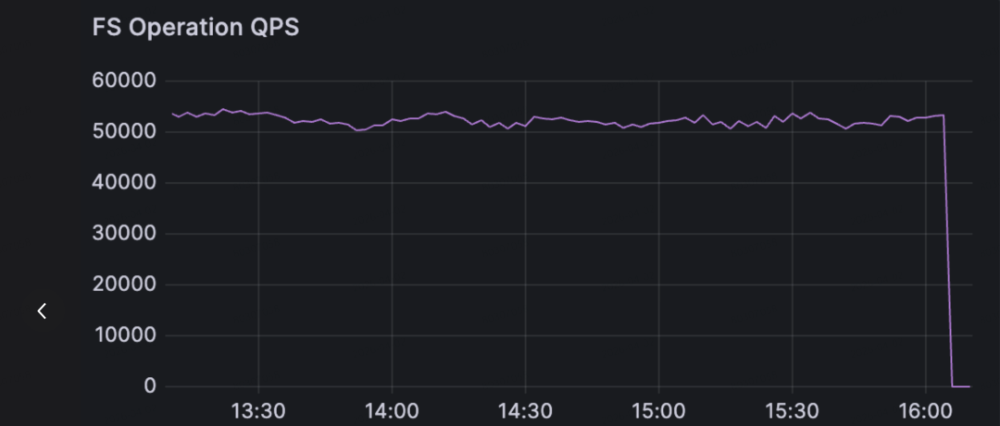
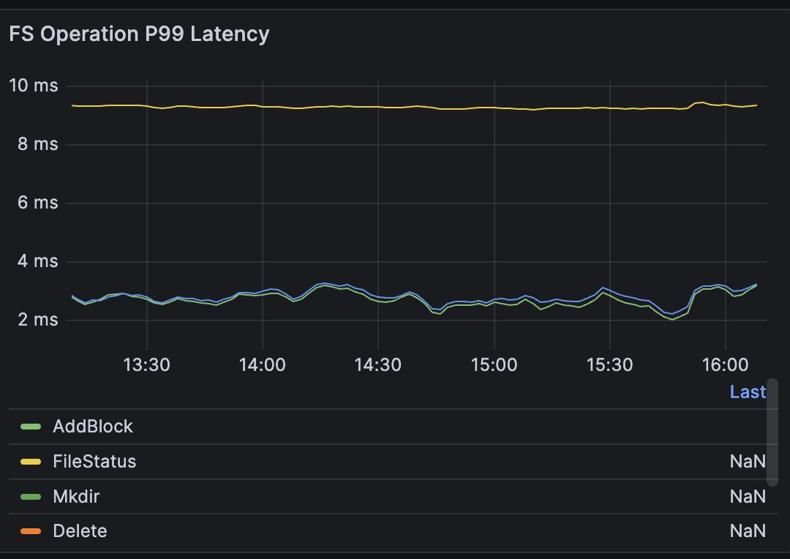
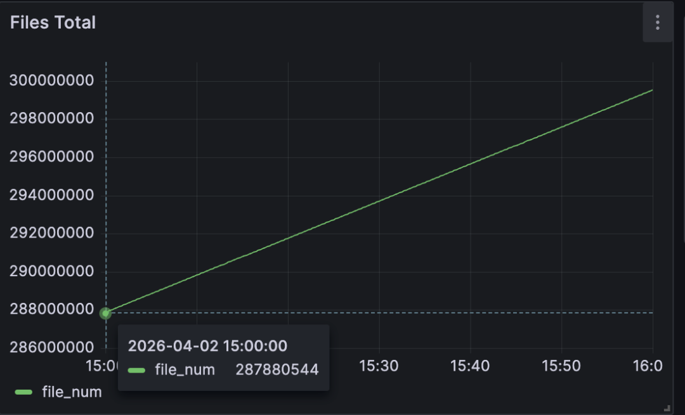
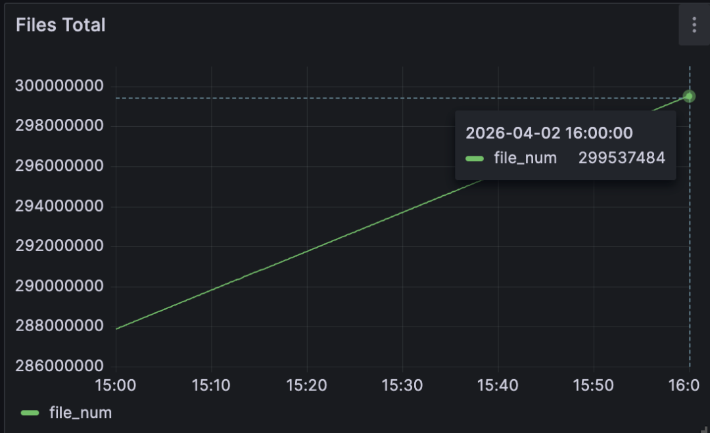

# Curvine Benchmark: 300 Million Files in Just 38 GB of Memory

*Translated from the original Chinese article published on April 6, 2026.*

In distributed file systems, metadata memory efficiency, concurrent request handling, and small-file throughput are core indicators of overall system capability. Curvine recently completed a high-intensity metadata benchmark, and the results were clear: Curvine reached a new high-water mark for open-source metadata efficiency while delivering core capabilities comparable to commercial distributed storage products.

### 🔥 Key Takeaways

- **Efficient memory usage**: With **800,000 directories** and **300 million files**, and one block written per file, Curvine used just **38 GB** of memory. That is roughly on par with the metadata-memory capability described for the commercial edition of JuiceFS in reference [1].
- **Low latency under massive concurrency**: With **100,000 clients** looping operations, throughput held steady at **53,000 ops/s**. Average command latency stayed **below 2 ms**, and **P99 latency stayed below 9 ms**.
- **High small-file throughput**: Under heavy concurrent small-file writes, Curvine sustained **12 million small files per hour**, with an average write time of **0.3 ms per file**.

## 📝 Test Setup

- **Curvine cluster**: one Master and one Worker
- **Benchmark machine**: Alibaba Cloud `ecs.i5.8xlarge`, 32 cores, 256 GB RAM
- **Clients**: 100,000 FUSE clients
- **Operations**: repeated high-frequency commands such as `mkdir`, `touch`, file writes, and `ls`

## 📊 Core Benchmark Results

### 🧠 Memory Efficiency: A New Open-Source High-Water Mark

- Managed scale: **800,000 directories + 300 million files**
- Per-file data written: **1 block**
- Total memory usage: **38 GB**
- Comparison point: comparable to the metadata-memory capability described for the commercial edition of JuiceFS

### ⏱️ High Concurrency, Low Latency at 100,000 Clients

- Concurrent clients: **100,000 FUSE clients**
- Stable throughput: **53,000 ops/s**
- Average latency: **up to 2 ms**
- P99 latency: **up to 9 ms**

Connection overhead was also low: **100,000 live connections consumed only 1.1 GB**, or about **11.5 KB per connection**.

Once the benchmark stopped, Master memory dropped immediately from **39.1 GB** back to **38 GB**.

### 🚀 Small-File Throughput: Built for Scale

- Files written per hour: **12 million small files**
- Average write time per file: **0.3 ms**
- Throughput remained saturated even under high concurrency

At **15:00**, Curvine had written **287 million files**:

At **16:00**, the total had reached **299 million files**:

## 🏗️ Metadata Architecture

Curvine's metadata subsystem stands out not just in large-scale memory efficiency and high-concurrency performance, but also in comparison with other open-source systems. Those results come from a deliberately designed metadata architecture.

### 💡 Design Principles

1. A single Master should support very large namespaces and massive numbers of small files.
2. The system should provide high concurrency and low latency for frequent operations such as create, delete, and update.
3. External dependencies should be minimized to reduce operational complexity while keeping the system stable.

Based on those goals, Curvine combines an **in-memory directory tree**, **standalone RocksDB**, and a **Raft-based consistency mechanism**. This three-layer design balances performance, scale, and stability.

| Layer | Core Responsibility | Why It Exists |
| --- | --- | --- |
| In-memory directory tree | Stores directory structure metadata such as directory names and parent-child relationships; handles path resolution, directory listing, and other high-frequency namespace operations | Keeps the hottest namespace operations in memory so directory lookups and path matching stay in the microsecond range; stores only lightweight directory structure to maximize scale |
| Metadata RocksDB (`inode` engine) | Persists complete file and directory metadata, including file size, permissions, `mtime`, block locations, and full directory relationships | Uses column families to separate different metadata types, improving read/write efficiency and making frequent metadata updates easier to manage |
| Raft log RocksDB | Persists the log of all metadata mutations, including create, delete, and update operations, in order for node-to-node synchronization | Separates log storage from metadata storage so replication, compaction, cleanup, and recovery do not interfere with metadata reads and writes |

### 🛡️ FsMode: Working with UFS for Safe Durability

Curvine also supports **FsMode**, which synchronizes metadata and file data to the underlying file system (UFS). This creates a dual safety model of **local storage plus disk-backed fallback**, preventing data loss without sacrificing runtime performance.

## 🚀 Future Directions

Curvine's metadata system will keep pushing forward in three areas:

1. **10 billion files on a single node**: continue deepening single-node capability until a standard **512 GB** memory machine can manage metadata for **10 billion files**.
2. **Federation**: improve cluster-scale metadata expansion with an HDFS Federation-like model that partitions by directory and can scale beyond **100 billion files**. Federation is especially strong for centralized metadata operations such as `mv` and `ls`, but it requires directory planning up front.
3. **Pluggable metadata management**: abstract the metadata interface and support pluggable metadata backends for better flexibility and adaptability.

## 📚 References

1. https://mp.weixin.qq.com/s/zbBUQ4P53PPWQjOHQmw8uw
2. https://hadoop.apache.org/docs/r3.4.0/hadoop-project-dist/hadoop-hdfs-rbf/HDFS%20RouterFederation.html

### 👇 Follow Us

We regularly share hands-on work on distributed storage, metadata optimization, and high-concurrency benchmarking.

GitHub: https://github.com/CurvineIO/curvine
