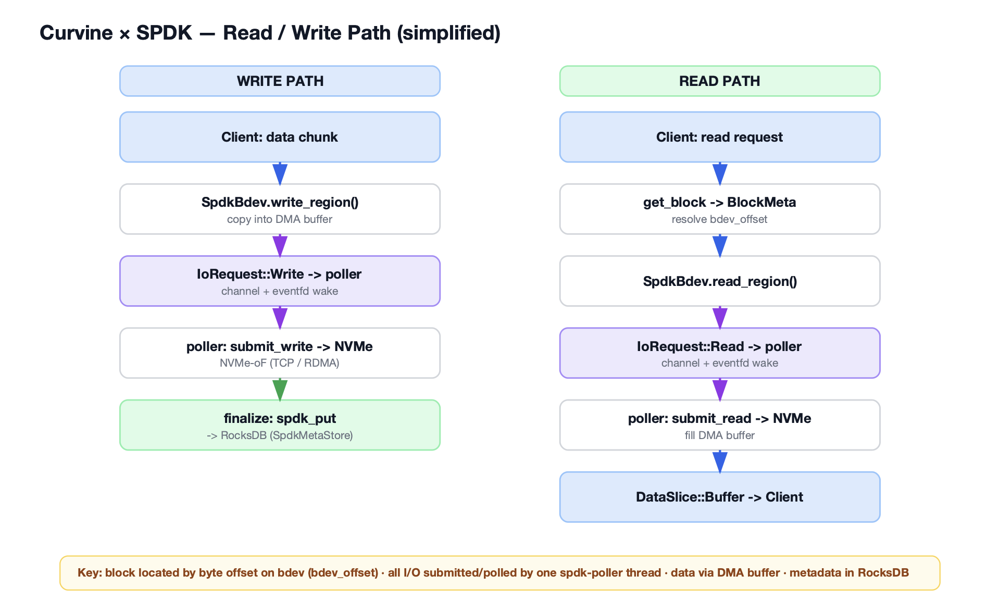

# Performance Leap: How Curvine Uses SPDK to Unlock the Full Potential of NVMe Drives

*Translated from the original Chinese article published on WeChat.*

## Introduction

As data volumes continue to grow explosively, storage performance has become a key factor in application responsiveness and user experience. Traditional storage I/O paths are often constrained by operating-system kernel overhead, making it difficult to fully utilize modern high-speed storage devices such as NVMe SSDs. To break through this bottleneck, many high-performance storage systems have started to adopt kernel-bypass technologies. This article takes a closer look at how the Curvine storage platform integrates SPDK (Storage Performance Development Kit) to deliver extreme NVMe storage performance, bringing users lower latency and higher throughput.

## The Challenge with Traditional I/O: The Kernel VFS Bottleneck

In a traditional storage architecture without SPDK, application I/O requests must pass through the operating system's Virtual File System (VFS) layer. VFS provides a unified file-operation interface, but it also introduces overhead such as context switches, data copies, and interrupt handling. For NVMe devices, which already provide extremely low latency at the hardware level, these kernel overheads can become the main barrier to further performance improvement. When Curvine Worker processes read and write data through system calls such as `pread` and `pwrite`, the system cannot fully unleash the raw performance of NVMe hardware.

## Enter SPDK: Kernel Bypass and User-Space I/O

The core idea behind SPDK is to move storage I/O processing from the kernel into user space. By bypassing the kernel VFS path, SPDK allows applications to communicate directly with NVMe devices, significantly reducing unnecessary overhead.

Curvine takes advantage of this capability by integrating SPDK into its architecture and achieving several key improvements:

1. **Ultra-low latency**: With kernel bypass, I/O requests no longer travel through a complex kernel path. They complete directly in user space, greatly reducing end-to-end latency.
2. **Extremely high throughput**: By reducing CPU overhead and context switches, a single CPU core can handle more I/O operations, resulting in higher IOPS. According to official SPDK data, SPDK can natively exceed 10 million IOPS on a single core [1].
3. **Efficient resource utilization**: SPDK uses hugepages for DMA buffer management, reducing TLB misses and improving memory-access efficiency.

## Deep Integration Between Curvine and SPDK: Architecture Overview

Curvine uses SPDK as its remote block-device layer. Local physical NVMe drives, dedicated SPDK target containers, and remote storage nodes can all communicate with Curvine Worker processes through NVMe-oF (NVMe over Fabrics).

<em>Overall architecture diagram</em>

This integration is not a thin wrapper around SPDK calls. It reaches deeply into Curvine's architecture.

### SpdkEnv: The Foundation of the Global Environment

`SpdkEnv` is the brain of Curvine's SPDK module. It initializes the entire SPDK application framework and acts as a singleton to ensure unified resource management.

Its main responsibilities include:

- **Hugepage allocation**: Reserves large memory pages for DMA buffers to optimize performance.
- **CPU affinity configuration**: Uses `reactor_mask` to bind SPDK I/O threads to specific CPU cores, avoiding scheduling overhead.
- **NVMe-oF target discovery**: Automatically discovers and connects to available NVMe-oF storage targets.
- **SpdkPoller thread creation**: Starts dedicated I/O polling threads, which are central to SPDK's high-efficiency execution model.

### SpdkPoller: The Always-On I/O Engine

`SpdkPoller` is a critical component in the SPDK architecture. Because SPDK requires NVMe command submission and completion handling to occur on the same thread, `SpdkPoller` takes on this responsibility. It is a dedicated I/O thread that bridges asynchronous processing threads with SPDK's synchronous polling loop.

`SpdkPoller` provides two important capabilities:

- **Intelligent polling**: When there are no I/O requests, `SpdkPoller` enters an idle state and uses `eventfd` to avoid wasting CPU cycles on busy spinning. When new requests arrive, it wakes up, enters an active state, efficiently submits NVMe commands, and polls completion queues. This spin-before-sleep strategy minimizes system-call overhead and keeps the I/O path smooth.
- **Error handling**: When a queue pair (`qpair`) encounters an error, `SpdkPoller` can mark it as orphaned and force-complete all pending I/O on that queue pair, preserving system stability.

### SpdkBdev and DMA Buffers: The Basis for Efficient Data Transfer

`SpdkBdev` is Curvine's abstract handle for SPDK block devices, similar in role to `LocalFile` in a traditional file system. It manages connections to NVMe namespaces and queue pairs, and it owns the key DMA buffers (`DmaBuf`).

The design focuses on efficient and predictable data transfer:

- **Hugepage-backed DMA buffers**: `DmaBuf` is a preallocated, fixed-size buffer backed by hugepages. Data can move directly between the NVMe device and memory without CPU involvement, avoiding extra copies and TLB misses.
- **Buffer reuse**: `SpdkBdev` allocates read and write buffers during initialization and reuses them across I/O operations. This avoids frequent memory allocation and release overhead, reaching a zero-cost-after-first-allocation model.
- **Chunked processing for large I/O**: For large I/O requests, `SpdkBdev` splits them into chunks of `dma_buf_size` (1 MB by default) and processes them sequentially through the same fixed buffer. This keeps the implementation efficient while avoiding the complexity of dynamic memory management.

### BdevOffsetAllocator: User-Space Block Management

With SPDK, Curvine bypasses the kernel file system and directly works with the flat byte-address space provided by NVMe devices. This means the traditional kernel block allocator is no longer applicable.

`BdevOffsetAllocator` fills that gap by implementing block management in user space:

- **Unique byte-range allocation**: Allocates a unique byte range for each Curvine block and reclaims that range when the block is deleted.
- **Efficient space management**: Uses a bump cursor for new allocations and a free list to track reclaimed ranges. Adjacent free ranges are coalesced to reduce fragmentation.
- **Persistence and thread safety**: Allocator state, including the cursor position and free list, is persisted to RocksDB through `SpdkMetaStore`, ensuring consistency after restart. The allocator itself is also thread-safe.

## Optimized Read and Write Paths

After integrating SPDK, Curvine's read and write paths become significantly more efficient.

<em>Simplified read and write path diagram</em>

- **Read path**: The handler submits an `IoRequest` directly to `SpdkPoller`. `SpdkPoller` communicates with the NVMe-oF target and notifies the handler after I/O completion. Data is copied directly from the DMA buffer to the application, keeping the path extremely short.
- **Write path**: SPDK requires block-aligned I/O. For unaligned writes, Curvine uses a read-modify-write strategy: it first reads the full aligned block, modifies the target range, and writes the complete aligned block back. For aligned writes, Curvine writes directly, minimizing unnecessary steps.

## The Core Value SPDK Brings to Curvine

Curvine's deep SPDK integration is more than the introduction of a technical component. It is a comprehensive upgrade to Curvine's high-performance storage architecture. Through kernel bypass, user-space I/O, dedicated polling threads, hugepage-backed DMA buffers, and user-space block management, SPDK brings Curvine several important benefits:

- **Outstanding performance**: Under I/O-intensive workloads, Curvine can significantly outperform traditional kernel-VFS-based storage paths, delivering lower latency and higher throughput.
- **Higher resource utilization**: Reduced CPU and memory overhead allows hardware resources to serve business logic more efficiently.
- **Stronger scalability**: Modular design and user-space control provide a solid foundation for future Curvine features and performance optimizations.

On the path toward extreme performance, the combination of Curvine and SPDK is a strong example of what modern software-defined storage can achieve. It demonstrates the potential of software-defined storage and points toward the future direction of high-performance storage systems.

## References

[1] SPDK official performance data: [SPDK](https://spdk.io/)
