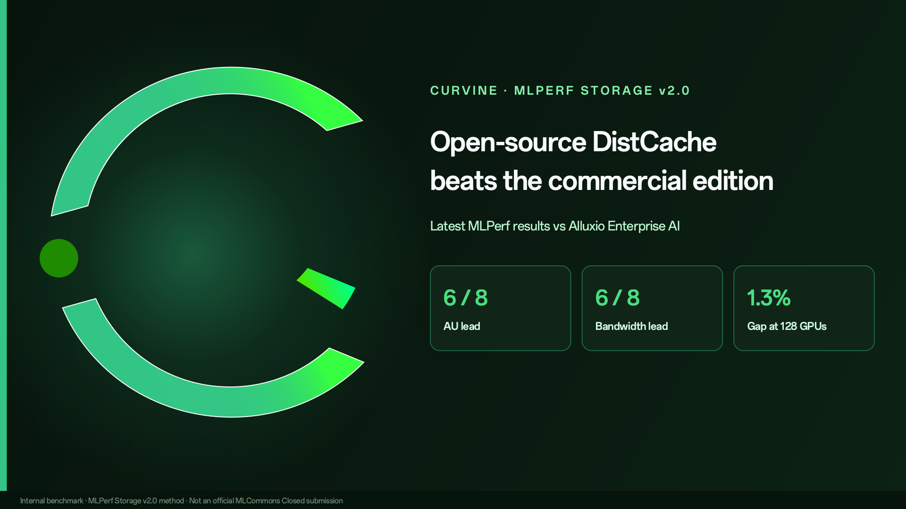
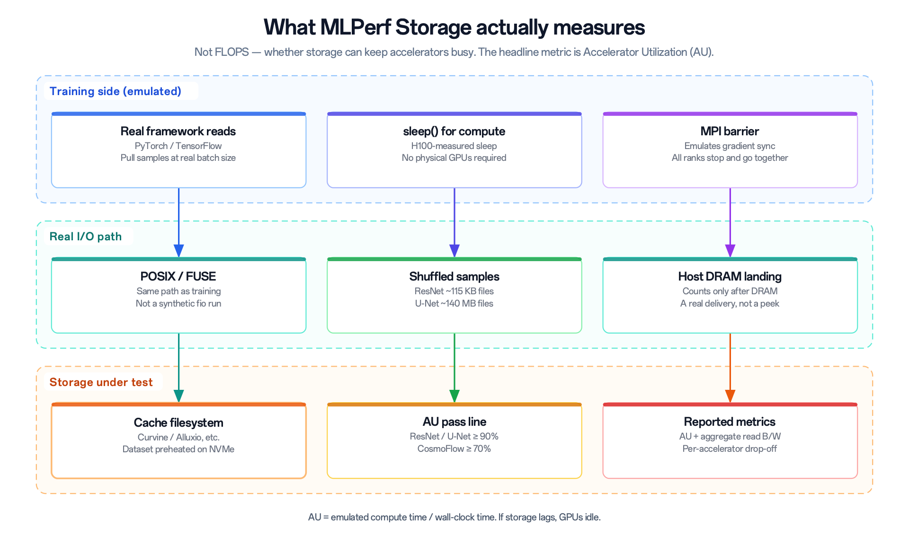
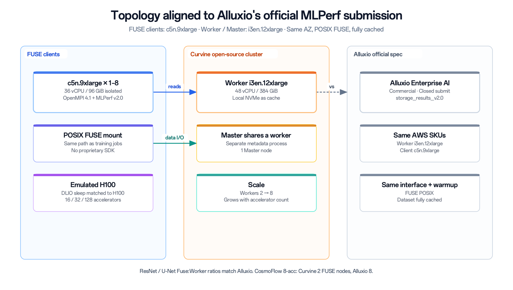
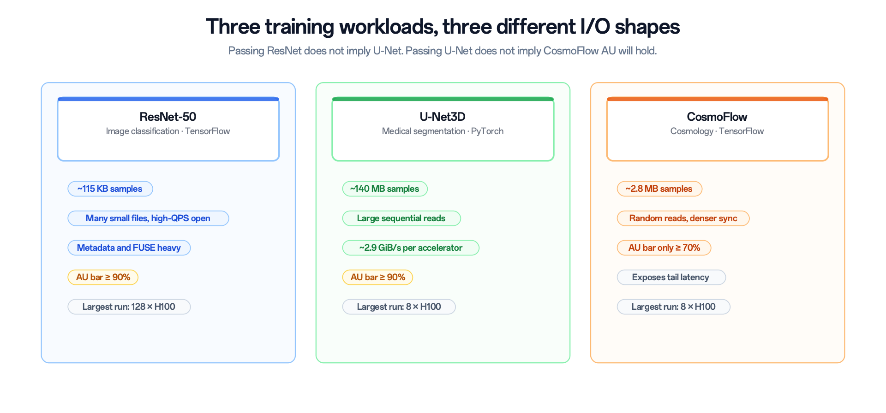
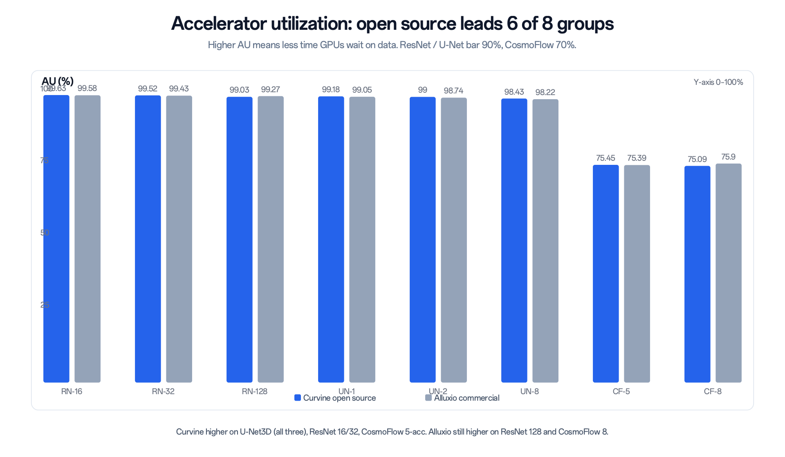
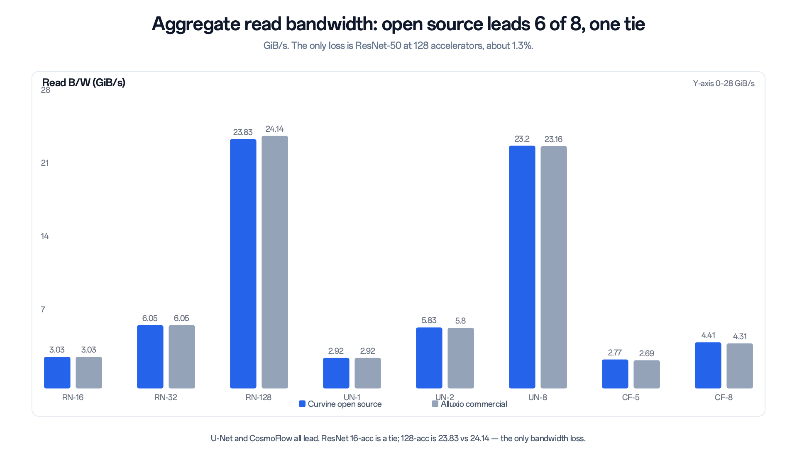
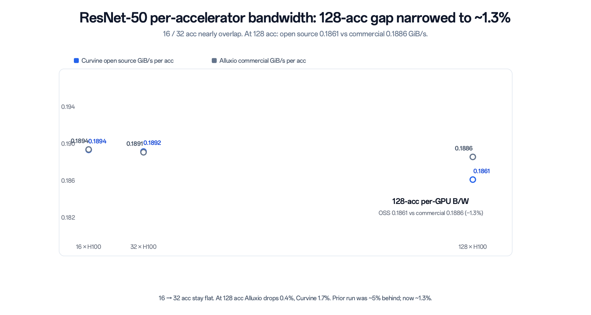

<!-- truncate -->

# Open-source DistCache Beats Alluxio Commercial: Curvine's Latest MLPerf Results

When GPUs wait on data, the cluster is idling. For training storage, the industry now uses the same ruler: MLPerf Storage.

Alluxio submitted official numbers for commercial Alluxio Enterprise AI in the MLCommons Closed division. Curvine is an Apache-2.0 open-source project. We ran an internal comparison with the same MLPerf Storage v2.0 method and the same class of AWS machines. The baseline is not open-source Alluxio. It is the commercial edition they submitted.

Numbers first, then the reading.

Across eight runs, **open-source Curvine leads accelerator utilization (AU) in 6 groups, and aggregate read bandwidth in 6 groups with 1 tie**. It is ahead on all three U-Net3D lines. CosmoFlow bandwidth is higher on both scales, and the 5-accelerator AU also moves in front. The only bandwidth loss is ResNet-50 at 128 emulated H100s: 23.83 vs 24.14 GiB/s, about 1.3%.

Not every decimal wins. On the same ruler, the open-source implementation is already ahead of the commercial Closed submission on most points. Below we lay out the background, the setup, and the tables.

## What MLPerf Storage measures

MLPerf is an AI benchmark suite maintained by MLCommons. The training and inference tracks ask how fast a model computes. **The Storage track does not score FLOPS. It asks whether storage can keep accelerators fed.**

During training, accelerators pull random samples by batch. If storage is a half-step late, GPUs sit idle. MLPerf Storage answers: how many cards can this storage keep busy enough.

You do not need a rack of real H100s. The harness (DLIO) reads through PyTorch or TensorFlow at the real batch size, replaces "compute one batch" with a sleep() timed from real H100 measurements, and uses an MPI barrier to emulate gradient sync. The data path is real: POSIX, FUSE, into client memory. Only then does a delivery count.

The headline metric is **Accelerator Utilization (AU)**:

> AU = emulated compute time / wall-clock time

Higher AU means less time GPUs wait on data. The v2.0 pass lines are:

| Workload | Typical sample | I/O shape | AU bar |
| --- | --- | --- | --- |
| ResNet-50 | ~115 KB | Small files, high-concurrency opens; metadata and FUSE heavy | ≥ 90% |
| U-Net3D | ~140 MB | Large sequential reads; ~2.9 GiB/s per accelerator | ≥ 90% |
| CosmoFlow | ~2.8 MB | Random reads, denser sync; tail latency shows up | ≥ 70% |

After the pass line, look at aggregate bandwidth and whether per-accelerator bandwidth drops. These are three different exams. Passing ResNet does not mean you pass U-Net. Passing U-Net does not mean CosmoFlow AU will hold.

*Figure 1: The benchmark is not compute. It is whether storage can keep accelerators busy. The headline metric is AU.*

Alluxio's official results live in [MLCommons storage_results_v2.0 / closed/Alluxio](https://github.com/mlcommons/storage_results_v2.0/tree/main/closed/Alluxio/results). Their docs list 24.14 GiB/s for ResNet-50 at 128 accelerators. Curvine has not filed a Closed submission. What follows is an internal comparison, not an official leaderboard. That should be clear up front.

## How we measured: same SKUs, same POSIX path

A comparison only holds if the topology matches.

Alluxio's official environment is AWS instances in one AZ: Workers on `i3en.12xlarge` (48 vCPU / 384 GiB, local NVMe), FUSE clients on `c5n.9xlarge` (36 vCPU / 96 GiB), POSIX FUSE, dataset fully warmed into cache. Curvine used the same class of machines:

| Role | AWS-equivalent SKU | Count | Hard limits |
| --- | --- | --- | --- |
| FUSE client (load gen) | c5n.9xlarge | 1–8 | ≥ 36 cores, 96 GiB isolated |
| Worker (cache tier) | i3en.12xlarge | 2–8 | ≥ 48 cores / 384 GiB, enterprise NVMe |
| Master (metadata) | Shared with a worker | 1 | Separate metadata process |

Accelerators are emulated H100s. Dataset size scales with the run: 500 GB → 1.0 TB → 4.0 TB. Fuse:Worker ratios for ResNet and U-Net match Alluxio's official table (1:2, 2:2, 8:8). CosmoFlow at 8 accelerators differs: Curvine used 2 FUSE + 8 Workers; Alluxio's table is 8 FUSE + 8 Workers. Keep that in mind on that one row.

*Figure 2: Hardware, interface, and warmup aligned to Alluxio's official submission.*

*Figure 3: Small-file concurrency, large sequential reads, and medium-file random reads each test a different capability.*

## The scorecard

AU first.

*Figure 4: Open source leads 6 of 8. The losses are ResNet 128-acc and CosmoFlow 8-acc.*

Then aggregate read bandwidth.

*Figure 5: Open source leads 6 of 8, with one tie. The only loss is ResNet-50 at 128 accelerators, about 1.3%.*

Full tables below. Alluxio numbers are the per-scale detail from the official submission. Their public materials often flatten AU into one headline per model (for example ResNet as 99.57%). Those headlines are rounded; this article uses the per-scale values. Some Curvine raw fields were labeled GB/s. The absolute values line up with Alluxio's GiB/s, so we report GiB/s throughout, which is the MLPerf convention.

**ResNet-50 (AU bar 90%)**

| Scale | Dataset | Fuse / Worker | Curvine AU | Alluxio AU | Curvine B/W | Alluxio B/W | Per acc (OSS / commercial) |
| --- | --- | --- | --- | --- | --- | --- | --- |
| 16 × H100 | 500 GB | 1 / 2 | **99.63%** | 99.58% | 3.03 | 3.03 | 0.1894 / 0.1894 |
| 32 × H100 | 1.0 TB | 2 / 2 | **99.52%** | 99.43% | **6.05** | 6.05 | **0.1892** / 0.1891 |
| 128 × H100 | 4.0 TB | 8 / 8 | 99.03% | **99.27%** | 23.83 | **24.14** | 0.1861 / **0.1886** |

**U-Net3D (AU bar 90%)**

| Scale | Dataset | Fuse / Worker | Curvine AU | Alluxio AU | Curvine B/W | Alluxio B/W | Per acc (OSS / commercial) |
| --- | --- | --- | --- | --- | --- | --- | --- |
| 1 × H100 | 500 GB | 1 / 2 | **99.18%** | 99.05% | **2.92** | 2.92 | **2.925** / 2.923 |
| 2 × H100 | 1.0 TB | 2 / 2 | **99.00%** | 98.74% | **5.83** | 5.80 | **2.917** / 2.895 |
| 8 × H100 | 4.0 TB | 8 / 8 | **98.43%** | 98.22% | **23.20** | 23.16 | **2.900** / 2.895 |

**CosmoFlow (AU bar 70%)**

| Scale | Dataset | Fuse / Worker | Curvine AU | Alluxio AU | Curvine B/W | Alluxio B/W | Per acc (OSS / commercial) |
| --- | --- | --- | --- | --- | --- | --- | --- |
| 5 × H100 | 500 GB | 1 / 2 | **75.45%** | 75.39% | **2.77** | 2.69 | **0.554** / 0.539 |
| 8 × H100 | 1.0 TB | 2 / 8 vs 8 / 8 | 75.09% | **75.90%** | **4.41** | 4.31 | **0.551** / 0.539 |

Across the eight groups: open source is higher on most points. Commercial Alluxio is still slightly better on ResNet 128-acc bandwidth and on two AU rows. This is not a sweep. It is also no longer "open source trailing commercial."

## How to read the numbers

### U-Net3D: ahead on all three lines

U-Net3D is a large sequential-read exam. One accelerator wants about 2.9 GiB/s; eight aggregate to about 23 GiB/s. AU, bandwidth, and per-accelerator bandwidth are all higher on Curvine. At 8 accelerators: AU 98.43% vs 98.22%, bandwidth 23.20 vs 23.16.

That matches the implementation. Rust, user-space FUSE, sequential reads on NVMe — this path likes large blocks. Medical images, checkpoints, and long-sequence features look more like this exam. Open source does not have to flinch here.

### ResNet-50: ahead at 16 / 32 acc, 1.3% behind at 128

ResNet is a small-file exam. Samples are a little over 100 KB, opens are dense, and FUSE plus metadata get amplified.

At 16 and 32 accelerators, open-source AU is higher (99.63% / 99.52%) and bandwidth is tied or slightly ahead. At 128 accelerators with 8 FUSE + 8 Workers, bandwidth is 23.83 vs 24.14, about 1.3%; AU is 99.03% vs 99.27%, commercial slightly higher. Both are well above the 90% bar.

*Figure 6: 16 → 32 acc almost overlap. At 128 acc, open source is 0.1861 per GPU, commercial 0.1886, about 1.3% apart.*

From 16 to 128 accelerators, Alluxio's per-accelerator bandwidth drops 0.4%; Curvine drops 1.7%. In the previous comparison this gap was about 5%. This round it is 1.3%. On small-file, high-concurrency scale-out, the commercial stack is still a bit flatter. Open source has moved from "a visible drop" to "a point and a bit."

### CosmoFlow: both bandwidth rows ahead, 5-acc AU also ahead

CosmoFlow's bar is only 70%, but tail latency shows up easily. At 5 accelerators: AU 75.45% vs 75.39%, bandwidth 2.77 vs 2.69 — open source higher on both. At 8 accelerators: bandwidth 4.41 vs 4.31, still open source; AU 75.09% vs 75.90%, commercial higher by less than one point.

Both pass 70%. The 8-accelerator client mix is not the same, so the bandwidth lead should not be read as a full win on that row. What we can say: on random reads, open source already feeds GPUs past the bar, and at 5 accelerators it also puts AU in front of the commercial number.

## Closing

MLPerf compresses "is storage fast" into two questions: are the GPUs waiting, and does per-accelerator bandwidth fall as you scale. Commercial Alluxio used a Closed submission to show a DistCache can keep 128 emulated H100s above 99% AU. Open-source Curvine measured itself with the same ruler. It is ahead on most points, and a point-and-a-bit behind on a few.

The numbers are above. For an open-source project, putting the scorecard on the table is more useful than another "we lead everywhere" line.

Curvine repository: [https://github.com/CurvineIO/curvine](https://github.com/CurvineIO/curvine)

---

**Notes and sources**

- Curvine: internal comparison, method aligned to MLPerf Storage v2.0, hardware aligned to Alluxio's official AWS topology. **Not an official MLCommons Closed or Open submission.**
- Alluxio: Enterprise AI, MLCommons `storage_results_v2.0` Closed division. Per-scale bandwidth matches the [Alluxio MLPerf documentation](https://documentation.alluxio.io/ee-ai-en/benchmark/benchmarking-ml-training-performance-with-mlperf). Public materials often flatten ResNet AU to 99.57%, U-Net to 99.02%, CosmoFlow to 74.97%. This article uses the per-scale values.
- Units: bandwidth is reported as GiB/s.
- CosmoFlow 8-accelerator client counts are not identical on both sides.
- MLPerf® is a trademark of MLCommons Association. This article does not imply MLCommons endorsement of any product.
