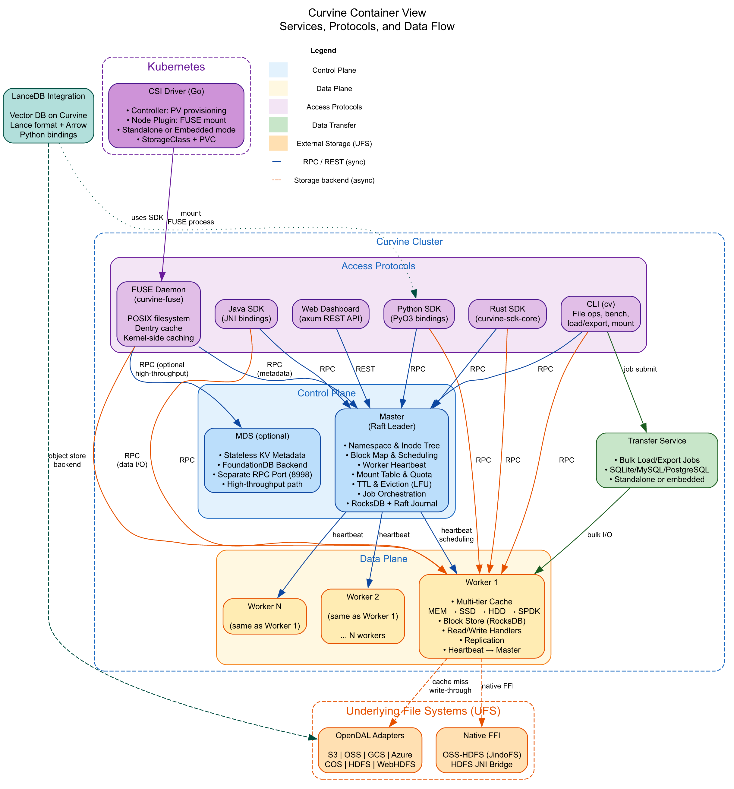

Curvine is an AI-Native and Cloud-Native distributed cache file system, written entirely in Rust. Born at OPPO and now a CNCF Landscape project, it layers full POSIX semantics over cloud object storage — delivering local-disk speed for AI training, inference, and big data workloads while keeping S3, OSS, GCS, Azure Blob, and HDFS as the durable backbone.

This post walks through Curvine's architecture at three levels: the overall system context, the container-level service breakdown, and the end-to-end data flow for read and write operations.

<!-- truncate -->

## 1. System Context: Who Uses Curvine and What It Depends On

At the highest level, Curvine sits between compute workloads and durable storage. It exposes multiple access protocols upward and fans out to object storage backends downward.


### Upstream Consumers

| Consumer | Access Method |
|---|---|
| **AI Training Jobs** (PyTorch, TensorFlow) | POSIX I/O via FUSE mount or S3-compatible gateway |
| **Big Data Engines** (Spark, Flink, Presto) | HDFS protocol adapter or POSIX mount |
| **AI Agents** (RAG, Inference) | Python/Java SDK, LanceDB vector store integration |
| **DevOps / SRE** | CLI tool (`cv`), Kubernetes kubectl, Web Dashboard |
| **Kubernetes** | CSI Driver for dynamic PV/PVC provisioning |

Curvine integrates with big data engines transparently — no custom connectors are needed. Spark, Flink, and Presto access Curvine through standard POSIX or HDFS interfaces, so existing pipelines work without modification.

### Downstream Storage Backends

All persistent storage is abstracted behind the **UFS (Underlying File System)** layer:

- **AWS S3**, **Alibaba OSS**, **Google GCS**, **Azure Blob**, **Tencent COS** — via Apache OpenDAL adapters
- **HDFS** / **WebHDFS** — via JNI bridge or OpenDAL native
- **Alibaba OSS-HDFS (JindoFS)** — via native FFI adapter
- **MinIO** and any S3-compatible store

### Observability

Curvine exports Prometheus metrics from all services and ships pre-built Grafana dashboard templates for cluster health, cache hit rates, worker utilization, and I/O throughput monitoring.

---

## 2. Container View: Services, Protocols, and Internal Boundaries

Zooming into the Curvine cluster, the architecture separates cleanly into three planes: control, data, and access protocols.



### Control Plane

The control plane manages metadata, scheduling, and cluster coordination.

**Master** is the brain of the cluster. It runs as a Raft-replicated leader node responsible for:

- **Namespace & Inode Tree** — the complete file and directory hierarchy
- **Block Map & Scheduling** — mapping file blocks to worker nodes, with five scheduling policies (local, round-robin, random, load-based, weighted)
- **Worker Heartbeat** — health monitoring and capacity tracking
- **Mount Table & Quota** — UFS mount point management and per-directory quotas
- **TTL & Eviction** — time-to-live management and LFU-based cache eviction
- **Job Orchestration** — coordinating bulk data load and export jobs
- **Persistence** — RocksDB for inode storage, Raft journal for replication and HA

**MDS (Metadata Service)** is an optional, stateless metadata path backed by FoundationDB (production) or in-memory store (development). It provides a high-throughput metadata alternative for workloads that need to bypass the Raft journal.

### Data Plane

**Workers** are the data nodes that store and serve file blocks. Each worker implements a **multi-tier cache hierarchy**:

```
MEM → SSD → HDD → SPDK (NVMe-oF/RDMA)
```

Hot data automatically promotes to faster tiers; cold data demotes or evicts. Each worker maintains:

- **Block Store** — backed by RocksDB for block metadata, local filesystems for block data
- **Read/Write Handlers** — direct RPC handlers for client I/O
- **Replication** — block-level replication managed by the Master
- **Heartbeat** — periodic status reports to the Master

Workers can optionally use **SPDK** (Storage Performance Development Kit) for direct NVMe access via RDMA, bypassing the kernel for ultra-low latency.

### Access Protocols

Curvine exposes five access paths, all converging on the same internal RPC layer:

| Protocol | Implementation | Use Case |
|---|---|---|
| **FUSE** | `curvine-fuse` (fuse2/fuse3) | POSIX filesystem mount for any Linux application |
| **Java SDK** | JNI bindings via `curvine-libsdk-java` | JVM-based big data applications |
| **Python SDK** | PyO3 bindings via `curvine-libsdk-python` | AI/ML training scripts, data pipelines |
| **Rust SDK** | `curvine-sdk-core` | Native Rust applications |
| **CLI** | `cv` command | File operations, benchmarking, mount management |
| **Web Dashboard** | axum REST API | Cluster monitoring and administration |

**Unified FS** (`curvine-unified-fs`) is the internal abstraction that transparently falls back to UFS (object storage) on cache miss, so applications never need to know whether data is cached locally or fetched remotely.

### Kubernetes Integration

The **CSI Driver** (`curvine-csi`) is a Go binary implementing the Container Storage Interface spec:

- **Controller** — dynamic PV provisioning (CreateVolume/DeleteVolume)
- **Node Plugin** — FUSE mount lifecycle management per node
- **Two modes**: Standalone (FUSE in independent MountPod, recommended) or Embedded (FUSE inside CSI container)
- **StorageClass** — `volumeBindingMode: Immediate`, `allowVolumeExpansion: true`

### Transfer Service

The **Transfer Service** handles bulk data movement — loading data from UFS into Curvine cache or exporting Curvine data to external systems. It maintains its own job store (SQLite by default, with MySQL and PostgreSQL options) and can run standalone or embedded in the Master.

### LanceDB Integration

Curvine integrates with **LanceDB** to provide a vector database layer on top of Curvine's object storage. Built on the Lance columnar format and Apache Arrow, it enables AI applications to store and query vector embeddings directly through Curvine's storage backend.

---

## 3. Data Flow: How Read and Write Operations Traverse the System

Understanding the data flow reveals why Curvine achieves local-disk performance for hot data while maintaining object-storage durability.


### Read Path (6 Steps)

```
Application → Protocol Layer → Unified FS → Master (metadata) → Worker (data) → [UFS on miss]
```

1. **Metadata Lookup** — The client sends an RPC to the Master to resolve the file path to inode metadata and block locations.

2. **Block Location Response** — The Master returns the list of block IDs and the worker nodes that hold them (or can fetch them).

3. **Scheduled Read** — The client connects directly to the assigned Worker via RPC to read the requested blocks. This avoids routing data through the Master.

4. **Cache Hit (Fast Path)** — The Worker serves the block from its multi-tier cache (MEM → SSD → HDD → SPDK). This is the hot path — latency is comparable to local disk.

5. **Cache Miss (UFS Fetch)** — If the block is not cached, the Worker fetches it from the underlying object storage (S3, OSS, HDFS, etc.) via the OpenDAL adapter or native FFI bridge.

6. **Cache Promotion** — The fetched block is written into the Worker's cache, promoting it to the appropriate tier based on access frequency. Subsequent reads hit the cache directly.

### Write Path

```
Application → Protocol Layer → Unified FS → Worker (write) → UFS (write-through)
```

- The client writes blocks directly to the assigned Worker via RPC.
- The Worker writes to its local cache tier and performs **write-through** to the underlying object storage for durability.
- The Master is updated with new block metadata via the Raft-replicated journal.

### Key Design Properties

- **Metadata and data paths are separated** — metadata goes through the Master (or MDS), data goes directly to Workers. This prevents the Master from becoming a throughput bottleneck.
- **Client-to-Worker direct I/O** — once the Master provides block locations, clients talk to Workers directly. This scales data throughput linearly with the number of Workers.
- **Transparent UFS fallback** — the Unified FS layer handles cache misses transparently. Applications see a single POSIX namespace regardless of where data physically lives.
- **Multi-tier automatic promotion** — frequently accessed data migrates to faster tiers (MEM/SSD), while cold data demotes to HDD or evicts entirely.

---

## 4. Technology Stack Summary

| Layer | Technology |
|---|---|
| **Language** | Rust (core), Go (CSI driver) |
| **Async Runtime** | Tokio |
| **RPC** | Custom protobuf-based (prost) over TCP |
| **Metadata Store** | RocksDB + Raft journal (Master), FoundationDB (MDS) |
| **Object Storage** | Apache OpenDAL (S3/OSS/GCS/Azure/COS/HDFS/WebHDFS) |
| **Hardware Acceleration** | SPDK (NVMe-oF/RDMA), mimalloc/jemalloc |
| **Vector DB** | LanceDB + Lance + Apache Arrow |
| **Kubernetes** | CSI Driver (Go), FUSE MountPod |
| **Observability** | Prometheus metrics + Grafana dashboards |
| **Build** | Makefile + Cargo workspace, Docker (CentOS/Rocky/Ubuntu/Amazon) |

---

## 5. Summary

Curvine's architecture is designed around three principles:

1. **Separation of concerns** — Control plane (Master/MDS) handles metadata; data plane (Workers) handles I/O; protocol layer handles access diversity.
2. **Performance through caching** — Multi-tier cache (MEM → SSD → HDD → SPDK) with automatic promotion delivers local-disk latency for hot data.
3. **Durability through abstraction** — The UFS layer decouples Curvine from any single storage backend, allowing S3, OSS, GCS, Azure, or HDFS to serve as the persistent layer without application changes.

The result is a system that gives AI training jobs, big data engines, and Kubernetes workloads a unified POSIX interface with the speed of local storage and the durability of cloud object storage — all in a single Rust-based binary.
