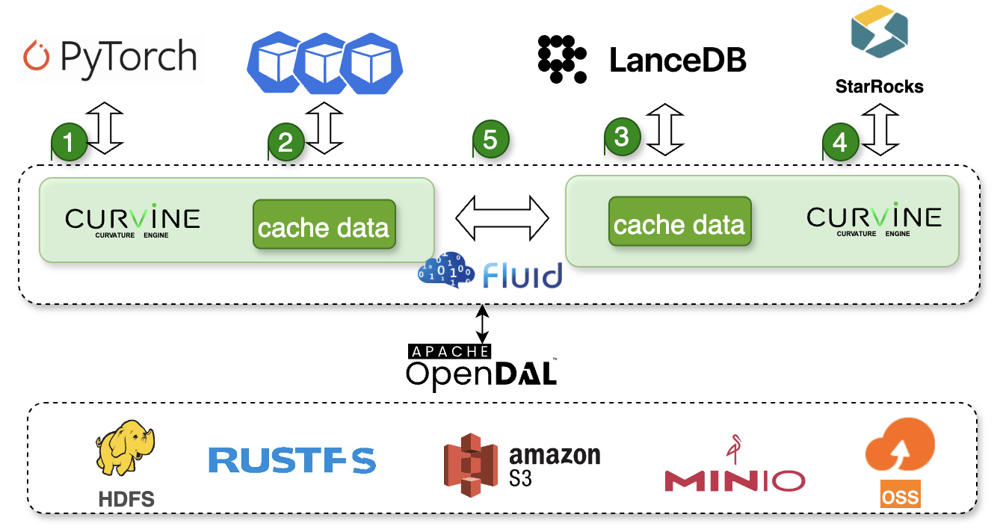

# Curvine Overview

Curvine is a high-performance distributed cache system written in Rust and released under the Apache 2.0 license. It provides a unified cached file-system view over external storage systems, with low-latency metadata access, high-throughput data access, and POSIX-compatible FUSE integration.

Curvine uses a classic Master/Worker architecture. Master nodes manage metadata and cluster coordination, while Worker nodes store and serve data blocks. Metadata consistency and high availability are provided through Raft.

Curvine exposes multiple access paths for analytics, AI, and data infrastructure workloads, including the Rust CLI, FUSE, Java/Python SDK bindings, and S3-compatible access.

## Core Features

- **Multi-cloud storage support**: Works with S3-compatible systems, HDFS, OSS, MinIO, and other UFS backends through a unified access layer
- **Cloud-native integration**: Supports CSI-based deployment and Kubernetes-oriented packaging workflows
- **Multi-tier cache**: Supports memory, SSD, and HDD cache strategies
- **POSIX-compatible access**: Provides a FUSE layer so existing applications can access cached data as a local file system
- **S3 and HDFS ecosystem compatibility**: Offers S3-compatible gateway access and Hadoop/SDK integration paths
- **High performance**: Uses asynchronous I/O and zero-copy-oriented data paths for low-latency, high-throughput workloads
- **Raft-based metadata HA**: Uses Raft to keep metadata consistent across Master nodes
- **Built-in observability**: Exposes monitoring and metrics for cluster components
- **Web management interface**: Provides browser-based status and management pages on service web ports

## Use Cases

Curvine is designed for high-performance, high-concurrency, and massive data caching scenarios:

- **Deep Learning Training**: Provides high-speed data access for deep learning training, significantly reducing data loading time, improving GPU utilization, and accelerating model training processes
- **Large Language Model Inference**: Optimizes data access for LLM inference scenarios, reducing inference latency and improving model service response speed and throughput
- **Analytical Databases and OLAP Engines**: Provides high-speed caching for analytical databases and OLAP engines, significantly improving complex query performance and reducing data analysis time
- **Big Data Computing**: Provides high-speed caching for big data computing scenarios, reducing data read/write time
- **Shuffle Data Storage**: Stores intermediate results (shuffle) during big data computation, achieving complete separation of compute and storage
- **Multi-cloud Data Caching**: Improves data access efficiency across clouds and regions

## Performance
&emsp;We demonstrate performance and resource utilization from the following aspects:​

**1. Metadata operation performance**
<!-- 表格区 -->
   <table>
  <thead>
    <tr style={{ backgroundColor: '#2ecc71', color: 'white' }}>
      <th>Operation Type</th>
      <th>Curvine (QPS)</th>
      <th>Juicefs (QPS)</th>
      <th>oss (QPS)</th>
    </tr>
  </thead>
  <tbody>
    <tr>
      <td>create</td>
      <td style={{ textAlign: 'right' }}>19,985</td>
      <td style={{ textAlign: 'right' }}>16,000</td>
      <td style={{ textAlign: 'right' }}>2,000</td>
    </tr>
    <tr>
      <td>open</td>
      <td style={{ textAlign: 'right' }}>60,376</td>
      <td style={{ textAlign: 'right' }}>50,000</td>
      <td style={{ textAlign: 'right' }}>3,900</td>
    </tr>
    <tr>
      <td>rename</td>
      <td style={{ textAlign: 'right' }}>43,009</td>
      <td style={{ textAlign: 'right' }}>21,000</td>
      <td style={{ textAlign: 'right' }}>200</td>
    </tr>
    <tr>
      <td>delete</td>
      <td style={{ textAlign: 'right' }}>39,013</td>
      <td style={{ textAlign: 'right' }}>41,000</td>
      <td style={{ textAlign: 'right' }}>1,900</td>
    </tr>
  </tbody>
</table>

&emsp;**Note**: All benchmark comparisons were conducted with a concurrency level of 40.

&emsp;**Detailed results**: https://curvineio.github.io/docs/Benchmark/meta/

&emsp;**Industry benchmark test data of comparable products**: https://juicefs.com/zh-cn/blog/engineering/meta-perf-hdfs-oss-jfs

**2. Data Read/Write Performance**

&emsp;Benchmarking Alluxio performance under identical hardware conditions:

● 256K sequential read
  <!-- 表格区 -->
  <table style={{ width: '100%', borderCollapse: 'collapse' }}>
    <thead>
      <tr style={{ backgroundColor: '#2ecc71', color: 'white' }}>
        <th>Thread count</th>
        <th>Curvine Open Source Edition (GiB/s)</th>
        <th>Throughput of Open Source Alluxio (GiB/s)</th>
      </tr>
    </thead>
    <tbody>
      <!-- 数据行模板 -->
      <tr style={{ borderBottom: '1px solid #e1e4e8' }}>
        <td style={{ textAlign: 'right' }}>1</td>
        <td style={{ textAlign: 'right' }}>2.2</td>
        <td style={{ textAlign: 'right' }}>0.6</td>
      </tr>
      <tr style={{ borderBottom: '1px solid #e1e4e8' }}>
        <td style={{ textAlign: 'right' }}>2</td>
        <td style={{ textAlign: 'right' }}>3.7</td>
        <td style={{ textAlign: 'right' }}>1.1</td>
      </tr>
      <tr style={{ borderBottom: '1px solid #e1e4e8' }}>
        <td style={{ textAlign: 'right' }}>4</td>
        <td style={{ textAlign: 'right' }}>6.8</td>
        <td style={{ textAlign: 'right' }}>2.3</td>
      </tr>
      <tr style={{ borderBottom: '1px solid #e1e4e8' }}>
        <td style={{ textAlign: 'right' }}>8</td>
        <td style={{ textAlign: 'right' }}>8.9</td>
        <td style={{ textAlign: 'right' }}>4.5</td>
      </tr>
      <tr style={{ borderBottom: '1px solid #e1e4e8' }}>
        <td style={{ textAlign: 'right' }}>16</td>
        <td style={{ textAlign: 'right' }}>9.2</td>
        <td style={{ textAlign: 'right' }}>7.9</td>
      </tr>
      <tr style={{ borderBottom: '1px solid #e1e4e8' }}>
        <td style={{ textAlign: 'right' }}>32</td>
        <td style={{ textAlign: 'right' }}>9.5</td>
        <td style={{ textAlign: 'right' }}>8.8</td>
      </tr>
      <tr style={{ borderBottom: '1px solid #e1e4e8' }}>
        <td style={{ textAlign: 'right' }}>64</td>
        <td style={{ textAlign: 'right' }}>9.2</td>
        <td style={{ textAlign: 'right' }}>N/A</td>
      </tr>
      <tr style={{ borderBottom: '1px solid #e1e4e8' }}>
        <td style={{ textAlign: 'right' }}>128</td>
        <td style={{ textAlign: 'right' }}>9.2</td>
        <td style={{ textAlign: 'right' }}>N/A</td>
      </tr>
    </tbody>
  </table>
  
● 256K random read
<!-- 表格区 -->
  <table style={{ width: '100%', borderCollapse: 'collapse' }}>
    <thead>
      <tr style={{ backgroundColor: '#2ecc71', color: 'white' }}>
        <th>Thread count</th>
        <th>Curvine Open Source Edition (GiB/s)</th>
        <th>Throughput of Open Source Alluxio (GiB/s)</th>
      </tr>
    </thead>
    <tbody>
      <!-- 数据行模板 -->
      <tr style={{ borderBottom: '1px solid #e1e4e8' }}>
        <td style={{ textAlign: 'right' }}>1</td>
        <td style={{ textAlign: 'right' }}>0.3</td>
        <td style={{ textAlign: 'right' }}>0.0</td>
      </tr>
      <tr style={{ borderBottom: '1px solid #e1e4e8' }}>
        <td style={{ textAlign: 'right' }}>2</td>
        <td style={{ textAlign: 'right' }}>0.7</td>
        <td style={{ textAlign: 'right' }}>0.1</td>
      </tr>
      <tr style={{ borderBottom: '1px solid #e1e4e8' }}>
        <td style={{ textAlign: 'right' }}>4</td>
        <td style={{ textAlign: 'right' }}>1.4</td>
        <td style={{ textAlign: 'right' }}>0.1</td>
      </tr>
      <tr style={{ borderBottom: '1px solid #e1e4e8' }}>
        <td style={{ textAlign: 'right' }}>8</td>
        <td style={{ textAlign: 'right' }}>2.8</td>
        <td style={{ textAlign: 'right' }}>0.2</td>
      </tr>
      <tr style={{ borderBottom: '1px solid #e1e4e8' }}>
        <td style={{ textAlign: 'right' }}>16</td>
        <td style={{ textAlign: 'right' }}>5.2</td>
        <td style={{ textAlign: 'right' }}>0.4</td>
      </tr>
      <tr style={{ borderBottom: '1px solid #e1e4e8' }}>
        <td style={{ textAlign: 'right' }}>32</td>
        <td style={{ textAlign: 'right' }}>7.8</td>
        <td style={{ textAlign: 'right' }}>0.3</td>
      </tr>
      <tr style={{ borderBottom: '1px solid #e1e4e8' }}>
        <td style={{ textAlign: 'right' }}>64</td>
        <td style={{ textAlign: 'right' }}>8.7</td>
        <td style={{ textAlign: 'right' }}>N/A</td>
      </tr>
      <tr style={{ borderBottom: '1px solid #e1e4e8' }}>
        <td style={{ textAlign: 'right' }}>128</td>
        <td style={{ textAlign: 'right' }}>9.0</td>
        <td style={{ textAlign: 'right' }}>N/A</td>
      </tr>
    </tbody>
  </table>

 &emsp; Data disclosure from Alluxio official website: https://www.alluxio.com.cn/alluxio-enterprise-vs-open-source/.

**3. Resource consumption**

 &emsp; Benefiting from Rust language features, in big data shuffle acceleration scenarios, comparing resource consumption between Curvine and Alluxio in production environments shows that memory usage is reduced by over 90%, and CPU usage is reduced by over 50%.

## 🧩 Modular Architecture

Curvine adopts a modular codebase. The main components in the current `main` branch are:

- **orpc**: High-performance async RPC and runtime infrastructure
- **curvine-common**: Shared configuration, protocol, metadata, and utility types
- **curvine-server**: Master and Worker server implementations
- **curvine-client**: Rust client library for metadata and block I/O
- **curvine-fuse**: FUSE daemon for POSIX-style access
- **curvine-libsdk**: Java and Python SDK bindings built on top of the native client
- **curvine-ufs**: UFS backend implementations for S3, HDFS, WebHDFS, and related providers
- **curvine-cli**: Native CLI (`cv`) for cluster, mount, fs, and load operations
- **curvine-s3-gateway**: S3-compatible HTTP gateway
- **curvine-web**: Web UI assets and server-side web support
- **curvine-csi**: CSI driver for Kubernetes storage integration
- **curvine-tests**: Integration tests, regression tooling, and benchmark utilities
