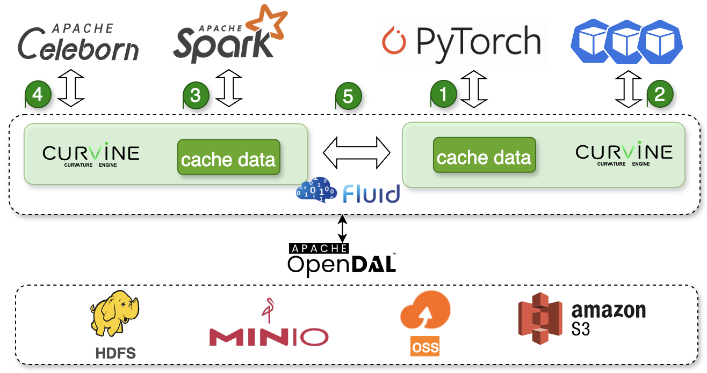

# Curvine Overview

Curvine is a high-performance, high-concurrency distributed caching system released under the Apache 2.0 open-source license. It provides unified path access to various storage systems with caching acceleration, featuring POSIX compatibility for seamless integration as massive local storage, while supporting concurrent mount and read/write operations across cross-platform and cross-region hosts.

Curvine adopts the classic master-worker architecture to implement distributed file system design. The Master manages file metadata and ensures high availability and data consistency through the Raft protocol, while Workers handle data management.

Curvine provides rich APIs suitable for various forms of data management, analysis, archiving, and backup. It can seamlessly integrate with big data, machine learning, and artificial intelligence platforms without code modifications, providing massive, elastic, and cost-effective caching acceleration.

## Core Features

- **High Performance**: Millisecond-level latency with exceptional performance for writes, sequential reads, and random reads. Single node can achieve up to 15GiB/s read throughput
- **High Concurrency**: Single node supports tens of thousands of concurrent file read/write operations
- **Low Resource Consumption**: In 1000 concurrent read/write tests, both server and client require only tens of MB of memory; CPU usage is reduced by 50% compared to other systems
- **Multi-Backend Storage Support**: Supports S3, HDFS, OSS, MinIO, and other backend storage systems with unified access interface
- **POSIX Compatibility**: Functions like a local file system with seamless integration to existing applications without business intrusion
- **Distributed Design**: Same file system can be mounted simultaneously on thousands of servers for high-performance concurrent read/write and data sharing
- **Multi-Language Support**: Provides Java, Python, Rust, FUSE, and other client implementations
- **Multi-OS Support**: Supports Linux, Windows, macOS, and other operating systems
- **Multi-Architecture Support**: Supports x86, ARM, and other hardware architectures

## Use Cases

Curvine is designed for high-performance, high-concurrency, and massive data caching scenarios:

- **Deep Learning Training**: Provides high-speed data access for deep learning training, significantly reducing data loading time, improving GPU utilization, and accelerating model training processes
- **Large Language Model Inference**: Optimizes data access for LLM inference scenarios, reducing inference latency and improving model service response speed and throughput
- **Analytical Databases and OLAP Engines**: Provides high-speed caching for analytical databases and OLAP engines, significantly improving complex query performance and reducing data analysis time
- **Big Data Computing**: Provides high-speed caching for big data computing scenarios, reducing data read/write time
- **Shuffle Data Storage**: Stores intermediate results (shuffle) during big data computation, achieving complete separation of compute and storage
- **Multi-cloud Data Caching**: Improves data access efficiency across clouds and regions

## Performance
&emsp;We demonstrate performance and resource utilization from the following aspects:​

**1. Metadata operation performance**
<!-- 表格区 -->
   <table>
  <thead>
    <tr style={{ backgroundColor: '#2ecc71', color: 'white' }}>
      <th>Operation Type</th>
      <th>Curvine (QPS)</th>
      <th>Juicefs (QPS)</th>
      <th>oss (QPS)</th>
    </tr>
  </thead>
  <tbody>
    <tr>
      <td>create</td>
      <td style={{ textAlign: 'right' }}>19,985</td>
      <td style={{ textAlign: 'right' }}>16,000</td>
      <td style={{ textAlign: 'right' }}>2,000</td>
    </tr>
    <tr>
      <td>open</td>
      <td style={{ textAlign: 'right' }}>60,376</td>
      <td style={{ textAlign: 'right' }}>50,000</td>
      <td style={{ textAlign: 'right' }}>3,900</td>
    </tr>
    <tr>
      <td>rename</td>
      <td style={{ textAlign: 'right' }}>43,009</td>
      <td style={{ textAlign: 'right' }}>21,000</td>
      <td style={{ textAlign: 'right' }}>200</td>
    </tr>
    <tr>
      <td>delete</td>
      <td style={{ textAlign: 'right' }}>39,013</td>
      <td style={{ textAlign: 'right' }}>41,000</td>
      <td style={{ textAlign: 'right' }}>1,900</td>
    </tr>
  </tbody>
</table>

&emsp;**Note**: All benchmark comparisons were conducted with a concurrency level of 40.

&emsp;**Detailed results**: https://curvineio.github.io/docs/Benchmark/meta/

&emsp;**Industry benchmark test data of comparable products**: https://juicefs.com/zh-cn/blog/engineering/meta-perf-hdfs-oss-jfs

**2. Data Read/Write Performance**

&emsp;Benchmarking Alluxio performance under identical hardware conditions:

● 256K sequential read
  <!-- 表格区 -->
  <table style={{ width: '100%', borderCollapse: 'collapse' }}>
    <thead>
      <tr style={{ backgroundColor: '#2ecc71', color: 'white' }}>
        <th>Thread count</th>
        <th>Curvine Open Source Edition (GiB/s)</th>
        <th>Throughput of Open Source Alluxio (GiB/s)</th>
      </tr>
    </thead>
    <tbody>
      <!-- 数据行模板 -->
      <tr style={{ borderBottom: '1px solid #e1e4e8' }}>
        <td style={{ textAlign: 'right' }}>1</td>
        <td style={{ textAlign: 'right' }}>2.2</td>
        <td style={{ textAlign: 'right' }}>0.6</td>
      </tr>
      <tr style={{ borderBottom: '1px solid #e1e4e8' }}>
        <td style={{ textAlign: 'right' }}>2</td>
        <td style={{ textAlign: 'right' }}>3.7</td>
        <td style={{ textAlign: 'right' }}>1.1</td>
      </tr>
      <tr style={{ borderBottom: '1px solid #e1e4e8' }}>
        <td style={{ textAlign: 'right' }}>4</td>
        <td style={{ textAlign: 'right' }}>6.8</td>
        <td style={{ textAlign: 'right' }}>2.3</td>
      </tr>
      <tr style={{ borderBottom: '1px solid #e1e4e8' }}>
        <td style={{ textAlign: 'right' }}>8</td>
        <td style={{ textAlign: 'right' }}>8.9</td>
        <td style={{ textAlign: 'right' }}>4.5</td>
      </tr>
      <tr style={{ borderBottom: '1px solid #e1e4e8' }}>
        <td style={{ textAlign: 'right' }}>16</td>
        <td style={{ textAlign: 'right' }}>9.2</td>
        <td style={{ textAlign: 'right' }}>7.9</td>
      </tr>
      <tr style={{ borderBottom: '1px solid #e1e4e8' }}>
        <td style={{ textAlign: 'right' }}>32</td>
        <td style={{ textAlign: 'right' }}>9.5</td>
        <td style={{ textAlign: 'right' }}>8.8</td>
      </tr>
      <tr style={{ borderBottom: '1px solid #e1e4e8' }}>
        <td style={{ textAlign: 'right' }}>64</td>
        <td style={{ textAlign: 'right' }}>9.2</td>
        <td style={{ textAlign: 'right' }}>N/A</td>
      </tr>
      <tr style={{ borderBottom: '1px solid #e1e4e8' }}>
        <td style={{ textAlign: 'right' }}>128</td>
        <td style={{ textAlign: 'right' }}>9.2</td>
        <td style={{ textAlign: 'right' }}>N/A</td>
      </tr>
    </tbody>
  </table>
  
● 256K random read
<!-- 表格区 -->
  <table style={{ width: '100%', borderCollapse: 'collapse' }}>
    <thead>
      <tr style={{ backgroundColor: '#2ecc71', color: 'white' }}>
        <th>Thread count</th>
        <th>Curvine Open Source Edition (GiB/s)</th>
        <th>Throughput of Open Source Alluxio (GiB/s)</th>
      </tr>
    </thead>
    <tbody>
      <!-- 数据行模板 -->
      <tr style={{ borderBottom: '1px solid #e1e4e8' }}>
        <td style={{ textAlign: 'right' }}>1</td>
        <td style={{ textAlign: 'right' }}>0.3</td>
        <td style={{ textAlign: 'right' }}>0.0</td>
      </tr>
      <tr style={{ borderBottom: '1px solid #e1e4e8' }}>
        <td style={{ textAlign: 'right' }}>2</td>
        <td style={{ textAlign: 'right' }}>0.7</td>
        <td style={{ textAlign: 'right' }}>0.1</td>
      </tr>
      <tr style={{ borderBottom: '1px solid #e1e4e8' }}>
        <td style={{ textAlign: 'right' }}>4</td>
        <td style={{ textAlign: 'right' }}>1.4</td>
        <td style={{ textAlign: 'right' }}>0.1</td>
      </tr>
      <tr style={{ borderBottom: '1px solid #e1e4e8' }}>
        <td style={{ textAlign: 'right' }}>8</td>
        <td style={{ textAlign: 'right' }}>2.8</td>
        <td style={{ textAlign: 'right' }}>0.2</td>
      </tr>
      <tr style={{ borderBottom: '1px solid #e1e4e8' }}>
        <td style={{ textAlign: 'right' }}>16</td>
        <td style={{ textAlign: 'right' }}>5.2</td>
        <td style={{ textAlign: 'right' }}>0.4</td>
      </tr>
      <tr style={{ borderBottom: '1px solid #e1e4e8' }}>
        <td style={{ textAlign: 'right' }}>32</td>
        <td style={{ textAlign: 'right' }}>7.8</td>
        <td style={{ textAlign: 'right' }}>0.3</td>
      </tr>
      <tr style={{ borderBottom: '1px solid #e1e4e8' }}>
        <td style={{ textAlign: 'right' }}>64</td>
        <td style={{ textAlign: 'right' }}>8.7</td>
        <td style={{ textAlign: 'right' }}>N/A</td>
      </tr>
      <tr style={{ borderBottom: '1px solid #e1e4e8' }}>
        <td style={{ textAlign: 'right' }}>128</td>
        <td style={{ textAlign: 'right' }}>9.0</td>
        <td style={{ textAlign: 'right' }}>N/A</td>
      </tr>
    </tbody>
  </table>

 &emsp; Data disclosure from Alluxio official website: https://www.alluxio.com.cn/alluxio-enterprise-vs-open-source/.

**3. Resource consumption**

 &emsp; Benefiting from Rust language features, in big data shuffle acceleration scenarios, comparing resource consumption between Curvine and Alluxio in production environments shows that memory usage is reduced by over 90%, and CPU usage is reduced by over 50%.

## 🧩 Modular Architecture
Curvine adopts a modular design and is mainly composed of the following core components：

- **orpc**: A high-performance network communication framework that supports asynchronous RPC calls.
- **curvine-common**: A shared library containing protocol definitions, error handling, and common utilities.
- **curvine-server**: A server component that includes Master and Worker implementations.
- **curvine-client**: A client library that provides APIs for interacting with the server.
- **curvine-fuse**: A FUSE file system interface that allows Curvine to be mounted as a local file system.
- **curvine-libsdk**: An SDK library that supports multi - language access.
- **curvine-web**: A web management interface and API.
- **curvine-tests**: A testing framework and performance benchmarking tool.