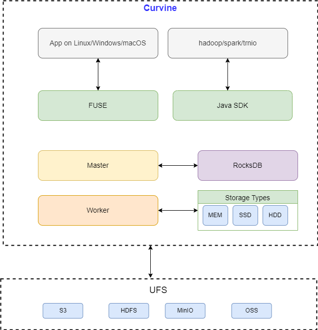

# Technical Architecture

This chapter provides an in-depth introduction to Curvine's technical architecture, detailing the functionality, interaction patterns, and design principles of each layer component to help you comprehensively understand how the Curvine system works.

## Architecture Overview

Curvine adopts a layered distributed architecture design that ensures clear component responsibilities with excellent scalability and high availability. The entire architecture is primarily divided into three layers: **control layer** (Master), **storage layer** (Workers), and **access layer** (clients: FUSE, SDK, CLI, S3 gateway), which collaborate to complete data storage, processing, and management tasks.

Curvine consists of three main server-side roles plus clients and UFS:

**Curvine Client**: Data read/write operations are implemented by the client, which calls Curvine server-side interfaces through RPC (metadata from Master, block data from Workers). The client supports multiple access methods:

- **FUSE**: POSIX-compatible mount, functioning as local storage
- **Hadoop Java SDK**: Java client for the Hadoop ecosystem
- **Rust / Python SDK**: Native SDKs for Rust and Python
- **S3 gateway**: S3-compatible object API
- **CLI (`cv`)**: Command-line management, mount, fs operations, load, report, node

**Master**: The core control node; responsible for metadata (directory tree, file inodes, block locations), Worker registration, block allocation, and UFS mount table. Master can run as multiple nodes forming a Raft group for high availability; only the Raft leader serves metadata writes.

**Worker**: Stores block data and serves block read/write RPC; reports to Master via heartbeat. Does not hold file system metadata.

**UFS**: Underlying storage (S3, HDFS, etc.) accessed through Curvine’s data orchestration; Curvine provides a unified file system view over mounted UFS paths and native paths.

For deployment topology and component roles, see [Deployment Architecture](../2-Deploy/2-Deploy-Curvine-Cluster/0-Deployment-Architecture.md). For internal data flow (journal, replay, client read/write), see [Basic Architecture](../5-Architecture/01-introduction.md).

## High-Performance Design

To achieve high performance, high concurrency, and low resource consumption, Curvine adopts the following technologies and design principles:

- **Pure Rust Implementation**: Curvine is implemented entirely in Rust, avoiding performance bottlenecks and resource consumption of traditional languages while ensuring code safety and stability
- **High-Performance RPC Framework**: Curvine implements a custom RPC communication framework supporting efficient data transmission with asynchronous I/O and zero-copy implementation within the framework
- **Zero-Cost Abstractions**: Zero-cost abstraction design where core modules directly interface with underlying systems, avoiding unnecessary abstraction layers and improving system performance and resource utilization
- **Asynchronous I/O**: Asynchronous I/O design fully utilizes system resources, avoiding blocking waits and improving system concurrent processing capabilities
- **Zero-Copy**: Zero-copy design avoids data copying and memory allocation, reducing system memory usage and resource consumption

## High Availability Design

Curvine adopts distributed architecture design with multi-replica mechanisms and failover mechanisms to ensure system high availability:

- **Raft Protocol**: Uses Raft protocol to implement distributed consistency, ensuring data consistency and reliability
- **Automatic Failover**: Automatic failover mechanism that switches to backup nodes when primary nodes fail, ensuring system high availability
- **Multi-Replica Mechanism**: Multi-replica mechanism ensures data redundancy backup, improving system reliability and fault tolerance
- **Snapshot Mechanism**: Lightweight snapshot mechanism for periodic data backup, improving system recovery speed and stability