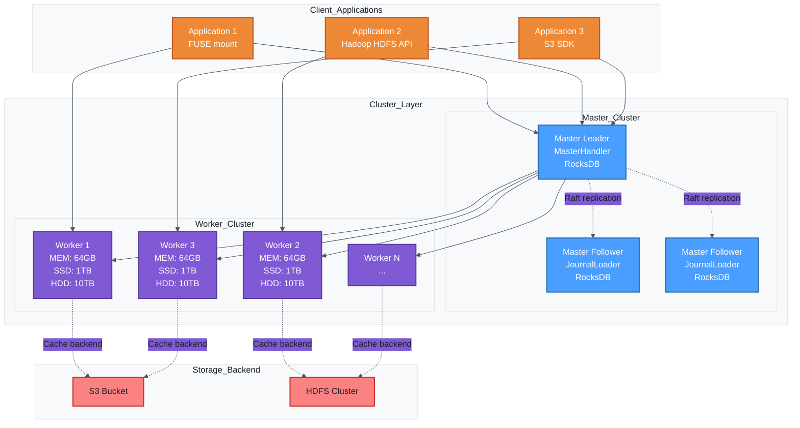
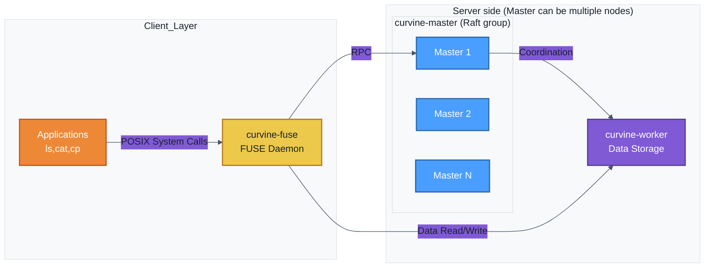

# Deployment Architecture

Before deploying a cluster, you need to understand the roles of each Curvine component and their interaction patterns. The following diagram shows the typical deployment architecture of Curvine, divided into three layers from top to bottom:
- **Application Layer**: Includes curvine-fuse, applications accessed via SDK, CLI management tools, etc. For details, refer to [Access Methods](../../3-User-Manuals/4-Access/01-fuse.md).
- **Curvine Cluster Service Layer**: Consists of **curvine-master** (can be multiple nodes for HA, forming a Raft group) and **curvine-worker** nodes forming the Curvine cluster.
- **UFS Cluster**: As the underlying storage backend, connected to the Curvine cluster through [mounting](../../3-User-Manuals/1-Key-Features/01-ufs.md#mounting), such as S3, HDFS, and other clusters.

## Component Roles

**Master nodes** (can be multiple for high availability): Responsible for metadata management, worker node coordination, and load balancing
- Deployed as a Raft group (one leader, multiple followers); clients talk to the current leader
- Maintains file system metadata (directory structure, file locations, etc.)
- Manages worker node registration and health checks
- Handles client metadata requests
- Uses Raft consensus algorithm to ensure metadata consistency

**Worker Node**: Responsible for data storage and processing
- Stores actual data blocks (supports memory, SSD, HDD multi-level caching)
- Handles data read/write requests
- Periodically sends heartbeats to Master
- Supports multi-replica data storage

**FUSE Interface**: Provides POSIX file system interface, mounting distributed cache as local file system

**S3 Gateway**: Provides S3-compatible object storage interface, supporting S3 API

**Client Library**: Provides multi-language APIs, communicating with Master and Worker nodes via RPC

## Relationship between curvine master, curvine worker, and curvine fuse

Master is deployed as **multiple nodes** (Raft group). Clients and FUSE communicate with the current master leader; the diagram below shows the logical roles.

## curvine fuse Use Cases

When you need to enable existing applications to access Curvine distributed cache without modification, FUSE can be used to mount Curvine as a local file system.

- Default mount points
    - /curvine-fuse