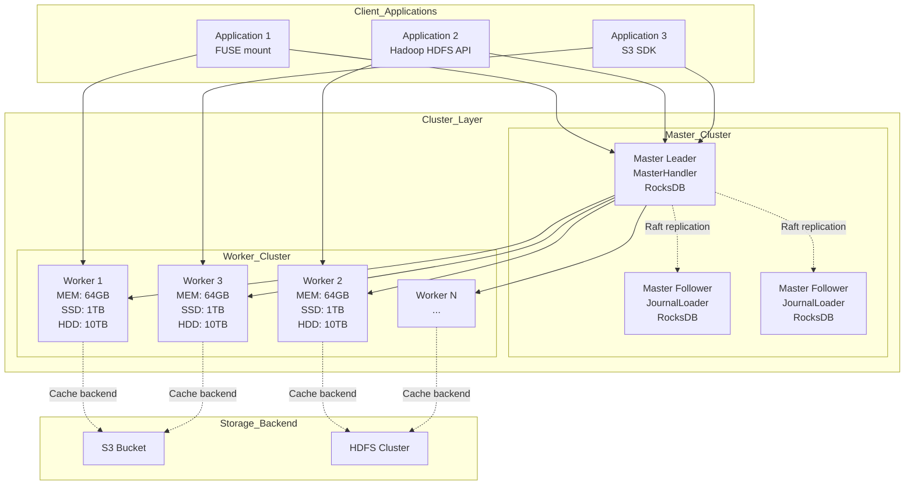
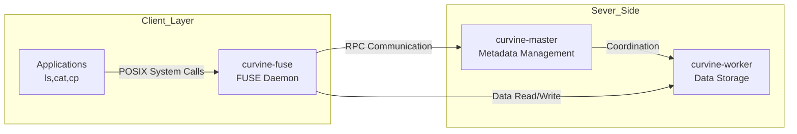

# Deployment Architecture

## Component Roles

**Master Node**: Responsible for metadata management, worker node coordination, and load balancing
- Maintains file system metadata (directory structure, file locations, etc.)
- Manages worker node registration and health checks
- Handles client metadata requests
- Uses Raft consensus algorithm to ensure metadata consistency

**Worker Node**: Responsible for data storage and processing
- Stores actual data blocks (supports memory, SSD, HDD multi-level caching)
- Handles data read/write requests
- Periodically sends heartbeats to Master
- Supports multi-replica data storage

**FUSE Interface**: Provides POSIX file system interface, mounting distributed cache as local file system

**S3 Gateway**: Provides S3-compatible object storage interface, supporting S3 API

**Client Library**: Provides multi-language APIs, communicating with Master and Worker nodes via RPC

## Relationship between curvine master, curvine worker, and curvine fuse

## curvine fuse Use Cases

When you need to enable existing applications to access Curvine distributed cache without modification, FUSE can be used to mount Curvine as a local file system.

- Default mount points
    - /curvine-fuse
    - /var/lib/curvine-fuse (Kubernetes environment)