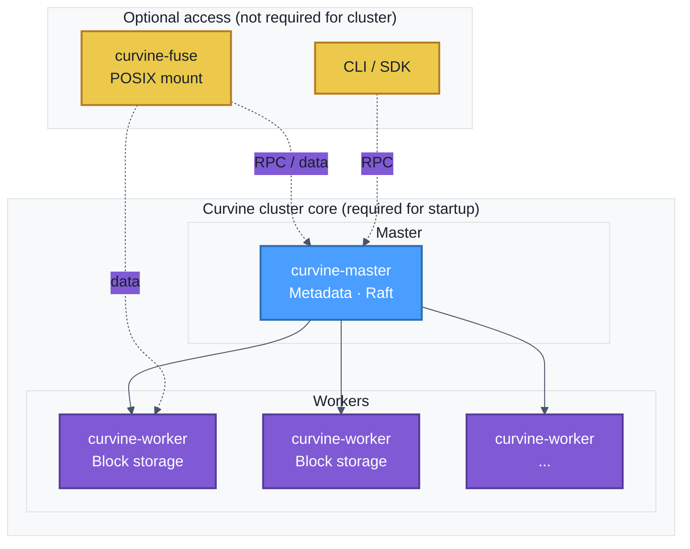

# Bare Metal Deployment

Before deployment, you need to [create installation packages and modify configuration files](../1-Preparation/03-deployment-setup.md#create-installation-package).

## Logical Deployment Architecture

The following diagram shows the logical architecture of a Curvine bare metal deployment. The **cluster core** consists only of Master and Worker processes; they must be started for the cluster to operate. FUSE is an **optional** access method and is **not** part of the cluster startup—you only need it when applications require a POSIX mount point.



- **Cluster core (required):** Start `curvine-master` and `curvine-worker` on the intended hosts. The cluster is operational once Master and Workers are running; you can use the CLI (`cv`) or SDK without FUSE.
- **FUSE (optional):** Start `curvine-fuse` only when you need a POSIX filesystem mount (e.g. for legacy tools or scripts). FUSE is not a core service—the cluster does not depend on it to start or run.

:::info
**FUSE is not part of cluster startup.** The Curvine cluster is formed by Master and Worker nodes. FUSE is one of several access methods (along with CLI, SDK, S3 gateway) and is only needed when applications require a local mount point.
:::

---

:::warning
Each worker needs to have its own determined IP. In multi-network interface environments, it is recommended to explicitly specify the IP through environment variables to avoid automatically reading unexpected network interface addresses.
:::

## Startup Commands

Bare metal deployment requires manually starting the **cluster core** (master and worker). Optionally start FUSE on nodes where you need a POSIX mount:

```bash
# Start cluster core (required)
bin/curvine-master.sh start
bin/curvine-worker.sh start

# Optional: start FUSE only when you need a POSIX mount point
bin/curvine-fuse.sh start
```