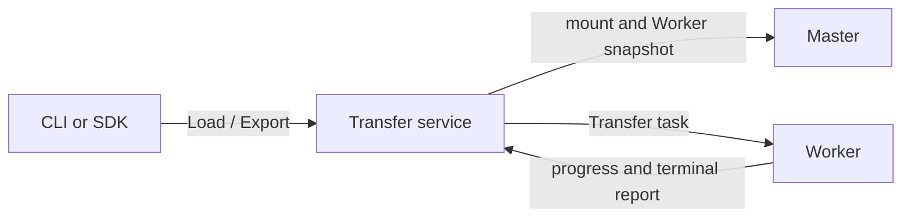

# Transfer Service

Transfer is an independent service for Load and Export jobs. It persists job
state, plans work from mount and Worker information, dispatches tasks to
Workers, and receives task reports. It does not host a replica of the full
Curvine metadata tree.

Deploy Transfer after the Master and Workers are healthy. It is optional: a
cluster that does not enable Transfer continues to use the legacy Master Load
and Export path.



## Configuration Boundary

The service and the client use different Transfer settings. Do not change the
running Master or Worker configuration merely to deploy Transfer.

| Component | Required change | Notes |
| --- | --- | --- |
| Transfer service | Set `transfer.enabled = true`, a persistent `store_url`, and a reachable endpoint. | The service configuration must also contain the existing cluster's Master addresses. |
| CLI or SDK client | Set `transfer.enabled = true` and `transfer.endpoints`. | `cv load`, `cv export`, and compatible status/cancel commands then use Transfer automatically. |
| Master | None. Keep Transfer disabled during staged rollout. | Enabling it makes the Master reject the legacy Load and Export RPCs. |
| Worker | None. | Workers need a version that supports Transfer tasks. Report endpoints are included in each task. |

The client configuration contains no database URL. The store belongs only to
the Transfer service.

## Choose a State Store

| Store | Topology | Use it when |
| --- | --- | --- |
| SQLite | One Transfer instance and one persistent local volume. | Evaluation, development, or a single-instance deployment. |
| MySQL | Two or more Transfer instances sharing one database. | Production high availability and rolling service upgrades. |

Never point multiple Transfer instances at independent SQLite files. They would
hold different job state and cannot fail over correctly.

## Required Configuration

The Transfer server needs a complete cluster configuration, including
`[client]` Master addresses. Add this section only to the Transfer server's
configuration file:

```toml
[transfer]
enabled = true
store_url = "sqlite:///var/lib/curvine-transfer/transfer.db"
hostname = "transfer-1.example.com"
endpoints = ["transfer-1.example.com:9010"]
```

For a MySQL-backed service, replace `store_url` with a shared MySQL URL. Do not
put credentials in a client configuration file or a ConfigMap.

Clients need only the routing settings:

```toml
[transfer]
enabled = true
endpoints = ["transfer-1.example.com:9010"]
```

If `endpoints` is omitted, Curvine derives one endpoint from
`hostname:rpc_port`. Explicit endpoints are recommended for Kubernetes and for
any address that differs from the bind address.

## Deploy and Verify

- [Deploy on bare metal](./1-Bare-Metal.md)
- [Deploy on Kubernetes](./2-Kubernetes.md)
- [Transfer configuration reference](../2-Deploy-Curvine-Cluster/3-Distributed-Mode/03-conf.md#transfer)

After deployment, run `cv transfer list` from a client configured for Transfer.
Submit a small mounted UFS file with `cv load <path> --watch`, then verify that
the job reaches `Completed` and the target can be read with `cv fs --cache-only get`.

## Rollout and Rollback

Enable Transfer in clients gradually. A client with `transfer.enabled = false`
continues to use the legacy Master job API, so deploying the service alone does
not change existing workloads. To roll back a client, disable Transfer in that
client configuration; do not delete a Transfer store while jobs are active.
