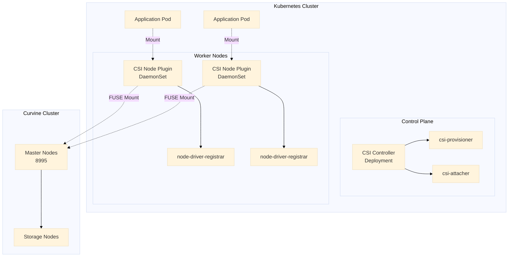

# K8S CSI Driver
To facilitate quick integration with Curvine in cloud-native environments, Curvine provides CSI driver support. Your Pod containers can access Curvine through `PV` (Persistent Volume) without requiring application modifications, enabling seamless use of Curvine's caching capabilities.

The Curvine CSI driver follows the standard CSI specification and includes:
- `CSI Controller`, deployed in `Deployment` or `Statefulset` mode
- `CSI Node Plugin`, deployed in `DaemonSet` mode

## Architecture Overview

The Curvine CSI driver adopts the standard CSI architecture with two main components:



### Core Components

1. **CSI Controller**
   - Runs in the Control Plane
   - Responsible for Volume creation, deletion, Attach/Detach operations
   - Includes csi-provisioner and csi-attacher sidecars

2. **CSI Node Plugin**
   - Runs as DaemonSet on each Worker Node
   - Responsible for mounting Curvine storage to Pods
   - Uses FUSE technology for filesystem mounting

3. **FUSE Mounting Mechanism**
   - Directly mounts Curvine filesystem paths
   - Same paths share FUSE process, saving resources
   - Supports concurrent access by multiple Pods

---

## Prerequisites

### Environment Requirements

- Kubernetes 1.19+
- Helm 3.0+
- Accessible Curvine cluster (Master node address and port)
- Cluster administrator privileges

### Environment Check

```bash
# Check Kubernetes version
kubectl version --short

# Check Helm version
helm version --short

# Check node status
kubectl get nodes
```

---

## I. Installing Curvine CSI

### 1.1 Get Helm Chart

```bash
helm repo add curvine https://curvineio.github.io/helm-charts
helm repo update
helm search repo curvine --devel
helm install curvine-csi curvine/curvine-csi \ 
    --namespace curvine-system \ 
    --create-namespace --devel \ 
    --version 0.0.1-dev+7ffc6a2
```


:::tip
The current Curvine Helm repository provides pre-release versions:
- Use `--devel` to view them, and replace the `--version` in the command above with your desired version
- curvine-csi is installed by default in the `curvine-system` namespace via Helm
- Official release versions will be provided progressively
:::

### 1.2 Configure Custom Parameters (Optional)
curvine-csi supports rich customization parameters. If your network environment has restrictions, you can use custom images and other methods.

For example, create a `custom-values.yaml` file:

```yaml
# Image configuration
image:
  repository: ghcr.io/curvineio/curvine-csi
  tag: latest
  pullPolicy: IfNotPresent

# Controller configuration
controller:
  replicas: 1
  resources:
    requests:
      cpu: 100m
      memory: 128Mi
    limits:
      cpu: 500m
      memory: 512Mi

# Node configuration
node:
  resources:
    requests:
      cpu: 100m
      memory: 128Mi
    limits:
      cpu: 500m
      memory: 512Mi
```

Install with custom parameters using Helm:
```bash
helm install curvine-csi curvine/curvine-csi \ 
    --namespace curvine-system \ 
    --create-namespace --devel \ 
  --values custom-values.yaml

# Check installation status
helm status curvine-csi -n curvine-system
```

### 1.4 Upgrade and Uninstall

```bash
# Upgrade
helm upgrade curvine curvine/curvine-csi -n curvine-system --devel --version xxxxx

# Uninstall
helm uninstall curvine-csi -n curvine-system

# Complete cleanup (including namespace)
kubectl delete namespace curvine-system
```

---

## II. Verification and Status Check

### 2.1 Check CSI Driver Registration

```bash
# Check if CSI Driver is registered successfully
kubectl get csidriver curvine

# Example output:
# NAME      ATTACHREQUIRED   PODINFOONMOUNT   STORAGECAPACITY
# curvine   false            false            false
```

**Parameter Explanation:**
- `ATTACHREQUIRED: false` - No Attach operation needed (direct FUSE mount)
- `PODINFOONMOUNT: false` - No Pod information needed during mount

### 2.2 Check Controller Status

```bash
# Check Controller Deployment
kubectl get deployment -n curvine-system curvine-csi-controller

# Check Controller Pod
kubectl get pods -n curvine-system -l app=curvine-csi-controller

# Check Controller logs
kubectl logs -n curvine-system \
  -l app=curvine-csi-controller \
  -c csi-plugin \
  --tail=50

# Check Provisioner Sidecar logs
kubectl logs -n curvine-system \
  -l app=curvine-csi-controller \
  -c csi-provisioner \
  --tail=50
```

### 2.3 Check Node Plugin Status

```bash
# Check Node DaemonSet
kubectl get daemonset -n curvine-system curvine-csi-node

# Check all Node Plugin Pods
kubectl get pods -n curvine-system -l app=curvine-csi-node -o wide

# Check specific Node logs
kubectl logs -n curvine-system curvine-csi-node-xxxxx -c csi-plugin

# Check Node Registrar logs
kubectl logs -n curvine-system curvine-csi-node-xxxxx -c node-driver-registrar
```

## III. StorageClass Explained

StorageClass is a resource in Kubernetes that defines storage types, used for automatic creation of dynamic PVs.

### 3.1 StorageClass Configuration Example

```yaml
apiVersion: storage.k8s.io/v1
kind: StorageClass
metadata:
  name: curvine-sc
provisioner: curvine                      # CSI driver name
reclaimPolicy: Delete                     # Reclaim policy
volumeBindingMode: Immediate              # Binding mode
allowVolumeExpansion: true                # Allow expansion
parameters:
  # Required: Curvine cluster connection information
  master-addrs: "master1:8995,master2:8995,master3:8995"
  
  # Required: Filesystem path prefix
  fs-path: "/k8s-volumes"
  
  # Optional: Path creation strategy
  path-type: "DirectoryOrCreate"
  
  # Optional: FUSE parameters
  io-threads: "4"
  worker-threads: "8"
```

### 3.2 Parameter Details

#### Core Parameters

| Parameter | Required | Description | Example |
|-----|------|------|------|
| `master-addrs` | ✅ | Curvine Master node address list, comma-separated | `"10.0.0.1:8995,10.0.0.2:8995"` |
| `fs-path` | ✅ | Path prefix for dynamic PVs, actual path is `fs-path + pv-name` | `"/k8s-volumes"` |
| `path-type` | ❌ | Path creation strategy, defaults to `Directory` | `"DirectoryOrCreate"` |
| `io-threads` | ❌ | FUSE IO thread count | `"4"` |
| `worker-threads` | ❌ | FUSE worker thread count | `"8"` |

#### Path Creation Strategy (path-type)

- **`Directory`** (default)
  - Path must already exist
  - Recommended for production environments
  - Ensures path is pre-created by administrators

- **`DirectoryOrCreate`**
  - Automatically creates path if it doesn't exist
  - Suitable for testing and development environments
  - Note permission issues

#### Reclaim Policy (reclaimPolicy)

- **`Delete`** (recommended for dynamic PVs)
  - Automatically deletes PV and storage data when PVC is deleted
  - Suitable for temporary data and testing environments

- **`Retain`**
  - PV is retained after PVC deletion
  - Data needs manual cleanup
  - Suitable for important data protection

#### Binding Mode (volumeBindingMode)

- **`Immediate`** (default)
  - PV is bound immediately after PVC creation
  - Suitable for single AZ clusters

- **`WaitForFirstConsumer`**
  - Waits for Pod scheduling before binding PV
  - Suitable for multi-AZ clusters, ensures PV is available on the Pod's node

### 3.3 Dynamic PV Path Generation Rules

```
Actual mount path = fs-path + "/" + pv-name
```

**Example:**
```yaml
# StorageClass configuration
fs-path: "/k8s-volumes"

# Auto-generated PV name
pv-name: "pvc-1234-5678-abcd"

# Final Curvine path
Actual path: "/k8s-volumes/pvc-1234-5678-abcd"
```

### 3.4 Create StorageClass

```bash
# Create StorageClass
kubectl apply -f - <<EOF
apiVersion: storage.k8s.io/v1
kind: StorageClass
metadata:
  name: curvine-sc
provisioner: curvine
reclaimPolicy: Delete
volumeBindingMode: Immediate
allowVolumeExpansion: true
parameters:
  master-addrs: "m0:8995,m1:8995,m2:8995"
  fs-path: "/k8s-volumes"
  path-type: "DirectoryOrCreate"
EOF

# View StorageClass
kubectl get storageclass curvine-sc

# Set as default StorageClass (optional)
kubectl patch storageclass curvine-sc \
  -p '{"metadata": {"annotations":{"storageclass.kubernetes.io/is-default-class":"true"}}}'
```

:::tip
Replace the `master-addrs` in the example above with your actual master addresses.
:::

### 3.5 Multiple StorageClass Scenarios

You can create multiple StorageClasses for different scenarios:

```yaml
# Production environment - strict mode
---
apiVersion: storage.k8s.io/v1
kind: StorageClass
metadata:
  name: curvine-prod
provisioner: curvine
reclaimPolicy: Retain
volumeBindingMode: WaitForFirstConsumer
parameters:
  master-addrs: "prod-master1:8995,prod-master2:8995"
  fs-path: "/production"
  path-type: "Directory"

# Development environment - relaxed mode
---
apiVersion: storage.k8s.io/v1
kind: StorageClass
metadata:
  name: curvine-dev
provisioner: curvine
reclaimPolicy: Delete
volumeBindingMode: Immediate
parameters:
  master-addrs: "dev-master:8995"
  fs-path: "/development"
  path-type: "DirectoryOrCreate"
```

---

## IV. Static PV Usage

Static PV is used to mount existing data directories in Curvine, suitable for the following scenarios:
- Multiple clusters sharing the same data
- Need for precise control over data paths

### 4.1 Working Principle

```
Curvine cluster has existing data
    ↓
Administrator creates PV, specifying curvine-path
    ↓
User creates PVC, binds to specified PV
    ↓
Pod mounts PVC
```

### 4.2 Create Static PV

```yaml
apiVersion: v1
kind: PersistentVolume
metadata:
  name: curvine-pv-existing-data
  labels:
    type: curvine-static
spec:
  storageClassName: curvine-sc
  capacity:
    storage: 100Gi                    # Declared capacity
  accessModes:
    - ReadWriteMany                   # Supports multi-Pod read-write
  persistentVolumeReclaimPolicy: Retain  # Retain data
  csi:
    driver: curvine
    volumeHandle: "existing-data-volume-001"  # Unique identifier
    volumeAttributes:
      # Required: Curvine Master address
      master-addrs: "m0:8995,m1:8995,m2:8995"
      
      # Required: Complete path in Curvine
      curvine-path: "/production/user-data"
      
      # Recommended: Use Directory to ensure path exists
      path-type: "Directory"
      
      # Optional: FUSE parameters
      io-threads: "4"
      worker-threads: "8"
```

**Parameter Explanation:**
- `volumeHandle`: Any unique string, used to identify the PV
- `curvine-path`: Complete path in Curvine filesystem, must already exist
- `path-type: Directory`: Requires path to exist (recommended)

### 4.3 Create Static PVC

```yaml
apiVersion: v1
kind: PersistentVolumeClaim
metadata:
  name: curvine-pvc-existing-data
  namespace: default
spec:
  storageClassName: curvine-sc
  accessModes:
    - ReadWriteMany
  resources:
    requests:
      storage: 100Gi
  # Key: Specify the PV name to bind
  volumeName: curvine-pv-existing-data
```

### 4.4 Verify Binding

```bash
# Check PV status
kubectl get pv curvine-pv-existing-data
# STATUS should be Bound

# Check PVC status
kubectl get pvc curvine-pvc-existing-data
# STATUS should be Bound

# Check detailed information
kubectl describe pvc curvine-pvc-existing-data
```

### 4.5 Using Static PV in Pod

```yaml
apiVersion: v1
kind: Pod
metadata:
  name: static-pv-test
spec:
  containers:
  - name: app
    image: nginx:alpine
    volumeMounts:
    - name: data
      mountPath: /data
  volumes:
  - name: data
    persistentVolumeClaim:
      claimName: curvine-pvc-existing-data
```

## V. Dynamic PV Usage

Dynamic PV is the most commonly used method, automatically created and managed by the CSI Controller.

### 5.1 Working Principle

```
User creates PVC, specifying StorageClass
    ↓
CSI Provisioner automatically creates PV
    ↓
Auto-generates Curvine path: fs-path + pv-name
    ↓
PVC automatically binds to PV
    ↓
Pod mounts PVC for use
```

### 5.2 Create Dynamic PVC

Dynamic PVC requires specifying a storageclass, without specifying volumeName:

```yaml
apiVersion: v1
kind: PersistentVolumeClaim
metadata:
  name: my-dynamic-pvc
  namespace: default
spec:
  storageClassName: curvine-sc    # Specify StorageClass
  accessModes:
    - ReadWriteOnce               # or ReadWriteMany
  resources:
    requests:
      storage: 10Gi               # Request capacity
```

### 5.3 Automatic Path Generation Example

```yaml
# StorageClass configuration
fs-path: "/k8s-volumes"

# PVC name
name: my-dynamic-pvc

# Auto-generated PV
# volumeHandle: pvc-1a2b3c4d-5e6f-7g8h-9i0j-k1l2m3n4o5p6

# Actual Curvine path
# /k8s-volumes/pvc-1a2b3c4d-5e6f-7g8h-9i0j-k1l2m3n4o5p6

# You can use Curvine's cv command to check if the volume was created correctly in the Curvine cluster
./bin/cv fs ls /
```

### 5.4 Dynamic PV Complete Example

```bash
# 1. Create dynamic PVC
kubectl apply -f - <<EOF
apiVersion: v1
kind: PersistentVolumeClaim
metadata:
  name: app-data-pvc
  namespace: default
spec:
  storageClassName: curvine-sc
  accessModes:
    - ReadWriteMany
  resources:
    requests:
      storage: 20Gi
EOF

# 2. Check PVC status (should automatically Bound)
kubectl get pvc app-data-pvc
kubectl describe pvc app-data-pvc

# 3. Check auto-created PV
kubectl get pv

# 4. Create Pod using PVC
kubectl apply -f - <<EOF
apiVersion: v1
kind: Pod
metadata:
  name: dynamic-pv-test
spec:
  containers:
  - name: app
    image: nginx:alpine
    volumeMounts:
    - name: data
      mountPath: /usr/share/nginx/html
  volumes:
  - name: data
    persistentVolumeClaim:
      claimName: app-data-pvc
EOF

# 5. Test write and read
kubectl exec dynamic-pv-test -- sh -c 'echo "Hello Curvine" > /usr/share/nginx/html/index.html'
kubectl exec dynamic-pv-test -- cat /usr/share/nginx/html/index.html
```

## VI. Using Dynamic PV in Deployment

Deployment is suitable for stateless applications where multiple replicas share the same storage.

### 6.1 Architecture Pattern

```
           Deployment (3 replicas)
               /      |      \
            Pod-1  Pod-2  Pod-3
               \      |      /
                Single PVC (RWX)
                      |
              Curvine Volume (Shared)
```

### 6.2 Complete Example

```yaml
# deployment-with-pvc.yaml
---
# 1. Create shared PVC
apiVersion: v1
kind: PersistentVolumeClaim
metadata:
  name: shared-data-pvc
  namespace: default
spec:
  storageClassName: curvine-sc
  accessModes:
    - ReadWriteMany
  resources:
    requests:
      storage: 10Gi

---
# 2. Create Deployment
apiVersion: apps/v1
kind: Deployment
metadata:
  name: web-app
  namespace: default
spec:
  replicas: 3
  selector:
    matchLabels:
      app: web-app
  template:
    metadata:
      labels:
        app: web-app
    spec:
      containers:
      - name: nginx
        image: nginx:alpine
        ports:
        - containerPort: 80
        volumeMounts:
        - name: shared-storage
          mountPath: /usr/share/nginx/html
        livenessProbe:
          httpGet:
            path: /
            port: 80
          initialDelaySeconds: 10
        readinessProbe:
          httpGet:
            path: /
            port: 80
          initialDelaySeconds: 5
      volumes:
      - name: shared-storage
        persistentVolumeClaim:
          claimName: shared-data-pvc  # Share the same PVC

---
# 3. Create Service
apiVersion: v1
kind: Service
metadata:
  name: web-app-service
  namespace: default
spec:
  selector:
    app: web-app
  ports:
  - port: 80
    targetPort: 80
  type: ClusterIP
```

:::tip
For Deployment applications, Kubernetes is natively positioned for stateless services, meaning all replica Pods by default read and write to the same PV path. If your application requires different path isolation on Curvine, you can try using OpenKruise's `CloneSets` as an alternative, which supports VolumeClaimTemplates. Reference: https://openkruise.io/zh/docs/user-manuals/cloneset
:::

### 6.3 Deploy and Verify

```bash
# 1. Deploy application
kubectl apply -f deployment-with-pvc.yaml

# 2. Check PVC status
kubectl get pvc shared-data-pvc

# 3. Check all Pods
kubectl get pods -l app=web-app -o wide

# 4. Verify all Pods mounted the same PVC
kubectl get pods -l app=web-app -o jsonpath='{range .items[*]}{.metadata.name}{"\t"}{.spec.volumes[0].persistentVolumeClaim.claimName}{"\n"}{end}'

# 5. Write data in one Pod
POD1=$(kubectl get pod -l app=web-app -o jsonpath='{.items[0].metadata.name}')
kubectl exec $POD1 -- sh -c 'echo "Hello from Pod 1" > /usr/share/nginx/html/test.html'

# 6. Read data in another Pod (verify sharing)
POD2=$(kubectl get pod -l app=web-app -o jsonpath='{.items[1].metadata.name}')
kubectl exec $POD2 -- cat /usr/share/nginx/html/test.html
# Should output: Hello from Pod 1

# 7. Verify Service access
kubectl run curl-test --image=curlimages/curl --rm -it --restart=Never -- curl http://web-app-service/test.html
```

## VII. Using Dynamic PV in StatefulSet

StatefulSet is suitable for stateful applications, where each Pod has independent persistent storage.

### 7.1 Architecture Pattern

```
        StatefulSet (3 replicas)
            |         |         |
         Pod-0     Pod-1     Pod-2
            |         |         |
         PVC-0     PVC-1     PVC-2
            |         |         |
          PV-0      PV-1      PV-2
            |         |         |
     /path/pvc-0  /path/pvc-1  /path/pvc-2
```

### 7.2 Complete Example

```yaml
# statefulset-web-app.yaml
---
# 1. Headless Service (required)
apiVersion: v1
kind: Service
metadata:
  name: web-app-service
  namespace: default
spec:
  clusterIP: None                # Headless Service
  selector:
    app: web-app
  ports:
  - port: 80
    name: web

---
# 2. StatefulSet with VolumeClaimTemplates
apiVersion: apps/v1
kind: StatefulSet
metadata:
  name: web-app
  namespace: default
spec:
  serviceName: web-app-service   # Must specify Service
  replicas: 3
  selector:
    matchLabels:
      app: web-app
  template:
    metadata:
      labels:
        app: web-app
    spec:
      containers:
      - name: nginx
        image: nginx:alpine
        ports:
        - containerPort: 80
          name: web
        volumeMounts:
        - name: data                # Must match volumeClaimTemplates name
          mountPath: /usr/share/nginx/html
        command:
        - /bin/sh
        - -c
        - |
          # Write hello world message with pod name
          echo "<h1>Hello from $(hostname)</h1>" > /usr/share/nginx/html/index.html
          echo "<p>This is my persistent storage!</p>" >> /usr/share/nginx/html/index.html
          echo "<p>Created at: $(date)</p>" >> /usr/share/nginx/html/index.html
          # Start nginx
          nginx -g 'daemon off;'
  # Key: VolumeClaimTemplates
  volumeClaimTemplates:
  - metadata:
      name: data                    # PVC name prefix
    spec:
      storageClassName: curvine-sc
      accessModes:
        - ReadWriteOnce             # Independent storage for each Pod
      resources:
        requests:
          storage: 1Gi
```

### 7.3 Deploy and Verify

```bash
# 1. Deploy StatefulSet
kubectl apply -f statefulset-web-app.yaml

# 2. Watch Pod creation order (created sequentially)
kubectl get pods -l app=web-app -w

# 3. Check PVCs (auto-created, one per Pod)
kubectl get pvc
# Example output:
# data-web-app-0   Bound    pvc-xxx   1Gi       RWO
# data-web-app-1   Bound    pvc-yyy   1Gi       RWO
# data-web-app-2   Bound    pvc-zzz   1Gi       RWO

# 4. Check PVs (auto-created)
kubectl get pv

# 5. Verify each Pod has independent storage
for i in 0 1 2; do
  echo "=== Pod web-app-$i ==="
  kubectl exec web-app-$i -- cat /usr/share/nginx/html/index.html
done

# 6. Write custom data to Pod-0
kubectl exec web-app-0 -- sh -c \
  'echo "<p>Custom data from Pod-0</p>" >> /usr/share/nginx/html/index.html'

# 7. Verify Pod-0's data
kubectl exec web-app-0 -- cat /usr/share/nginx/html/index.html

# 8. Verify Pod-1 doesn't have Pod-0's custom data (independent storage)
kubectl exec web-app-1 -- cat /usr/share/nginx/html/index.html

# 9. Test persistence: Data remains after deleting Pod-0
kubectl delete pod web-app-0
# Wait for Pod to be recreated
kubectl wait --for=condition=Ready pod/web-app-0 --timeout=60s
# Verify data still exists
kubectl exec web-app-0 -- cat /usr/share/nginx/html/index.html
```

### 7.4 StatefulSet Features

#### PVC Naming Convention

```
PVC name = volumeClaimTemplate.name + "-" + StatefulSet.name + "-" + Pod ordinal

Example:
data-web-app-0
data-web-app-1
data-web-app-2
```

#### Pod and PVC Lifecycle

```bash
# 1. Delete Pod, PVC is not deleted
kubectl delete pod web-app-0
# Pod is recreated and automatically binds back to the original PVC, data is retained

# 2. Delete StatefulSet, retain PVCs (recommended)
kubectl delete statefulset web-app --cascade=orphan
# PVCs and data are retained

# 3. Delete StatefulSet and Pods, but retain PVCs
kubectl delete statefulset web-app
# PVCs need manual deletion

# 4. Manually delete PVC
kubectl delete pvc data-web-app-0
```

#### Scaling

```bash
# 1. Scale up (increase replicas)
kubectl scale statefulset web-app --replicas=5
# Automatically creates web-app-3, web-app-4 and corresponding PVCs

# 2. Scale down (decrease replicas)
kubectl scale statefulset web-app --replicas=2
# web-app-2 is deleted, but PVC data-web-app-2 is retained

# 3. Scale up again
kubectl scale statefulset web-app --replicas=3
# web-app-2 is recreated and binds back to data-web-app-2, data is restored
```

#### FUSE Process Sharing

```yaml
# Conditions for multiple PVs to share a FUSE process:
# 1. Same master-addrs
# 2. Same curvine-path

# Example: These two PVs will share a FUSE process
PV1:
  master-addrs: "10.0.0.1:8995"
  curvine-path: "/shared-data"

PV2:
  master-addrs: "10.0.0.1:8995"
  curvine-path: "/shared-data"

# These two PVs will have independent FUSE processes
PV3:
  curvine-path: "/data-1"

PV4:
  curvine-path: "/data-2"
```

## Appendix
### Helm Custom Parameters
#### Global Settings

| Parameter Path | Type | Default | Description |
|---------|------|--------|------|
| `global.namespace` | string | `curvine-system` | Namespace where CSI driver is deployed |

#### Image Settings

| Parameter Path | Type | Default | Description |
|---------|------|--------|------|
| `image.repository` | string | `ghcr.io/curvineio/curvine-csi` | CSI driver image repository address |
| `image.tag` | string | `latest` | CSI driver image tag version |
| `image.pullPolicy` | string | `Always` | Image pull policy (Always/IfNotPresent/Never) |

#### CSI Driver Settings

| Parameter Path | Type | Default | Description |
|---------|------|--------|------|
| `csiDriver.name` | string | `curvine` | CSI driver name identifier |
| `csiDriver.attachRequired` | boolean | `false` | Whether attach operation is required (volume attachment to node) |
| `csiDriver.podInfoOnMount` | boolean | `false` | Whether Pod information is required during mount |

#### Controller Settings

| Parameter Path | Type | Default | Description |
|---------|------|--------|------|
| `controller.name` | string | `curvine-csi-controller` | Controller Deployment name |
| `controller.replicas` | int | `1` | Number of Controller replicas |
| `controller.priorityClassName` | string | `system-cluster-critical` | Controller priority class name (high priority) |
| `controller.container.name` | string | `csi-plugin` | Main container name |
| `controller.container.command` | array | `["/opt/curvine/csi"]` | Container start command |
| `controller.container.args` | array | See values.yaml | Container start arguments |
| `controller.container.env.CSI_ENDPOINT` | string | `unix:///csi/csi.sock` | CSI socket endpoint address |
| `controller.container.livenessProbe.failureThreshold` | int | `5` | Liveness probe failure threshold |
| `controller.container.livenessProbe.initialDelaySeconds` | int | `10` | Liveness probe initial delay seconds |
| `controller.container.livenessProbe.periodSeconds` | int | `10` | Liveness probe check period (seconds) |
| `controller.container.livenessProbe.timeoutSeconds` | int | `3` | Liveness probe timeout (seconds) |
| `controller.container.ports.healthz` | int | `9909` | Health check port |
| `controller.container.securityContext.privileged` | boolean | `true` | Whether to run in privileged mode |
| `controller.container.securityContext.capabilities.add` | array | `[SYS_ADMIN]` | Added Linux Capabilities |
| `controller.tolerations` | array | See values.yaml | Pod toleration configuration (allows CriticalAddons scheduling) |

#### Controller Sidecar Container Configuration

| Parameter Path | Type | Default | Description |
|---------|------|--------|------|
| `controller.sidecars.provisioner.image` | string | `quay.io/k8scsi/csi-provisioner:v1.6.0` | Provisioner sidecar image |
| `controller.sidecars.provisioner.args` | array | See values.yaml | Provisioner arguments (timeout 60s, log level v5) |
| `controller.sidecars.attacher.image` | string | `registry.k8s.io/sig-storage/csi-attacher:v4.5.0` | Attacher sidecar image |
| `controller.sidecars.attacher.args` | array | See values.yaml | Attacher arguments (log level v5) |
| `controller.sidecars.livenessProbe.image` | string | `registry.k8s.io/sig-storage/livenessprobe:v2.11.0` | LivenessProbe sidecar image |
| `controller.sidecars.livenessProbe.args` | array | See values.yaml | LivenessProbe arguments |
| `controller.sidecars.livenessProbe.env.HEALTH_PORT` | string | `"9909"` | Health check port |

#### Node Settings

| Parameter Path | Type | Default | Description |
|---------|------|--------|------|
| `node.name` | string | `curvine-csi-node` | Node DaemonSet name |
| `node.priorityClassName` | string | `system-node-critical` | Node priority class name (node critical level) |
| `node.dnsPolicy` | string | `ClusterFirstWithHostNet` | DNS policy (cluster first + host network) |
| `node.container.name` | string | `csi-plugin` | Main container name |
| `node.container.command` | array | `["/opt/curvine/csi"]` | Container start command |
| `node.container.args` | array | See values.yaml | Container start arguments |
| `node.container.env.CSI_ENDPOINT` | string | `unix:///csi/csi.sock` | CSI socket endpoint address |
| `node.container.livenessProbe.failureThreshold` | int | `5` | Liveness probe failure threshold |
| `node.container.livenessProbe.initialDelaySeconds` | int | `10` | Liveness probe initial delay seconds |
| `node.container.livenessProbe.periodSeconds` | int | `10` | Liveness probe check period (seconds) |
| `node.container.livenessProbe.timeoutSeconds` | int | `3` | Liveness probe timeout (seconds) |
| `node.container.ports.healthz` | int | `9909` | Health check port |
| `node.container.securityContext.privileged` | boolean | `true` | Whether to run in privileged mode |
| `node.container.lifecycle.preStop` | object | See values.yaml | Container pre-stop hook (cleanup socket files) |
| `node.tolerations` | array | `[{operator: Exists}]` | Pod toleration configuration (tolerates all taints) |

#### Node Sidecar Container Configuration

| Parameter Path | Type | Default | Description |
|---------|------|--------|------|
| `node.sidecars.nodeDriverRegistrar.image` | string | `quay.io/k8scsi/csi-node-driver-registrar:v2.1.0` | Node driver registrar image |
| `node.sidecars.nodeDriverRegistrar.args` | array | See values.yaml | Registrar arguments (log level v5) |
| `node.sidecars.nodeDriverRegistrar.env.ADDRESS` | string | `/csi/csi.sock` | CSI socket address |
| `node.sidecars.nodeDriverRegistrar.env.DRIVER_REG_SOCK_PATH` | string | `/var/lib/kubelet/csi-plugins/csi.curvine.io/csi.sock` | Driver registration path in Kubelet |
| `node.sidecars.livenessProbe.image` | string | `registry.k8s.io/sig-storage/livenessprobe:v2.11.0` | LivenessProbe sidecar image |
| `node.sidecars.livenessProbe.args` | array | See values.yaml | LivenessProbe arguments |
| `node.sidecars.livenessProbe.env.ADDRESS` | string | `/csi/csi.sock` | CSI socket address |
| `node.sidecars.livenessProbe.env.HEALTH_PORT` | string | `"9909"` | Health check port |

#### Node Host Path Configuration

| Parameter Path | Type | Default | Description |
|---------|------|--------|------|
| `node.hostPaths.pluginDir.path` | string | `/var/lib/kubelet/csi-plugins/csi.curvine.io/` | CSI plugin directory path |
| `node.hostPaths.pluginDir.type` | string | `DirectoryOrCreate` | Path type (create if not exists) |
| `node.hostPaths.kubeletDir.path` | string | `/var/lib/kubelet` | Kubelet working directory path |
| `node.hostPaths.kubeletDir.type` | string | `DirectoryOrCreate` | Path type (create if not exists) |
| `node.hostPaths.registrationDir.path` | string | `/var/lib/kubelet/plugins_registry/` | Plugin registration directory path |
| `node.hostPaths.registrationDir.type` | string | `Directory` | Path type (must exist) |

#### Service Account Settings

| Parameter Path | Type | Default | Description |
|---------|------|--------|------|
| `serviceAccount.controller.name` | string | `curvine-csi-controller-sa` | Controller service account name |
| `serviceAccount.node.name` | string | `curvine-csi-node-sa` | Node service account name |

#### RBAC Configuration

| Parameter Path | Type | Default | Description |
|---------|------|--------|------|
| `rbac.create` | boolean | `true` | Whether to create RBAC resources (ClusterRole/ClusterRoleBinding) |

#### ConfigMap Configuration (Curvine Cluster Configuration)

| Parameter Path | Type | Default | Description |
|---------|------|--------|------|
| `configMap.name` | string | `curvine-config` | ConfigMap name |
| `configMap.defaultMode` | octal | `0755` | File default permission mode |
| `configMap.data.curvineClusterToml` | string | See values.yaml | Curvine cluster configuration file (TOML format) |
| `configMap.data.curvineEnvSh` | string | See values.yaml | Curvine environment variables script |

#### Curvine Cluster Configuration Parameters in ConfigMap

| Configuration Item | Type | Default | Description |
|-------|------|--------|------|
| `client.master_addrs` | array | `[{hostname: "localhost", port: 8995}]` | Curvine Master node address list |
| `log.level` | string | `"info"` | Log level (debug/info/warn/error) |
| `log.log_dir` | string | `"stdout"` | Log output directory (stdout for standard output) |
| `log.file_name` | string | `"curvine.log"` | Log file name |

#### StorageClass Parameters (Configured at Usage Time)

| Parameter Name | Required | Type | Default | Description |
|--------|---------|------|--------|------|
| `master-addrs` | **Required** | string | None | Curvine Master node addresses, format: `host:port,host:port` |
| `fs-path` | **Required** | string | None | Filesystem path prefix, each PV creates: `fs-path + pv-name` |
| `path-type` | Optional | string | `Directory` | Path creation strategy: `DirectoryOrCreate` or `Directory` |
| `io-threads` | Optional | string | None | FUSE IO thread count |
| `worker-threads` | Optional | string | None | FUSE worker thread count |