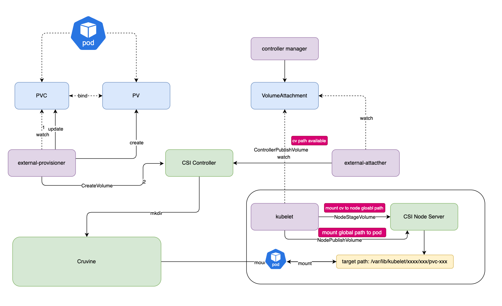

# CSI Driver
To facilitate quick integration with Curvine in cloud-native environments, Curvine provides CSI driver support. Your Pod containers can access Curvine through `PV` (Persistent Volume) without requiring application modifications, enabling the use of Curvine's caching capabilities.

The Curvine CSI driver follows the standard CSI specification and includes:
- `CSI Controller`, deployed in `Deployment` mode or `Statefulset` mode
- `CSI Node Plugin`, deployed in `DaemonSet` mode

Deployment scripts are located in the `curvine-csi/deploy` directory. Execute:
```bash
kubectl create -f curvine-csi/deploy
```

:::warning
Currently, the `curvine-csi` depends on a fuse version that only supports cluster configuration file connection method. Therefore, in `deploy/configmap.yaml`, you need to fill in the `master_addrs` option with the real curvine master address.

This is a temporary solution. If you want to try it out, you can test it. We are working on supporting custom parameters for fuse, and various configuration parameters for connecting to the cluster will be customized through storageclass or pv attributes. This will be released soon, stay tuned!

The CSI driver is still in rapid iteration. If you encounter issues during use, welcome to submit an issue 😄!
:::

After successful deployment, you will see the following pods:
```bash
NAME                     READY   STATUS    RESTARTS   AGE
curvine-controller-0     4/4     Running   0          4h32m
curvine-csi-node-jbvmt   3/3     Running   0          4h32m
```



:::warning
The Curvine CSI driver depends on fuse, which is established by the CSI node plugin. Since CSI driver upgrades will interrupt the fuse service, proceed with caution.
:::

## Deploy CSI
First, deploy the CSI driver in the k8s cluster and ensure that the CSI node plugin is running properly.

## PVC+Static PV
You can manually create a static PV and bind the PVC to the static PV. Example:
```yaml
---
apiVersion: v1
kind: PersistentVolume
metadata:
  name: curvine-pv
  labels:
    type: curvine
spec:
  storageClassName: curvine-sc
  capacity:
    storage: 10Gi
  accessModes:
    - ReadWriteOnce
  persistentVolumeReclaimPolicy: Delete
  csi:
    driver: curvine
    volumeHandle: curvine-volume-1
    volumeAttributes:
      curvinePath: "/"
      type: "Directory" # Using Directory type requires that the path must already exist
```

:::note 
The following fields are required:
- `volumeAttributes.curvinePath` must be `/`, as currently Curvine fuse only supports mounting the root path
- `volumeAttributes.type` as `Directory` indicates the path already exists. `DirectoryOrCreate` indicates the path will be automatically created if it doesn't exist
:::

## PVC+Dynamic PV
To use dynamic PV, you need to define a `StorageClass` first.

`StorageClass` example:

```yaml
apiVersion: storage.k8s.io/v1
kind: StorageClass
metadata:
  name: curvine-sc
provisioner: curvine
reclaimPolicy: Delete
volumeBindingMode: Immediate
allowVolumeExpansion: true
parameters:
  curvinePath: "/"
  type: "DirectoryOrCreate" #"DirectoryOrCreate" or "Directory"
```

PVC example:
```yaml
---
apiVersion: v1
kind: PersistentVolumeClaim
metadata:
  name: curvine-pvc
spec:
  storageClassName: curvine-sc
  accessModes:
    - ReadWriteOnce
  resources:
    requests:
      storage: 5Gi
```

After creating the PVC, a PV will be automatically created with the status `Bound`, as shown below:
```bash
$ kubectl get pvc
NAME          STATUS   VOLUME                                     CAPACITY   ACCESS MODES   STORAGECLASS   VOLUMEATTRIBUTESCLASS   AGE
curvine-pvc   Bound    pvc-fce87a49-828f-43d2-8360-7901b0b5f886   5Gi        RWO            curvine-sc     <unset>                 16s
```

## Creating a Pod
Mount the Curvine volume to a pod. Example:
```yaml
apiVersion: v1
kind: Pod
metadata:
  name: curvine-csi-pod
  labels:
    app: curvine-csi-pod
spec:
  containers:
    - name: web-server
      image: nginx
      ports:
        - containerPort: 80
          name: "http-server"
      volumeMounts:
        - mountPath: "/usr/share/nginx/html"
          name: curvine-storage
  volumes:
    - name: curvine-storage
      persistentVolumeClaim:
        claimName: curvine-pvc
```

## Verification
On a cluster with Curvine running, you can manually create a file in the root path, such as 'index.html'. You can use the `fuse` feature; by default, the fuse mounted by Curvine is at the `/curvine-fuse` path.

```bash
$ ls /curvine-fuse
index.html
```

Check in the pod:
```bash
$ kubectl exec curvine-test-pod -n default -- /usr/bin/cat /usr/share/nginx/html/index.html
<html>
        hello curvine csi
</html>
```

## Curvine CSI Driver Helm Chart

Using Helm chart to deploy the Curvine CSI (Container Storage Interface) driver on a Kubernetes cluster.

## Prerequisites

- Kubernetes 1.19+
- Helm 3.0+

## Installation

### Add Helm Repository (if available)

```bash
helm repo add curvine https://charts.curvine.io
helm repo update
```

### Install from Local Chart

```bash
# Install with default values
helm install curvine-csi ./curvine-csi

# Install with custom values
helm install curvine-csi ./curvine-csi -f custom-values.yaml

# Install in specific namespace
helm install curvine-csi ./curvine-csi --namespace curvine-system --create-namespace
```

## Configuration

The following table lists the configurable parameters and their default values:

| Parameter | Description | Default |
|-----------|-------------|---------|
| `global.namespace` | Namespace to deploy resources | `default` |
| `image.repository` | Curvine CSI image repository | `curvine/curvine-csi` |
| `image.tag` | Curvine CSI image tag | `latest` |
| `image.pullPolicy` | Image pull policy | `Always` |
| `csiDriver.name` | CSI driver name | `curvine` |
| `csiDriver.attachRequired` | Whether attach is required | `true` |
| `csiDriver.podInfoOnMount` | Whether pod info on mount | `false` |
| `controller.replicas` | Number of controller replicas | `1` |
| `controller.priorityClassName` | Priority class for controller | `system-cluster-critical` |
| `node.priorityClassName` | Priority class for node | `system-node-critical` |
| `rbac.create` | Create RBAC resources | `true` |
| `configMap.name` | ConfigMap name | `curvine-config` |

## Customization

### Custom Curvine Configuration

You can customize the Curvine configuration by modifying the `configMap.data.curvineClusterToml` value:

```yaml
configMap:
  data:
    curvineClusterToml: |
      [client]
      master_addrs = [
          { hostname = "your-master-host", port = 8995 }
      ]
      
      [log]
      level = "debug"
      log_dir = "stdout"
      file_name = "curvine.log"
```

### Custom Images

```yaml
image:
  repository: your-registry/curvine-csi
  tag: v1.0.0
  pullPolicy: IfNotPresent

controller:
  sidecars:
    provisioner:
      image: registry.k8s.io/sig-storage/csi-provisioner:v3.6.0
    attacher:
      image: registry.k8s.io/sig-storage/csi-attacher:v4.5.0
```

### Node Tolerations

```yaml
node:
  tolerations:
    - key: "node-role.kubernetes.io/master"
      operator: "Exists"
      effect: "NoSchedule"
    - key: "node-role.kubernetes.io/control-plane"
      operator: "Exists"
      effect: "NoSchedule"
```

## Usage

After installation, create a StorageClass:

```yaml
apiVersion: storage.k8s.io/v1
kind: StorageClass
metadata:
  name: curvine-csi
provisioner: curvine
parameters:
  # Add Curvine-specific parameters
volumeBindingMode: WaitForFirstConsumer
```

Create a PVC:

```yaml
apiVersion: v1
kind: PersistentVolumeClaim
metadata:
  name: test-pvc
spec:
  accessModes:
    - ReadWriteOnce
  resources:
    requests:
      storage: 10Gi
  storageClassName: curvine-csi
```

## Uninstallation

```bash
helm uninstall curvine-csi
```

## Troubleshooting

### Check CSI Driver Status

```bash
kubectl get csidriver curvine
kubectl get pods -l app.kubernetes.io/name=curvine-csi
```

### Check Logs

```bash
# Controller logs
kubectl logs -l app=curvine-csi-controller -c csi-plugin

# Node logs
kubectl logs -l app=curvine-csi-node -c csi-plugin
```

### Common Issues

1. **CSI Driver not registered**: Check if the node-driver-registrar sidecar is running
2. **Mount failures**: Verify Curvine cluster connectivity and configuration
3. **Permission issues**: Ensure proper RBAC permissions are granted