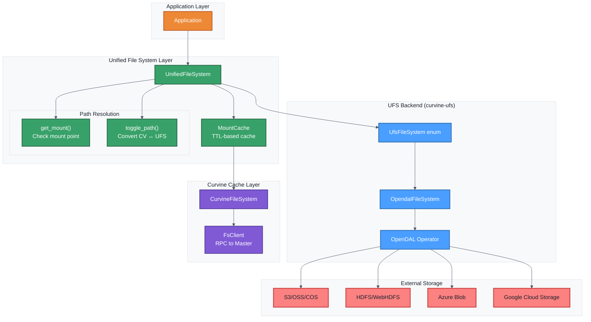
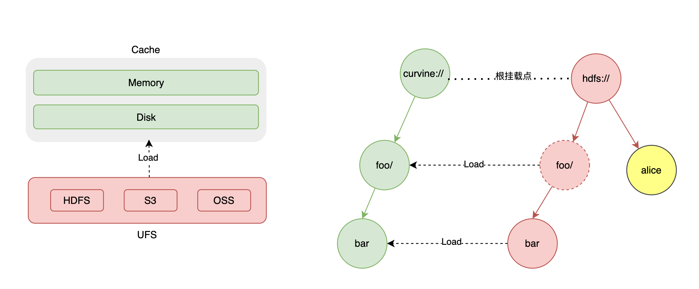

# Data Orchestration

Curvine provides a UFS (Unified File System) view to manage all supported distributed storage systems, including S3, HDFS, and others.


```mermaid
%%{init: {'theme': 'base', 'themeVariables': { 'background': '#ffffff', 'primaryColor': '#4a9eff', 'primaryTextColor': '#1a202c', 'primaryBorderColor': '#3182ce', 'lineColor': '#4a5568', 'secondaryColor': '#805ad5', 'tertiaryColor': '#38a169', 'mainBkg': '#ffffff', 'nodeBorder': '#4a5568', 'clusterBkg': '#f8f9fa', 'clusterBorder': '#dee2e6', 'titleColor': '#1a202c'}}}%%
flowchart TD
    subgraph Application_Layer["Application Layer"]
        App[Application]
    end

    subgraph UFS_Backend["UFS Backend (curvine-ufs)"]
        UEnum[UfsFileSystem enum]
        OFS[OpendalFileSystem]
        ODO[OpenDAL Operator]
    end

    subgraph Unified_FS["Unified File System Layer"]
        UFS[UnifiedFileSystem]
        subgraph Path_Resolution["Path Resolution"]
            GM["get_mount()"<br/>Check mount point]
            TP["toggle_path()"<br/>Convert CV ↔ UFS]
        end
        MC[MountCache<br/>TTL-based cache]
    end

    subgraph External_Storage["External Storage"]
        S3[S3/OSS/COS]
        HDFS[HDFS/WebHDFS]
        Azure[Azure Blob]
        GCS[Google Cloud Storage]
    end

    subgraph Curvine_Cache["Curvine Cache Layer"]
        CFS[CurvineFileSystem]
        FSC[FsClient<br/>RPC to Master]
    end

    App --> UFS
    UFS --> GM
    UFS --> TP
    UFS --> MC
    UFS --> UEnum
    MC --> CFS
    CFS --> FSC
    UEnum --> OFS
    OFS --> ODO
    ODO --> S3
    ODO --> HDFS
    ODO --> Azure
    ODO --> GCS

    %% Styles (align with deployment-architecture / bare-metal)
    classDef appStyle fill:#ed8936,stroke:#c05621,color:#fff,stroke-width:2px
    classDef ufsStyle fill:#4a9eff,stroke:#2b6cb0,color:#fff,stroke-width:2px
    classDef unifiedStyle fill:#38a169,stroke:#276749,color:#fff,stroke-width:2px
    classDef storageStyle fill:#fc8181,stroke:#c53030,color:#1a202c,stroke-width:2px
    classDef cacheStyle fill:#805ad5,stroke:#553c9a,color:#fff,stroke-width:2px
    class App appStyle
    class UEnum,OFS,ODO ufsStyle
    class UFS,GM,TP,MC unifiedStyle
    class S3,HDFS,Azure,GCS storageStyle
    class CFS,FSC cacheStyle
```
## Mounting

Curvine supports connecting multiple UFS sources by mounting them to different Curvine paths. Curvine does not provide default UFS configuration, which means if you want to load data from UFS, you must first mount the UFS source.



Curvine persists the mount table in metadata, so there is no need to remount when Curvine restarts. However, some rules must be followed.
- Mounting to the root path is not allowed.
- Mounting other UFS under a mounted path is not allowed.
- The same mount path cannot be mounted to different UFS.

Mount command:
```bash
bin/cv mount <UFS_PATH> <CV_PATH> [OPTIONS]
```

- ufs_path: UFS path, e.g., s3://bucket/path.
- curvine_path: Curvine path, e.g., /ufs/path.
- options: Optional parameters such as `--config`, `--provider`, `--ttl-ms`, and `--write-type`.

Example:
```
bin/cv mount s3://ai/xuen-test /s3 \
--config s3.endpoint_url=http://hostname.com \
--config s3.region_name=cn \
--config s3.credentials.access=access_key \
--config s3.credentials.secret=secret_key \
--config s3.path_style=true
```

:::tip
You can use command line, API to access ufs directories and files after UFS is mounted, but ufs data will not be automatically synchronized to curvine unless you load specific paths.
:::

### Mounting Parameters

| Parameter | Type | Default | Description | Example |
|-----------|------|---------|-------------|---------|
| `--config <key=value>` | repeated | none | UFS backend parameters | `--config s3.endpoint_url=http://...` |
| `--update` | bool | `false` | Update an existing mount | `--update` |
| `--check-path-consist` | bool | `true` | Require the UFS path and Curvine path to map consistently | `--check-path-consist=false` |
| `--read-verify-ufs` | bool | `false` | Compare cache reads against UFS metadata (`mtime` / `len`) | `--read-verify-ufs` |
| `--ttl-ms` | duration | `7d` | TTL for the mount | `24h`, `7d`, `30d` |
| `--replicas` | int | inherited | Replica count override | `3` |
| `--block-size` | size | inherited | Block size override | `64MB`, `128MB`, `256MB` |
| `--storage-type` | enum | inherited | Storage medium type | `mem` / `ssd` / `disk` |
| `--write-type` | enum | `fs_mode` | Mount write behavior | `cache_mode` / `fs_mode` |
| `--provider` | enum | `auto` | Force the backend implementation | `auto` / `oss-hdfs` / `opendal` |

### Mount Modes
#### Write Type

The current `main` branch exposes only two write types:

| Mode | Behavior | Typical use case |
|---|---|---|
| `cache_mode` | Write through to the underlying storage path and use Curvine mainly as a unified access / cached-read layer | Data that primarily lives in UFS |
| `fs_mode` | Write into the Curvine namespace first; first mount of an `fs_mode` path can trigger metadata `resync` | Curvine-managed cached filesystem view over mounted data |

#### Read Verification

For read-side validation, the current user-facing control is `--read-verify-ufs`:

| Mode | Behavior |
|---|---|
| disabled | Trust cached data and normal unified filesystem fallback rules |
| enabled | Compare cache state against UFS metadata (`mtime` and length) before serving reads |

:::note
For `s3://...` mounts, the CLI can auto-fill `s3.bucket_name` from the URI. For `hdfs://...` mounts, it can infer `hdfs.namenode` and `hdfs.root` from the URI. When Kerberos keys are present without `hdfs.kerberos.ccache` or `KRB5CCNAME`, the CLI prints a warning.
:::

## Unified Access
After UFS is mounted, Curvine provides a unified file system view, and you can access the UFS file system just like accessing the Curvine file system;
Clients, command line tools, fuse, etc. can all access the UFS file system through a unified path.

:::tip
- Curvine does not cache UFS metadata, so there is no data consistency issue when accessing. Accessing UFS through Curvine is no different from accessing UFS directly.
When Curvine cache data read fails, it automatically falls back to reading data from UFS.
- If using the `cv` command, you can use `--cache-only` to temporarily disable unified access and view only files cached in Curvine. See the [CLI page](/docs/User-Manuals/Operations/cli) for details.
:::

## Disabling Unified Access
If you don't want to use unified access, you can add or modify the following configuration:
```
[client]
enable_unified_fs = false
```
