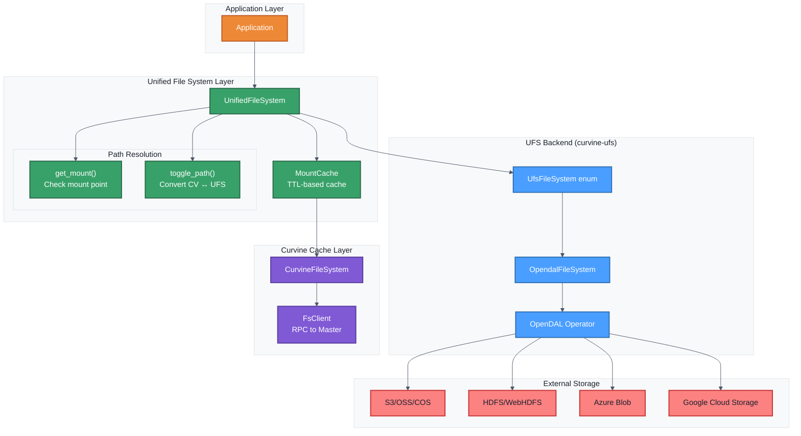

# Unified Namespace

Curvine provides a UFS (Unified File System) view to manage all supported distributed storage systems, including local filesystems, S3/MinIO, HDFS, and others. In simple terms, Curvine UFS mounting creates a path mapping that integrates external storage systems into Curvine's own filesystem. Users no longer need to remember different storage access methods and can access all storage through one unified interface.


```mermaid
%%{init: {'theme': 'base', 'themeVariables': { 'background': '#ffffff', 'primaryColor': '#4a9eff', 'primaryTextColor': '#1a202c', 'primaryBorderColor': '#3182ce', 'lineColor': '#4a5568', 'secondaryColor': '#805ad5', 'tertiaryColor': '#38a169', 'mainBkg': '#ffffff', 'nodeBorder': '#4a5568', 'clusterBkg': '#f8f9fa', 'clusterBorder': '#dee2e6', 'titleColor': '#1a202c'}}}%%
flowchart TD
    subgraph Application_Layer["Application Layer"]
        App[Application]
    end

    subgraph UFS_Backend["UFS Backend (curvine-ufs)"]
        UEnum[UfsFileSystem enum]
        OFS[OpendalFileSystem]
        ODO[OpenDAL Operator]
    end

    subgraph Unified_FS["Unified File System Layer"]
        UFS[UnifiedFileSystem]
        subgraph Path_Resolution["Path Resolution"]
            GM["get_mount()"<br/>Check mount point]
            TP["toggle_path()"<br/>Convert CV ↔ UFS]
        end
        MC[MountCache<br/>TTL-based cache]
    end

    subgraph External_Storage["External Storage"]
        S3[S3/OSS/COS]
        HDFS[HDFS/WebHDFS]
        Azure[Azure Blob]
        GCS[Google Cloud Storage]
    end

    subgraph Curvine_Cache["Curvine Cache Layer"]
        CFS[CurvineFileSystem]
        FSC[FsClient<br/>RPC to Master]
    end

    App --> UFS
    UFS --> GM
    UFS --> TP
    UFS --> MC
    UFS --> UEnum
    MC --> CFS
    CFS --> FSC
    UEnum --> OFS
    OFS --> ODO
    ODO --> S3
    ODO --> HDFS
    ODO --> Azure
    ODO --> GCS

    classDef appStyle fill:#ed8936,stroke:#c05621,color:#fff,stroke-width:2px
    classDef ufsStyle fill:#4a9eff,stroke:#2b6cb0,color:#fff,stroke-width:2px
    classDef unifiedStyle fill:#38a169,stroke:#276749,color:#fff,stroke-width:2px
    classDef storageStyle fill:#fc8181,stroke:#c53030,color:#1a202c,stroke-width:2px
    classDef cacheStyle fill:#805ad5,stroke:#553c9a,color:#fff,stroke-width:2px
    class App appStyle
    class UEnum,OFS,ODO ufsStyle
    class UFS,GM,TP,MC unifiedStyle
    class S3,HDFS,Azure,GCS storageStyle
    class CFS,FSC cacheStyle
```


## 1. UFS Mounting

Two core path concepts are involved in UFS mounting:

- UFS path: the original external storage address. It must include a dedicated scheme prefix, which is the native address of the storage system. Common formats include local directories such as `file://fs/cache_mode`, object storage such as `s3://bucket/prefix`, and big data storage such as `hdfs://nn/path`.
- Curvine path, or CV path: the unified logical path inside the cluster. It always starts with `/` and belongs to Curvine's `cv://` namespace. On the client side, it is the mount point directory that users can directly access.

The core value of mounting is that after the mount is complete, regardless of whether the underlying storage is a local disk, S3 object storage, or HDFS, users only need one set of Curvine commands to operate it and do not need to care about differences between storage types.


Curvine persists the mount table in metadata, so there is no need to remount when Curvine restarts. However, some rules must be followed:

- Mounting to the root path is not allowed.
- Mounting another UFS under an existing mounted path is not allowed.
- The same Curvine mount path cannot be mounted to different UFS paths.


## 2. Mount Commands {#mounting}

All mount commands are executed under the Curvine installation directory. The basic command format is fixed:

```bash
bin/cv mount <external_ufs_path> <internal_curvine_path> [options]
```

### 2.1 Local Directory Mounting

This is suitable for local testing and quickly trying the unified namespace without connecting to external storage.

```bash
bin/cv mount \
  file://fs/cache_mode /fs/cache_mode \
  --write-type cache_mode
```

This command mounts the local `file://fs/cache_mode` directory to the internal Curvine path `/fs/cache_mode`, using cache mode (`cache_mode`) as the write mode.

### 2.2 External Storage Mounting

When connecting to object storage such as S3 or OSS, additional parameters such as endpoint, credentials, and region are required. Replace them with your own storage information.

```bash
bin/cv mount \
  s3://s3/cache_mode /s3/cache_mode \
  --write-type cache_mode \
  -c s3.endpoint_url=http://localhost:9000 \
  -c s3.credentials.access=admin \
  -c s3.credentials.secret=admin \
  -c s3.region_name=cn
```

Required parameters for beginners:

- `s3.endpoint_url`: access address of the S3/MinIO service.
- `s3.credentials.access` / `s3.credentials.secret`: access key and secret of the storage service.
- `s3.region_name`: region of the storage service. Use `cn` if there is no special requirement.

:::note
For `s3://...` mounts, the CLI can auto-fill `s3.bucket_name` from the URI. For `hdfs://...` mounts, it can infer `hdfs.namenode` and `hdfs.root` from the URI. When Kerberos keys are present without `hdfs.kerberos.ccache` or `KRB5CCNAME`, the CLI prints a warning.
:::

### 2.3 Complete Mount Parameter Table

| Parameter | Default | Description |
| --- | --- | --- |
| `ufs_path` | none | External underlying storage URI path. It must include a scheme prefix such as `s3://`, `oss://`, or `file://`; otherwise the command fails. |
| `cv_path` | none | Curvine internal logical mount path. It must start with `/` and only supports absolute paths. Relative paths are not supported. |
| `--write-type` | `fs_mode` | Mount write mode. This is a core parameter. Supported values are `cache_mode` and `fs_mode`. |
| `--update` | `false` | Flag used to update configuration when the mount point already exists. The mount path (`ufs_path` + `cv_path`) cannot be changed. Without this flag, repeated mounting reports an error. |
| `--check-path-consist` | `true` | Checks whether the path parts of the UFS path and CV path are consistent when creating a mount. Set to `false` to allow different path shapes. |
| `--read-verify-ufs` | `false` | Only effective in `cache_mode`. When set to `true`, Curvine compares UFS file `mtime` and size before reading cache. If they are inconsistent, the cache is invalidated and data is re-read from UFS. |
| `--ttl-ms` | `7d` | Cache expiration time of the mount point. Human-readable units are supported, such as `7d`, `1h`, `30m`, and `100s`. |
| `--replicas` | none | File replica count. If not set, file creation falls back to the client default replica configuration. |
| `--block-size` | none | File block size. If not set, file creation falls back to the client default block size configuration. |
| `--storage-type`, `-s` | none | Curvine local storage media type. Optional values include `mem`, `ssd`, and `hdd`. |
| `--provider` | not set, underlying default is `opendal` | UFS backend implementation. Optional values include `auto`, `oss-hdfs`, and `opendal`. The default `opendal` works for most storage types. |

Full mount command template:

```bash
bin/cv mount \
  <ufs_path> \
  <cv_path> \
  --write-type cache_mode/fs_mode \
  --update \
  --check-path-consist true/false \
  --read-verify-ufs true/false \
  --ttl-ms 7d \
  --replicas 3 \
  --block-size 128M \
  -s ssd \
  --provider opendal \
  -c <storage_connection_config>
```

## 3. View Existing Mount Points

After mounting, run the following command to view all configured mount points in the cluster:

```bash
bin/cv mount
```

Example output:

```text
+------------+----------------+--------------------+------------+----------------+---------+------------+----------+
| ID         | Curvine Path   | UFS Path           | Write Type | Read Verify UFS| Storage | TTL Action | Provider |
+------------+----------------+--------------------+------------+----------------+---------+------------+----------+
| 80640993   | /test/fs_mode  | s3://test/fs_mode  | fs_mode    | no             | -       | free       | -        |
| 4234729426 | /s3/cache_mode | s3://s3/cache_mode | cache_mode | no             | -       | delete     | -        |
+------------+----------------+--------------------+------------+----------------+---------+------------+----------+
```

- `ID`: unique mount point identifier automatically generated by the system.
- `Curvine Path` / `UFS Path`: internal and external paths. Use them to check whether the configuration is correct.
- `Write Type`: core read/write mode, `cache_mode` or `fs_mode`.
- `TTL Action`: cache expiration handling policy.


## 4. Mount Modes {#mount-modes}

### 4.1 cache_mode: High-Performance Read Cache

`cache_mode` uses Curvine as a cache acceleration layer for external storage. Directory structure and original data are based on the external UFS, while Curvine only provides cached reads to improve read performance.

Core logic:

- Directory listing and modification operations directly access external UFS to keep the view up to date.
- File attribute queries first check Curvine cache. Valid cache is returned directly, and invalid cache falls back to UFS.
- The fixed expiration policy is `ttl_action=delete`. After cache expires, files and directories in Curvine are completely deleted, while data in external UFS remains.

Read operations:

- Cache miss: Curvine reads external UFS directly and asynchronously loads data into Curvine cache in the background. The next read can use cache and is faster.
- Cache hit: Curvine reads directly from cache without accessing UFS.
- Risk: within the cache validity period, if external UFS data is modified by other tools, Curvine cache will not automatically update and may return stale data.
- Solution: for frequently updated data, add `--read-verify-ufs=true` when mounting. Before each read, Curvine compares UFS file modification time and size. If they differ, Curvine reloads data. The cost is one extra UFS query, so reads are slightly slower.

Write operations:

- Writes are directly passed through to external UFS, and Curvine cache is invalidated.
- Deleting a file directly deletes the original data in UFS, not only the cache. Use this operation carefully.

Capability boundaries and limits:

- POSIX file semantics fully depend on external UFS support. Operations not supported by UFS, such as symbolic links or file locks, may fail directly.
- Some advanced operations, such as modifying file attributes, symbolic links, and file locks, are limited by the current Curvine version and UFS capabilities.

Cache invalidation conditions:

- Cache reaches the TTL expiration time.
- Writes, modifications, or deletes are performed through Curvine.
- After `--read-verify-ufs` is enabled, UFS file modification time or size differs from Curvine records.

### 4.2 fs_mode: Layered File System

`fs_mode` breaks away from UFS semantic limitations and provides full POSIX filesystem capabilities. All operations are completed inside Curvine first and then asynchronously synchronized to external UFS. It is suitable for business scenarios requiring standard file operations.

Core logic:

- All data operations go through Curvine first instead of direct client writes to UFS. Usage is the same as a normal Curvine directory that is not mounted to external storage.
- Operation logs are synchronized to all Master nodes through the Raft protocol. The Leader node replays them and synchronizes changes to external UFS, ensuring eventual consistency between Curvine and UFS.

UFS synchronization rules:

| Operation Type | Behavior Synchronized to UFS |
| --- | --- |
| Create directory (`mkdir`) | Leader Master automatically accesses UFS and creates the corresponding directory. |
| Delete file/directory (`delete`) | Leader Master automatically deletes data at the corresponding UFS path. |
| File write complete (`complete`) | Starts a data synchronization task to copy the file from Curvine to UFS. |
| Rename (`rename`) | If UFS supports rename, execute it directly. If UFS does not support rename, such as S3/OSS, delete the source path and fully copy data to the target path. |

:::caution
Object storage systems such as S3 and OSS do not support rename. Do not rename large directories on these backends. It triggers a full data copy, takes a long time, blocks subsequent operations, and may generate significant storage and bandwidth costs.
:::

Metadata synchronization:

In `fs_mode`, Curvine does not automatically detect external UFS data changes. If files are modified, added, or deleted directly in S3/HDFS, the Curvine directory is not updated automatically. Run a metadata alignment command manually:

```bash
bin/cv mount resync /test/fs_mode
```

Replace the path with your own Curvine mount path. In production, run this regularly or after external changes.

Data expiration rules:

- After data expires, only the actual data in Curvine is cleaned. Metadata is retained, and external UFS data is not affected.
- When read again, data is automatically loaded back from UFS to Curvine and can be accessed normally.
- When writing after expiration, Curvine first copies the original data in UFS back to Curvine and then performs the write in Curvine. This is because most UFS backends, especially S3/OSS object storage, do not support standard POSIX features such as random writes, file holes, and incremental modification. Copying large files may take time and is expected behavior.

## 5. Unified Access

After UFS is mounted, Curvine provides a unified filesystem view. Clients, command-line tools, FUSE, and APIs can all access UFS files through the unified Curvine path.

If using the `cv` command, you can use `--cache-only` to temporarily disable unified access and view only files cached in Curvine. See the [CLI page](/docs/User-Manuals/Operations/cli) for details.

## 6. Space Release

In `cache_mode`, deleting a file directly deletes the original UFS data. If you only want to release Curvine local cache space while retaining UFS original data and metadata, use the `free` command. It is safe and does not delete data that does not meet cleanup conditions.

```bash
bin/cv fs free -r /fs_mode/data
```

- `-r`: recursively cleans all eligible cache under the directory.
- Applicable scope: `fs_mode`, `cache_mode`, and normal directories not mounted to UFS.
- Safety guarantee: files that do not meet cleanup conditions are automatically skipped, such as files without TTL or data not synchronized to UFS.
- Cleanup condition: the file exists in both Curvine and UFS, and `ttl_action != none`.

## 7. Disable Unified Access

If you do not want to use unified access, add or modify the following configuration:

```toml
[client]
enable_unified_fs = false
```

## 8. Summary

- Choose the mode based on the scenario: use `cache_mode` for read-heavy workloads and `fs_mode` for write-heavy workloads.
- Mount commands must strictly follow `UFS path with scheme + Curvine path starting with /`.
- In `cache_mode`, deleting files directly deletes UFS data. Use caution.
- In `fs_mode`, do not rename large S3/OSS directories.
- After external UFS data changes, `fs_mode` must use `resync` to synchronize metadata manually.
- Use `free` to release cache safely without deleting original data.
