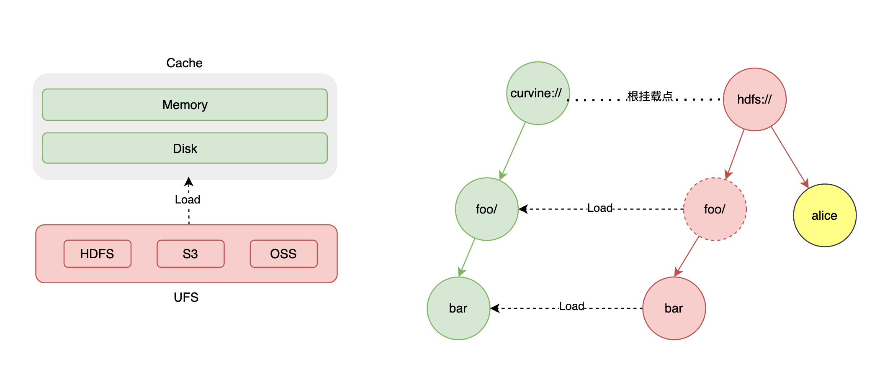

# Data Orchestration

Curvine provides a UFS (Unified File System) view to manage all supported distributed storage systems, including S3, HDFS, and others.

```mermaid
%%{init: {'theme': 'base', 'themeVariables': { 'background': '#ffffff', 'primaryColor': '#4a9eff', 'primaryTextColor': '#1a202c', 'primaryBorderColor': '#3182ce', 'lineColor': '#4a5568', 'secondaryColor': '#805ad5', 'tertiaryColor': '#38a169', 'mainBkg': '#ffffff', 'nodeBorder': '#4a5568', 'clusterBkg': '#f8f9fa', 'clusterBorder': '#dee2e6', 'titleColor': '#1a202c'}}}%%
flowchart TD
    subgraph Application_Layer["Application Layer"]
        App[Application]
    end

    subgraph UFS_Backend["UFS Backend (curvine-ufs)"]
        UEnum[UfsFileSystem enum]
        OFS[OpendalFileSystem]
        ODO[OpenDAL Operator]
    end

    subgraph Unified_FS["Unified File System Layer"]
        UFS[UnifiedFileSystem]
        subgraph Path_Resolution["Path Resolution"]
            GM["get_mount()"<br/>Check mount point]
            TP["toggle_path()"<br/>Convert CV ↔ UFS]
        end
        MC[MountCache<br/>TTL-based cache]
    end

    subgraph External_Storage["External Storage"]
        S3[S3/OSS/COS]
        HDFS[HDFS/WebHDFS]
        Azure[Azure Blob]
        GCS[Google Cloud Storage]
    end

    subgraph Curvine_Cache["Curvine Cache Layer"]
        CFS[CurvineFileSystem]
        FSC[FsClient<br/>RPC to Master]
    end

    App --> UFS
    UFS --> GM
    UFS --> TP
    UFS --> MC
    UFS --> UEnum
    MC --> CFS
    CFS --> FSC
    UEnum --> OFS
    OFS --> ODO
    ODO --> S3
    ODO --> HDFS
    ODO --> Azure
    ODO --> GCS

    %% Styles (align with deployment-architecture / bare-metal)
    classDef appStyle fill:#ed8936,stroke:#c05621,color:#fff,stroke-width:2px
    classDef ufsStyle fill:#4a9eff,stroke:#2b6cb0,color:#fff,stroke-width:2px
    classDef unifiedStyle fill:#38a169,stroke:#276749,color:#fff,stroke-width:2px
    classDef storageStyle fill:#fc8181,stroke:#c53030,color:#1a202c,stroke-width:2px
    classDef cacheStyle fill:#805ad5,stroke:#553c9a,color:#fff,stroke-width:2px
    class App appStyle
    class UEnum,OFS,ODO ufsStyle
    class UFS,GM,TP,MC unifiedStyle
    class S3,HDFS,Azure,GCS storageStyle
    class CFS,FSC cacheStyle
```


## Mounting

Curvine supports connecting multiple UFS sources by mounting them to different Curvine paths. Curvine does not provide default UFS configuration, which means if you want to load data from UFS, you must first mount the UFS source.



Curvine persists the mount table in metadata, so there is no need to remount when Curvine restarts. However, some rules must be followed.
- Mounting to the root path is not allowed.
- Mounting other UFS under a mounted path is not allowed.
- The same mount path cannot be mounted to different UFS.

Mount command:
```bash
bin/cv mount ufs_path curvine_path [configs]
```

- ufs_path: UFS path, e.g., s3://bucket/path.
- curvine_path: Curvine path, e.g., /ufs/path.
- configs: Optional parameters, e.g., access_key_id, secret_access_key, region, endpoint, etc.

Example:
```
bin/cv mount s3://ai/xuen-test /s3 \
-c s3.endpoint_url=http://hostname.com \
-c s3.region_name=cn \
-c s3.credentials.access=access_key \
-c s3.credentials.secret=secret_key \
-c s3.path_style=true
```

:::tip
You can use command line, API to access ufs directories and files after UFS is mounted, but ufs data will not be automatically synchronized to curvine unless you load specific paths.
:::

### Mounting Parameters

| Parameter | Type | Default | Description | Example |
|-----------|------|---------|-------------|---------|
| `--ttl-ms` | duration | `0` | Cache data expiration time | `24h`, `7d`, `30d` |
| `--ttl-action` | enum | `none` | Expiration policy: `delete`/`none` | `delete` |
| `--replicas` | int | `1` | Number of data replicas (1-5) | `3` |
| `--block-size` | size | `128MB` | Cache block size | `64MB`, `128MB`, `256MB` |
| `--consistency-strategy` | enum | `always` | Consistency strategy | `none` / `always` |
| `--storage-type` | enum | `disk` | Storage medium type | `mem`/`ssd`/`disk` |

### Mount Modes
#### Write Cache
WriteType controls the write behavior between Curvine cache and underlying storage (UFS)
| Mode | Behavior (Sync/Async) | Consistency | Use Cases |
|---|---|---|---|
| Cache mode | Write only to Curvine cache, not sync to UFS | Cache-only consistency, no data in UFS | Temporary data, scratch data, disposable intermediate results |
| Through mode | Write directly to UFS, bypass cache | Strong consistency, data directly persisted to UFS | Write-once-read-many scenarios, cache-unbeneficial data |
| AsyncThrough mode (default) | Write to cache first, async sync to UFS, return immediately | Eventual consistency, cache readable immediately, UFS updated async | Machine learning training, scenarios balancing performance and persistence |
| CacheThrough mode | Sync write to cache and UFS, wait for UFS completion | Strong consistency, ensure data exists in both cache and UFS | Shared data, scenarios requiring strong persistence guarantees |

#### Read Cache
ConsistencyStrategy determines whether consistency validation with underlying storage (UFS) is needed when reading logs
| Mode | Behavior | Consistency | Use Cases |
|---|---|---|---|
| None | Trust cache, no consistency validation during reads | No consistency guarantee, may read stale data | High-performance read scenarios, relatively static base data, temporary data/intermediate results |
| Always | Validate cache matches UFS on every read | Strong consistency guarantee, ensure latest data | Intermittent data updates, multi-client shared data, strong consistency requirement scenarios |

:::note
TTL controls read cache behavior in Curvine by determining cache validity to trigger automatic cache refresh or cleanup operations.
:::

## Unified Access
After UFS is mounted, Curvine provides a unified file system view, and you can access the UFS file system just like accessing the Curvine file system;
Clients, command line tools, fuse, etc. can all access the UFS file system through a unified path.

:::tip
- Curvine does not cache UFS metadata, so there is no data consistency issue when accessing. Accessing UFS through Curvine is no different from accessing UFS directly.
When Curvine cache data read fails, it automatically falls back to reading data from UFS.
- If using the cv command, you can use the `cache-only` parameter to temporarily disable unified access and view only files cached in Curvine. See the [fs subcommand](/docs/User-Manuals/Operations/cli#3-fs--file-system-operations) for details.
:::

## Disabling Unified Access
If you don't want to use unified access, you can add or modify the following configuration:
```
[client]
enable_unified_fs = false
```