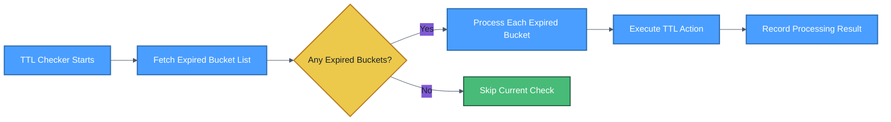

This section introduces Curvine's caching strategies and how to cache data.

## Caching Strategies

### Write Strategies

Write strategies control how data is written when files are located at UFS mount points. They are set per mount (e.g. `cv mount ... --write-type <type>`). The default is **AsyncThrough**.

| Strategy | CLI value | Behavior | Use Cases |
|----------|-----------|----------|-----------|
| Cache | `cache` | Writes only to Curvine cache | Temporary data, maximum performance requirements |
| Through | `through` | Writes directly to UFS, bypassing cache | Write-once data, scenarios where caching provides no benefit |
| CacheThrough | `cache_through` | Writes synchronously to both cache and UFS | Data sharing with strong consistency requirements |
| AsyncThrough | `async_through` (default) | Writes to cache first, asynchronously syncs to UFS | Balancing performance and durability |

### Consistency Strategies

Curvine provides two strategies to validate cached data against UFS (configurable per mount via `--consistency-strategy`):

| Strategy | Behavior |
|----------|----------|
| **None** | No validation. Cached data is trusted; expired entries may be removed by TTL. May read stale data. |
| **Always** | Validates on every file read: compares file length and last modified time (mtime) with UFS. If they match, data is read from cache; otherwise cache is treated as stale. |

When validation fails (or cache miss), data is read directly from UFS and can be asynchronously loaded into Curvine if automatic caching is enabled for that mount.

## TTL Mechanism

TTL is the core mechanism in Curvine for automatically managing the lifecycle of cached data, supporting automatic expiration processing for both files and directories.

### Configuration

**Per-mount TTL (recommended)**  
When mounting UFS with `cv mount`, you can set TTL for that mount:

| Option | Type | Default | Description | Example |
|--------|------|---------|--------------|---------|
| `--ttl-ms` | duration | `7d` (mount default) | Cache data expiration time | `24h`, `7d`, `30d` |
| `--ttl-action` | enum | `delete` (mount default) | Action when TTL expires (see below) | `none`, `delete`, `persist`, `evict`, `flush` |

**Client defaults**  
In the client section of the cluster config (e.g. `curvine-cluster.toml`), `ttl_ms` (default `0`) and `ttl_action` (default `none`) can be set as defaults for non-mount paths or when creating files.

**Master node (TTL checker)**  
In the `[master]` section of the cluster config, use the following TOML keys:

| Parameter | Type | Default | Description |
|-----------|------|---------|--------------|
| `ttl_checker_interval` | duration | `1h` | Interval at which the TTL checker runs |
| `ttl_checker_retry_attempts` | u32 | `3` | Maximum retry attempts for failed TTL operations |
| `ttl_bucket_interval` | duration | `1h` | Bucket time interval for batching expired inodes |
| `ttl_max_retry_duration` | duration | `30m` | Maximum duration for retrying failed TTL operations |
| `ttl_retry_interval` | duration | `5s` | Interval between retry attempts |

### Action Types

TTL supports five expiration actions (values: `none`, `delete`, `persist`, `evict`, `flush`):

| Action | Description |
|--------|-------------|
| **None** | No operation; expired data remains until explicitly removed or overwritten. |
| **Delete** | Delete the file or directory from Curvine only (no export to UFS). |
| **Persist** | Export to UFS if not already present (skip if exists); keep data in Curvine cache. |
| **Evict** | Export to UFS if not already present (skip if exists); then remove from Curvine cache. |
| **Flush** | Export to UFS (overwrite if exists); then remove from Curvine cache. |

### Execution Flow



## Caching Methods

### Automatic Caching

Automatic caching is enabled for a mount when that mount has a **non-zero TTL** (e.g. `cv mount s3://bucket/prefix /path --ttl-ms 7d`). On the **first read** of a UFS file under that mount (cache miss), Curvine submits an asynchronous load job to bring the data into Curvine; the read is served from UFS while the job runs in the background.

You may see the following output in the logs:

```plain
Submit async cache successfully for s3://bucket/cache/test.log, job res CacheJobResult { job_id: 7c00853f-13c8-43c1-8b3f-44740750b5a0, target_path: /s3/cache/test.log }
```
You can use the job_id to query the caching task status:
```plain
bin/cv load-status 7c00853f-13c8-43c1-8b3f-44740750b5a0
```

### Proactive Caching

You can proactively load UFS data into Curvine using the `load` command, as shown below:

```plain
bin/cv load s3://bucket/cache/test.log
```

Automatic caching and proactive caching are not mutually exclusive; proactive caching can reduce the time required for the first read of a UFS file.

:::tip
Before loading data, the UFS must first be mounted to Curvine (`cv mount`).  
Both automatic and proactive caching store files at fixed cache paths, maintaining the same directory structure as the UFS.
:::