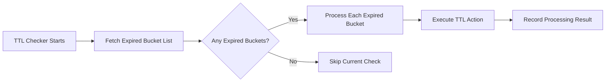

This section introduces Curvine's caching strategies and how to cache data.

## Caching Strategies

### Write Strategies

Write strategies control how data is written when files are located at UFS mount points.

| Strategy | Behavior | Use Cases |
|:----|:----|:----|
| Cache | Writes only to Curvine cache | Temporary data, maximum performance requirements |
| Through | Writes directly to UFS, bypassing cache | Write-once data, scenarios where caching provides no benefit |
| CacheThrough | Writes synchronously to both cache and UFS | Data sharing with strong consistency requirements |
| AsyncThrough | Writes to cache first, asynchronously syncs to UFS | Balancing performance and durability |

### Consistency Strategies

Curvine provides three strategies to validate data consistency:

* **No validation** – Expired data is automatically deleted; may read stale data.

* **Periodic validation** – Checks UFS for changes at a set frequency.

* **Forced validation** – Validates on every file read by checking if the UFS file's length and last modified time match what Curvine has saved. This is the default configuration.

If consistency validation fails, data is read directly from UFS while being asynchronously cached to Curvine.

## TTL Mechanism

TTL is the core mechanism in Curvine for automatically managing the lifecycle of cached data, supporting automatic expiration processing for both files and directories.

### Configuration

In client configuration, TTL-related parameters include:

| Parameter | Type | Default | Description | Example |
|:----|:----|:----|:----|:----|
| `--ttl-ms` | duration | 0 | Cache data expiration time | 24h, 7d, 30d |
| `--ttl-action` | enum | none | Expiration policy: delete/none | delete |

In Master node configuration, TTL checker parameters:

| Parameter | Type | Default | Description | Example |
|:----|:----|:----|:----|:----|
| `--ttl-checker-interval` | duration | 1h | TTL checker execution interval | 1h, 30m, 1s |
| `--ttl-checker-retry-attempts` | u32 | 3 | Maximum retry attempts for failed TTL operations | 3, 5, 10 |
| `--ttl-bucket-interval` | duration | 1h | TTL bucket time interval for batch processing expired files | 1h, 30m, 1s |

### Action Types

TTL supports 5 types of expiration actions:

| Action | Description |
|:----|:----|
| None | No operation performed |
| Delete | Delete file/directory |
| Persist | Persist to UFS |
| Evict | Evict from cache |
| Flush | Flush to backend storage |

### Execution Flow



## Caching Methods

### Automatic Caching

After mounting UFS to Curvine, if automatic caching is configured, Curvine will submit an asynchronous caching task upon the first read of a UFS file to load the data into Curvine.

You may see the following output in the logs:

```plain
Submit async cache successfully for s3://bucket/cache/test.log, job res CacheJobResult { job_id: 7c00853f-13c8-43c1-8b3f-44740750b5a0, target_path: /s3/cache/test.log }
```
You can use the job_id to query the caching task status:
```plain
bin/cv load-status 7c00853f-13c8-43c1-8b3f-44740750b5a0
```

### Proactive Caching

You can proactively load UFS data into Curvine using the `load` command, as shown below:

```plain
bin/cv load s3://bucket/cache/test.log
```

Automatic caching and proactive caching are not mutually exclusive; proactive caching can reduce the time required for the first read of a UFS file.

:::tip
 Before loading data, the UFS must first be mounted to Curvine.  
 Both automatic and proactive caching store files at fixed cache paths, maintaining the same directory structure as the UFS.
 :::