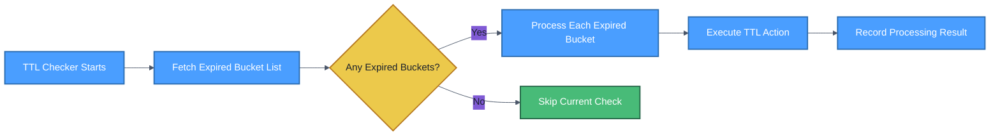

This section introduces Curvine's caching strategies and how to cache data.

## Caching Strategies

### Write Strategies

Write strategies control how data is written for mounted paths. In the current `main` branch they are set per mount through `cv mount ... --write-type <type>`. The default exposed by the CLI is **`fs_mode`**.

| Strategy | CLI value | Behavior | Use Cases |
|----------|-----------|----------|-----------|
| CacheMode | `cache_mode` | Write through to the underlying UFS path; Curvine mainly acts as a unified-access and cached-read layer | Data whose primary source of truth remains in UFS |
| FsMode | `fs_mode` (CLI default) | Write into the Curvine namespace first; first mount may trigger metadata `resync` | Curvine-managed cached namespace over mounted data |

### Read Verification

The current read-side validation control is `--read-verify-ufs` on the mount:

| Strategy | Behavior |
|----------|----------|
| disabled | Cached data is trusted and normal unified filesystem fallback rules apply |
| enabled | On reads, Curvine compares cached file metadata against UFS (`mtime` and file length) before serving cached data |

When validation fails, or when the cache misses, data is read directly from UFS. If automatic caching is enabled for that mount, Curvine can still submit a background load job.

## TTL Mechanism

TTL is the core mechanism in Curvine for automatically managing the lifecycle of cached data, supporting automatic expiration processing for both files and directories.

### Configuration

**Per-mount TTL (recommended)**  
When mounting UFS with `cv mount`, you can set TTL for that mount:

| Option | Type | Default | Description | Example |
|--------|------|---------|--------------|---------|
| `--ttl-ms` | duration | `7d` (mount default) | Cache data expiration time | `24h`, `7d`, `30d` |

For mount points, the action at expiration is derived from `write_type` in the current source:

- `cache_mode` mounts default to `delete`
- `fs_mode` mounts default to `free`

**Client defaults**  
In the client section of the cluster config (e.g. `curvine-cluster.toml`), `ttl_ms` (default `0`) and `ttl_action` (default `none`) can be set as defaults for non-mount paths or when creating files.

**Master node (TTL checker)**  
In the `[master]` section of the cluster config, use the following TOML keys:

| Parameter | Type | Default | Description |
|-----------|------|---------|--------------|
| `ttl_checker_interval` | duration | `1h` | Interval at which the TTL checker runs |
| `ttl_checker_retry_attempts` | u32 | `3` | Maximum retry attempts for failed TTL operations |
| `ttl_bucket_interval` | duration | `1h` | Bucket time interval for batching expired inodes |
| `ttl_max_retry_duration` | duration | `10m` | Maximum duration for retrying failed TTL operations |
| `ttl_retry_interval` | duration | `1s` | Interval between retry attempts |

### Action Types

The current source exposes three TTL actions:

| Action | Description |
|--------|-------------|
| **None** | No operation; expired data remains until explicitly removed or overwritten. |
| **Delete** | Delete the file or directory from Curvine only (no export to UFS). |
| **Free** | Release cached data while preserving the mounted namespace semantics used by `fs_mode` mounts. |

### Execution Flow


```mermaid
%%{init: {'theme': 'base', 'themeVariables': { 'background': '#ffffff', 'primaryColor': '#4a9eff', 'primaryTextColor': '#1a202c', 'primaryBorderColor': '#3182ce', 'lineColor': '#4a5568', 'secondaryColor': '#805ad5', 'tertiaryColor': '#38a169', 'mainBkg': '#ffffff', 'nodeBorder': '#4a5568', 'clusterBkg': '#f8f9fa', 'clusterBorder': '#dee2e6', 'titleColor': '#1a202c'}}}%%
flowchart LR
    A[TTL Checker Starts] --> B[Fetch Expired Bucket List]
    B --> C{Any Expired Buckets?}
    C -->|Yes| D[Process Each Expired Bucket]
    D --> E[Execute TTL Action]
    E --> F[Record Processing Result]
    C -->|No| G[Skip Current Check]

    classDef stepStyle fill:#4a9eff,stroke:#2b6cb0,color:#fff,stroke-width:2px
    classDef decisionStyle fill:#ecc94b,stroke:#b7791f,color:#1a202c,stroke-width:2px
    classDef endStyle fill:#48bb78,stroke:#276749,color:#fff,stroke-width:2px
    class A,B,D,E,F stepStyle
    class C decisionStyle
    class G endStyle
```

## Caching Methods

### Automatic Caching

Automatic caching is enabled for a mount when that mount has a **non-zero TTL** (e.g. `cv mount s3://bucket/prefix /path --ttl-ms 7d`). On the **first read** of a UFS file under that mount (cache miss), Curvine submits an asynchronous load job to bring the data into Curvine; the read is served from UFS while the job runs in the background.

You may see the following output in the logs:

```plain
Submit async cache successfully for s3://bucket/cache/test.log, job res CacheJobResult { job_id: 7c00853f-13c8-43c1-8b3f-44740750b5a0, target_path: /s3/cache/test.log }
```
You can use the job_id to query the caching task status:
```plain
bin/cv load-status 7c00853f-13c8-43c1-8b3f-44740750b5a0
```

### Proactive Caching

You can proactively load UFS data into Curvine using the `load` command, as shown below:

```plain
bin/cv load s3://bucket/cache/test.log
```

Automatic caching and proactive caching are not mutually exclusive; proactive caching can reduce the time required for the first read of a UFS file.

:::tip
Before loading data, the UFS must first be mounted to Curvine (`cv mount`).  
Both automatic and proactive caching store files at fixed cache paths, maintaining the same directory structure as the UFS.
:::
