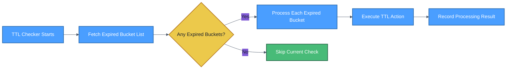

# Cache

For first-time users, Curvine can be understood as a distributed file cache that can be used like a local disk. Users do not need to care which machine in the cluster stores the data or which storage type is used. Through a single mount point, users can easily use distributed caching capabilities for most daily file operation scenarios.

## 1. What Is Curvine?

Curvine is a distributed file cache system. It integrates storage media inside the cluster and remote storage resources to build a unified file directory space, and provides a directly mountable filesystem to external users.

Unlike traditional distributed filesystems, Curvine's biggest highlight is full compatibility with POSIX semantics. Its user experience is almost the same as a local disk. Users do not need to learn complex extra commands or modify existing applications. Whether for daily development, data caching, `git clone`, database file storage, log writing, or temporary file storage, users only need to point file paths to the Curvine mount point.

## 2. Core Features

| Core Capability | Plain Explanation |
| --- | --- |
| Unified namespace | A single mount point can access all file directories. Users do not need to care which Worker node or storage medium stores the data. File paths and permissions are consistent with the local filesystem. |
| High-speed cache for smoother repeated access | Frequently used working data stays on faster media inside the cluster. Repeated access greatly reduces I/O requests to remote or slower storage, making file open and read operations faster. |
| Intelligent tiered storage | Supports multiple storage tiers such as memory (MEM), SSD, and HDD. Administrators configure paths for each tier in advance, and users can specify the preferred write medium. When the preferred tier lacks space, data automatically spills over to the next tier. |
| Intelligent space management | Uses TTL expiration and quota plus LRU eviction to manage storage space, preventing cache from occupying cluster capacity indefinitely. |
| Complete POSIX file semantics | Supports standard file operations, including random writes, concurrent writes, file locks, extended attributes, symbolic and hard links, sparse files, and preallocation. Existing local applications can migrate directly. |

## 3. Local-Disk-Like User Experience

Curvine follows local disk usage habits.

### 3.1 Multi-Process Concurrent Writes

Multiple clients and processes can write to the same file at the same time. Applications do not need to coordinate this themselves. As long as writes target different file offsets, data will not become inconsistent, matching local multi-process file write semantics.

### 3.2 Free Random Writes

Curvine is not limited to sequential or append-only writes. It supports writing at any file position at any time, which fits scenarios such as databases and large-file modification that require random reads and writes.

### 3.3 Common Commands Are Fully Compatible

Common Linux file commands such as `cp`, `mv`, `rm`, `mkdir`, `ls`, and `find` can be used normally on the Curvine mount point. Users do not need to change their operation habits.

## 4. POSIX Advanced Features

Curvine supports advanced POSIX features to meet complex business requirements.

| Feature | Description |
| --- | --- |
| Random writes and concurrent writes | Supports writing at any file position. Multiple clients can operate different regions of the same file at the same time, fitting logs, databases, and other flexible write scenarios. |
| Extended attributes (`xattr`) | Supports file extended attributes, allowing users to store custom metadata for file tagging and business association. |
| Symbolic links | Supports symbolic links. It is recommended that link targets point to Curvine internal paths. If a link points to a local path on one machine, other nodes may not be able to access it in a distributed environment. |
| Hard links | Supports hard links with semantics consistent with local filesystems. This only applies inside the same Curvine filesystem and cannot cross systems. |
| File locks | Compatible with POSIX locks and BSD locks. In a distributed environment, file locks have a default 5-minute timeout auto-release mechanism to avoid deadlocks caused by abnormal clients or nodes. |
| Sparse files | Supports sparse files. Hole regions without actual written data do not occupy physical storage space, saving cluster storage resources. |
| Space preallocation | Supports preallocating storage space for files, avoiding insufficient space during large file writes and improving write stability. |
| Common file attributes | Basic inode semantics such as permission bits, access/modification timestamps, and truncation follow POSIX standards. |

## 5. Tiered Storage Usage

Curvine supports multiple storage media tiers. With simple configuration, users can specify data storage priority to balance speed and cost.

### 5.1 How It Works

Worker nodes configure storage tier paths and labels. Users specify the preferred storage type on the client. Data is written to the target tier first. When that tier lacks capacity, data automatically falls back to the next tier without manual intervention.

### 5.2 Configuration Example

Worker configuration:

```toml
[worker]
data_dir = [
    '[MEM]/mem',
    '[SSD]/data/ssd',
    '[HDD]/data/hdd'
]
```

Client configuration:

```toml
[client]
storage_type = "mem"
```

Configuration effect: newly created files are stored in the memory tier first. When memory is insufficient, data automatically falls back to SSD and then HDD.

## 6. Cache Strategies

### 6.1 Write Strategies

Write strategies control how data is written for mounted paths. They are configured per mount through `cv mount ... --write-type <type>`. The CLI default is `fs_mode`.

| Strategy | CLI Value | Behavior | Use Case |
| --- | --- | --- | --- |
| CacheMode | `cache_mode` | Writes through to the underlying UFS path. Curvine mainly acts as a unified-access and cached-read layer. | Data whose primary source of truth remains in UFS. |
| FsMode | `fs_mode` | Writes into the Curvine namespace first. The first mount may trigger metadata `resync`. | Curvine-managed cached namespace over mounted data. |

### 6.2 Read Verification

The current read-side validation control is `--read-verify-ufs` on the mount:

| Strategy | Behavior |
| --- | --- |
| disabled | Cached data is trusted and normal unified filesystem fallback rules apply. |
| enabled | On reads, Curvine compares cached file metadata against UFS (`mtime` and file length) before serving cached data. |

When validation fails, or when the cache misses, data is read directly from UFS. If automatic caching is enabled for that mount, Curvine can also submit a background load job.

## 7. Data Expiration Management (TTL)

To manage cache space properly, Curvine supports configuring expiration time and expiration actions for files and directories.

### 7.1 Basic Configuration Example

```toml
[client]
ttl_ms = "1d"
ttl_action = "delete"
```

Configuration effect: the file expiration time is calculated from the last modification time (`mtime`). After 1 day, the file expires and the delete action is executed.

### 7.2 Per-Mount TTL

When mounting UFS with `cv mount`, TTL can be set for that mount:

| Option | Type | Default | Description | Example |
| --- | --- | --- | --- | --- |
| `--ttl-ms` | duration | `7d` | Cache data expiration time | `24h`, `7d`, `30d` |

For mount points, the expiration action is derived from `write_type`:

- `cache_mode` mounts default to `delete`
- `fs_mode` mounts default to `free`

### 7.3 Expiration Actions

| Action | Meaning |
| --- | --- |
| `none` | Disables time-based expiration. Data is retained until manually deleted or cleaned by other policies. |
| `delete` | Deletes file data and metadata after expiration. This is the most common expiration cleanup strategy, calculated from the file's last modification time. |
| `free` | Releases only file data blocks after expiration while preserving directories and metadata. This is suitable for scenarios that need to keep directory structure while cleaning cached data. |

### 7.4 Notes: mtime and Data Copy

When using tools such as `rclone` to copy files to Curvine, the tool may preserve the original modification time (`mtime`) of the source file. If the source file has existed for a long time, it may immediately trigger TTL expiration after being copied, causing the file to be deleted or freed.

Before large-scale data import, confirm the TTL configuration, manually adjust file `mtime` after import, or temporarily disable TTL to avoid accidental cleanup.

### 7.5 Master TTL Checker

In the `[master]` section of the cluster configuration, use the following TOML keys:

| Parameter | Type | Default | Description |
| --- | --- | --- | --- |
| `ttl_checker_interval` | duration | `1h` | Interval at which the TTL checker runs. |
| `ttl_checker_retry_attempts` | u32 | `3` | Maximum retry attempts for failed TTL operations. |
| `ttl_bucket_interval` | duration | `1h` | Bucket interval for batching expired inodes. |
| `ttl_max_retry_duration` | duration | `10m` | Maximum duration for retrying failed TTL operations. |
| `ttl_retry_interval` | duration | `1s` | Interval between retry attempts. |

### 7.6 Execution Flow


```mermaid
%%{init: {'theme': 'base', 'themeVariables': { 'background': '#ffffff', 'primaryColor': '#4a9eff', 'primaryTextColor': '#1a202c', 'primaryBorderColor': '#3182ce', 'lineColor': '#4a5568', 'secondaryColor': '#805ad5', 'tertiaryColor': '#38a169', 'mainBkg': '#ffffff', 'nodeBorder': '#4a5568', 'clusterBkg': '#f8f9fa', 'clusterBorder': '#dee2e6', 'titleColor': '#1a202c'}}}%%
flowchart LR
    A[TTL Checker Starts] --> B[Fetch Expired Bucket List]
    B --> C{Any Expired Buckets?}
    C -->|Yes| D[Process Each Expired Bucket]
    D --> E[Execute TTL Action]
    E --> F[Record Processing Result]
    C -->|No| G[Skip Current Check]

    classDef stepStyle fill:#4a9eff,stroke:#2b6cb0,color:#fff,stroke-width:2px
    classDef decisionStyle fill:#ecc94b,stroke:#b7791f,color:#1a202c,stroke-width:2px
    classDef endStyle fill:#48bb78,stroke:#276749,color:#fff,stroke-width:2px
    class A,B,D,E,F stepStyle
    class C decisionStyle
    class G endStyle
```

## 8. Data Eviction: Quota and LRU

In addition to time-based expiration, Curvine supports automatic eviction based on storage quotas to prevent cluster storage from being filled and to keep the system stable.

### 8.1 How It Works

After quota eviction is enabled, when cluster storage usage reaches the configured high watermark, the system automatically cleans data that has not been accessed for a long time according to the LRU rule until storage usage returns to a safe range.

### 8.2 Configuration Example

```toml
[master]
enable_quota_eviction = true
quota_eviction_high_rate = 0.8
```

### 8.3 Relationship with TTL

If `ttl_action = "none"` is configured, disabling time-based expiration, the data will not be evicted and deleted by the quota LRU mechanism. This is suitable for important data that needs to be retained for a long time.

## 9. Caching Methods

### 9.1 Automatic Caching

Automatic caching is enabled for a mount when that mount has a non-zero TTL, for example `cv mount s3://bucket/prefix /path --ttl-ms 7d`. On the first read of a UFS file under that mount, Curvine submits an asynchronous load job to bring the data into Curvine. The read is served from UFS while the job runs in the background.

Example log output:

```plain
Submit async cache successfully for s3://bucket/cache/test.log, job res CacheJobResult { job_id: 7c00853f-13c8-43c1-8b3f-44740750b5a0, target_path: /s3/cache/test.log }
```

Use the `job_id` to query the caching task status:

```plain
bin/cv load-status 7c00853f-13c8-43c1-8b3f-44740750b5a0
```

### 9.2 Proactive Caching

You can proactively load UFS data into Curvine using the `load` command:

```plain
bin/cv load s3://bucket/cache/test.log
```

Automatic caching and proactive caching are not mutually exclusive. Proactive caching can reduce the time required for the first read of a UFS file.

:::tip
Before loading data, the UFS must first be mounted to Curvine with `cv mount`.
Automatic and proactive caching both store files at fixed cache paths and maintain the same directory structure as the UFS.
:::

## 10. Quick Summary

| Dimension | Curvine Key Point |
| --- | --- |
| Product positioning | Distributed file cache with POSIX mounting, with a user experience equivalent to a local disk. |
| Core advantages | Unified namespace, intelligent tiered storage, TTL + LRU space management, and complete POSIX semantics. |
| Write capability | Supports random writes and multi-client concurrent writes to the same file. |
| Advanced features | Supports extended attributes, symbolic and hard links, timeout-based file locks, sparse files, and preallocation. |
| Storage management | Multi-media tiered storage. The client can specify priority, and data falls back automatically when space is insufficient. |
| Space management | `mtime`-based TTL expiration plus optional quota LRU eviction. |
