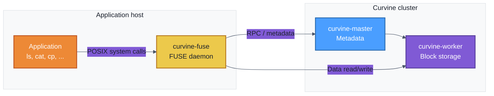

# FUSE Mode Access

In addition to the SDK, S3 gateway, and CLI, Curvine provides **FUSE (Filesystem in Userspace)** so that applications can access the Curvine filesystem as a local directory **without code changes**. Operations under the mount point are translated into Curvine RPC and data access.

In cloud-native environments, FUSE can be used via volume mounts; Curvine also provides a [CSI driver](../5-K8S-CSI-Driver/01-Setup.md) for Kubernetes.

:::info
**FUSE is an optional access method.** The Curvine cluster (Master + Worker) must be running first. FUSE is only needed when applications require a POSIX mount point. See [Deployment Architecture](../../2-Deploy/2-Deploy-Curvine-Cluster/0-Deployment-Architecture.md) for the role of each component.
:::

## Architecture



## Prerequisites

- **Curvine cluster** is running (Master and Worker started). See [Bare Metal Deployment](../../2-Deploy/2-Deploy-Curvine-Cluster/3-Distributed-Mode/02-Bare-Metal-Deployment.md) or [Quick Start](../../2-Deploy/1-quick-start.md).
- **Configuration**: The node where FUSE runs must have access to the cluster config (e.g. `conf/curvine-cluster.toml`) and correct Master address.
- **Supported systems**: FUSE 2 and FUSE 3 are supported; behavior may vary by distribution. See [Supported Linux Distributions](../../2-Deploy/2-Deploy-Curvine-Cluster/1-Preparation/02-compile.md#supported-linux-distributions).

## Usage

### Start FUSE

Run from the installation directory (e.g. `build/dist` or the extracted release package):

```bash
# Default: mount at /curvine-fuse, use conf/curvine-cluster.toml
bin/curvine-fuse.sh start

# Custom mount path
bin/curvine-fuse.sh start --mnt-path /mnt/curvine

# Custom config file
bin/curvine-fuse.sh start -c /path/to/curvine-cluster.toml
```

- **Default mount path**: `/curvine-fuse`
- **Default config**: `conf/curvine-cluster.toml` (relative to current working directory when the process starts)
- Use `bin/curvine-fuse.sh stop` to stop, or `bin/curvine-fuse.sh restart` to restart.

### Use the mount point

Under the FUSE mount path you can use standard Linux file commands: `ls`, `cat`, `rm`, `mv`, `mkdir`, `du`, `cp`, etc.

Example:

```bash
# Assume default mount /curvine-fuse
cd /curvine-fuse

echo "hello curvine" > a.txt
cat a.txt
du -h a.txt

mkdir -p b/c
ls -l
tree
# .
# ├── a.txt
# └── b
#     └── c
```

Data written here is stored in the Curvine cluster; you can also access paths that correspond to [mounted UFS](../../3-User-Manuals/1-Key-Features/01-ufs.md#mounting) (unified file system view).

### Optional parameters

When starting FUSE, you can pass through options to the underlying `curvine-fuse` binary, for example:

| Option | Description | Default |
|--------|-------------|---------|
| `--mnt-path` | Mount point path | `/curvine-fuse` |
| `-c` / `--conf` | Cluster config file path | `conf/curvine-cluster.toml` |
| `--fs-path` | Root path inside Curvine to expose at mount | `/` |
| `--io-threads` | I/O thread count | config value |
| `--worker-threads` | Worker thread count | config value |

Run `bin/curvine-fuse.sh --help` (or `lib/curvine-fuse --help` under the installation directory) to list all options.

## FUSE support level

Curvine FUSE supports:

- Standard file read/write and directory operations
- User/group and permission semantics
- Extended attributes (xattr), symbolic links (symlink), hard links (link)

:::tip
FUSE driver behavior can vary by distribution and FUSE version (FUSE2 vs FUSE3). For tested versions and dependencies, see [Supported Linux Distributions](../../2-Deploy/2-Deploy-Curvine-Cluster/1-Preparation/02-compile.md#supported-linux-distributions).
:::

On the **ltp-full-20210524** test suite, a large majority of tests pass; remaining failures are mainly in areas such as random write and file locking, which are under continuous improvement.

| Test suite      | Total | Skip (SKIP) | Fail (FAIL) | Pass (PASS) |
|-----------------|-------|-------------|-------------|-------------|
| fs_perms_simple  | 18    | 0           | 0           | 18          |
| fsx              | 1     | 0           | 0           | 1           |
| fs_bind          | 1     | 0           | 0           | 1           |
| smoketest        | 13    | 0           | 1           | 12          |
| io               | 2     | 0           | 1           | 1           |
| fs               | 29    | 0           | 13          | 16          |
| syscall          | 1206  | 32          | 300         | 874         |
| **Total**        | 1270  | 32          | 315         | 923         |

We welcome community contributions to improve FUSE compatibility and test coverage.
