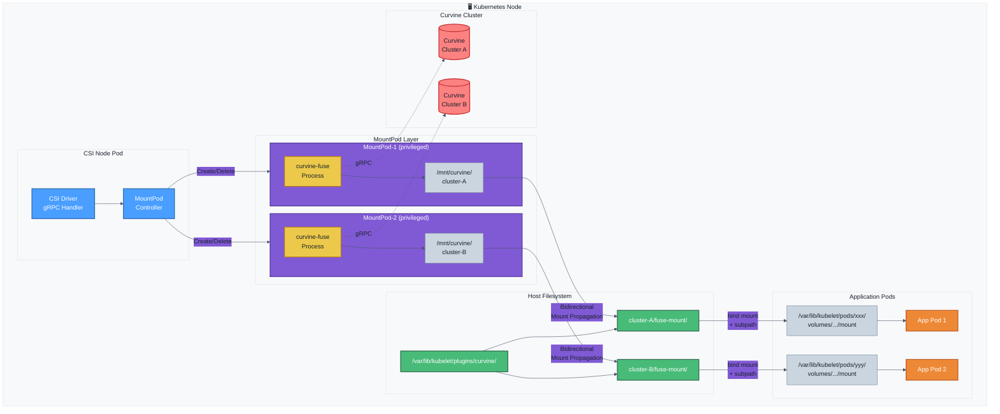
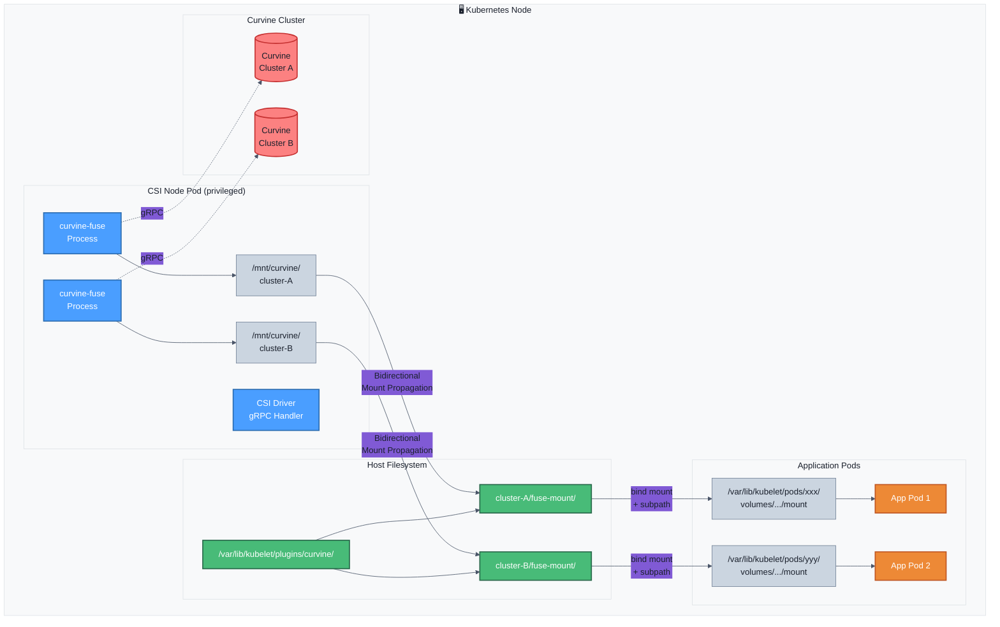

# Curvine CSI Architecture

`curvine-csi` is based on FUSE implementation, establishing connection with Curvine cluster through FUSE mount in csi-node.

## Architecture

The diagram below shows the overall design architecture of curvine-csi. **If you only need to use CSI, you can skip this chapter** and refer to [K8S CSI Driver](Setup) directly.

Curvine-csi mainly consists of two components:

| Component | Responsibility |
|-----------|---------------|
| CSI Node Service | Handle CSI gRPC calls, manage MountPod lifecycle |
| MountPod Controller | Create/Delete/Monitor MountPod |

## Mount Modes

Most CSI implementations manage mounts directly in csi-node by mounting remote storage to hosts and finally bind mounting to pod containers. Curvine-csi is based on FUSE. When the CSI component restarts, the FUSE process will be interrupted. To avoid FUSE interruption caused by CSI driver upgrades or restarts, curvine-csi supports two mount modes: standalone and embedded.

- **Standalone**: Decouple the FUSE process from the csi-node pod and run it in an independent Pod
- **Embedded**: FUSE process runs in the csi-node plugin pod

### Standalone Mode (Recommended)

Default mode. Install with Helm:

```bash
helm install curvine-csi ./curvine-csi \
  --set mountMode=standalone
```

#### Resource Configuration

Configure Standalone Pod resource limits via Helm values:

```bash
helm install curvine-csi ./curvine-csi \
  --set node.mountMode=standalone \
  --set node.standalone.resources.requests.cpu=500m \
  --set node.standalone.resources.requests.memory=512Mi \
  --set node.standalone.resources.limits.cpu=2 \
  --set node.standalone.resources.limits.memory=2Gi
```

Or use a values file:

```yaml
node:
  mountMode: standalone
  standalone:
    image: ""  # Empty uses CSI image
    resources:
      requests:
        cpu: "500m"
        memory: "512Mi"
      limits:
        cpu: "2"
        memory: "2Gi"
```

Default configuration:
- CPU: requests 500m, limits 2
- Memory: requests 512Mi, limits 2Gi

Architecture diagram:



### Embedded Mode

Install with Helm:

```bash
helm install curvine-csi ./curvine-csi \
  --set node.mountMode=embedded \
  --set node.resources.requests.memory=2Gi \
  --set node.resources.requests.cpu=1000m \
  --set node.resources.limits.memory=4Gi \
  --set node.resources.limits.cpu=2000m
```

Architecture diagram:



## FUSE Process Reuse and Lifecycle Management

### Overview

Curvine CSI implements intelligent FUSE process reuse mechanism. Using **ClusterID** as a unique identifier, multiple PVs can share the same FUSE process (Standalone Pod). This design significantly improves resource utilization and system performance.

### Core Concepts

#### ClusterID Generation

ClusterID is generated from the first 8 characters of the SHA256 hash of `master-addrs`:

```go
// Example: Generate ClusterID from master-addrs
masterAddrs := "10.0.0.1:8995,10.0.0.2:8995,10.0.0.3:8995"
clusterID := SHA256(masterAddrs)[:8]  // e.g., 0893a5f6
```

**Key Features**:
- Same `master-addrs` → Same ClusterID → Shared Standalone Pod
- Different `master-addrs` → Different ClusterID → Independent Standalone Pod
- Multi-cluster support: Same node can run multiple Standalone Pods for different Curvine clusters

#### Reference Counting

Each Standalone Pod maintains a reference count:
- **RefCount++**: When a new PV uses this Standalone Pod
- **RefCount--**: When a PV is deleted
- **Delete Pod**: When RefCount reaches 0 (no references)

### Lifecycle Management

#### Creation Phase

1. First PV requests → Create Standalone Pod (RefCount: 0 → 1)
2. Subsequent PVs with same master-addrs → Reuse existing Pod (RefCount++)

#### Running Phase

- Standalone Pod serves multiple PVs simultaneously
- Shared FUSE mount point
- Shared gRPC connection to Curvine cluster

#### Cleanup Phase (Automatic)

When the last PV is deleted:
1. RefCount: 1 → 0
2. Trigger automatic cleanup
3. Graceful shutdown (30s):
   - preStop hook: 5s (wait for I/O)
   - Unmount FUSE
   - Clean up resources
4. Delete Standalone Pod

### PV Watch Fallback Mechanism

To handle abnormal cases (e.g., PV deleted directly without Unstage call), CSI implements PV Watch mechanism:

**Triple Protection**:
1. **Main Path**: Normal Unstage call (fastest, 0 latency)
2. **PV Watch**: Monitor PV deletion events (second-level response)
3. **Periodic GC**: Scan orphaned Pods (10-minute fallback)

### State Persistence

Reference counts and volume lists are stored in ConfigMap, ensuring state survives node restarts:

```yaml
apiVersion: v1
kind: ConfigMap
metadata:
  name: curvine-standalone-state-<nodename>
data:
  state.json: |
    {
      "mounts": {
        "0893a5f6": {
          "clusterID": "0893a5f6",
          "podName": "curvine-standalone-0893a5f6-aefd8804",
          "refCount": 3,
          "volumes": ["vol-1", "vol-2", "vol-3"]
        }
      }
    }
```

### RBAC Requirements

Standalone mode requires the following permissions:

| Resource | Permissions | Purpose |
|----------|-------------|---------|
| `pods` | `create`, `delete`, `get`, `list`, `watch` | Manage Standalone Pods |
| `configmaps` | `create`, `delete`, `get`, `list`, `update`, `watch` | State persistence |
| `persistentvolumes` | `get`, `list`, `watch` | PV Watch fallback cleanup |
| `events` | `create`, `patch` | Event logging and debugging |

### Best Practices

1. **Use Standalone Mode** (default, recommended)
   - Independent FUSE process, CSI upgrades don't affect business
   - Resource isolation, clear problem domain

2. **Use consistent master-addrs for same cluster**
   - Ensure PV's `master-addrs` format is consistent
   - Maximize FUSE process reuse

3. **Monitor Standalone Pods**
   ```bash
   # View all Standalone Pods
   kubectl get pods -n curvine-system -l app=curvine-standalone
   
   # View reference count state
   kubectl get configmap -n curvine-system -l app=curvine-standalone-state
   ```

4. **Check logs for lifecycle events**
   ```log
   # Creation
   I1222 10:00:00 Creating Standalone for cluster 0893a5f6
   
   # Reference addition
   I1222 10:01:00 Added volume ref, refCount=2
   
   # Automatic cleanup
   I1222 10:15:00 Removed volume ref, refCount=0
   I1222 10:15:00 No more refs, deleting Standalone
   ```
