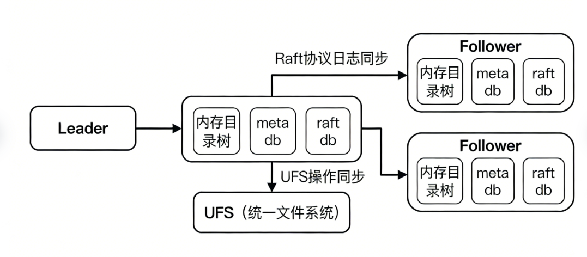

# Curvine Metadata Architecture

Metadata is the core component of a distributed file system. It is equivalent to the system's "navigation hub" and is mainly responsible for managing key information such as the namespace of files and directories, storage locations, size and permissions, and modification time. Its read/write speed, storage capacity, and data consistency directly determine the operating performance, stability, and availability of the entire distributed file system. Based on best practices in distributed storage and after comparing and validating multiple solutions, Curvine finally adopts the core combination of the Raft protocol and the RocksDB database to manage metadata. This combination meets low-latency requirements in high-concurrency scenarios, supports massive metadata storage, and ensures multi-node data consistency. The following is a simplified and complete core explanation.

## 1. Design Goals and Selection

The core design goals of the Curvine metadata architecture are clear and focused, mainly around four core requirements. First, it supports metadata storage for tens of millions to tens of billions of files and directories, adapting to mixed storage scenarios with massive small files and large files. Second, it ensures low latency in high-concurrency read/write scenarios, handling frequent high-frequency operations such as file creation, deletion, and modification. Third, it implements data consistency across multiple nodes in a distributed cluster, avoiding the problem that "local changes are invisible to other nodes". Fourth, it balances operational convenience and controllable costs, reducing the complexity of deployment, monitoring, and fault recovery.

During technology selection, the technical team compared multiple mainstream solutions such as HDFS NameNode, TiDB, Redis, and an independent Raft cluster, and finally determined the combined architecture of Raft and RocksDB. There are three core considerations. First, both have been validated in large-scale production scenarios, with high engineering maturity and guaranteed stability, and are widely used in various distributed storage systems. Second, RocksDB is based on the LSM-Tree architecture and has the advantages of high-concurrency writes, high compression ratio, and massive storage, making it very suitable for storing metadata, which consists of high-frequency read/write and massive small-entry data. Third, the Raft protocol can efficiently solve the consistency problem of distributed clusters, using a simple and clear mechanism to implement multi-node data synchronization, avoid single points of failure, and balance consistency and performance.

To balance speed, storage, and consistency, the architecture adopts a three-layer division of responsibilities. Each layer performs its own role and collaborates with the others. The specific responsibilities are as follows:

| Layer | Core Responsibility | Design Motivation |
| --- | --- | --- |
| In-memory directory tree | Specifically handles high-frequency operations such as path resolution, directory listing, and folder association. It only stores core directory structure information, such as folder names and parent-folder relationships. | Memory read/write speed is far faster than disk. Placing the core information for high-frequency operations in memory can keep directory query and path matching latency at the microsecond level. At the same time, only maintaining a lightweight directory structure greatly reduces memory usage and avoids wasting memory resources. |
| Metadata RocksDB (Inode engine) | Persistently stores the complete detailed information of all files and directories, including file size, permissions, modification time, data block locations, and complete directory association relationships. | It undertakes the persistent storage requirements of massive metadata. Through column families, different types of metadata are classified and stored, such as separating file attributes and directory relationships, improving read/write efficiency and management convenience while adapting to high-frequency metadata modification scenarios. |
| Raft log RocksDB | Specifically stores logs for all metadata modification operations, such as creation, deletion, and modification. Logs are recorded in operation order and used for multi-node synchronization. | It is completely isolated from business metadata storage, avoiding mutual impact between log storage and business reads/writes. It also facilitates log synchronization, compression, cleanup, and fault recovery, reducing performance loss. |

The in-memory directory tree and RocksDB do not operate independently. Instead, they form a collaborative model in which memory handles speed and disk handles storage. This ensures the speed of high-frequency operations while enabling massive data storage. The core collaboration logic is as follows:

**In-memory directory tree**: focuses on the ultimate speed of high-frequency operations. It only stores the most core directory structure information, such as folder names, parent folder IDs, and child node lists, and does not store detailed file attributes such as size and modification time. This design keeps memory usage extremely low and allows high-frequency operations such as directory listing and path lookup to be completed directly in memory with very fast response.

**RocksDB**: focuses on reliable storage of massive data and carries the complete detailed information of all files and directories, including file size, permissions, modification time, and the location of data blocks on disk. By classifying and managing different types of metadata through column families, data organization becomes clearer. At the same time, RocksDB's high-concurrency read/write characteristics ensure the read/write efficiency of massive metadata.

**Collaboration logic**: adopts an on-demand loading and divided-response approach. For example, when a user lists the contents of a directory, the in-memory directory tree first quickly returns the names of all files and folders in the directory to ensure response speed. When the user needs to view detailed information about a file, such as size and modification time, the system then performs a batch query in RocksDB for the corresponding detailed information and returns it all at once. This ensures speed without wasting memory resources.

## 3. Raft Protocol: The Core Mechanism for Ensuring Multi-Node Data Consistency

The core pain point of a distributed cluster is data inconsistency. For example, a file created on one machine may not be visible on another machine, affecting normal business operations. As the consistency hub of the Curvine distributed cluster, the Raft protocol is designed specifically to solve this problem. Its core mechanism is simple and efficient:

**Log synchronization first**: any metadata modification operation, such as creation, deletion, rename, or attribute modification, is first packaged as an operation log and stored in a dedicated log database, then synchronized to more than half of the machines in the cluster. Only after most machines successfully receive and store this log is the modification operation officially effective, ensuring that data will not be lost due to a single machine failure.

**Log replay ensures consistency**: the Leader node in the cluster is responsible for initiating modification operations and recording logs. Follower nodes synchronize the Leader's logs in real time and execute the same modification operations one by one in log order, ensuring that the metadata state of all nodes is completely consistent and avoiding data divergence.

**Snapshots accelerate recovery**: if a machine falls too far behind the Leader due to failure or network disconnection, it does not need to replay all historical logs one by one. The Leader directly sends a complete snapshot of the current data. After loading the snapshot, the machine can quickly catch up with the cluster progress, greatly shortening fault recovery time and improving system availability.

## 4. Leader-First Write: A Balance Between Speed and Consistency

To adapt to high-concurrency and low-latency business scenarios, Curvine reasonably optimizes the execution process of the traditional Raft protocol and adopts a Leader-first write strategy, which differs from the traditional mode of synchronizing logs first and then modifying local data:

**Core process**: the Leader node first updates its own in-memory directory tree, then writes to the local RocksDB to complete the local data modification, and then synchronizes the log of this modification to other Follower nodes in the cluster to complete consistency synchronization.

**Core advantage**: write speed is greatly improved. There is no need to wait for the log to be synchronized to most machines before completing the local modification. Local write latency can be reduced to a few milliseconds. In high-concurrency scenarios, such as creating a large number of small files, throughput can increase several times, perfectly adapting to high-frequency small-operation scenarios.

**Small cost**: an extremely short consistency window. If the Leader node fails just after completing the local modification but before synchronizing the log, these unsynchronized modifications may not be synchronized to other nodes. However, this window is extremely short, usually only a few milliseconds, and the probability of occurrence in actual production is extremely low. It is an acceptable trade-off between performance and consistency.

## 5. Log Batch Processing Optimization: Further Improving High-Concurrency Throughput

For high-frequency small-operation scenarios such as creating and modifying a large number of small files, Curvine introduces a log batch processing mechanism to further improve write throughput and avoid performance loss caused by frequent log synchronization:

The core logic is to accumulate a batch and then synchronize. The system merges metadata modification operations within a short time window, usually 1 to 10 milliseconds, or a certain number of operations, such as 100, into one batch log and then synchronizes it to other nodes in the cluster. The core benefit is reducing the number of log synchronizations and lowering the overhead of network transmission and disk writes. In high-concurrency scenarios, throughput can increase several times.

At the same time, batch processing parameters can be flexibly adjusted. The batch processing time window, such as 1 millisecond or 5 milliseconds, and the batch size, such as 50 or 100 entries, can be set according to business requirements to find the optimal balance between write latency and throughput. The shorter the window, the lower the latency. The larger the batch, the higher the throughput. In addition, because the Raft log already guarantees data consistency, RocksDB's own WAL log is disabled, further improving write speed.

## 6. Selection Trade-Offs: Why Not Use External Databases Such as TiDB or Redis

When selecting a metadata storage solution, the technical team also focused on mature external databases such as TiDB and Redis. However, it finally chose the self-developed architecture of in-memory directory tree, RocksDB, and built-in Raft. The core reason is that external databases cannot adapt to Curvine's high-concurrency and low-latency core requirements. The specific trade-offs are as follows:

**Excessive latency**: external databases require network communication to complete reads and writes. Each metadata operation has to go through an additional network round trip, and tail latency increases significantly. This is far slower than local operations using memory and local RocksDB and cannot meet the low-latency requirements of high-frequency small operations.

**Prone to performance bottlenecks**: metadata operations are mostly high-frequency small requests. When massive clients connect to an external database at the same time, it is easy to exhaust database connections, causing QPS to hit a ceiling and making it unable to support high-concurrency scenarios.

**High and cumbersome O&M cost**: introducing an external database adds dependent components to the cluster. This database needs to be deployed, monitored, and maintained separately, and fault recovery becomes more complex. At the same time, as the amount of metadata grows, the cost of an externally hosted database increases significantly, which does not meet the goal of controllable cost.

**Limited optimization space**: external databases are general-purpose designs and cannot be customized for characteristics such as high-frequency directory operations and batch reads/writes of metadata. A self-developed architecture can deeply optimize core processes such as path resolution and on-demand loading, making it better suited to business requirements.

## 7. fs-mode Mode: Cooperating with UFS to Ensure Data Fallback Safety

Curvine supports fs-mode. Its core function is to synchronize metadata and file data to the underlying unified file system, UFS, forming a dual guarantee of local storage plus disk fallback. This avoids data loss without affecting system performance:

**Metadata mirror synchronization**: all metadata modifications in Curvine, such as creation, deletion, and attribute modification, are asynchronously synchronized to UFS in the background after being completed locally. This ensures that the directory structure and file attributes of Curvine and UFS are completely consistent, implementing a unified namespace.

**Asynchronous data copy**: the actual data blocks of files are asynchronously copied from Curvine to UFS in the background. The copy process does not affect local metadata read/write operations and avoids slowing down write speed. If UFS is temporarily unavailable, the copy task automatically retries until synchronization succeeds.

**Idempotent retry guarantee**: synchronization operations adopt an idempotent design. Repeated execution of the same modification operation will not change the result, avoiding exceptions such as duplicate file creation or duplicate deletion and ensuring the reliability of the synchronization process.

**Progress tracking and fast recovery**: the system separately records the latest Curvine local modification progress and UFS synchronization progress. If UFS falls too far behind due to failure or network disconnection, after recovery it does not need to resynchronize all data. It only needs to continue synchronization from the last interrupted progress, greatly improving recovery efficiency.

## 8. Architecture Summary

The core logic of Curvine's metadata architecture can be summarized as three layers of division of responsibilities, one trade-off, and one fallback. It ensures speed and massive storage while also considering data consistency and operational convenience:

**Three-layer division of responsibilities**: the in-memory directory tree handles speed, with high-frequency operations responding instantly; RocksDB handles storage, reliably carrying massive metadata; the Raft protocol handles consistency, keeping multi-node data free of divergence. The three work together to achieve fast, stable, efficient, and complete behavior.

**One trade-off**: the Leader-first write strategy uses an extremely short consistency window in exchange for low latency and high throughput in high-concurrency scenarios, adapting to the core scenario of massive small-file reads and writes.

**One fallback**: through fs-mode cooperation with UFS, metadata and file data have dual backups, ensuring data safety while supporting fast fault recovery.

**Selection advantage**: by giving up external databases and adopting a local architecture, Curvine reduces latency and O&M costs while retaining room for customized optimization, perfectly matching the core requirements of a distributed file system.
