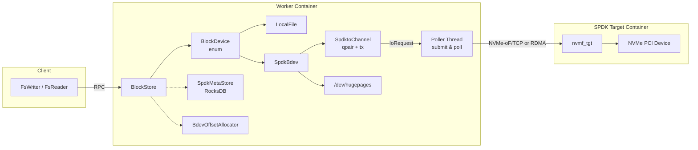
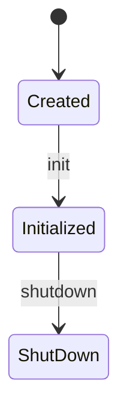
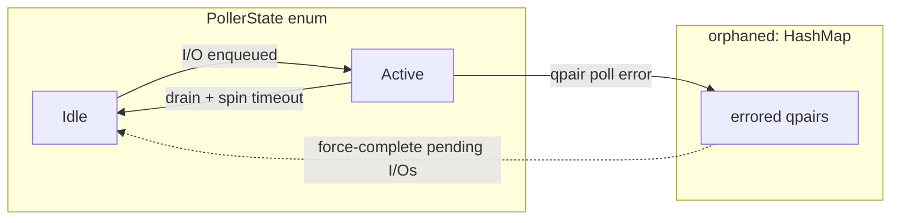
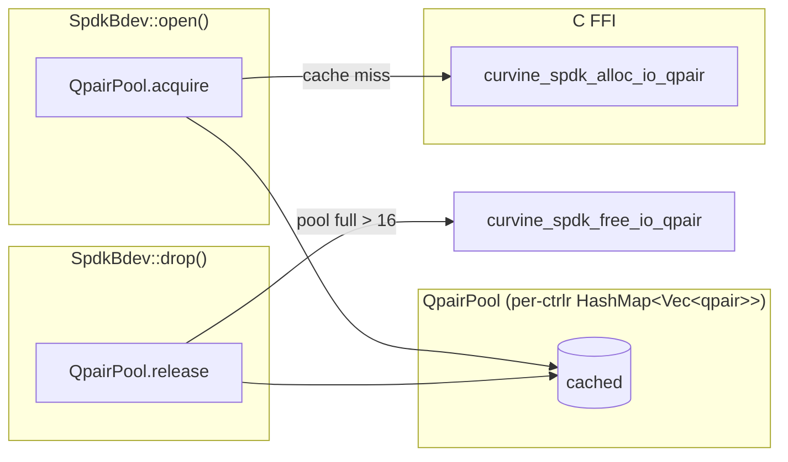
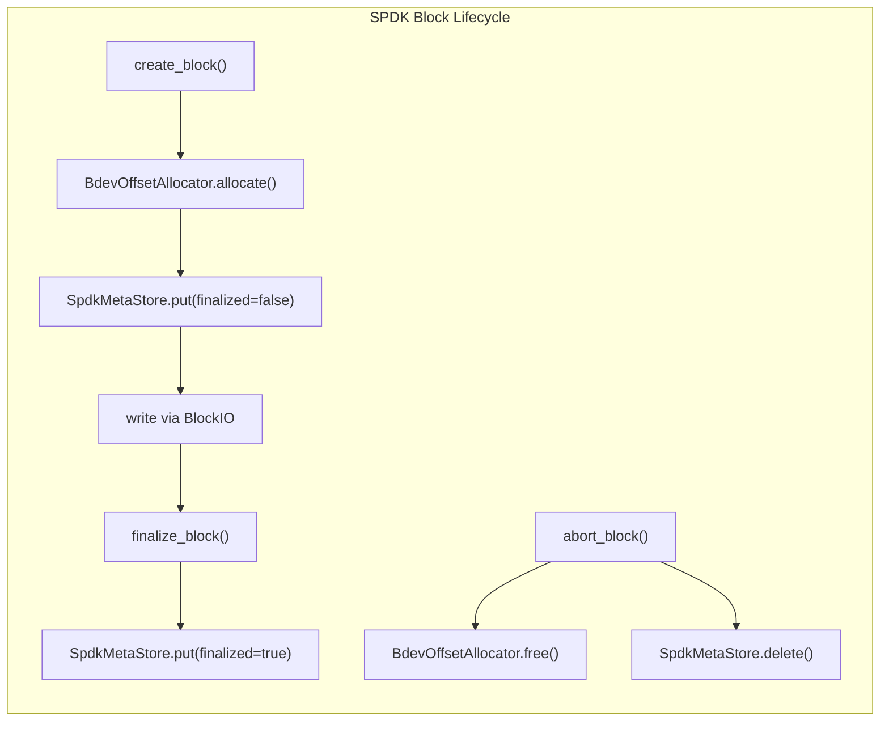

# SPDK Integration Architecture

## Overview

SPDK (Storage Performance Development Kit) enables kernel-bypass, userspace NVMe I/O in Curvine. Instead of going through the kernel VFS (`pread`/`pwrite`), the Worker talks directly to an NVMe-oF target via TCP or RDMA, using a dedicated poller thread and DMA hugepage buffers for minimal latency.

Curvine uses SPDK as a **remote block device** — the NVMe-oF target can be a physical NVMe drive on the same host, a dedicated SPDK target container, or a remote storage node. The Worker opens `SpdkBdev` handles (analogous to `LocalFile`) and issues read/write I/O through the `BlockIO` trait.

## When to Use SPDK

SPDK natively reaches over 10 million IOPS on a single core[[1]](#ref-spdk-iops). Curvine's SPDK integration targets
latency-sensitive workloads where kernel VFS overhead becomes the bottleneck — use it when your
workload needs consistent sub-millisecond latency or exceeds what LocalFile can sustain. 

## System Architecture



## Key Components

### SpdkEnv (Global Environment)

`orpc/src/io/spdk_env.rs`

Singleton that initializes the SPDK application framework (DPDK EAL, hugepages, reactor mask). On startup it:
1. Allocates hugepages for DMA buffers
2. Sets CPU affinity via `reactor_mask`
3. Discovers NVMe-oF targets and their namespaces
4. Creates the `SpdkPoller` thread
5. Maintains a qpair pool per controller

Only one `SpdkEnv` exists per Worker process. It is initialized from `SpdkConf`.

#### SpdkEnvState

`orpc/src/io/spdk_env.rs`

Three-state lifecycle machine controlling `SpdkEnv` initialization and shutdown:



Stored as `AtomicU8` for lock-free reads. The state gates handle acquisition
(`acquire_handle` increments then verifies `Initialized`) and prevents
concurrent shutdown (CAS transitions `Initialized → ShutDown`).

### SPDK FFI Layer

`orpc/src/io/spdk_ffi.rs`

Curvine interacts with the SPDK C library through a thin FFI layer that insulates Rust code from SPDK's C ABI. Three techniques are used:

- **Opaque ZST pointers**: SPDK types like `spdk_nvme_ctrlr` are declared as zero-sized enums in Rust — they exist only for compile-time type safety. At runtime they are raw pointers passed straight to C.
- **Fixed-size byte buffers**: SPDK C structs (async context, namespace data) are represented as `[u8; N]` with `#[repr(C, align(8))]` instead of matching the C layout field-by-field. This avoids version-dependent layout mismatches.
- **`curvine_*` C helper functions**: Small C wrappers that set struct fields at known offsets. For example, Rust calls `curvine_spdk_async_ctx_init(...)` rather than manipulating C struct fields directly. At init, a runtime `sizeof()` check compares the Rust buffer size against the real C struct size, catching ABI drift immediately.


### SpdkPoller (Dedicated I/O Thread)

`orpc/src/io/spdk_poller.rs`

SPDK requires all NVMe submission and completion processing to run on a single thread that holds the SPDK reactor context. `SpdkPoller` bridges the async handler threads (which issue I/O) to the synchronous SPDK polling loop.



- **Idle**: The poller blocks on `eventfd` to avoid burning CPU. Handler threads signal the `eventfd` when enqueuing a new request, waking the poller into Active.
- **Active**: Drains the incoming request channel, submits NVMe commands via `spdk_nvme_ns_cmd_read`/`write`, polls qpairs for completions, and invokes per-I/O callbacks. When the queue is empty, it spins for `spin_iter` iterations before transitioning to Idle. This **spin-before-park** avoids an `eventfd` wake round-trip when the next I/O arrives immediately, keeping the poller in a low-overhead polling loop instead of a syscall-heavy park/unpark cycle.
- **Orphaned (HashMap)**: When `curvine_spdk_qpair_poll` returns an error, the qpair is moved from Active into an `orphaned` HashMap. The poller force-completes all pending I/Os on the failed qpair via `force_complete_qpair`, waking blocked handler threads with an error status. The orphaned entry persists to catch late SPDK callbacks.

### I/O Request Protocol

`orpc/src/io/spdk_poller.rs`

Handler threads communicate with the poller through three types:

- **IoOp**: The operation enum. `Read` and `Write` carry namespace, qpair, DMA buffer, offset, and length. `Flush` targets a namespace; `UnregisterQpair` notifies cleanup.
- **IoRequest**: The envelope wrapping an `IoOp`, `Arc<IoCompletion>`, and the per-bdev inflight counter. Sent through the crossbeam channel.
- **IoCompletion**: Bridges handler and poller threads. The handler blocks on `wait(timeout)`; the poller's C callback wakes it via `complete(status)`.

### SpdkBdev (Block Device Handle)

`orpc/src/io/spdk_bdev.rs`

Per-bdev handle analogous to `LocalFile`. It holds:
- Raw NVMe namespace and qpair pointers
- DMA read and write buffers (hugepage-backed, fixed-size per `dma_buf_size` (1 MB as the default), reused across I/Os)
- I/O channel sender to the poller thread
- Current position (`pos`), device size, block size

Large I/Os are **chunked**: split into `dma_buf_size` chunks and submitted serially.

`BlockDevice` (in `orpc/src/io/block_io.rs`) wraps `SpdkBdev` and `LocalFile` into a single enum that implements `BlockIO`. The handler code dispatches through the trait at runtime without knowing which backend it's talking to.

### NVMe Queue Pair (Qpair)

`orpc/src/io/spdk_env.rs`

An NVMe I/O queue pair (qpair) is the communication channel between the host and the NVMe-oF target. Commands (read/write/flush) are submitted on the submission queue (SQ); completions arrive on the completion queue (CQ). The poller polls the CQ to detect finished I/Os.

Each `SpdkBdev` holds one qpair, opened against the target's namespace. Qpairs are **not thread-safe** — all submit and poll must happen on the same thread, which is why `SpdkPoller` exists as a dedicated thread.

#### Qpair Pool

`orpc/src/io/spdk_env.rs`

Allocating and freeing a qpair involves C FFI calls into SPDK, which in turn may send NVMe admin commands to the controller. To avoid this overhead on every bdev open/close, a `QpairPool` caches idle qpairs per controller:



- **Acquire**: Pop a cached qpair (zero FFI). If pool is empty, call `curvine_spdk_alloc_io_qpair` to allocate a new one.
- **Release**: Push the qpair back into the pool. If the pool exceeds the limit (16 per controller by default), free the excess via `curvine_spdk_free_io_qpair` to bound controller-side memory.
- **Drain**: On shutdown, `drain_all()` frees all cached qpairs.

### SpdkIoChannel

`orpc/src/io/spdk_bdev.rs:27`

The bridge between an `SpdkBdev` and the `SpdkPoller`. Each bdev holds one channel containing:

- **qpair**: The NVMe queue pair for issuing commands
- **poller_tx**: Crossbeam sender to submit `IoRequest`s to the poller thread
- **eventfd**: File descriptor for waking the poller from Idle state
- **poller_is_sleeping**: Shared `AtomicBool` set true by the poller when idle; bdevs check it to skip the eventfd write syscall

No direct reference to `SpdkPoller` is stored — all communication is through the channel and eventfd, which allows the bdev to be thread-safe.

### DmaBuf (DMA Buffer)

`orpc/src/io/spdk_bdev.rs`

A pre-allocated, fixed-size buffer backed by hugepages for NVMe DMA.

- **Hugepage backing**: Allocated via `curvine_spdk_dma_malloc` which returns physically contiguous, pinned memory. This satisfies the NVMe controller's DMA requirements and avoids TLB misses for large I/Os.
- **Pre-allocated and reused**: Each `SpdkBdev` allocates two buffers (read + write) at open time via `curvine_spdk_dma_malloc` and reuses them for every I/O. This avoids a malloc/free cycle per I/O — the buffer is zero-cost after the first allocation.
- **Cleanup on close**: Buffers are freed via `curvine_spdk_dma_free` in `SpdkBdev::drop`. If inflight I/Os do not drain before the drop deadline, the buffer pointers are nulled to prevent use-after-free (safe leak).
- **Reuse through chunking**: Large I/Os are split into `dma_buf_size`-aligned chunks and processed serially through the same fixed buffer, avoiding the need for dynamically-sized DMA memory.
- **Block alignment**: All offsets are aligned down to the device block size. This is required by the NVMe specification — unaligned DMA addresses cause controller errors.

### BdevOffsetAllocator

`curvine-server/src/worker/storage/dir_state.rs`

With `LocalFile` storage, the kernel's filesystem assigns disk blocks to each file and tracks free space. With SPDK, multiple Curvine blocks share the same raw bdev — there is no kernel filesystem in between, the NVMe device exposes a flat byte address space. `BdevOffsetAllocator` replaces the kernel's block allocator: it assigns each block a unique byte range on the bdev and reclaims the range when the block is deleted.

It manages this with a bump cursor that advances through the address space for new allocations, and a free-list that tracks reclaimed ranges with adjacent coalescing to reduce fragmentation. The allocator is thread-safe. On restart, the cursor position and free-list are restored from RocksDB snapshots (via `SpdkMetaStore`), ensuring no double-allocation. The current implementation is a straightforward bump-and-free-list design and need to optimize later.

### SpdkMetaStore

`curvine-server/src/worker/storage/spdk_meta_store.rs`

RocksDB-backed persistent map: `block_id → (dir_id, offset, size, len, finalized)`. Metadata is written on block create and finalize, restored on Worker restart.

## Read Path

The handler calls `SpdkBdev::read_region(enable_send_file, len)`, which reads from the bdev's current position. The underlying `spdk_read()` splits large reads into DMA-buffer-sized chunks (1 MB by default) and processes each through the poller:

1. Submit an `IoRequest` to the poller thread via crossbeam channel. If the poller is idle, wake it via `eventfd`.
2. The handler blocks on a condition variable waiting for completion.
3. The poller submits `spdk_nvme_ns_cmd_read` to the NVMe-oF target, polls for completion, then signals the handler.
4. The handler copies data from the DMA buffer into a heap `BytesMut`, then advances to the next chunk.

All I/O is block-aligned (aligned down to the device block size). Unaligned reads read the full aligned block and extract the requested bytes into the result.

## Write Path

NVMe commands require block-aligned offsets and lengths. When a write offset or length is not aligned to the device block size, a **read-modify-write** cycle is needed:

1. Read the full aligned block into the DMA buffer (e.g., 4096 bytes at offset 0 for a write at offset 7)
2. Copy the user's data into the DMA buffer at the correct offset, preserving bytes outside the write range
3. Submit the write command for the full aligned block

For aligned writes, only step 3 is needed — the NVMe write command is submitted directly.

## Block Lifecycle



## DMA Buffer Management

- Read and write buffers are `dma_buf_size` 1 MB each by default, pre-allocated at `SpdkBdev::open()`
- Larger I/Os are split into `dma_buf_size` chunks, processed serially
- Each chunk requires a DMA memcpy: `DmaBuf → heap BytesMut` (read) or `heap → DmaBuf` (write)

### Alignment Constraints

NVMe commands require block-aligned offsets and lengths:

```
Example: block_size = 4096, user wants to read 100 bytes at offset 7

aligned_off = 0         (align down)
head_skip  = 7          (unaligned prefix)
aligned_len = 4096      (round up)

NVMe reads 4096 bytes at offset 0
We copy only bytes [7..107] into the result
```

For writes, unaligned offsets or lengths trigger a read-modify-write cycle (see Write Path).

## Configuration
TBP

## Quick Start
TBP

## Optimization Experiment: Next Steps

- **Target-side hybrid mode**: Apply active/idle state transitions to the SPDK NVMe-oF target to reduce CPU usage when idle.
- **Allocator improvements**: Enhance performance, reduce fragmentation, contention, and time complexity under high workload.
- **I/O submission and polling**: Experiment with batch submission and multi-poller approaches to scale throughput.
## Code References

| File | Purpose |
|---|---|
| `orpc/src/io/spdk_env.rs` | Global SPDK environment init, SpdkEnvState lifecycle |
| `orpc/src/io/spdk_poller.rs` | Poller thread, I/O submission, completion callbacks, IoOp/IoRequest/IoCompletion |
| `orpc/src/io/spdk_bdev.rs` | SpdkBdev read/write, SpdkIoChannel, DmaBuf, chunked I/O |
| `orpc/src/io/spdk_ffi.rs` | Raw FFI bindings to SPDK C library |
| `orpc/csrc/spdk_opts_helper.c` | C helper for SPDK opts initialization |
| `orpc/src/io/block_io.rs` | BlockIO trait and BlockDevice enum |
| `curvine-server/src/worker/storage/dir_state.rs` | BdevOffsetAllocator |
| `curvine-server/src/worker/storage/spdk_meta_store.rs` | RocksDB-backed block metadata |
| `curvine-server/src/worker/storage/vfs_dataset.rs` | VfsDataset with SPDK-aware create/finalize/abort |
| `curvine-docker/deploy/spdk/curvine-cluster-spdk.toml` | SPDK worker configuration |

<a id="ref-spdk-iops"></a>
[[1]] [10.39M Storage I/O Per Second From One Thread](https://spdk.io/news/2019/05/06/nvme/)
