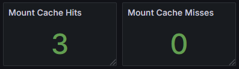

# Curvine 可观测性建设
Curvine 作为一款高性能分布式缓存系统，对性能、稳定性和可靠性有着严苛的要求。
为确保系统在各种负载条件下保持最优性能，并快速定位和解决潜在问题，我们构建了基于 Prometheus 和 Grafana 的全方位监控解决方案。该监控体系为 Master 节点、Worker 节点、Fuse 节点和 S3 Gateway 提供深度可观测性能力，通过收集各组件的关键指标，实现对缓存集群规模、运行状态、性能表现和资源使用情况的实时监控。

## 监控架构

本监控系统采用以下核心组件：

- **Prometheus**: 负责指标收集、存储和查询
- **Grafana**: 提供数据可视化和仪表板展示

## 可观测性指标
### Master 节点指标

Master 节点作为集群的元数据管理中心，提供以下关键指标：

#### 容量指标

容量指标是评估系统存储资源使用状况的基础，对容量规划、资源优化和预防性维护至关重要。通过监控这些指标，可以及时发现存储瓶颈，预测容量需求，确保系统有足够空间应对业务增长。

| 指标名称 | 描述 |
|---------|------|
| inode_dir_num | 目录数量 |
| inode_file_num | 文件数量 |
| num_blocks | block 总数 |
| blocks_size_avg | block 平均大小 |
| capacity | 总存储容量 |
| available | 可用存储空间 |
| fs_used | 文件系统已用空间 |

#### 资源指标

资源指标反映了系统对计算资源的使用情况，对性能调优、资源分配和故障预防具有重要意义。内存使用情况直接影响系统性能和稳定性，特别是 RocksDB 作为核心存储引擎，其内存占用需要精确监控以避免内存溢出和性能下降。

| 指标名称 | 描述 |
|---------|------|
| used_memory_bytes | 已用内存字节数 |
| rocksdb_used_memory_bytes | rocksdb 内存占用 |

#### 集群状态指标

集群状态指标提供了系统整体健康状况的实时视图，对保障高可用性和数据一致性至关重要。通过监控 Worker 节点状态和复制任务执行情况，可以快速发现节点故障、数据不一致等问题，确保分布式缓存系统的可靠运行。

| 指标名称 | 描述 |
|---------|------|
| worker_num | worker 数量（按状态分类） |
| replication_staging_number | 等待复制的块数量 |
| replication_inflight_number | 正在进行复制的块数量 |
| replication_failure_count | 累计复制失败的总次数 |

#### 性能指标

性能指标是衡量系统响应能力和处理效率的核心指标，对性能优化和容量规划具有关键作用。RPC 请求的总计数和总耗时可以计算出平均响应时间，直接反映系统的处理能力，而各类操作的耗时分析有助于识别性能瓶颈，指导系统优化。

| 指标名称 | 描述 |
|---------|------|
| rpc_request_total_count | RPC 总请求计数 |
| rpc_request_total_time | RPC 总请求时间 |
| operation_duration | 操作耗时（按类型分类，不包括心跳） |

#### Journal 系统指标

Journal 系统是保证数据一致性和故障恢复的关键组件，其性能直接影响系统的写入性能和数据可靠性。监控 Journal 队列长度和刷新性能可以及时发现写入瓶颈，预防数据丢失风险，确保系统在高并发写入场景下的稳定性。

| 指标名称 | 描述 |
|---------|------|
| journal_queue_len | Journal 队列长度 |
| journal_flush_count | Journal 刷新次数 |
| journal_flush_time | Journal 刷新时间 |

### Client 指标（Fuse/S3 Gateway）

Fuse 和 S3 Gateway 的指标通过 Client 收集

#### 缓存指标

缓存指标直接反映了缓存系统的核心价值——提升访问性能。挂载缓存的命中率是衡量缓存效果的关键指标，高命中率意味着更少的后端访问和更快的响应速度。这些指标对评估缓存策略有效性、优化缓存配置至关重要。

| 指标名称 | 描述 |
|---------|------|
| client_mount_cache_hits | 挂载缓存命中数 |
| client_mount_cache_misses | 挂载缓存未命中数 |

#### I/O 指标

I/O 指标是评估系统读写性能的核心数据，对性能调优和容量规划具有指导意义。通过监控读写字节数和耗时，可以计算出读写吞吐量，准确评估系统的 I/O 性能瓶颈，优化存储策略，确保在高并发访问场景下的稳定性能。

| 指标名称 | 描述 |
|---------|------|
| client_write_bytes | 写入字节数 |
| client_write_time_us | 写入时间（微秒） |
| client_read_bytes | 读取字节数 |
| client_read_time_us | 读取时间（微秒） |

#### 元数据操作指标

元数据操作性能直接影响文件系统的响应速度，对提升用户体验和系统整体性能至关重要。元数据操作的耗时分析有助于识别元数据管理瓶颈，优化目录结构，提升文件系统操作效率。

| 指标名称 | 描述 |
|---------|------|
| client_metadata_operation_duration | 元数据操作耗时 |

### Worker 节点指标

Worker 节点作为数据存储节点，提供全面的存储和性能指标：

#### 容量指标

Worker 节点的容量指标是数据存储管理的核心，对负载均衡、数据迁移和容量规划具有关键作用。通过监控各节点的存储使用情况，可以实现智能的数据分布，防止单点过载，确保整个缓存集群的存储资源得到最优利用。

| 指标名称 | 描述 |
|---------|------|
| capacity | 总存储容量 |
| available | 可用存储空间 |
| fs_used | 文件系统已用空间 |
| num_blocks | block 总数 |
| num_blocks_to_delete | 待删除 block 数 |

#### I/O 指标

Worker 节点的 I/O 指标反映了数据存储的实际性能，对评估存储硬件效率、优化数据访问模式至关重要。详细的读写统计信息有助于识别热点数据、优化数据布局，提升整体存储性能和响应速度。

| 指标名称 | 描述 |
|---------|------|
| write_bytes | 写入字节数 |
| write_time_us | 写入时间（微秒） |
| write_count | 写入次数 |
| write_blocks | 写入块数（按类型分类） |
| read_bytes | 读取字节数 |
| read_time_us | 读取时间（微秒） |
| read_count | 读取次数 |
| read_blocks | 读取块数（按类型分类） |

#### 资源指标

Worker 节点的资源使用情况直接影响数据存储服务的稳定性和性能，对资源调度和性能优化具有重要意义。合理的内存使用是保证数据缓存效率的基础，需要精确监控以避免资源竞争和性能下降。

| 指标名称 | 描述 |
|---------|------|
| used_memory_bytes | 已用内存字节数 |

#### 硬件状态指标

硬件状态指标是保障数据可靠性和系统可用性的重要监控维度，对预防性维护和故障快速响应至关重要。通过实时监控磁盘健康状态，可以提前发现硬件故障风险，及时进行数据迁移和硬件更换，确保缓存系统的数据安全和持续可用。

| 指标名称 | 描述 |
|---------|------|
| failed_disks | 异常存储数量 |
| total_disks | 存储磁盘数量 |

## 全局面板
### Master

### Worker

### Client

## 总结

Curvine 分布式缓存系统的可观测性设计覆盖了从元数据管理到数据存储的完整链路，通过细粒度的指标收集实现了：

- **全链路监控**: 从客户端请求到数据存储的完整监控，确保每个环节的性能和状态都可观测
- **多维度观测**: 涵盖性能、容量、状态等多个维度，提供系统健康度的全面视图
- **实时告警**: 基于关键指标的实时监控和告警，及时发现异常并快速响应
- **故障诊断**: 详细的指标数据支持快速故障定位，缩短故障恢复时间
- **性能优化**: 通过持续监控和分析，为系统性能调优提供数据支撑
- **容量规划**: 基于历史趋势和实时数据，为容量扩展和资源优化提供决策依据

通过这套完善的监控体系，Curvine 能够在复杂的分布式环境中保持高可用性和高性能，为用户提供稳定可靠的缓存服务。