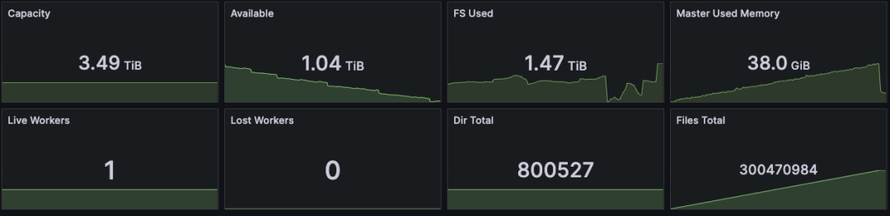
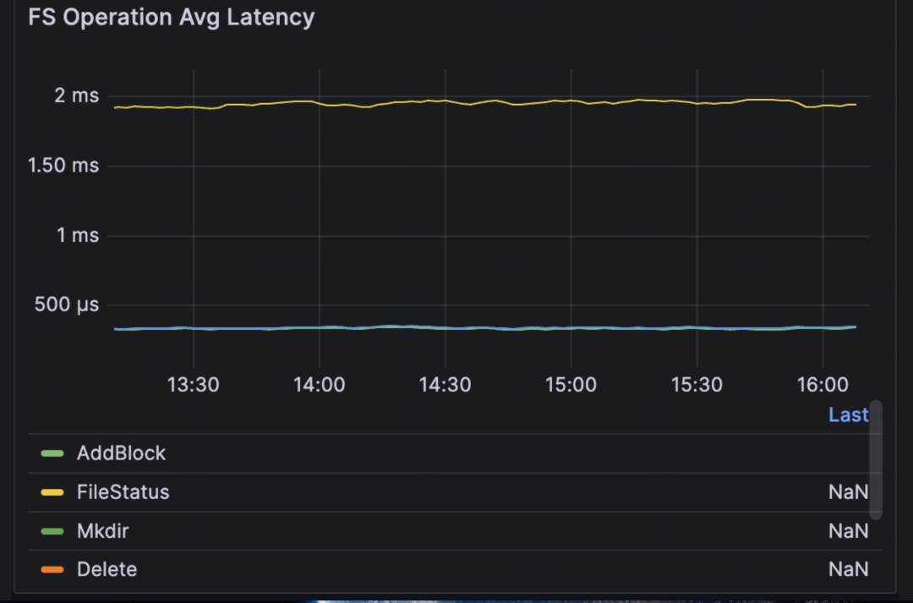
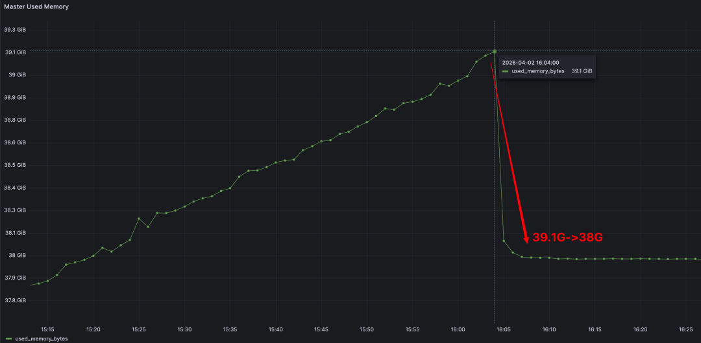
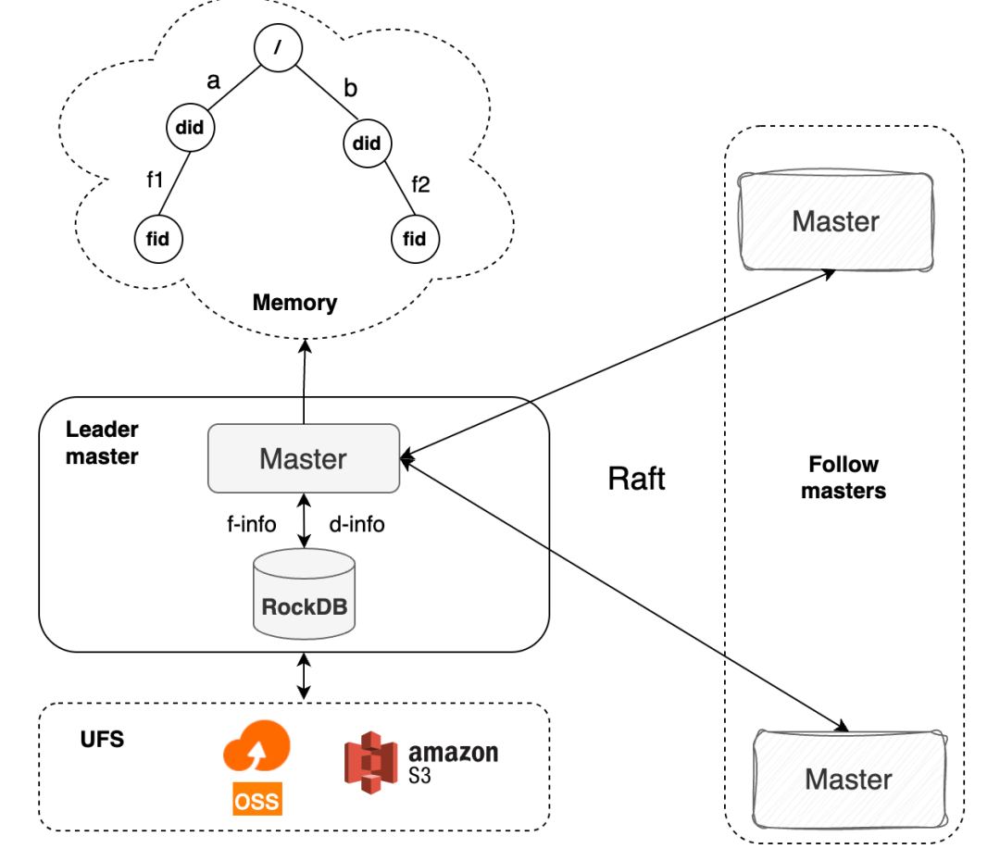

# Curvine 压测：3 亿文件仅占 38G 内存，开源项目天花板

在分布式文件系统领域，元数据的内存效率、并发处理能力、小文件吞吐性能，一直是衡量产品核心能力的关键指标。近期，Curvine 完成了一组高规格元数据压测，结果显示：Curvine 的元数据内存效率达到了开源项目中的顶尖水平，核心能力可与商业版分布式存储产品相当。

### 🔥 开篇结论

- **内存高效利用**：在 **80 万目录**、**3 亿文件**、每个文件写入一个 block 的条件下，Curvine 仅占用 **38G** 内存，与参考材料 [1] 中 JuiceFS 商业版的元数据能力大致相当。
- **高并发低延迟**：在 **10 万客户端** 循环操作的压力下，QPS 稳定在 **5.3 万每秒**，命令操作**平均时延低于 2ms**，**P99 时延低于 9ms**。
- **小文件高吞吐**：高并发写入大量小文件时，Curvine 可实现**每小时写入 1200 万小文件**，平均写入一个小文件仅需 **0.3ms**。

## 📝 测试条件

- **Curvine 集群**：一台 Master，一台 Worker
- **测试机型**：阿里云 `ecs.i5.8xlarge`，32 核，256G 内存
- **客户端**：10 万个 FUSE 客户端
- **操作**：客户端循环执行 `mkdir`、`touch`、写文件、`ls` 等高频命令

## 📊 核心压测数据

### 🧠 内存效率：开源第一梯队

- 管理规模：**80 万目录 + 3 亿文件**
- 单文件写入：**1 个 block**
- 内存占用：**仅 38G**
- 对标结论：与 JuiceFS 商业版的元数据内存能力相当

### ⏱️ 高并发低延迟：10 万客户端快跑稳跑

- 并发客户端：**10 万 FUSE 客户端**
- 稳定吞吐：**5.3 万次/秒**
- 平均时延：**不超过 2ms**
- P99 时延：**不超过 9ms**

连接开销同样很低：**10 万连接仅消耗 1.1G 内存**，平均每个连接约 **11.5KB**。

压测停止后，Master 内存会立刻从 **39.1G** 回落到 **38G**。

### 🚀 小文件高吞吐：海量场景无压力

- 每小时写入：**1200 万小文件**
- 单文件平均写入时延：**0.3ms**
- 高并发下吞吐持续打满

**15:00** 时，Curvine 已写入 **2.87 亿文件**：

**16:00** 时，文件总量达到 **2.99 亿**：

## 🏗️ 元数据架构

Curvine 的元数据能力不仅在大规模内存效率和高并发性能上表现突出，与其他开源产品相比也具备明显优势。其背后是一套经过精心设计的元数据架构。

### 💡 设计理念

1. 单 Master 支撑大规模文件与海量小文件。
2. 以高并发、低延迟应对频繁的创建、删除、修改等高频元数据操作。
3. 尽量减少对外部组件的依赖，降低运维复杂度，同时保证系统稳定性。

基于这些目标，Curvine 选择了 **内存目录树 + 单机 RocksDB + Raft 一致性机制** 的三层组合，在性能、规模和稳定性之间取得平衡。

| 层次 | 核心职责 | 设计动机 |
| --- | --- | --- |
| 内存目录树 | 存储目录结构信息，包括目录名、父子关系，并处理路径解析、目录列举等高频操作 | 将高频命名空间操作放在内存中，把目录查询和路径匹配延迟控制在微秒级；只维护轻量目录结构，最大化可支撑规模 |
| 元数据 RocksDB（`inode` 引擎） | 持久化文件和目录的完整元数据，包括文件大小、权限、`mtime`、block 位置以及完整目录关系 | 通过列族机制拆分不同类型的元数据，提升读写效率，并更好地适配频繁的元数据更新 |
| Raft 日志 RocksDB | 持久化所有元数据修改日志，包括创建、删除、更新等操作，并按顺序用于多节点同步 | 将日志存储与元数据存储完全隔离，避免互相干扰，同时便于同步、压缩、清理和故障恢复 |

### 🛡️ FsMode：与 UFS 协同，保障数据兜底安全

Curvine 支持 **FsMode**，会将元数据和文件数据同步到底层统一文件系统（UFS），形成**本地存储 + 磁盘兜底**的双重保障，在不影响系统性能的前提下避免数据丢失。

## 🚀 未来演进方向

Curvine 的元数据能力还会继续向前推进，重点包括三个方向：

1. **单机百亿**：继续深挖单机能力，让普通 **512G 内存** 机器也能支撑 **百亿级文件元数据**。
2. **联邦 Federation**：增强元数据集群扩展性，采用类似 HDFS Federation 的模式，通过目录拆分支撑 **千亿级以上** 的规模。该模式对 `mv`、`ls` 等集中式元数据操作尤其友好，但需要在初始化时规划目录结构。
3. **插件式元数据管理**：抽象元数据接口，支持插件化元数据后端，进一步提升灵活性和适配能力。

## 📚 参考材料

1. https://mp.weixin.qq.com/s/zbBUQ4P53PPWQjOHQmw8uw
2. https://hadoop.apache.org/docs/r3.4.0/hadoop-project-dist/hadoop-hdfs-rbf/HDFS%20RouterFederation.html

### 👇 关注我们

我们会持续分享分布式存储、元数据优化和高并发压测等实战内容。

GitHub：https://github.com/CurvineIO/curvine
