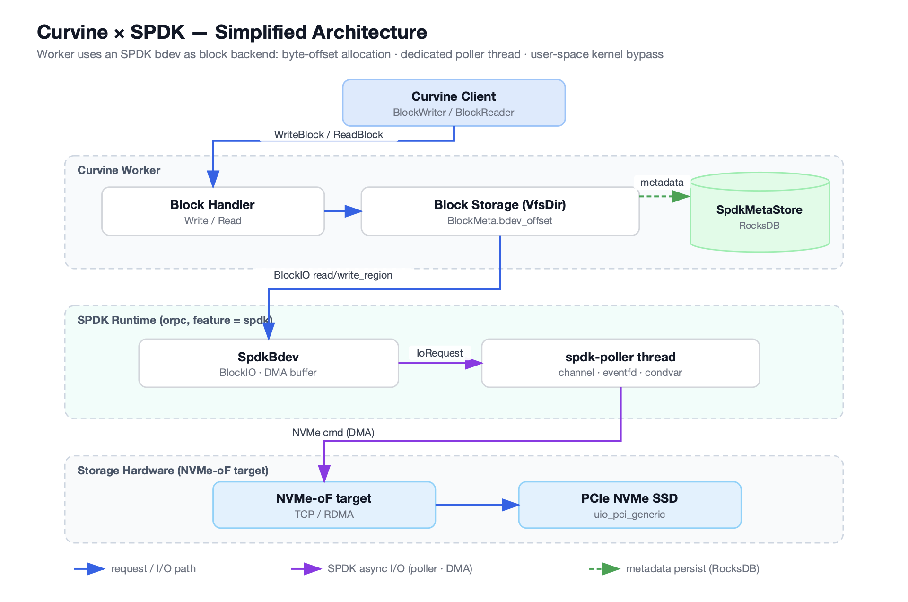

# 性能飞跃：Curvine 如何通过 SPDK 释放 NVMe 盘的极致潜力

## 引言

在数据爆炸式增长的今天，存储性能已成为决定应用响应速度和用户体验的关键因素。传统的存储 I/O 路径往往受限于操作系统内核的开销，难以充分发挥现代高速存储设备（如 NVMe SSD）的潜力。为了突破这一瓶颈，许多高性能存储系统开始探索内核旁路（Kernel-bypass）技术。今天，我们将深入探讨 Curvine 存储平台如何巧妙地集成 SPDK（Storage Performance Development Kit），从而实现 NVMe 存储的极致性能，为用户带来前所未有的低延迟和高吞吐体验。

## 传统 I/O 的困境：内核 VFS 的瓶颈

在没有 SPDK 的传统存储架构中，应用程序的 I/O 请求需要经过操作系统内核的虚拟文件系统（VFS）层。VFS 提供了统一的文件操作接口，但同时也引入了上下文切换、数据拷贝、中断处理等一系列开销。对于 NVMe 这种本身就拥有极低延迟的设备而言，这些内核开销反而成为了性能提升的主要障碍。当 Curvine 的 Worker 进程需要读写数据时，如果依然依赖 `pread`、`pwrite` 等系统调用，就意味着无法完全释放 NVMe 硬件的洪荒之力。

## SPDK 登场：内核旁路与用户态 I/O

SPDK 的核心理念是将存储 I/O 处理从内核转移到用户空间。通过绕过内核 VFS，SPDK 允许应用程序直接与 NVMe 设备通信，从而大幅减少不必要的开销。

Curvine 正是抓住了这一核心优势，将 SPDK 集成到其架构中，实现了以下关键突破：

1. **极致低延迟**：通过内核旁路，I/O 请求不再需要经过复杂的内核路径，而是直接在用户态完成，显著降低端到端延迟。
2. **超高吞吐量**：减少 CPU 开销和上下文切换，使单个 CPU 核能够处理更多 I/O 操作，从而实现更高 IOPS（每秒输入/输出操作数）。官方数据显示，SPDK 在单核上可原生达到超过 1000 万 IOPS [1]。
3. **资源高效利用**：SPDK 利用巨页（Hugepage）进行 DMA 缓冲区管理，减少 TLB 未命中，进一步提升内存访问效率。

## Curvine 与 SPDK 的深度融合：架构解析

Curvine 将 SPDK 作为其远程块设备层。无论是本地物理 NVMe 驱动器、专用的 SPDK 目标容器，还是远程存储节点，都可以通过 NVMe-oF（NVMe over Fabrics）协议与 Curvine Worker 进程通信。

<em>整体架构示意图</em>

这种集成并非简单调用，而是深入到架构的每一个层面。

### SpdkEnv：全局环境的奠基者

`SpdkEnv` 是 Curvine 中 SPDK 模块的“大脑”，负责初始化整个 SPDK 应用程序框架。它是一个单例，确保资源统一管理。

`SpdkEnv` 的主要职责包括：

- **巨页分配**：为 DMA 缓冲区预留大内存页，优化性能。
- **CPU 亲和性设置**：通过 `reactor_mask` 将 SPDK I/O 线程绑定到特定 CPU 核，避免调度开销。
- **NVMe-oF 目标发现**：自动识别并连接可用的 NVMe-oF 存储目标。
- **SpdkPoller 线程创建**：启动专用 I/O 轮询线程，这是 SPDK 高效运行的核心。

### SpdkPoller：I/O 引擎的“永动机”

`SpdkPoller` 是 SPDK 架构中至关重要的组件。由于 SPDK 要求所有 NVMe 命令的提交和完成处理都在同一个线程上进行，`SpdkPoller` 便承担了这一重任。它是一个专用 I/O 线程，负责桥接异步处理线程与同步的 SPDK 轮询循环。

- **智能轮询机制**：`SpdkPoller` 在没有 I/O 请求时会进入空闲（Idle）状态，通过 `eventfd` 机制避免空转消耗 CPU。当有新请求到来时，它会被唤醒进入活跃（Active）状态，高效提交 NVMe 命令并轮询完成队列。这种“停顿前旋转”的策略，最大限度减少系统调用开销，确保 I/O 路径流畅。
- **错误处理**：当队列对（`qpair`）出现错误时，`SpdkPoller` 能够将其标记为“孤儿”，并强制完成其上所有挂起的 I/O，确保系统稳定性。

### SpdkBdev 与 DMA 缓冲区：高效数据传输的基石

`SpdkBdev` 是 Curvine 中对 SPDK 块设备的抽象句柄，类似于传统文件系统中的 `LocalFile`。它管理与 NVMe 命名空间和队列对的连接，并持有关键的 DMA 缓冲区（`DmaBuf`）。

- **巨页支持的 DMA 缓冲区**：`DmaBuf` 是预分配的、固定大小的缓冲区，由巨页支持。这意味着数据可以直接在 NVMe 设备和内存之间传输，无需 CPU 介入，避免数据拷贝和 TLB 未命中，是实现高性能的关键。
- **缓冲区复用**：`SpdkBdev` 在初始化时会分配读写缓冲区，并在所有 I/O 操作中复用这些缓冲区，避免频繁的内存分配和释放开销，实现“首次分配后零成本”的效率。
- **大 I/O 分块处理**：对于大型 I/O 请求，`SpdkBdev` 会将其拆分为 `dma_buf_size`（默认 1MB）大小的块，通过相同的固定缓冲区串行处理，既高效又避免动态内存管理的复杂性。

### BdevOffsetAllocator：用户态的块管理专家

在 SPDK 架构下，Curvine 绕过了内核文件系统，直接面对 NVMe 设备提供的扁平字节地址空间。这意味着传统的内核块分配器不再适用。

`BdevOffsetAllocator` 应运而生，它在用户态实现了块管理功能：

- **唯一字节范围分配**：为每个 Curvine 块分配唯一的字节范围，并在块删除时回收。
- **高效空间管理**：采用移动游标（Bump Cursor）进行新分配，并利用空闲列表（Free-list）跟踪回收范围，通过相邻合并（coalescing）技术有效减少碎片。
- **持久化与线程安全**：分配器的状态（游标位置和空闲列表）通过 `SpdkMetaStore` 持久化到 RocksDB，确保系统重启后数据一致性。同时，分配器本身也是线程安全的。

## 读写路径的优化

Curvine 结合 SPDK 后，其读写路径也得到了显著优化。

<em>读写路径简化示意图</em>

- **读路径**：处理程序直接向 `SpdkPoller` 提交 `IoRequest`，`SpdkPoller` 负责与 NVMe-oF 目标通信，并在 I/O 完成后通知处理程序。数据直接从 DMA 缓冲区复制到应用程序，路径极短。
- **写路径**：SPDK 要求块对齐的 I/O。对于非对齐写入，Curvine 采用读-修改-写（Read-Modify-Write）策略：先读取完整的对齐块，修改其中需要写入的部分，再将整个对齐块写回。对于对齐写入，则直接进行写入操作，最大限度减少不必要的步骤。

## 总结：SPDK 为 Curvine 带来的核心价值

Curvine 对 SPDK 的深度集成，不仅仅是引入了一个技术组件，更是对高性能存储架构的一次全面升级。通过内核旁路、用户态 I/O、专用轮询线程、巨页 DMA 缓冲区以及用户态块管理等一系列优化，SPDK 为 Curvine 带来了：

- **卓越的性能表现**：在 I/O 密集型工作负载下，显著超越传统基于内核 VFS 的存储方案，提供更低延迟和更高吞吐量。
- **更高的资源利用率**：减少 CPU 和内存开销，使硬件资源能够更高效地服务于实际业务逻辑。
- **更强的可扩展性**：模块化设计和用户态控制能力，为 Curvine 未来的功能扩展和性能优化奠定坚实基础。

在追求极致性能的道路上，Curvine 与 SPDK 的结合无疑是一个成功的典范。它不仅展示了软件定义存储的巨大潜力，也为我们描绘了未来高性能存储系统的发展方向。

## 参考文献

[1] SPDK 官方性能数据：[SPDK](https://spdk.io/)
