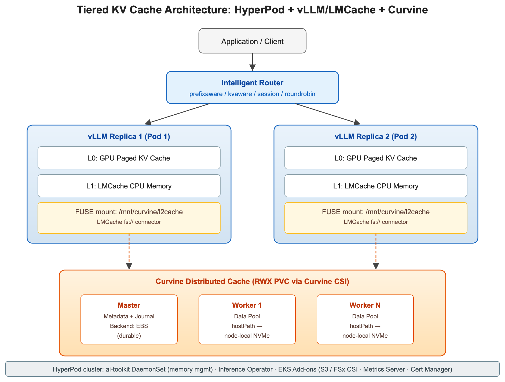
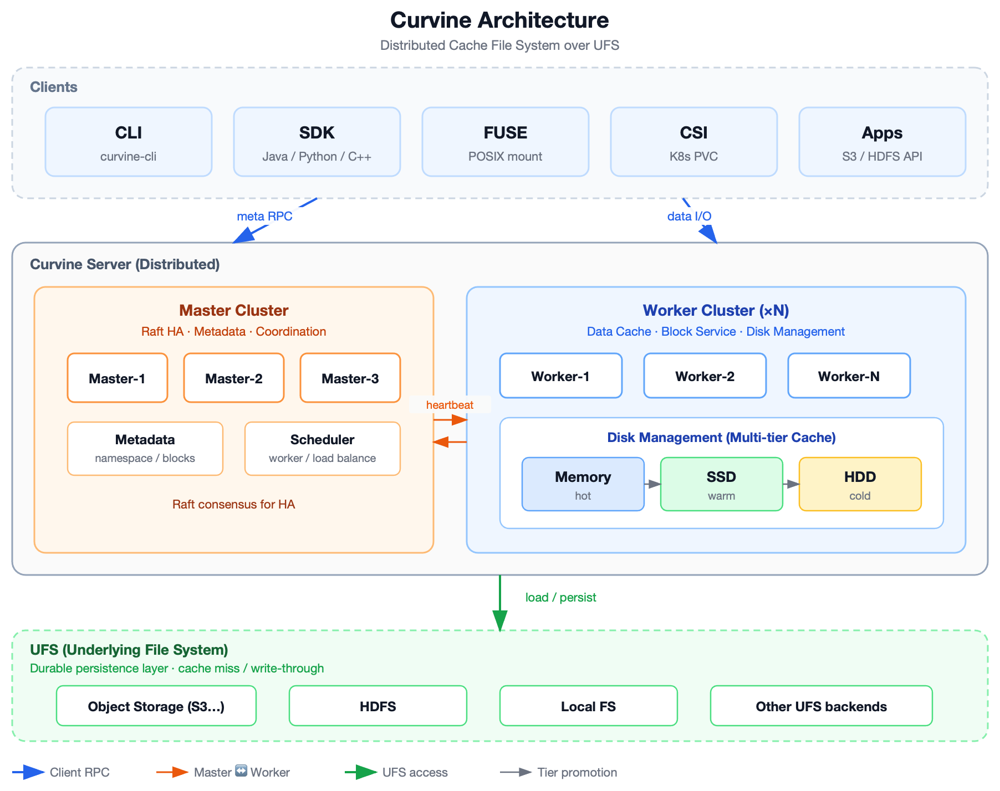
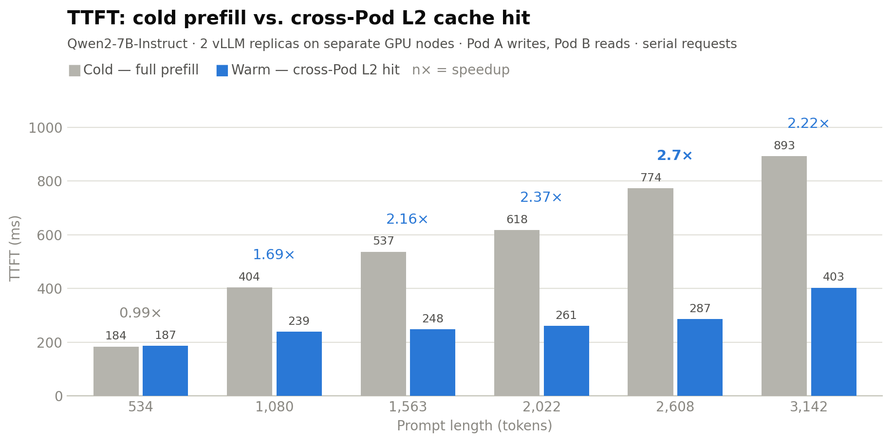
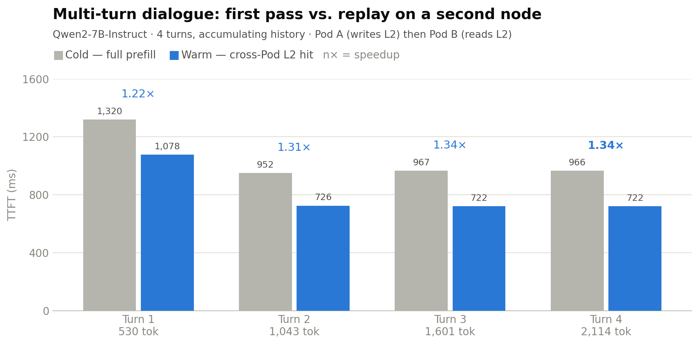
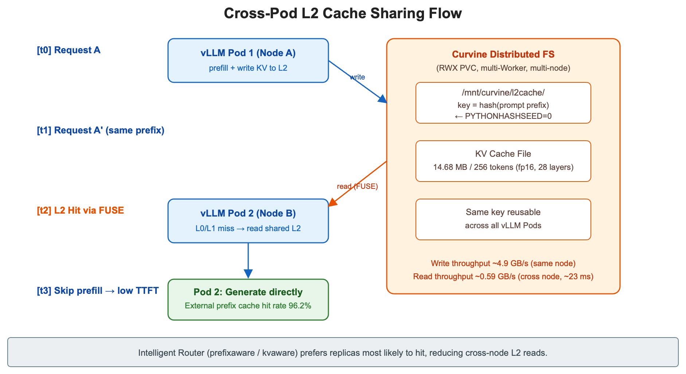

<!-- truncate -->

# 在 Amazon SageMaker HyperPod 上借助 Curvine 为大型 LLM 构建分层 KV 缓存

大规模运行大语言模型（LLM）推理时，通常需要在 KV 缓存之间做出权衡：要么为不断增长的 KV 缓存支付更大规格的 GPU 实例费用，要么接受较慢的首字延迟（TTFT），因为相同的 prompt 会在每次请求时被重新计算。对于跨业务线端点、检索增强生成（RAG）流水线或多轮对话应用部署大量公开基础模型（FM）（如 Qwen、Llama、DeepSeek 等）的团队而言，这种权衡直接转化为更高的基础设施成本和更差的用户体验。

根本原因很直接。在生成阶段，vLLM 会把已经处理过的每个 token 的注意力键值（keys and values）存入 KV 缓存，从而避免在每一步重新计算。前缀缓存（prefix caching）在此基础上扩展，通过在共享相同前导 token（如公共系统 prompt）的请求之间复用该缓存。在 ml.g6e.4xlarge（每块 GPU 48 GB）这类高性价比实例上，一旦扣除模型权重和运行时分配，留给前缀缓存的内存就很有限，并且随着模型变大或并发升高而进一步收紧。长 prompt 的缓存命中率下降，相同的系统 prompt 在每次请求时都被重新 prefill，水平扩展的 vLLM 副本各自维护隔离的缓存。路由到不同副本在功能上等同于一次冷启动。

在这篇文章中，我们在 Amazon SageMaker HyperPod 上构建一套分层 KV 缓存架构，将缓存层级从 GPU 和 CPU 内存延伸到一个共享的分布式 NVMe 池。它基于 HyperPod 的两项能力——托管分层 KV 缓存（Managed Tiered KV Cache）和智能路由（Intelligent Routing），并加入 Curvine（一个轻量级分布式缓存文件系统）作为共享 L2 层（GPU 到 CPU 到共享 NVMe）。借助这套设置，你可以以接近本地磁盘的速度在副本之间复用 KV 缓存。

我们将端到端地讲解实现过程，从启用 HyperPod 分层存储，到在节点本地 NVMe 上部署 Curvine Worker，再到为文件系统支持的 L2 打补丁 Inference Operator。在一次测试部署中，这套架构实现了高达 100% 的跨 Pod 缓存命中率、最高 2.7 倍的 TTFT 提升，以及约 56 毫秒的跨节点 L2 读取延迟（针对约 1,900 token 的 prompt）。完整的方法论与结果见"基准测试"一节。借助这套架构，原本需要 P5 实例的工作负载可以运行在成本更低的 G6e 实例上，从而降低每个端点的成本。实际节省取决于模型规模和流量特征。

## 方案设计

核心思路是把 KV 缓存扩展到单 Pod 所能容纳的范围之外。与其接受每个 vLLM 副本各自孤立——拥有自己的 GPU 块、自己的 CPU 溢出区、互不共享——我们构建一个三层层级结构：L0（GPU HBM）、L1（本地 CPU/主机内存）和 L2（Curvine，一个跨节点共享缓存），并在其上叠加缓存感知的请求路由。

L0 —— GPU 前缀缓存。这是 vLLM 原生的分页注意力层，以最低访问延迟保存最热的 KV 块，但其容量只是模型权重之后剩余的 GPU 内存。在一块 48 GB 的 GPU 上，7B 模型在 bf16 下权重大约占用 14 GB，留给 KV 块的内存超过 30 GB，空间相当充裕，因此 L0 压力很小。32B 模型权重大约 64 GB，一块 48 GB 的 GPU 根本装不下。即便分片后，留给 KV 的内存也少得多，因此缓存很快被填满并在并发下被驱逐。随着模型规模和流量增大，这种不断缩小的余量正是为什么把缓存扩展到 GPU 之外如此重要。

L1 —— CPU 内存卸载。当 GPU 块被驱逐时，LMCache 会在它们丢失之前将其捕获到主机 DRAM 中。这运行在每个推理 Pod 内，并在你于 InferenceEndpointConfig CRD 中设置 `enableL1Cache: true` 时由 SageMaker HyperPod Inference Operator 自动管理。可以把它看作一张安全网。它速度快、Pod 本地，并由 InstanceMemoryAllocationPercentage 决定大小（建议从 20% 起步）。

L2 —— 共享分布式 NVMe 池。这是跨副本复用发生的地方。Curvine，一个轻量级分布式缓存文件系统，把 G6e/P5 实例自带的本地 NVMe 盘汇聚到一个命名空间，FUSE 客户端（一种用户态驱动，将该池呈现为一个普通挂载目录）以 ReadWriteMany PVC（PersistentVolumeClaim）形式挂载到每个推理 Pod。LMCache 通过其 fs:// 连接器读写，因此分布式池看起来就像一个本地目录。由于每个 Pod 都挂载同一个命名空间，一个副本写入的 KV 块可立即被其他副本读取。

Curvine 本身运维很简单：一个主节点（Primary Node，在 Curvine 文档中称为"Master"）处理元数据和日志，持久化在 Amazon Elastic Block Store（Amazon EBS）上以保证持久性；Worker 组件运行在每个 GPU 节点上，数据存储在节点 NVMe 上（通常挂载在 /opt/dlami/nvme/curvine-data）。如果某个 Worker 宕机，它持有的缓存会被重新计算，不存在数据丢失风险，因为这些 KV 块是可复现的。

智能路由 —— 把请求送到正确的副本。只有当请求落到已经持有相关 KV 块的副本上时，三层缓存才能发挥全部收益。HyperPod Inference Operator 内置一个路由器，支持三种策略：

| 策略 | 适用场景 |
| --- | --- |
| prefix-aware（默认） | 多轮对话、共享系统 prompt |
| kv-aware | 长文档处理、长会话 |
| round-robin | 无状态批量推理、压测 |

路由器维护一棵前缀树（prefix-aware）或查询每个 Worker 的缓存状态（kv-aware），以选择最可能产生命中的副本。这一切透明完成，无需客户端改动。

各组件如何协同。Inference Operator 作为 Amazon Elastic Kubernetes Service（Amazon EKS）插件安装，管理整个生命周期。它启动带 LMCache 边车的 vLLM Pod，配置 L1 和 L2 后端，部署路由器，并暴露一个负载均衡端点。你在 InferenceEndpointConfig CRD（`enableL1Cache`、`enableL2Cache`、`l2CacheBackend`、`routingStrategy`）中声明想要的缓存拓扑，Operator 渲染出正确的环境变量、卷挂载和路由规则。目前的一个限制：CRD 的 `l2CacheBackend` 字段原生只接受 `redis` 或 `tieredstorage`。要把 L2 指向 Curvine FUSE 挂载，我们把 vLLM 容器规格中的 `LMCACHE_REMOTE_URL` 环境变量补丁为 `fs://localhost:0/mnt/curvine/l2cache/`。我们在实现的第 4 阶段讲解这个补丁。

最终效果是：请求到达路由器，被分发到前缀匹配最佳的副本，该副本依次检查 GPU 块（L0）、CPU（L1）、共享 NVMe 池（L2）。只有在完全未命中时才从头重新 prefill。对于中高 prompt 重叠度（约 40% 以上共享前导 token，例如公共系统 prompt 或共享 RAG 上下文）的工作负载，跳过这次重新 prefill 能显著降低 TTFT。

图 1 展示了完整数据路径。每个 vLLM Pod 叠加 L0 GPU 前缀缓存和 L1 CPU 卸载。在它们之下，所有 Pod 共享由节点本地 NVMe 汇聚而成、经 FUSE 以 ReadWriteMany 挂载的 Curvine 分布式文件系统上的 L2 层，Curvine 元数据节点则持久化到 Amazon EBS。HyperPod 智能路由器位于前端，将每个请求导向最可能已持有相关缓存的副本。



*图 1：分层 KV 缓存架构*

Curvine 是一个高性能分布式缓存文件系统，位于应用与底层存储（如 Amazon Simple Storage Service（Amazon S3）、HDFS 或 NAS）之间。客户端通过 CLI、SDK、FUSE 或 CSI 访问它。主节点处理元数据，Worker 以本地磁盘缓存提供低延迟 I/O 数据服务。图 2 展示了 Curvine 架构及其关键组件。



*图 2：Curvine 架构*

Curvine 工作原理（集群视角）：

- 客户端向 Master 发送元数据 RPC，向 Worker 发送数据 I/O。
- Master 通过心跳协调 Worker，并放置块以实现负载均衡和高可用。
- Worker 读写本地分层，并按热度提升/降级数据。
- 在未命中或策略驱动的持久化时，Curvine 从 UFS 加载/转储数据，因此持久性保留在底层存储上，而 Curvine 加速访问。

## 前置条件

Amazon SageMaker HyperPod 分层存储是一项集群级能力，为推理工作负载提供节点本地缓存层。分层存储激活后，SageMaker HyperPod 会在每个 GPU 节点上部署 ai-toolkit DaemonSet，预留一部分可配置的主机内存（InstanceMemoryAllocationPercentage）用于 L1 CPU 卸载，并将本地 NVMe 实例存储暴露在 /opt/dlami/nvme 下，以便 Curvine Worker 将其汇聚成共享 L2 命名空间。当 `enableL1Cache` 和 `enableL2Cache` 在 InferenceEndpointConfig CRD 上设置时，Inference Operator 会自动消费这些分层。

本 walkthrough 假设你有一个由 Amazon EKS 编排的 SageMaker HyperPod 集群。要创建一个，请参阅 SageMaker 文档中的"用 Amazon EKS 编排 SageMaker HyperPod 集群"，或使用 AWS CloudFormation，借助 AWSome Distributed AI 仓库上的参考模板。至少准备两个 GPU 节点。单节点无法演示跨节点复用。本文全程使用集群名 hyperpod-cluster-eks 和美国西部（俄勒冈）AWS 区域（us-west-2）作为示例，请用你自己的集群名和区域替换，以便在你的账户中复现本方案。

确认以下条件就位：

- 带 NVMe 的 GPU 容量：一个至少有一个 GPU 实例组的 SageMaker HyperPod EKS 集群。推荐 G6e 或 P5，因为其本地 NVMe 会被 Curvine 汇聚为 L2。
- CLI 工具：在你的工作站上：AWS Command Line Interface（AWS CLI）v2（具备 `sagemaker:UpdateCluster` 和 `eks:CreateAddon` 权限）、用 `aws eks update-kubeconfig` 配置好针对该集群的 kubectl，以及 Helm v3。
- 用于 EBS 挂载的 AWS Identity and Access Management（IAM）：授予 EBS CSI 驱动角色 `sagemaker:AttachClusterNodeVolume`、`sagemaker:DetachClusterNodeVolume` 和 `eks:Describe*`，以便 Curvine 元数据节点能挂载其 EBS 卷。保持 Amazon Virtual Private Cloud（Amazon VPC）CNI 和 EBS CSI 插件为最新版本。
- 模型权重：本文从 HuggingFace 拉取 Qwen2-7B，因此无需存储桶。若要自行暂存权重，请使用一个 Amazon S3 存储桶，并授予 SageMaker HyperPod 执行角色读取权限。TLS 证书会自动生成。

分层存储在第 1 阶段启用。Inference Operator、Amazon S3 和 Amazon FSx CSI 驱动、Metrics Server 和 Cert Manager 在第 2 阶段（或通过控制台 Quick Install）安装，EBS CSI 驱动和 Curvine 在第 3 阶段。

## 分步实现

以下流程以本实现为示例，组织为五个阶段。所示集群名和区域为占位符，请替换为你自己的。

### 第 1 阶段：启用 HyperPod 分层存储

分层存储是一个集群级开关。一旦激活，HyperPod 会自动在每个节点上部署 ai-toolkit DaemonSet。

```
# 通过 update-cluster 在现有集群上启用（推荐）
aws sagemaker update-cluster \
  --cluster-name hyperpod-cluster-eks \
  --tiered-storage-config Mode=Enable,InstanceMemoryAllocationPercentage=20 \
  --node-recovery Automatic
```

API 注意。仅带 `--tiered-storage-config` 调用 `update-cluster` 会返回 `ValidationException`。必须同时提供 `--node-recovery` 或 `--instance-groups` 之一。做法是先通过 `describe-cluster` 读取当前 `NodeRecovery` 值并原样回传。这对集群配置没有副作用。

`InstanceMemoryAllocationPercentage` 接受 20–100。从 20 起步，根据观察到的吞吐和命中率按需调高。用以下命令验证：

```
aws sagemaker describe-cluster --cluster-name hyperpod-cluster-eks \
  --query 'TieredStorageConfig'
# 预期: {"Mode": "Enable", "InstanceMemoryAllocationPercentage": 20}

kubectl get ds -n aws-hyperpod ai-toolkit
# 预期:
# NAME        DESIRED  CURRENT  READY  UP-TO-DATE  AVAILABLE  NODE SELECTOR  AGE
# ai-toolkit  2        2        2      2           2          <none>         45s
```

### 第 2 阶段：安装 Inference Operator 及依赖

最便捷的方式是在 SageMaker 控制台使用 Quick Install，它会一次性配置 IAM 角色并安装 S3 CSI、FSx CSI、Metrics Server、Cert Manager 和 Inference Operator。CLI 替代方案：

```
EKS_CLUSTER_NAME=$(aws sagemaker describe-cluster --cluster-name hyperpod-cluster-eks \
  --query 'Orchestrator.Eks.ClusterArn' --output text | cut -d'/' -f2)

for addon in aws-mountpoint-s3-csi-driver aws-fsx-csi-driver metrics-server cert-manager; do
  aws eks create-addon --cluster-name $EKS_CLUSTER_NAME --addon-name $addon --region us-west-2
done

aws eks create-addon \
  --cluster-name $EKS_CLUSTER_NAME \
  --addon-name amazon-sagemaker-hyperpod-inference \
  --configuration-values file://addon-config.json \
  --region us-west-2
```

### 第 3 阶段：部署 Curvine 分布式缓存

部署 Curvine 之前必须满足若干前置条件。将 VPC CNI 插件和 EBS CSI 驱动升级到当前版本，推荐使用 IRSA 而非 Pod Identity，以避免节点上额外的 IP 消耗。授予 `aws-ebs-csi-dri-role` 前置条件中列出的 EBS 挂载权限（缺少这些权限，SageMaker HyperPod 节点上的 EBS 挂载会返回 `ValidationException`）。最后，确认集群中有一个可用的 EBS StorageClass（例如 `ebs-sc`）。用 `kubectl get sc` 查看实际名称。在 SageMaker HyperPod EKS 集群上，默认 EBS StorageClass 通常是 `gp3`。在后续 Helm 安装中用该名称作为 `master.storage.meta.storageClass` 和 `master.storage.journal.storageClass`，或先创建一个 `ebs-sc` StorageClass：

```
apiVersion: storage.k8s.io/v1
kind: StorageClass
metadata:
  name: ebs-sc
provisioner: ebs.csi.aws.com
volumeBindingMode: WaitForFirstConsumer
reclaimPolicy: Delete
```

#### 安装 Curvine CSI

```
helm repo add curvine https://curvineio.github.io/helm-charts
helm repo update

helm install curvine-csi curvine/curvine-csi \
  -n curvine --create-namespace \
  --version 0.3.2-alpha \
  --set controller.sidecars.provisioner.image=registry.k8s.io/sig-storage/csi-provisioner:v3.6.0 \
  --set node.sidecars.nodeDriverRegistrar.image=registry.k8s.io/sig-storage/csi-node-driver-registrar:v2.10.0 \
  --set controller.container.securityContext.privileged=true \
  --set node.container.securityContext.privileged=true

kubectl get csidrivers | grep curvine  # 确认驱动已注册
```

CSI 安装不会自动创建 StorageClass，需要手动创建：

```
kubectl apply -f - <<'EOF'
apiVersion: storage.k8s.io/v1
kind: StorageClass
metadata:
  name: curvine-sc
provisioner: curvine
reclaimPolicy: Delete
volumeBindingMode: Immediate
allowVolumeExpansion: true
parameters:
  master-addrs: "curvine-master-0.curvine-master.curvine.svc.cluster.local:8995"
  fs-path: "/l2cache"
  path-type: "DirectoryOrCreate"
EOF

kubectl get sc curvine-sc  # 确认 curvine-sc 已创建
```

Curvine CSI 0.3.x 及以后版本要求三个 StorageClass 参数：`master-addrs`（Curvine master RPC 端点，必须与 Helm 安装创建的 service DNS 匹配，若 master 组件有多个副本则用逗号分隔多个地址）、`fs-path`（Curvine 文件系统内的挂载路径前缀）和 `path-type`（`DirectoryOrCreate` 让 CSI 自动创建目录）。缺少它们，PVC 供应会失败并报 `Parameter 'master-addrs' is required`。

#### 安装 Curvine 服务端（主节点 + Worker 组件）

对于 KV 缓存工作负载，节点本地 NVMe 加 hostPath 是推荐的 Worker 数据后端：G6e/P5 实例自带 NVMe（约 3 GB/s），性能远超 EBS gp3，无额外成本，且对于可恢复的缓存数据丢失是可接受的。

```
# 第 1 步：首次安装（引导）。格式化标志会初始化元数据/日志/数据目录。
# 0.3.x 上必须，否则 master pod 会以 "RocksDB directories not found" 失败。
helm install curvine curvine/curvine -n curvine --create-namespace \
  --version 0.3.2-alpha \
  --set image.pullPolicy=Always \
  --set cluster.formatMaster=true \
  --set cluster.formatWorker=true \
  --set cluster.formatJournal=true \
  --set master.replicas=1 \
  --set worker.replicas=2 \
  --set "master.nodeSelector.sagemaker\.amazonaws\.com/compute-type=hyperpod" \
  --set "worker.nodeSelector.sagemaker\.amazonaws\.com/compute-type=hyperpod" \
  --set master.storage.meta.storageClass=ebs-sc \
  --set master.storage.journal.storageClass=ebs-sc \
  --set "worker.storage.dataDirs[0].name=data1" \
  --set "worker.storage.dataDirs[0].type=SSD" \
  --set "worker.storage.dataDirs[0].enabled=true" \
  --set "worker.storage.dataDirs[0].size=100Gi" \
  --set "worker.storage.dataDirs[0].storageClass=" \
  --set "worker.storage.dataDirs[0].hostPath=/opt/dlami/nvme/curvine-data" \
  --set "worker.storage.dataDirs[0].mountPath=/data/data1"

# 第 2 步：所有 pod Running 后，立即禁用格式化标志，
# 以免未来 pod 重启时重新格式化并清空已有缓存/元数据：
helm upgrade curvine curvine/curvine -n curvine \
  --version 0.3.2-alpha --reuse-values \
  --set cluster.formatMaster=false \
  --set cluster.formatWorker=false \
  --set cluster.formatJournal=false

kubectl get pods -n curvine  # 确认 pod 保持 Running / 干净恢复
```

约束。Master 元数据和日志必须使用持久化的 EBS 存储。节点重建时丢失元数据或 WAL 是不可接受的。当 Worker `dataDirs[0].storageClass` 为空且设置了 `hostPath` 时，Helm chart 启用 hostPath 模式。两者互斥，必须且只能选其一。

#### 为推理 Pod 创建 ReadWriteMany（RWX）PVC

```
kubectl apply -f - <<'EOF'
apiVersion: v1
kind: PersistentVolumeClaim
metadata:
  name: curvine-pvc
  namespace: default
spec:
  accessModes:
    - ReadWriteMany
  storageClassName: curvine-sc
  resources:
    requests:
      storage: 100Gi
EOF

kubectl get pvc curvine-pvc  # 等待 Bound 后再继续
```

### 第 4 阶段：部署带分层 KV 缓存的 vLLM 端点

分层存储启用、Operator 安装、Curvine 运行之后，最后阶段部署推理端点并将其 L2 缓存指向 Curvine。这包含三步：用 InferenceEndpointConfig CRD 声明端点、给渲染出的 Deployment 打补丁以挂载 Curvine PVC，以及覆盖 Operator 注入的缓存 URL，使 L2 读写指向 Curvine。

#### 用 Inference Operator 部署

应用下面的 InferenceEndpointConfig CRD（deploy-qwen-kvcache.yaml）。SageMaker HyperPod Inference Operator 将其协调为一个 Deployment、vLLM Pod（每个带 LMCache 边车）、智能路由器和一个负载均衡端点。与标准部署有三点不同：

- 模型来源是 huggingface：Operator 内置的 init 容器在 Pod 启动时把权重下载到 `/opt/ml/model`，因此无需 S3 暂存。（若你倾向自行暂存权重，可设 `modelSourceType: s3` 并配 s3Storage 块。）
- LMCACHE_REMOTE_URL 故意未列入 CRD。当 enableL2Cache: true 时，Operator 注入自己的值。在此处也声明会产生重复 env 条目，之后需要按索引查找并删除。把它留空，用下一节的补丁覆盖注入值。
- tlsConfig 被省略：它不是必填字段，Operator 会自动把端点证书生成到其默认输出桶。

```
# deploy-qwen-kvcache.yaml
apiVersion: inference.sagemaker.aws.amazon.com/v1
kind: InferenceEndpointConfig
metadata:
  name: qwen2-7b-instruct-kvcache
  namespace: default
spec:
  modelName: qwen2-7b-instruct
  instanceType: ml.g6e.4xlarge
  invocationEndpoint: v1/chat/completions
  replicas: 2
  modelSourceConfig:
    modelSourceType: huggingface   # Operator 下载权重到 /opt/ml/model
    prefetchEnabled: true
    huggingFaceModel:
      modelId: Qwen/Qwen2-7B-Instruct   # 公开模型；受控模型请加 tokenSecretRef
  kvCacheSpec:
    enableL1Cache: true
    enableL2Cache: true
    l2CacheSpec:
      l2CacheBackend: "tieredstorage"   # 占位以通过 CRD 校验；由第 4 阶段补丁覆盖
  intelligentRoutingSpec:
    enabled: true
    routingStrategy: prefixaware
  # tlsConfig 故意省略：Operator 自动把端点证书生成到其默认输出桶。
  metrics:
    enabled: true
    modelMetrics:
      port: 8000
  loadBalancer:
    healthCheckPath: /health
  worker:
    image: public.ecr.aws/deep-learning-containers/vllm:0.11.1-gpu-py312-cu129-ubuntu22.04-ec2-v1.0
    args:
      - "--model"
      - "/opt/ml/model"
      - "--max-model-len"
      - "16384"
      - "--tensor-parallel-size"
      - "1"
    resources:
      limits:
        nvidia.com/gpu: "1"
      requests:
        cpu: "8"
        memory: 32Gi
        nvidia.com/gpu: "1"
    modelInvocationPort:
      containerPort: 8000
      name: http
    modelVolumeMount:
      name: model-weights
      mountPath: /opt/ml/model
    environmentVariables:
      # 不要在此加 LMCACHE_REMOTE_URL：enableL2Cache 为 true 时
      # Operator 注入自己的值；在此声明会产生重复 env 条目。
      # 它由第 4 阶段补丁在 Deployment 渲染后替换为 Curvine fs:// URL。
      - name: LMCACHE_REMOTE_SERDE
        value: "naive"   # cachegen serde 在 fs 连接器下有 zip bug
      - name: PYTHONHASHSEED
        value: "0"   # 必需：跨 Pod 一致的缓存键
```

其中两个环境变量值得说明，因为它们看起来都很随意，但都不是：

- LMCACHE_REMOTE_SERDE=naive —— `cachegen` 序列化器在 LMCache 的文件系统连接器下有一个 zip 序列化 bug。`naive` 序列化器是稳定选择。
- PYTHONHASHSEED=0 —— LMCache 从 Python 哈希派生缓存键。不固定种子，每个 Pod 对同一 prompt 算出不同键，跨 Pod 共享会静默地不命中。

应用并等待两个 Pod 变为 Ready（每个 Pod 运行三个容器：vLLM、reverse-proxy、otel-collector）：

```
kubectl apply -f deploy-qwen-kvcache.yaml
kubectl get pods -l app=qwen2-7b-instruct-kvcache -w   # 等待：2 个 Pod，3/3 Running
```

#### 给 Deployment 打补丁以挂载 Curvine PVC

Operator 渲染出的 Deployment 需要两处 CRD 无法表达的调整：把 Curvine PVC 挂载进 vLLM 容器，以及把 L2 重新指向 FUSE 挂载。当 `enableL2Cache: true` 时，Operator 注入 `LMCACHE_REMOTE_URL=sagemaker-hyperpod://$(NODE_IP):9200`（其节点本地后端），而由于 `l2CacheBackend` 只接受 `redis` 或 `tieredstorage`，没有 CRD 字段能把 L2 指向 Curvine 路径。因此我们直接给渲染出的 Deployment 打补丁。

有一个复杂点：Operator 运行协调循环，对运行中 Deployment 应用的补丁会在下次重新渲染时被覆盖。因此可靠顺序是：暂停 Operator、把 Deployment 缩到零、用单条命令应用所有补丁、扩回，并仅在 Pod Ready 后才恢复 Operator。缩到零还规避了一个滚动更新死锁：当副本数等于可用 GPU 数（两个副本、两个单 GPU 节点）时，默认 `maxSurge` 试图在释放旧 Pod 前启动新 Pod，新 Pod 会因永远等不到 GPU 而卡在 Pending。

先暂停 Operator 并排空 Deployment：

```
DEPLOY_NAME="qwen2-7b-instruct-kvcache"

# 1. 暂停 Operator，使其协调循环无法覆盖补丁
kubectl scale deployment hyperpod-inference-controller-manager \
  -n hyperpod-inference-system --replicas=0

# 2. 把模型 Deployment 缩到 0（释放 GPU；规避 maxSurge 死锁）
kubectl scale deployment $DEPLOY_NAME --replicas=0
```

接着，找到 Operator 把 LMCACHE_REMOTE_URL 放在容器 env 数组的哪个位置。不要硬编码索引，它在不同 Operator 版本间会变：

```
# 3. 列出 env 变量及其索引；记下 LMCACHE_REMOTE_URL 的索引
kubectl get deployment $DEPLOY_NAME \
  -o jsonpath='{.spec.template.spec.containers[0].env}' | \
  python3 -c "import json,sys; [print(f'{i}: {e[\"name\"]}') for i,e in enumerate(json.load(sys.stdin))]"
```

现在用单条命令应用全部三个补丁——URL 替换、Curvine 卷及其挂载。把 `N` 替换为上一步找到的索引：

```
# 4. 一次性应用所有补丁
kubectl patch deployment $DEPLOY_NAME --type='json' -p='[
  {"op": "replace", "path": "/spec/template/spec/containers/0/env/N/value",
   "value": "fs://localhost:0/mnt/curvine/l2cache/"},
  {"op": "add", "path": "/spec/template/spec/volumes/-", "value":
   {"name": "curvine-cache", "persistentVolumeClaim": {"claimName": "curvine-pvc"}}},
  {"op": "add", "path": "/spec/template/spec/containers/0/volumeMounts/-", "value":
   {"name": "curvine-cache", "mountPath": "/mnt/curvine/l2cache"}}
]'
```

关于 URL 格式：`localhost:0` 是占位符。LMCache 的 `parse_remote_url` 即便对文件系统连接器也要求非空 host 和 port。`fs://` 连接器忽略它们，只用路径部分（`/mnt/curvine/l2cache/`），即 Curvine PVC 的挂载点。

在扩回之前验证补丁已落地。你想要恰好一个 LMCACHE_REMOTE_URL、值为 fs://，外加卷和挂载：

```
# 5. 验证：卷存在，恰好一个值为 fs:// 的 LMCACHE_REMOTE_URL
kubectl get deployment $DEPLOY_NAME \
  -o jsonpath='{.spec.template.spec.volumes[?(@.name=="curvine-cache")]}{"\n"}'

kubectl get deployment $DEPLOY_NAME \
  -o jsonpath='{.spec.template.spec.containers[0].env}' | \
  python3 -m json.tool | grep -A1 LMCACHE_REMOTE_URL
```

最后把 Pod 扩回，并仅在它们 Ready 后才恢复 Operator。更早恢复会触发立即协调，重新渲染 Deployment 并丢弃补丁：

```
# 6. 扩回并等待 2 个 Pod 3/3 Running
kubectl scale deployment $DEPLOY_NAME --replicas=2
kubectl get pods -l app=$DEPLOY_NAME -w

# 7. 仅在 Pod Ready 后恢复 Operator
kubectl scale deployment hyperpod-inference-controller-manager \
  -n hyperpod-inference-system --replicas=1
```

只要 Operator 没有理由重新渲染 Deployment，补丁就持续有效。编辑 CRD、升级 Operator 或删除 Deployment 都会触发重新渲染并丢弃补丁，之后需重跑本节。对于长期生产使用，请用 MutatingWebhook 或 Kyverno ClusterPolicy 替代手动补丁，在每次渲染时自动注入 Curvine 卷、挂载和 URL，使 Operator 可自由协调。

### 第 5 阶段：验证 L2 写入、命中与跨 Pod 共享

短 prompt 不会触发 L2 写入：LMCache 仅在 prompt 跨过 256-token 块大小时才存储一个块。下面的测试使用一份真实长文档（Project Gutenberg 的《爱丽丝梦游仙境》），并把字节完全相同的请求发到两个不同节点上的两个不同 Pod：第一个 Pod 计算 prefill 并写入 Curvine，第二个 Pod 通过共享 FUSE 挂载读回同一条目。我们调用每个 Pod 自己的 `localhost:8000` 以绕过路由器，从而控制哪个副本写、哪个副本读。

识别两个 Pod 并确认共享 FUSE 挂载：

```
DEPLOY_NAME="qwen2-7b-instruct-kvcache"

PODS=($(kubectl get pods -l app=$DEPLOY_NAME --field-selector=status.phase=Running \
  -o jsonpath='{.items[*].metadata.name}'))

POD1=${PODS[0]}; POD2=${PODS[1]}

kubectl exec $POD1 -c $DEPLOY_NAME -- df -h /mnt/curvine/l2cache   # 期望是一个 curvine 文件系统
```

用该书前 8 KB 构造一个确定性 payload（约 1,900 token），并对两个请求复用同一文件以保证缓存键一致：

```
curl -s -L https://www.gutenberg.org/files/11/11-0.txt -o /tmp/alice.txt

python3 - <<'PY' > /tmp/payload.json
import json
text = " ".join(open("/tmp/alice.txt", encoding="utf-8").read().split())[:8000]
print(json.dumps({"model":"/opt/ml/model",
    "messages":[{"role":"system","content":"Reference text:\n"+text},
                {"role":"user","content":"In one sentence, what is this text about?"}],
    "max_tokens":50, "temperature":0}))
PY
```

先发给 POD1（冷启动、写入 L2），再发给 POD2（跨节点读取同一条目），并检查各自的 LMCache 日志：

```
cat /tmp/payload.json | kubectl exec -i $POD1 -c $DEPLOY_NAME -- \
  curl -s http://localhost:8000/v1/chat/completions -H "Content-Type: application/json" -d @-

cat /tmp/payload.json | kubectl exec -i $POD2 -c $DEPLOY_NAME -- \
  curl -s http://localhost:8000/v1/chat/completions -H "Content-Type: application/json" -d @-

kubectl logs $POD1 -c $DEPLOY_NAME | grep -E "Stored|hit tokens"
kubectl logs $POD2 -c $DEPLOY_NAME | grep -E "Retrieved|hit tokens"
```

观测结果（两个副本位于两个独立 G6e 节点）：

```
# POD1（节点 A）—— 冷启动：0 命中，计算 prefill，把全部 1,925 token 写入 Curvine
LMCache INFO: Reqid: ..., Total tokens 1925, LMCache hit tokens: 0, need to load: 0
LMCache INFO: Stored 1925 out of total 1925 tokens. size: 0.1028 GB, cost 10.71 ms, throughput: 9.60 GB/s

# POD2（节点 B）—— 通过 Curvine 读取同一条目：100% 跨 Pod 命中，无 prefill
LMCache INFO: Reqid: ..., Total tokens 1925, LMCache hit tokens: 1925, need to load: 1924
LMCache INFO: Retrieved 1925 out of 1925 required tokens. cost 55.75 ms, throughput: 1.84 GB/s
```

POD2 上 1,925/1,925 的命中意味着对一个 POD2 从未 prefill 过的请求实现了 100% 跨 Pod 缓存命中。这就是共享 L2 生效的证明。确认两个 Pod 看到相同的缓存文件（共享 ReadWriteMany 挂载）：

```
kubectl exec $POD1 -c $DEPLOY_NAME -- ls /mnt/curvine/l2cache/
kubectl exec $POD2 -c $DEPLOY_NAME -- ls /mnt/curvine/l2cache/
# 相同的 vllm@...bfloat16.data 文件
```

本次部署实测：跨 Pod 命中率 100%（1,925 / 1,925 token），同节点 L2 写入约 9.6 GB/s，跨节点 L2 读取约 1.8 GB/s，跨节点加载延迟约 56 ms（1,925 token）。若无共享 L2，POD2 的请求将是一次完整冷 prefill。

## 基准测试

为量化共享 L2 层的收益，我们针对上述架构跑了两个互补基准。两者均使用 Qwen2-7B-Instruct（fp16，张量并行 1），由两个位于独立 GPU 节点上的 vLLM 副本提供服务，Curvine Worker 与之同节点（要求反亲和性），LMCache 默认 256-token 块大小。两个测试都绕过路由器直接寻址每个 Pod，以便控制哪个副本写缓存、哪个读缓存。请求一发到 Pod A：冷启动做完整 prefill，然后异步写入 Curvine。字节相同的请求随后发到另一节点上的 Pod B，它没有本地缓存，必须从共享 L2 挂载加载全部内容。生成上限为 5 个 token、temperature=0，因此测得的延迟由 prefill 主导，而 prefill 正是 L2 缓存加速的部分。第一个基准在 500–3,000 token 之间扫描单次 prompt，找出 L2 复用划算的区间（两台 ml.g5.4xlarge 节点，A10G 24 GB）。第二个基准重放一段累积历史的四轮对话，530–2,114 prompt token，以建模多轮对话（一台 ml.g6e.4xlarge 和一台 ml.g6.16xlarge 节点）。

跨 Pod L2 复用带来了最高 2.7 倍的 TTFT 提升，并存在一个最优区间。对于 1,000 token 及以上的 prompt，Pod B 命中了 Pod A 写入的全部 token 并完全跳过 prefill：加速比从 1,000 token 的 1.7× 增长到 2,500 token 的 2.7×，此时一个 774 ms 的冷请求在 287 ms 内完成。低于约 1,000 token 时，L2 往返成本与直接重算 prefill 相当（500 token 时 0.99×），对于短 prompt，GPU 和 CPU 层（L0/L1）才是应命中的位置，这正是 prefix-aware 路由所鼓励的。超过 3,000 token 后相对加速比回落（2.2×），因为跨节点读取时间增长，但绝对节省仍在上升——3,000 token 时每请求节省 490 ms，是本次扫描中最大的。图 3 对每个 prompt 长度绘制了冷 prefill TTFT 与跨 Pod L2 命中 TTFT。冷柱随 prompt 大小增长，而 L2 命中柱几乎持平，二者之间不断拉大的差距就是跨 Pod 复用所节省的时间。



*图 3：跨 Pod L2 复用带来的 TTFT 加速与 prompt 长度对比（单次，Pod A 写 / Pod B 读，ml.g5.4xlarge）*

多轮基准在对话形态下呈现相同效果。四轮累积对话历史发给 Pod A（写入 2,048 token KV 缓存、109 MB 到 Curvine，聚合 7.8 GB/s，本地 NVMe 路径每轮绕行 3–4 ms），随后对 Pod B 重放。每轮在 L2 100% 命中，把总对话延迟从 4.21 s 降到 3.25 s（1.30×），每轮加速比随历史累积而增长，从 530 token 的 1.22× 到 2,114 token 的 1.34×。这里加速比较小，因为这些 GPU（L40S/L4）prefill 更快——当 prefill 本身便宜时，缓存命中节省得也少。在更小的加速卡上，预期会落在区间的高端。图 4 展示了四轮对话的相同对比，首轮对次节点重放，每对上方标注每轮加速比。



*图 4：多轮对话，首轮对次节点重放对比（Pod A 写 / Pod B 读，ml.g6e.4xlarge / ml.g6.16xlarge）*

从数字中得出两条实用结论。第一，写入成本很低：它们以接近磁盘速度落在节点本地 NVMe Worker 上。读取才是需要管理的成本——它们跨越 Pod 网络，这正是 prefix-aware 路由重要的原因：路由器每把一个请求落到已持有缓存的副本上，就把一次约 60–200 ms 的 L2 读取变成亚毫秒级的 L0 命中。第二，经济效益随上下文长度提升，直到网络的舒适区（此处约 2,500 token），而以低于约 1,000 token prompt 为主的工作负载应依赖 L0/L1 而非 L2。

与任何基准一样，这些数字与环境相关：加速比取决于 GPU 代际（更快 prefill 会缩小差距）、跨节点网络带宽，以及工作负载的 prompt 重叠比。两个测试都测量串行单请求以隔离缓存路径。并发负载行为还会额外受益于路由器的命中率优化，且与工作负载相关。

## 方案收益

上线后，在多个维度观察到可量化的收益。

### 在小实例上为大型模型启用 KV 缓存：NVMe 作为安全网

ml.g6e.4xlarge（每块 GPU 48 GB）这类高性价比实例足以承载 Qwen2-7B、Llama-3-8B 等长尾模型，同时在长 prompt（数千 token）上保持高 KV 缓存命中率。KV 缓存不再受限于 GPU 内存：最热数据驻留 GPU，温数据驻留主机 CPU 内存，冷数据卸载到汇聚的节点本地 NVMe，L2 容量随节点数线性扩展到数百 GB（每 Worker 100 Gi NVMe × N 节点）。因此，此前需要 ml.g6e.12xlarge 或 ml.p5.24xlarge 的多租户长 prompt 工作负载可以下沉到更小实例，降低每端点成本。实际节省取决于模型和流量特征。

### 统一 FUSE 挂载实现跨 Pod L2 缓存共享

这是本方案相对于普通 LMCache + 节点本地磁盘方案的主要差异点。当请求路由到一个未计算 prefill 的 Pod 时，L0 和 L1 都未命中，但该 Pod 会读取另一个副本写入共享 L2 挂载的 KV 缓存并完全跳过 prefill，从而 TTFT 大幅下降。

图 5 追踪了这条路径：Pod 1 计算 prefill 并把 KV 缓存写入共享 Curvine 挂载。一个后续带相同前缀的请求路由到 Pod 2，它 L0 和 L1 未命中，经 FUSE 从 Curvine 读取缓存并跳过 prefill。



*图 5：跨 Pod L2 缓存共享流程*

对比意义很直接：没有共享 L2 时，Pod1 和 Pod2 的缓存互不可见，路由到 Pod2 等同于未命中并触发完整 prefill。有了共享 L2，Pod1 写入的缓存可被 Pod2 直接复用，聚合命中率随副本数增长而提升。结合 Inference Operator 内置的 prefixaware / kvaware 路由，相同前缀的请求被优先分发到命中概率最高的副本，进一步降低跨节点 L2 读取频率。

延迟随层级深度增长：GPU（L0）命中亚毫秒级，CPU（L1）低毫秒级，跨 Pod L2 数十毫秒级，但每一层都远比重跑完整 prefill 便宜。实测数字见"基准测试"一节。

### 运维与成本

SageMaker HyperPod 的全托管特性会自动在每个节点部署 ai-toolkit DaemonSet，新节点自上线，内存管理细节无需运维关注。借助 Curvine，你从使用 hostPath + NVMe 实例存储的 Worker 获得弹性扩缩，零额外存储成本（NVMe 已随实例包含），而 Master 组件仅使用一个小的 EBS 卷（10–50 Gi）存放元数据。Inference Operator 接管 vLLM Pod 生命周期、智能路由、Cert Manager 和指标，因此业务团队只需维护一个 CRD。

## 清理

为避免持续计费，按实现的相反顺序拆除测试环境：

- 删除推理端点以停止 GPU 消耗：`kubectl delete inferenceendpointconfig ${ENDPOINT_NAME} -n ${NAMESPACE}`。Inference Operator 会自动移除渲染出的 Deployment、Service、路由器配置和 ALB 目标组。
- 卸载 Curvine 及其 CSI：`helm uninstall curvine -n curvine && helm uninstall curvine-csi -n curvine`，然后 `kubectl delete pvc -n curvine --all` 和 `kubectl delete ns curvine`。确认 Curvine Master 组件的底层 EBS 卷已释放（`ebs-sc` 的回收策略决定卷是被删除还是保留）。用作 L2 存储的节点本地 NVMe 是临时的，会自动释放。
- 若集群不再用于分层 KV 缓存测试，移除 Inference Operator 插件（`aws eks delete-addon --addon-name amazon-sagemaker-hyperpod-inference`）并在 HyperPod 集群上禁用分层存储：`aws sagemaker update-cluster --cluster-name hyperpod-cluster-eks --tiered-storage-config Mode=Disable --node-recovery Automatic`。此处同样需要 `--node-recovery` 标志，与第 1 阶段相同。
- 最后，删除测试期间创建的任何 S3 对象（模型权重、导出的 TLS 证书）和 Amazon CloudWatch 日志组（若未来运行不再需要）。把 GPU 实例组缩到零，或若集群仅为本次评估而创建则直接删除 HyperPod 集群，可停止最大的成本来源。

## 结论

在高效实例上部署大语言模型不必牺牲延迟。本文所述的分层 KV 缓存架构——结合 vLLM 的 GPU 前缀缓存、LMCache 的 CPU 卸载层和 Curvine 的分布式 NVMe 池，全部由 HyperPod Inference Operator 编排——表明你可以在 ml.g6e.4xlarge 实例上运行一组模型副本，同时保持 100% 的跨 Pod 缓存命中率和数十毫秒级的跨节点检索延迟。

这套架构适合高 prompt 重叠度的工作负载：复用检索上下文的 RAG 流水线、会话历史累积的多轮对话，以及共享系统 prompt 模板的多租户部署。如果你的流量符合这些特征，且希望在更小实例上获得更低 TTFT，值得评估。同一 L2 层还支撑 HyperPod Inference Operator 中的 prefill/decode 分离（PD）服务，它在 prefill 和 decode 池之间通过同一 LMCache 栈路由 KV 交换，因此 Curvine 可通过标准的 LMCACHE_REMOTE_URL 覆盖扩展到大型多节点模型，受"基准测试"中所示跨节点延迟约束。

开始上手：

- 在服务详情页了解更多 Amazon SageMaker HyperPod 信息。
- 使用 HyperPod 模型部署文档在你的 HyperPod 集群上激活托管分层 KV 缓存。
- 参阅"托管分层 KV 缓存与智能路由"博客文章，了解详细基准测试结果和路由策略指导。
- 使用 Curvine Helm chart 部署 Curvine 分布式文件系统。
- 探索 vLLM 和 LMCache，了解缓存连接器配置和驱逐策略细节。
- 关于集群搭建和 Inference Operator 安装，请参阅 HyperPod 设置指南。

---

*本文转载自 [AWS 机器学习博客](https://aws.amazon.com/cn/blogs/machine-learning/tiered-kv-cache-for-large-llms-on-amazon-sagemaker-hyperpod-with-curvine/)，原文内容保持不变。*

