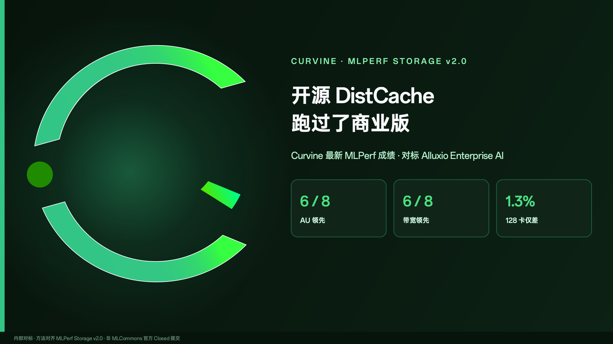
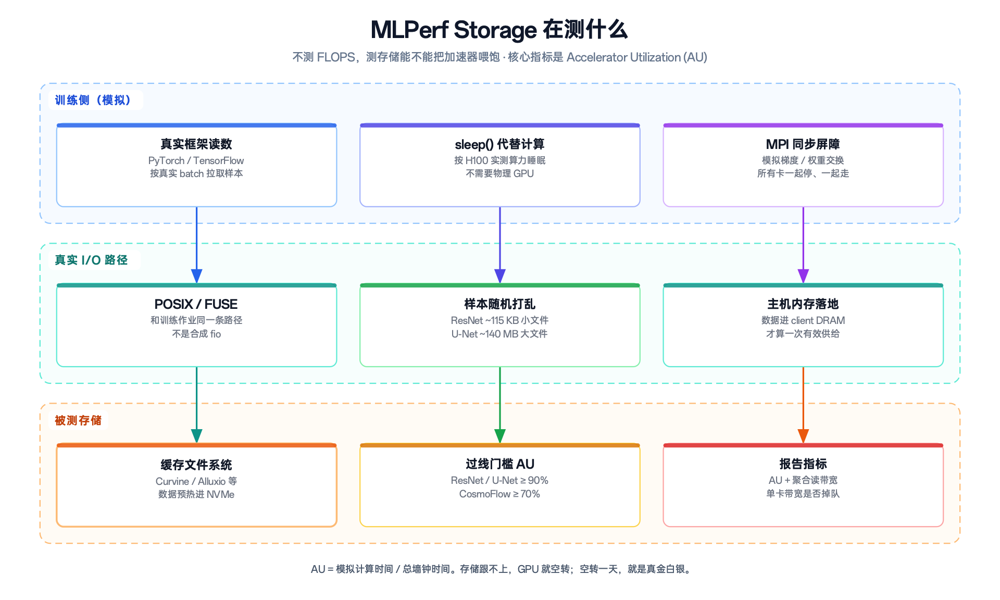
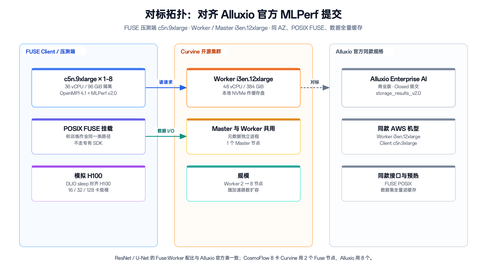
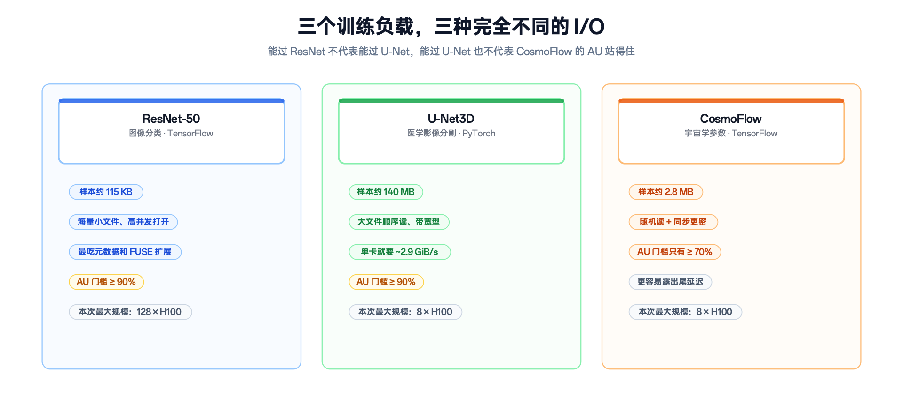
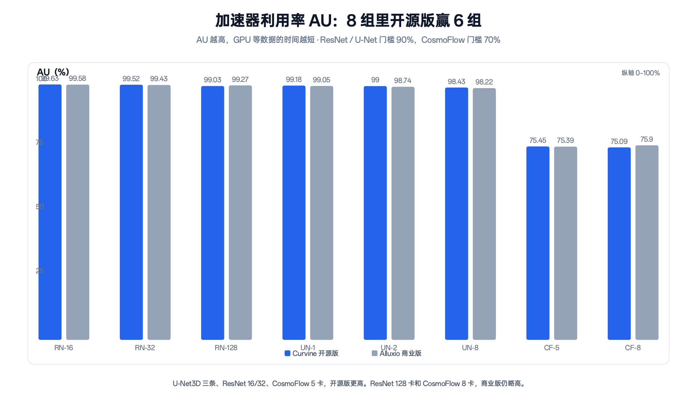
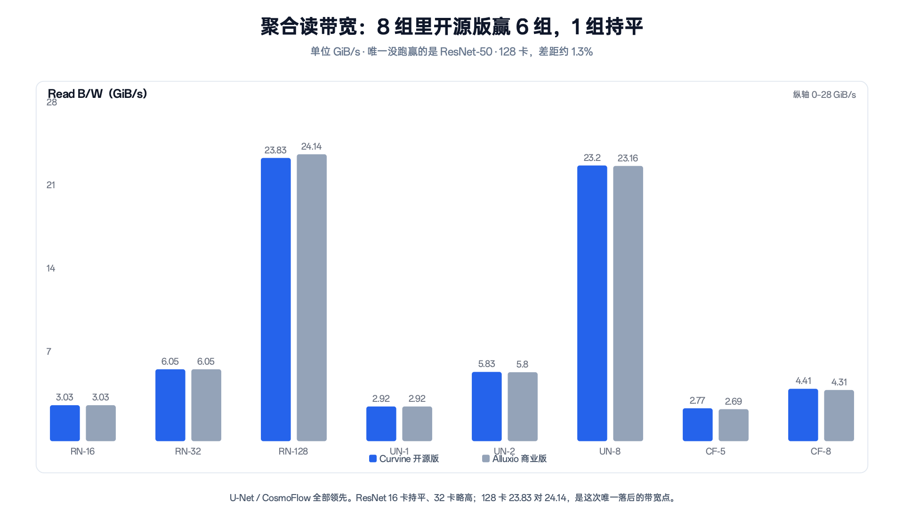
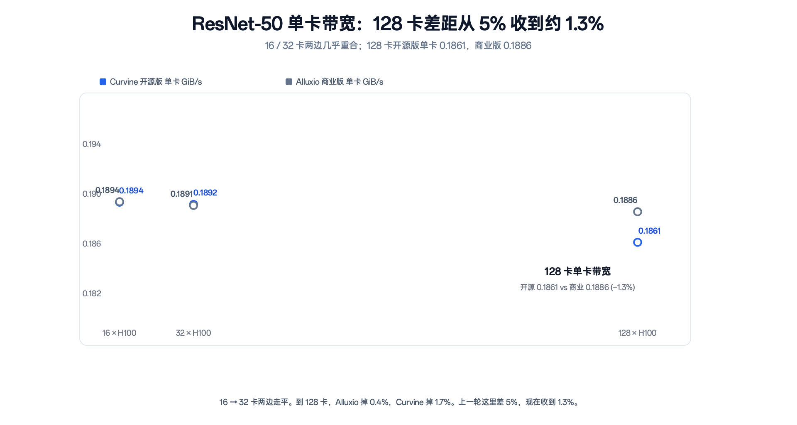

<!-- truncate -->

# 开源 DistCache 跑过了 Alluxio 商业版：Curvine 最新 MLPerf 成绩

GPU 在等数据，集群就在空转。训练存储好不好使，业界现在常用同一把尺子量：MLPerf Storage。

Alluxio 用商业版 Enterprise AI，在 MLCommons Closed 分区交过官方成绩。Curvine 是 Apache-2.0 开源项目，按同一套 MLPerf Storage v2.0 方法、同一档 AWS 机器，做了内部对标。对标对象不是 Alluxio 开源版，是他们拿去投稿的商业版。

先报数，再解释。

八组测试里，**加速器利用率（AU）开源版赢 6 组，聚合读带宽赢 6 组、1 组持平**。U-Net3D 三条全部超过。CosmoFlow 带宽两条都高，5 卡 AU 也翻到前面。唯一没跑赢的带宽，是 ResNet-50 · 128 张仿真 H100：23.83 对 24.14，大约差 1.3%。

不是每个小数点都赢。但按同一把尺子，开源实现已经在多数点上超过商业 Closed 提交。下面把背景、测法和数字摊开。

## MLPerf Storage 在测什么

MLPerf 是 MLCommons 维护的 AI 基准。训练榜、推理榜比的是模型算得多快。**Storage 这条线不比 FLOPS，比存储能不能把加速器喂饱。**

训练时加速器按 batch 随机取样本。存储慢半拍，GPU 就空等。MLPerf Storage 要回答的是：这套存储能撑住多少张卡，还能让它们保持足够忙。

它不要求真的摆一排 H100。基准工具 DLIO 会用 PyTorch / TensorFlow 按真实 batch 读数，把「算一个 batch」换成按 H100 实测时间 sleep()，再用 MPI 屏障模拟梯度同步。数据路径是真的：POSIX、FUSE、进到 client 内存，才算一次有效供给。

核心指标叫 **Accelerator Utilization（AU）**：

> AU = 模拟计算时间 / 总墙钟时间

AU 越高，说明 GPU 等数据的时间越短。v2.0 过线门槛：

| 负载 | 典型样本 | I/O 特点 | AU 门槛 |
| --- | --- | --- | --- |
| ResNet-50 | 约 115 KB | 小文件、高并发打开，吃元数据和 FUSE | ≥ 90% |
| U-Net3D | 约 140 MB | 大文件顺序读，单卡约 2.9 GiB/s | ≥ 90% |
| CosmoFlow | 约 2.8 MB | 随机读，同步更密，容易露出尾延迟 | ≥ 70% |

过了门槛，再看聚合带宽和单卡带宽掉不掉。三道题考的不是同一种能力。能过 ResNet，不代表能过 U-Net；能过 U-Net，也不代表 CosmoFlow 的 AU 站得住。

*图 1：不测算力，测存储能不能把加速器喂饱。核心指标是 AU。*

Alluxio 的官方成绩写在 [MLCommons storage_results_v2.0 / closed/Alluxio](https://github.com/mlcommons/storage_results_v2.0/tree/main/closed/Alluxio/results)，文档里 ResNet-50 128 卡写到 24.14 GiB/s。Curvine 还没有正式提交 Closed。下面是内部对标，不是官方榜单。口径先说在前面。

## 怎么测：同一档机器，同一条 POSIX 路径

要对得上，拓扑必须对齐。

Alluxio 官方环境是同 AZ 的 AWS 实例：Worker 用 `i3en.12xlarge`（48 vCPU / 384 GiB，本地 NVMe），FUSE 压测端用 `c5n.9xlarge`（36 vCPU / 96 GiB），接口 POSIX FUSE，数据全量预热进缓存。Curvine 按同一档规格搭：

| 角色 | AWS 对等规格 | 规模 | 硬指标 |
| --- | --- | --- | --- |
| FUSE Client（压测端） | c5n.9xlarge | 1–8 | ≥ 36 核，内存隔离 96 GiB |
| Worker（缓存层） | i3en.12xlarge | 2–8 | ≥ 48 核 / 384 GiB，企业级 NVMe |
| Master（元数据） | 与 Worker 共用 | 1 | 独立元数据进程 |

加速器按 H100 仿真。数据集随规模走：500 GB → 1.0 TB → 4.0 TB。ResNet / U-Net 的 Fuse:Worker 配比与 Alluxio 官方表一致（1:2、2:2、8:8）。CosmoFlow 8 卡有一处不同：Curvine 用了 2 个 Fuse + 8 个 Worker，Alluxio 官方表是 8 个 Fuse + 8 个 Worker。比这一组时，把这一点记在心里。

*图 2：硬件、接口、预热方式对齐 Alluxio 官方提交。*

*图 3：小文件高并发、大文件带宽、中等文件随机读，各考一套能力。*

## 成绩单

先看 AU。

*图 4：8 组里开源版赢 6 组。没赢的是 ResNet 128 卡、CosmoFlow 8 卡。*

再看聚合读带宽。

*图 5：8 组里开源版赢 6 组、1 组持平。唯一落后的是 ResNet-50 128 卡，约 1.3%。*

完整对照如下。Alluxio 取官方提交的分规模明细。他们对外材料常把各模型 AU 写成一条 headline（比如 ResNet 统一写 99.57%），和分规模值会有零点几个百分点的圆整，本文用分规模值。Curvine 原始记录部分字段写作 GB/s，绝对值与 Alluxio 的 GiB/s 几乎一一对应，按 MLPerf 惯例统一成 GiB/s。

**ResNet-50（AU 门槛 90%）**

| 规模 | 数据集 | Fuse / Worker | Curvine AU | Alluxio AU | Curvine 带宽 | Alluxio 带宽 | 单卡（开源 / 商业） |
| --- | --- | --- | --- | --- | --- | --- | --- |
| 16 × H100 | 500 GB | 1 / 2 | **99.63%** | 99.58% | 3.03 | 3.03 | 0.1894 / 0.1894 |
| 32 × H100 | 1.0 TB | 2 / 2 | **99.52%** | 99.43% | **6.05** | 6.05 | **0.1892** / 0.1891 |
| 128 × H100 | 4.0 TB | 8 / 8 | 99.03% | **99.27%** | 23.83 | **24.14** | 0.1861 / **0.1886** |

**U-Net3D（AU 门槛 90%）**

| 规模 | 数据集 | Fuse / Worker | Curvine AU | Alluxio AU | Curvine 带宽 | Alluxio 带宽 | 单卡（开源 / 商业） |
| --- | --- | --- | --- | --- | --- | --- | --- |
| 1 × H100 | 500 GB | 1 / 2 | **99.18%** | 99.05% | **2.92** | 2.92 | **2.925** / 2.923 |
| 2 × H100 | 1.0 TB | 2 / 2 | **99.00%** | 98.74% | **5.83** | 5.80 | **2.917** / 2.895 |
| 8 × H100 | 4.0 TB | 8 / 8 | **98.43%** | 98.22% | **23.20** | 23.16 | **2.900** / 2.895 |

**CosmoFlow（AU 门槛 70%）**

| 规模 | 数据集 | Fuse / Worker | Curvine AU | Alluxio AU | Curvine 带宽 | Alluxio 带宽 | 单卡（开源 / 商业） |
| --- | --- | --- | --- | --- | --- | --- | --- |
| 5 × H100 | 500 GB | 1 / 2 | **75.45%** | 75.39% | **2.77** | 2.69 | **0.554** / 0.539 |
| 8 × H100 | 1.0 TB | 2 / 8 vs 8 / 8 | 75.09% | **75.90%** | **4.41** | 4.31 | **0.551** / 0.539 |

八组看下来：开源版在多数点上更高，商业版在 ResNet 128 卡带宽、以及两组 AU 上仍略好。没有「全面碾压」，但已经不是「开源跟在商业版后面」。

## 这些数怎么读

### U-Net3D：三条全部超过

U-Net3D 是大文件顺序读。单卡就要接近 2.9 GiB/s，8 卡聚合到 23 GiB/s。AU、带宽、单卡，Curvine 三条都高于 Alluxio。8 卡 AU 98.43% 对 98.22%，带宽 23.20 对 23.16。

这和实现路径对得上。Rust、用户态 FUSE、NVMe 上的顺序读，本来就吃大块 I/O。医学影像、checkpoint、长序列特征，和这道题更像。开源版在这里不需要先低头。

### ResNet-50：16 / 32 卡超过，128 卡还差 1.3%

ResNet 是小文件题。样本一百多 KB，打开次数密，FUSE 和元数据会被放大。

16 卡、32 卡，AU 开源版更高（99.63% / 99.52%），带宽持平或略高。到 128 卡、8 个 Fuse + 8 个 Worker，带宽 23.83 对 24.14，大约差 1.3%；AU 99.03% 对 99.27%，商业版略高。两边都远超 90% 门槛。

*图 6：16 → 32 卡几乎重合。128 卡开源版单卡 0.1861，商业版 0.1886，差约 1.3%。*

单卡从 16 卡到 128 卡，Alluxio 掉 0.4%，Curvine 掉 1.7%。上一轮对标里，这里差大约 5%。这一轮收到 1.3%。小文件高并发的 scale-out，商业版仍更平一点；开源版已经从「掉一截」变成「差一个点出头」。

### CosmoFlow：带宽两条都高，5 卡 AU 也超过了

CosmoFlow 门槛只有 70%，却容易露尾延迟。5 卡：AU 75.45% 对 75.39%，带宽 2.77 对 2.69，开源版都高。8 卡：带宽 4.41 对 4.31，仍是开源版高；AU 75.09% 对 75.90%，商业版高不到 1 个百分点。

两边都过了 70%。8 卡这一组 Client 配比不同，带宽优势不宜单独解释成全面领先。能说的是：随机读这条，开源版已经能把 GPU 喂过线，并且在 5 卡上把 AU 也抬到商业版前面。

## 最后

MLPerf 把「存储快不快」收成两件事：GPU 有没有在等，规模上去单卡会不会掉。Alluxio 商业版用 Closed 提交证明过 DistCache 能把 128 张仿真 H100 喂到 99% 以上。Curvine 开源版按同一把尺子量自己，多数点已经超过，少数点还差一个点出头。

数字都在上面。开源项目把成绩摊开，比多写一句「全面领先」有用。

Curvine 仓库：[https://github.com/CurvineIO/curvine](https://github.com/CurvineIO/curvine)

---

**口径与来源**

- Curvine：内部对标，方法对齐 MLPerf Storage v2.0，硬件对齐 Alluxio 官方 AWS 拓扑。**不是 MLCommons 官方 Closed / Open 提交。**
- Alluxio：Enterprise AI，MLCommons `storage_results_v2.0` Closed 分区；分规模带宽与 [Alluxio 官方 MLPerf 文档](https://documentation.alluxio.io/ee-ai-en/benchmark/benchmarking-ml-training-performance-with-mlperf) 一致。对外材料常把 ResNet AU 统一写成 99.57%、U-Net 99.02%、CosmoFlow 74.97%，本文对照用分规模值。
- 单位：文中带宽统一为 GiB/s。
- CosmoFlow 8 卡 Client 配比两侧不完全相同。
- MLPerf® 是 MLCommons Association 的商标。本文不代表 MLCommons 对任何产品背书。
