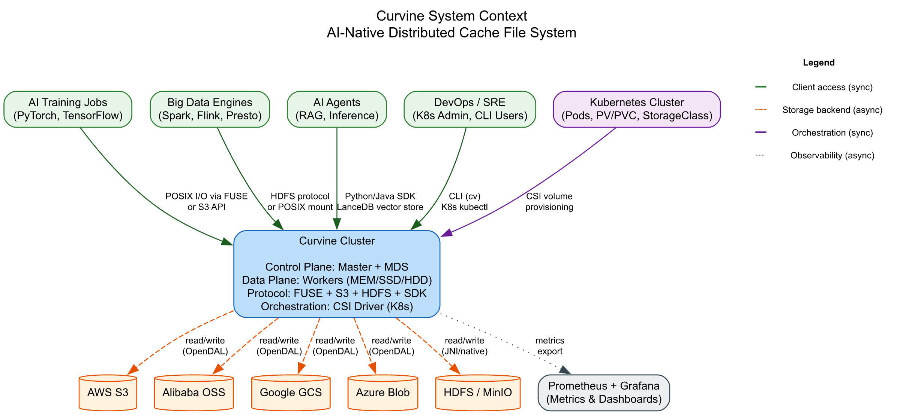
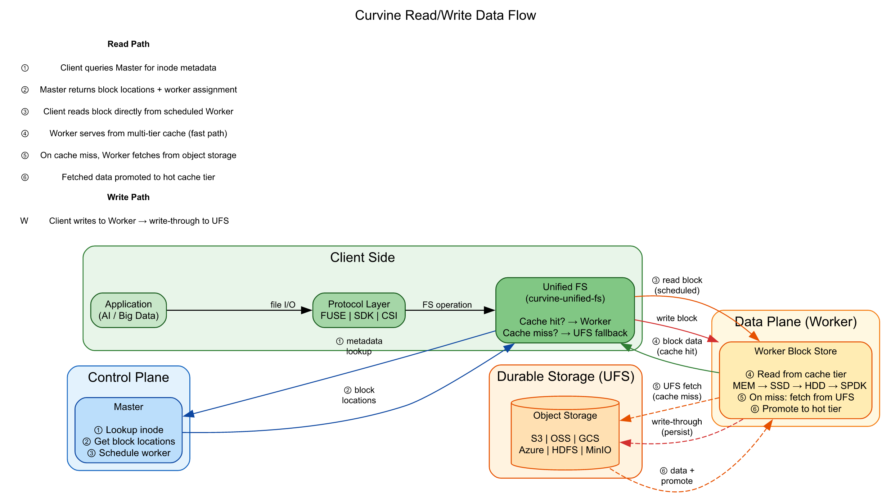

# Curvine 架构深度解析：系统设计、容器架构与数据流

Curvine 是一个 AI-Native 和 Cloud-Native 的分布式缓存文件系统，完全使用 Rust 编写。它诞生于 OPPO，目前是 CNCF Landscape 项目，在云对象存储之上提供完整的 POSIX 语义，为 AI 训练、推理和大数据负载提供本地磁盘级的性能，同时以 S3、OSS、GCS、Azure Blob 和 HDFS 作为持久化存储后端。

本文将从三个维度剖析 Curvine 的架构：整体系统上下文、容器级服务拆分，以及端到端的读写数据流。

<!-- truncate -->

## 一、系统上下文：谁在使用 Curvine，它依赖什么

从最高层视角来看，Curvine 位于计算负载和持久化存储之间。它向上暴露多种访问协议，向下扇出到各类对象存储后端。



### 上游消费者

| 消费者 | 访问方式 |
|---|---|
| **AI 训练任务**（PyTorch、TensorFlow） | 通过 FUSE 挂载的 POSIX I/O 或 S3 兼容网关 |
| **大数据引擎**（Spark、Flink、Presto） | HDFS 协议适配器或 POSIX 挂载 |
| **AI Agent**（RAG、推理） | Python/Java SDK，LanceDB 向量存储集成 |
| **DevOps / SRE** | CLI 工具（`cv`）、Kubernetes kubectl、Web 控制台 |
| **Kubernetes** | CSI Driver 动态 PV/PVC 供给 |

Curvine 与大数据引擎的集成是透明的——无需自定义连接器。Spark、Flink 和 Presto 通过标准 POSIX 或 HDFS 接口访问 Curvine，现有管道无需任何修改即可使用。

### 下游存储后端

所有持久化存储都通过 **UFS（Underlying File System，底层文件系统）** 层进行抽象：

- **AWS S3**、**阿里云 OSS**、**Google GCS**、**Azure Blob**、**腾讯云 COS** — 通过 Apache OpenDAL 适配器
- **HDFS** / **WebHDFS** — 通过 JNI 桥接或 OpenDAL 原生支持
- **阿里云 OSS-HDFS（JindoFS）** — 通过原生 FFI 适配器
- **MinIO** 及任何 S3 兼容存储

### 可观测性

Curvine 从所有服务导出 Prometheus 指标，并内置 Grafana 仪表盘模板，用于集群健康、缓存命中率、Worker 利用率和 I/O 吞吐量的监控。

---

## 二、容器视图：服务、协议与内部边界

深入 Curvine 集群内部，架构清晰地分为三个平面：控制面、数据面和访问协议层。


### 控制面

控制面负责元数据管理、调度和集群协调。

**Master** 是集群的大脑。它以 Raft 复制的 Leader 节点运行，负责：

- **命名空间与 Inode 树** — 完整的文件和目录层级结构
- **Block Map 与调度** — 将文件块映射到 Worker 节点，支持五种调度策略（本地优先、轮询、随机、负载均衡、加权）
- **Worker 心跳** — 健康监测和容量追踪
- **挂载表与配额** — UFS 挂载点管理和目录级配额
- **TTL 与淘汰** — 生存期管理和基于 LFU 的缓存淘汰
- **任务编排** — 协调批量数据加载和导出任务
- **持久化** — RocksDB 存储 inode 数据，Raft 日志用于复制和高可用

**MDS（元数据服务）** 是一个可选的无状态元数据路径，后端为 FoundationDB（生产环境）或内存存储（开发环境）。它为需要绕过 Raft 日志的高吞吐量工作负载提供替代的元数据通道。

### 数据面

**Worker** 是存储和服务文件块的数据节点。每个 Worker 实现了**多级缓存层级**：

```
MEM → SSD → HDD → SPDK（NVMe-oF/RDMA）
```

热数据自动提升到更快的层级；冷数据降级或淘汰。每个 Worker 维护：

- **Block Store** — 以 RocksDB 存储块元数据，本地文件系统存储块数据
- **读写处理器** — 直接响应客户端 I/O 的 RPC 处理器
- **复制** — 由 Master 管理的块级复制
- **心跳** — 定期向 Master 上报状态

Worker 可选使用 **SPDK**（Storage Performance Development Kit）通过 RDMA 直接访问 NVMe 设备，绕过内核以获得超低延迟。

### 访问协议

Curvine 暴露五种访问路径，全部汇聚到同一内部 RPC 层：

| 协议 | 实现 | 适用场景 |
|---|---|---|
| **FUSE** | `curvine-fuse`（fuse2/fuse3） | 任何 Linux 应用的 POSIX 文件系统挂载 |
| **Java SDK** | 通过 `curvine-libsdk-java` 的 JNI 绑定 | JVM 大数据应用 |
| **Python SDK** | 通过 `curvine-libsdk-python` 的 PyO3 绑定 | AI/ML 训练脚本、数据管道 |
| **Rust SDK** | `curvine-sdk-core` | 原生 Rust 应用 |
| **CLI** | `cv` 命令 | 文件操作、性能测试、挂载管理 |
| **Web 控制台** | axum REST API | 集群监控和管理 |

**Unified FS**（`curvine-unified-fs`）是内部抽象层，在缓存未命中时透明地回退到 UFS（对象存储），应用无需关心数据是本地缓存还是远端获取。

### Kubernetes 集成

**CSI Driver**（`curvine-csi`）是一个 Go 编写的容器存储接口实现：

- **Controller** — 动态 PV 供给（CreateVolume/DeleteVolume）
- **Node Plugin** — 每个节点的 FUSE 挂载生命周期管理
- **两种模式**：Standalone（FUSE 在独立 MountPod 中，推荐）或 Embedded（FUSE 在 CSI 容器内）
- **StorageClass** — `volumeBindingMode: Immediate`，`allowVolumeExpansion: true`

### Transfer Service（数据传输服务）

Transfer Service 处理批量数据搬运——将数据从 UFS 加载到 Curvine 缓存，或将 Curvine 数据导出到外部系统。它维护自己的任务存储（默认 SQLite，可选 MySQL 和 PostgreSQL），可以独立运行或嵌入在 Master 中。

### LanceDB 集成

Curvine 集成了 **LanceDB**，在 Curvine 的对象存储之上提供向量数据库层。基于 Lance 列式格式和 Apache Arrow 构建，使 AI 应用能够直接通过 Curvine 的存储后端存储和查询向量嵌入。

---

## 三、数据流：读写操作如何穿越系统

理解数据流可以揭示 Curvine 为何能在热数据上实现本地磁盘级性能，同时保持对象存储的持久性。



### 读路径（6 步）

```
应用 → 协议层 → Unified FS → Master（元数据）→ Worker（数据）→ [缓存未命中时访问 UFS]
```

1. **元数据查询** — 客户端向 Master 发送 RPC，将文件路径解析为 inode 元数据和块位置。

2. **块位置响应** — Master 返回块 ID 列表以及持有（或可获取）这些块的 Worker 节点。

3. **调度读取** — 客户端通过 RPC 直接连接到分配的 Worker 读取请求的块。这避免了数据经过 Master 中转。

4. **缓存命中（快速路径）** — Worker 从其多级缓存（MEM → SSD → HDD → SPDK）中提供数据块。这是热路径——延迟与本地磁盘相当。

5. **缓存未命中（UFS 获取）** — 如果块未缓存，Worker 通过 OpenDAL 适配器或原生 FFI 桥接从底层对象存储（S3、OSS、HDFS 等）获取数据。

6. **缓存提升** — 获取的块被写入 Worker 的缓存，根据访问频率提升到相应的层级。后续读取直接命中缓存。

### 写路径

```
应用 → 协议层 → Unified FS → Worker（写入）→ UFS（write-through）
```

- 客户端通过 RPC 将数据块直接写入分配的 Worker。
- Worker 写入本地缓存层，并执行 **write-through** 将数据持久化到底层对象存储。
- Master 通过 Raft 复制的日志更新新的块元数据。

### 关键设计特性

- **元数据与数据路径分离** — 元数据通过 Master（或 MDS）处理，数据直接走 Worker。这防止 Master 成为吞吐量瓶颈。
- **客户端到 Worker 的直接 I/O** — 一旦 Master 提供了块位置，客户端直接与 Worker 通信。数据吞吐量随 Worker 数量线性扩展。
- **透明的 UFS 回退** — Unified FS 层透明地处理缓存未命中。应用看到的是统一的 POSIX 命名空间，无论数据物理上存储在哪里。
- **多级自动提升** — 频繁访问的数据迁移到更快的层级（MEM/SSD），冷数据降级到 HDD 或完全淘汰。

---

## 四、技术栈总结

| 层级 | 技术 |
|---|---|
| **编程语言** | Rust（核心）、Go（CSI Driver） |
| **异步运行时** | Tokio |
| **RPC** | 基于 protobuf（prost）的自定义 RPC，TCP 传输 |
| **元数据存储** | RocksDB + Raft 日志（Master），FoundationDB（MDS） |
| **对象存储** | Apache OpenDAL（S3/OSS/GCS/Azure/COS/HDFS/WebHDFS） |
| **硬件加速** | SPDK（NVMe-oF/RDMA），mimalloc/jemalloc |
| **向量数据库** | LanceDB + Lance + Apache Arrow |
| **Kubernetes** | CSI Driver（Go），FUSE MountPod |
| **可观测性** | Prometheus 指标 + Grafana 仪表盘 |
| **构建系统** | Makefile + Cargo workspace，Docker（CentOS/Rocky/Ubuntu/Amazon） |

---

## 五、总结

Curvine 的架构围绕三个核心原则设计：

1. **关注点分离** — 控制面（Master/MDS）处理元数据；数据面（Worker）处理 I/O；协议层处理访问多样性。
2. **通过缓存实现性能** — 多级缓存（MEM → SSD → HDD → SPDK）配合自动提升，为热数据提供本地磁盘级延迟。
3. **通过抽象实现持久性** — UFS 层将 Curvine 与任何单一存储后端解耦，允许 S3、OSS、GCS、Azure 或 HDFS 作为持久层，无需修改应用。

最终结果是：一个为 AI 训练任务、大数据引擎和 Kubernetes 工作负载提供统一 POSIX 接口的系统——兼具本地存储的速度和云对象存储的持久性——全部封装在一个基于 Rust 的统一二进制文件中。
