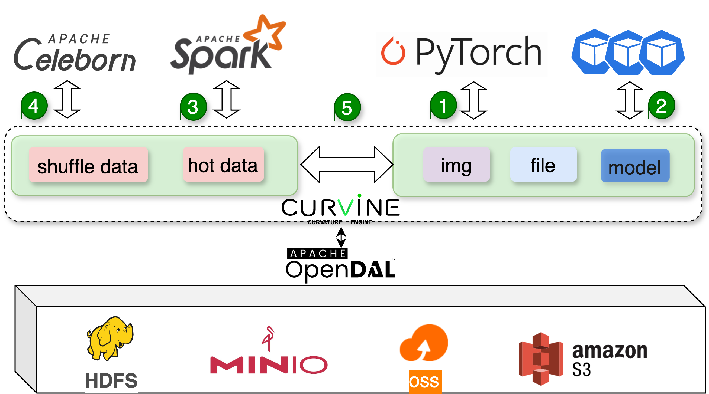

# Curvine简介
Curvine 是一款高性能、高并发分布式缓存系统，在 Apache 2.0 开源协议下发布；
可以使用统一的路径访问各种存储系统，同时提供缓存加速；同时具备POSIX 兼容性， 
接入本地作为海量本地磁盘使用，亦可同时在跨平台、跨地区的不同主机上挂载读写。

Curvine 采集经典Master、worker主从架构，从而实现文件系统的分布式设计，
Master管理文件元数据，通过raft协议实现高可用和保证数据的一致性，Worker管理数据。

Curvine 提供了丰富的 API，适用于各种形式数据的管理、分析、归档、备份，
可以在不修改代码的前提下无缝对接大数据、机器学习、人工智能等应用平台，为其提供海量、弹性、低价的缓存加速。

## 核心特性
- **高性能**：毫秒级延迟，写入、顺序读、随机读都有极高的性能，单节点最高读可达到15GiB/s；
- **高并发**：单节点可支持上万个文件并发读写；
- **低资源使用**：在1000并发读写测试中，服务端、客服端只需要几十MB内存；cpu使用对比其他系统也下降50%；
- **支持多种底层存储**：支持 S3、HDFS、OSS、MinIO等多种底层存储，提供统一的访问接口；
- **POSIX 兼容**：像本地文件系统一样使用，无缝对接已有应用，无业务侵入性；
- **分布式设计**：同一文件系统可在上千台服务器同时挂载，高性能并发读写，共享数据；
- **多语言支持**：提供 Java、Python、Rust、Fuse等多种客户端；
- **多操作系统支持**：支持 Linux、Windows、MacOS等多种操作系统；
- **多硬件架构支持**：支持 x86、ARM等多种硬件架构；
- 
## 使用场景

Curvine 为高性能、高并发以及海量数据缓存设计，可以在很多场景中使用：

- **为深度学习训练提供高速数据访问，大幅减少数据加载时间，提高GPU利用率，加速模型训练进程。**
- **针对大型语言模型推理场景优化数据访问，降低推理延迟，提升模型服务响应速度和吞吐量。**
- **为分析型数据库和OLAP引擎提供高速缓存，显著提升复杂查询性能，减少数据分析时间。**
- **为大数据计算场景提供高速缓存，降低数据读写时间。**
- **存储大数据计算过程中间结果（shuffle），实现计算、存储的完全分离。**
- **多云数据缓存，提高跨云、跨区域数据访问效率**

## 性能表现

**1. 元数据操作性能**
<!-- 表格区 -->
   <table>
  <thead>
    <tr style={{ backgroundColor: '#2ecc71', color: 'white' }}>
      <th>Operation Type</th>
      <th>Curvine (QPS)</th>
      <th>Juicefs (QPS)</th>
      <th>oss (QPS)</th>
    </tr>
  </thead>
  <tbody>
    <tr>
      <td>create</td>
      <td style={{ textAlign: 'right' }}>19,985</td>
      <td style={{ textAlign: 'right' }}>16,000</td>
      <td style={{ textAlign: 'right' }}>2,000</td>
    </tr>
    <tr>
      <td>open</td>
      <td style={{ textAlign: 'right' }}>60,376</td>
      <td style={{ textAlign: 'right' }}>50,000</td>
      <td style={{ textAlign: 'right' }}>3,900</td>
    </tr>
    <tr>
      <td>rename</td>
      <td style={{ textAlign: 'right' }}>43,009</td>
      <td style={{ textAlign: 'right' }}>21,000</td>
      <td style={{ textAlign: 'right' }}>200</td>
    </tr>
    <tr>
      <td>delete</td>
      <td style={{ textAlign: 'right' }}>39,013</td>
      <td style={{ textAlign: 'right' }}>41,000</td>
      <td style={{ textAlign: 'right' }}>1,900</td>
    </tr>
  </tbody>
</table>

&emsp;**注**： 对比数据选取的并发度均为40

&emsp;**详细结果**： https://curvineio.github.io/docs/Benchmark/meta/

&emsp;**业界类似产品测试数据**：https://juicefs.com/zh-cn/blog/engineering/meta-perf-hdfs-oss-jfs

**2. 数据读写性能**

相同硬件条件下，测试对比Alluxio性能：

● 256k顺序读
  <!-- 表格区 -->
  <table style={{ width: '100%', borderCollapse: 'collapse' }}>
    <thead>
      <tr style={{ backgroundColor: '#2ecc71', color: 'white' }}>
        <th>Thread count</th>
        <th>Curvine Open Source Edition (GiB/s)</th>
        <th>Throughput of Open Source Alluxio (GiB/s)</th>
      </tr>
    </thead>
    <tbody>
      <!-- 数据行模板 -->
      <tr style={{ borderBottom: '1px solid #e1e4e8' }}>
        <td style={{ textAlign: 'right' }}>1</td>
        <td style={{ textAlign: 'right' }}>2.2</td>
        <td style={{ textAlign: 'right' }}>0.6</td>
      </tr>
      <tr style={{ borderBottom: '1px solid #e1e4e8' }}>
        <td style={{ textAlign: 'right' }}>2</td>
        <td style={{ textAlign: 'right' }}>3.7</td>
        <td style={{ textAlign: 'right' }}>1.1</td>
      </tr>
      <tr style={{ borderBottom: '1px solid #e1e4e8' }}>
        <td style={{ textAlign: 'right' }}>4</td>
        <td style={{ textAlign: 'right' }}>6.8</td>
        <td style={{ textAlign: 'right' }}>2.3</td>
      </tr>
      <tr style={{ borderBottom: '1px solid #e1e4e8' }}>
        <td style={{ textAlign: 'right' }}>8</td>
        <td style={{ textAlign: 'right' }}>8.9</td>
        <td style={{ textAlign: 'right' }}>4.5</td>
      </tr>
      <tr style={{ borderBottom: '1px solid #e1e4e8' }}>
        <td style={{ textAlign: 'right' }}>16</td>
        <td style={{ textAlign: 'right' }}>9.2</td>
        <td style={{ textAlign: 'right' }}>7.9</td>
      </tr>
      <tr style={{ borderBottom: '1px solid #e1e4e8' }}>
        <td style={{ textAlign: 'right' }}>32</td>
        <td style={{ textAlign: 'right' }}>9.5</td>
        <td style={{ textAlign: 'right' }}>8.8</td>
      </tr>
      <tr style={{ borderBottom: '1px solid #e1e4e8' }}>
        <td style={{ textAlign: 'right' }}>64</td>
        <td style={{ textAlign: 'right' }}>9.2</td>
        <td style={{ textAlign: 'right' }}>N/A</td>
      </tr>
      <tr style={{ borderBottom: '1px solid #e1e4e8' }}>
        <td style={{ textAlign: 'right' }}>128</td>
        <td style={{ textAlign: 'right' }}>9.2</td>
        <td style={{ textAlign: 'right' }}>N/A</td>
      </tr>
    </tbody>
  </table>
  
● 256k随机读
<!-- 表格区 -->
  <table style={{ width: '100%', borderCollapse: 'collapse' }}>
    <thead>
      <tr style={{ backgroundColor: '#2ecc71', color: 'white' }}>
        <th>Thread count</th>
        <th>Curvine Open Source Edition (GiB/s)</th>
        <th>Throughput of Open Source Alluxio (GiB/s)</th>
      </tr>
    </thead>
    <tbody>
      <!-- 数据行模板 -->
      <tr style={{ borderBottom: '1px solid #e1e4e8' }}>
        <td style={{ textAlign: 'right' }}>1</td>
        <td style={{ textAlign: 'right' }}>0.3</td>
        <td style={{ textAlign: 'right' }}>0.0</td>
      </tr>
      <tr style={{ borderBottom: '1px solid #e1e4e8' }}>
        <td style={{ textAlign: 'right' }}>2</td>
        <td style={{ textAlign: 'right' }}>0.7</td>
        <td style={{ textAlign: 'right' }}>0.1</td>
      </tr>
      <tr style={{ borderBottom: '1px solid #e1e4e8' }}>
        <td style={{ textAlign: 'right' }}>4</td>
        <td style={{ textAlign: 'right' }}>1.4</td>
        <td style={{ textAlign: 'right' }}>0.1</td>
      </tr>
      <tr style={{ borderBottom: '1px solid #e1e4e8' }}>
        <td style={{ textAlign: 'right' }}>8</td>
        <td style={{ textAlign: 'right' }}>2.8</td>
        <td style={{ textAlign: 'right' }}>0.2</td>
      </tr>
      <tr style={{ borderBottom: '1px solid #e1e4e8' }}>
        <td style={{ textAlign: 'right' }}>16</td>
        <td style={{ textAlign: 'right' }}>5.2</td>
        <td style={{ textAlign: 'right' }}>0.4</td>
      </tr>
      <tr style={{ borderBottom: '1px solid #e1e4e8' }}>
        <td style={{ textAlign: 'right' }}>32</td>
        <td style={{ textAlign: 'right' }}>7.8</td>
        <td style={{ textAlign: 'right' }}>0.3</td>
      </tr>
      <tr style={{ borderBottom: '1px solid #e1e4e8' }}>
        <td style={{ textAlign: 'right' }}>64</td>
        <td style={{ textAlign: 'right' }}>8.7</td>
        <td style={{ textAlign: 'right' }}>N/A</td>
      </tr>
      <tr style={{ borderBottom: '1px solid #e1e4e8' }}>
        <td style={{ textAlign: 'right' }}>128</td>
        <td style={{ textAlign: 'right' }}>9.0</td>
        <td style={{ textAlign: 'right' }}>N/A</td>
      </tr>
    </tbody>
  </table>

&emsp; Alluxio官网数据披露：https://www.alluxio.com.cn/alluxio-enterprise-vs-open-source/

**3. 资源消耗情况**

&emsp; 得益于Rust语言的特性，大数据shuffle加速场景下，对比线上使用Curvine和Alluxio资源消耗情况，内存降低90%+，cpu降低50%+。

## 🧩 模块化架构

Curvine 采用模块化设计，主要由以下核心组件构成：

- **orpc**: 一个支持异步 RPC 调用的高性能网络通信框架
- **curvine-common**: 包含协议定义、错误处理和通用工具的共享库
- **curvine-server**: 服务端组件，包含 Master 和 Worker 实现
- **curvine-client**: 提供与服务器交互 API 的客户端库
- **curvine-fuse**: FUSE 文件系统接口，支持将 Curvine 挂载为本地文件系统
- **curvine-libsdk**: 支持多语言访问的 SDK 库
- **curvine-web**: Web 管理界面和 API
- **curvine-tests**: 测试框架与性能基准测试工具