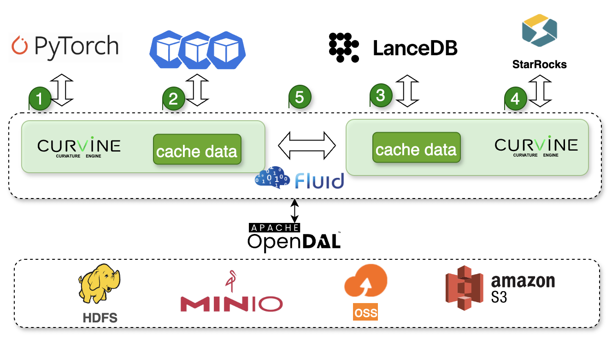

# Curvine简介
Curvine 是一个使用 Rust 编写的高性能分布式缓存系统，采用 Apache 2.0 开源协议发布。它在外部存储系统之上提供统一的缓存文件系统视图，兼顾低延迟元数据访问、高吞吐数据访问以及 POSIX 兼容的 FUSE 集成。

Curvine 采用经典的 Master / Worker 架构。Master 负责元数据与集群协调，Worker 负责数据块存储与读写服务；元数据一致性与高可用通过 Raft 保证。

Curvine 面向 AI、分析型计算和数据基础设施场景，当前 `main` 分支提供的主要接入方式包括 Rust CLI、FUSE、Java / Python SDK 绑定以及 S3 兼容访问。

## 核心特性
- **多云底层存储支持**：可对接 S3 兼容系统、HDFS、OSS、MinIO 等 UFS 后端，并提供统一访问层
- **云原生集成**：支持 CSI 与 Kubernetes 部署场景
- **多级缓存**：支持内存、SSD、HDD 多层缓存策略
- **POSIX 兼容访问**：通过 FUSE 将缓存数据以本地文件系统方式暴露给现有应用
- **兼容 S3 / HDFS 生态**：提供 S3 网关与 Hadoop / SDK 接入路径
- **高性能**：基于异步 I/O 与零拷贝导向的数据路径，面向低延迟和高吞吐负载
- **Raft 元数据高可用**：通过 Raft 保证 Master 元数据一致性
- **内建可观测性**：暴露监控与指标，便于集群运维
- **Web 管理界面**：在服务 Web 端口提供浏览器管理与状态查看能力
## 使用场景

Curvine 为高性能、高并发以及海量数据缓存设计，可以在很多场景中使用：

- **为深度学习训练提供高速数据访问，大幅减少数据加载时间，提高GPU利用率，加速模型训练进程。**
- **针对大型语言模型推理场景优化数据访问，降低推理延迟，提升模型服务响应速度和吞吐量。**
- **为分析型数据库和OLAP引擎提供高速缓存，显著提升复杂查询性能，减少数据分析时间。**
- **为大数据计算场景提供高速缓存，降低数据读写时间。**
- **存储大数据计算过程中间结果（shuffle），实现计算、存储的完全分离。**
- **多云数据缓存，提高跨云、跨区域数据访问效率**

## 性能表现

**1. 元数据操作性能**
<!-- 表格区 -->
   <table>
  <thead>
    <tr style={{ backgroundColor: '#2ecc71', color: 'white' }}>
      <th>Operation Type</th>
      <th>Curvine (QPS)</th>
      <th>Juicefs (QPS)</th>
      <th>oss (QPS)</th>
    </tr>
  </thead>
  <tbody>
    <tr>
      <td>create</td>
      <td style={{ textAlign: 'right' }}>19,985</td>
      <td style={{ textAlign: 'right' }}>16,000</td>
      <td style={{ textAlign: 'right' }}>2,000</td>
    </tr>
    <tr>
      <td>open</td>
      <td style={{ textAlign: 'right' }}>60,376</td>
      <td style={{ textAlign: 'right' }}>50,000</td>
      <td style={{ textAlign: 'right' }}>3,900</td>
    </tr>
    <tr>
      <td>rename</td>
      <td style={{ textAlign: 'right' }}>43,009</td>
      <td style={{ textAlign: 'right' }}>21,000</td>
      <td style={{ textAlign: 'right' }}>200</td>
    </tr>
    <tr>
      <td>delete</td>
      <td style={{ textAlign: 'right' }}>39,013</td>
      <td style={{ textAlign: 'right' }}>41,000</td>
      <td style={{ textAlign: 'right' }}>1,900</td>
    </tr>
  </tbody>
</table>

&emsp;**注**： 对比数据选取的并发度均为40

&emsp;**详细结果**： https://curvineio.github.io/docs/Benchmark/meta/

&emsp;**业界类似产品测试数据**：https://juicefs.com/zh-cn/blog/engineering/meta-perf-hdfs-oss-jfs

**2. 数据读写性能**

相同硬件条件下，测试对比Alluxio性能：

● 256k顺序读
  <!-- 表格区 -->
  <table style={{ width: '100%', borderCollapse: 'collapse' }}>
    <thead>
      <tr style={{ backgroundColor: '#2ecc71', color: 'white' }}>
        <th>Thread count</th>
        <th>Curvine Open Source Edition (GiB/s)</th>
        <th>Throughput of Open Source Alluxio (GiB/s)</th>
      </tr>
    </thead>
    <tbody>
      <!-- 数据行模板 -->
      <tr style={{ borderBottom: '1px solid #e1e4e8' }}>
        <td style={{ textAlign: 'right' }}>1</td>
        <td style={{ textAlign: 'right' }}>2.2</td>
        <td style={{ textAlign: 'right' }}>0.6</td>
      </tr>
      <tr style={{ borderBottom: '1px solid #e1e4e8' }}>
        <td style={{ textAlign: 'right' }}>2</td>
        <td style={{ textAlign: 'right' }}>3.7</td>
        <td style={{ textAlign: 'right' }}>1.1</td>
      </tr>
      <tr style={{ borderBottom: '1px solid #e1e4e8' }}>
        <td style={{ textAlign: 'right' }}>4</td>
        <td style={{ textAlign: 'right' }}>6.8</td>
        <td style={{ textAlign: 'right' }}>2.3</td>
      </tr>
      <tr style={{ borderBottom: '1px solid #e1e4e8' }}>
        <td style={{ textAlign: 'right' }}>8</td>
        <td style={{ textAlign: 'right' }}>8.9</td>
        <td style={{ textAlign: 'right' }}>4.5</td>
      </tr>
      <tr style={{ borderBottom: '1px solid #e1e4e8' }}>
        <td style={{ textAlign: 'right' }}>16</td>
        <td style={{ textAlign: 'right' }}>9.2</td>
        <td style={{ textAlign: 'right' }}>7.9</td>
      </tr>
      <tr style={{ borderBottom: '1px solid #e1e4e8' }}>
        <td style={{ textAlign: 'right' }}>32</td>
        <td style={{ textAlign: 'right' }}>9.5</td>
        <td style={{ textAlign: 'right' }}>8.8</td>
      </tr>
      <tr style={{ borderBottom: '1px solid #e1e4e8' }}>
        <td style={{ textAlign: 'right' }}>64</td>
        <td style={{ textAlign: 'right' }}>9.2</td>
        <td style={{ textAlign: 'right' }}>N/A</td>
      </tr>
      <tr style={{ borderBottom: '1px solid #e1e4e8' }}>
        <td style={{ textAlign: 'right' }}>128</td>
        <td style={{ textAlign: 'right' }}>9.2</td>
        <td style={{ textAlign: 'right' }}>N/A</td>
      </tr>
    </tbody>
  </table>
  
● 256k随机读
<!-- 表格区 -->
  <table style={{ width: '100%', borderCollapse: 'collapse' }}>
    <thead>
      <tr style={{ backgroundColor: '#2ecc71', color: 'white' }}>
        <th>Thread count</th>
        <th>Curvine Open Source Edition (GiB/s)</th>
        <th>Throughput of Open Source Alluxio (GiB/s)</th>
      </tr>
    </thead>
    <tbody>
      <!-- 数据行模板 -->
      <tr style={{ borderBottom: '1px solid #e1e4e8' }}>
        <td style={{ textAlign: 'right' }}>1</td>
        <td style={{ textAlign: 'right' }}>0.3</td>
        <td style={{ textAlign: 'right' }}>0.0</td>
      </tr>
      <tr style={{ borderBottom: '1px solid #e1e4e8' }}>
        <td style={{ textAlign: 'right' }}>2</td>
        <td style={{ textAlign: 'right' }}>0.7</td>
        <td style={{ textAlign: 'right' }}>0.1</td>
      </tr>
      <tr style={{ borderBottom: '1px solid #e1e4e8' }}>
        <td style={{ textAlign: 'right' }}>4</td>
        <td style={{ textAlign: 'right' }}>1.4</td>
        <td style={{ textAlign: 'right' }}>0.1</td>
      </tr>
      <tr style={{ borderBottom: '1px solid #e1e4e8' }}>
        <td style={{ textAlign: 'right' }}>8</td>
        <td style={{ textAlign: 'right' }}>2.8</td>
        <td style={{ textAlign: 'right' }}>0.2</td>
      </tr>
      <tr style={{ borderBottom: '1px solid #e1e4e8' }}>
        <td style={{ textAlign: 'right' }}>16</td>
        <td style={{ textAlign: 'right' }}>5.2</td>
        <td style={{ textAlign: 'right' }}>0.4</td>
      </tr>
      <tr style={{ borderBottom: '1px solid #e1e4e8' }}>
        <td style={{ textAlign: 'right' }}>32</td>
        <td style={{ textAlign: 'right' }}>7.8</td>
        <td style={{ textAlign: 'right' }}>0.3</td>
      </tr>
      <tr style={{ borderBottom: '1px solid #e1e4e8' }}>
        <td style={{ textAlign: 'right' }}>64</td>
        <td style={{ textAlign: 'right' }}>8.7</td>
        <td style={{ textAlign: 'right' }}>N/A</td>
      </tr>
      <tr style={{ borderBottom: '1px solid #e1e4e8' }}>
        <td style={{ textAlign: 'right' }}>128</td>
        <td style={{ textAlign: 'right' }}>9.0</td>
        <td style={{ textAlign: 'right' }}>N/A</td>
      </tr>
    </tbody>
  </table>

&emsp; Alluxio官网数据披露：https://www.alluxio.com.cn/alluxio-enterprise-vs-open-source/

**3. 资源消耗情况**

&emsp; 得益于Rust语言的特性，大数据shuffle加速场景下，对比线上使用Curvine和Alluxio资源消耗情况，内存降低90%+，cpu降低50%+。

## 🧩 模块化架构

Curvine 采用模块化代码组织。当前 `main` 分支的主要组件包括：

- **orpc**：高性能异步 RPC 与运行时基础设施
- **curvine-common**：共享配置、协议、元数据与通用工具
- **curvine-server**：Master / Worker 服务端实现
- **curvine-client**：Rust 客户端库，负责元数据与块 I/O
- **curvine-fuse**：提供 POSIX 访问的 FUSE 守护进程
- **curvine-libsdk**：基于原生客户端封装的 Java / Python SDK 绑定
- **curvine-ufs**：S3、HDFS、WebHDFS 等 UFS 后端实现
- **curvine-cli**：原生命令行工具 `cv`
- **curvine-s3-gateway**：S3 兼容 HTTP 网关
- **curvine-web**：Web UI 静态资源与服务端 Web 支持
- **curvine-csi**：面向 Kubernetes 的 CSI 驱动
- **curvine-tests**：集成测试、回归工具与基准测试工具
