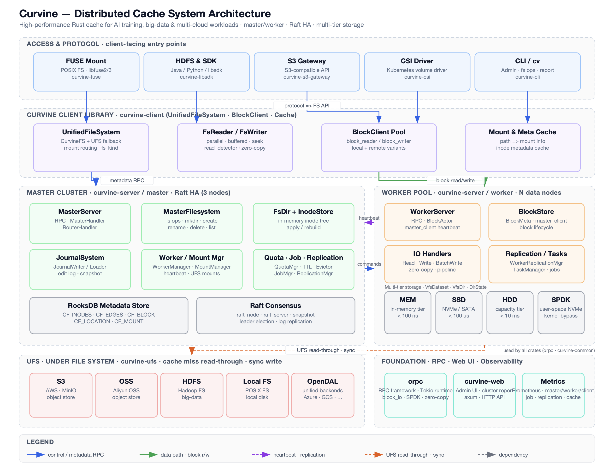

# 技术架构
本章节将深入介绍 Curvine 的技术架构，详细剖析其各层组件的功能、交互方式以及设计理念，帮助你全面了解 Curvine 系统的工作原理。

## 整体架构概述

Curvine 采用分层设计的分布式架构，各组件职责明确，具备良好的可扩展性和高可用性。整个架构主要分为三层：**控制层**（Master）、**存储层**（Worker）、**接入层**（客户端：FUSE、SDK、CLI、S3 网关），共同完成数据的存储、处理和管理。

Curvine 由三个主要服务器端角色加上客户端和 UFS 组成：

**Curvine 客户端**：数据读写操作由客户端实现，通过 RPC 调用 Curvine 服务器端接口（从 Master 获取元数据，从 Worker 获取块数据）。客户端支持多种访问方式：

- **FUSE 挂载**：通过 libfuse/3 的 POSIX 兼容挂载 (curvine-fuse)
- **HDFS & SDK**：Java / Python / libsdk 接口
- **S3 网关**：S3 兼容 API (curvine-s3-gateway)
- **CSI 驱动**：Kubernetes 卷驱动 (curvine-csi)
- **CLI (`cv`)**：文件系统操作、报告和集群管理的管理工具

内部，客户端层由以下组成：

- **UnifiedFileSystem**：提供 CurvineFS + UFS 回退的统一命名空间
- **FsReader / FsWriter**：并行、缓冲的 I/O，具有零拷贝优化
- **BlockClient Pool**：管理本地和远程访问的 block_reader / block_writer
- **Mount & Meta Cache**：缓存挂载信息和 inode 元数据

**Master**：核心控制节点；负责元数据（目录树、文件 inode、块位置）、Worker 注册、块分配和 UFS 挂载表。Master 可以作为多个节点运行，形成 Raft 组以实现高可用性；只有 Raft Leader 处理元数据写入。

Master 集群主要包括：

- **MasterServer**：RPC 处理和路由
- **MasterFilesystem**：文件系统操作（mkdir、create、rename、delete、list）
- **FsDir + InodeStore**：内存中的 inode 树和元数据管理
- **JournalSystem**：编辑日志和快照以进行恢复
- **Worker / Mount Manager**：Worker 心跳和 UFS 挂载管理
- **Quota / Job / Replication**：配额控制、TTL、驱逐、复制调度
- **RocksDB Metadata Store**：持久元数据存储
- **Raft Consensus**：Leader 选举和日志复制

**Worker**：存储块数据并服务块读写 RPC；通过心跳向 Master 上报。不保存文件系统元数据。

每个 Worker 节点包括：

- **WorkerServer**：处理块 I/O RPC 和心跳
- **BlockStore**：管理块生命周期和本地存储
- **IO Handlers**：读/写管道，具有零拷贝
- **Replication / Tasks**：后台复制和任务调度

Worker 支持**多层存储**：

- **MEM**：内存层（< 100 ns）
- **SSD**：NVMe / SATA（< 100 µs）
- **HDD**：容量层（< 10 ms）
- **SPDK**：用户空间 NVMe 加速

**UFS**：底层存储（S3、HDFS 等）通过 Curvine 的数据编排访问；Curvine 在挂载的 UFS 路径和原生路径上提供统一文件系统视图。

支持的 UFS 类型包括：

- **S3 / MinIO**
- **OSS**
- **HDFS**
- **Local FS**
- **OpenDAL (Azure, GCS, etc.)**

此外，Curvine 提供基础组件：

- **orpc**：高性能 RPC 框架（基于 Tokio，零拷贝）
- **curvine-web**：管理 UI 和集群管理
- **Metrics**：基于 Prometheus 的监控（master/worker/client、job、cache）

部署拓扑与组件角色见 [部署架构](../2-Deploy/2-Deploy-Curvine-Cluster/0-Deployment-Architecture.md)；内部数据流（journal、回放、客户端读写）见 [基本架构](../5-Architecture/01-introduction.md)。

## 高性能设计
Curvine为了实现高性能、高并发、低资源消耗的目标，采用了以下技术和设计原则：

- **纯Rust实现**：Curvine 采用纯 Rust 语言实现，避免了传统语言的性能瓶颈和资源消耗，同时也保证了代码的安全性和稳定性。
- **高性能RPC框架**：Curvine实现了自定义rpc通信框架，支持高效的数据传输，在框架内实现了异步IO和零拷贝；
- **零成本抽象**： 零成本抽象设计，核心模块直接对接底层系统，避免了不必要的抽象层，提高了系统性能和资源利用率。
- **异步IO**：异步IO设计，充分利用了系统资源，避免了阻塞等待，提高了系统的并发处理能力。
- **零拷贝**：零拷贝设计，避免了数据的复制和内存的分配，减少了系统的内存占用和资源消耗。

## 高可用设计    
Curvine 采用分布式架构设计，通过多副本机制和故障转移机制保证系统的高可用性。

- **Raft协议**：使用用 Raft 协议实现分布式一致性，保证数据的一致性和可靠性。
- **故障转移机制**：故障自动转移，当主节点故障时，自动切换到备用节点，保证系统的高可用性。
- **多副本机制**：多副本机制，保证数据的冗余备份，提高系统的可靠性和容错能力。
- **快照机制**：轻量级快照机制，定期备份数据，提高系统的恢复速度和稳定性。