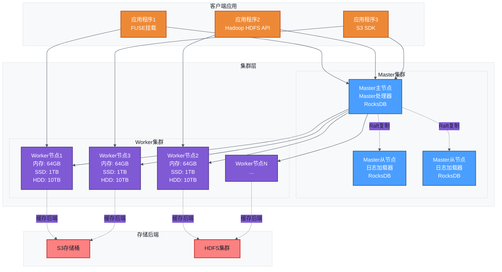
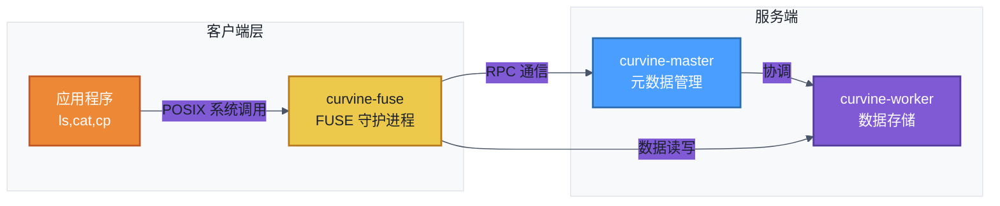

# 部署架构
在部署集群之前，您需要了解清楚curvine各个组件的作用，以及交互模式。下图展示了curvine的典型部署架构，自上而下分为三层：
- 应用层：包括 curvine-fuse、通过 SDK 接入的应用、CLI 运维工具等。详细内容请参考[接入方式](../../../3-User-Manuals/Access/fuse.md)。
- curvine集群服务层：由 curvine-master 和 curvine-worker 组成 curvine 集群。
- UFS集群作为底层存储后端通过[挂载](../../../3-User-Manuals/1-Key-Features/01-ufs.md#挂载)的方式接入到curvine集群上，比如S3、HDFS等集群

## 组件作用
**Master节点**：负责元数据管理、工作节点协调和负载均衡
- 维护文件系统元数据（目录结构、文件位置等）
- 管理Worker节点注册和健康检查
- 处理客户端的元数据请求
- 使用Raft共识算法确保元数据一致性

**Worker节点**：负责数据存储和处理 
- 存储实际数据块（支持内存、SSD、HDD多级缓存）
- 处理数据读写请求
- 定期向Master发送心跳
- 支持多副本数据存储

**FUSE接口**：提供POSIX文件系统接口，将分布式缓存挂载为本地文件系统

**S3 Gateway**：提供S3兼容的对象存储接口，支持S3 API

**客户端库**：提供多语言API，通过RPC与Master节和Worker节点通信

## curvine master, curvine worker 和 curvine fuse 的关系

## curvine fuse 使用场景
当需要让现有应用程序无需修改即可访问 Curvine 分布式缓存时，使用 FUSE 可以将 Curvine 挂载为本地文件系统。
- 默认挂载点
    - /curvine-fuse
    - /var/lib/curvine-fuse （Kubernetes 环境）
