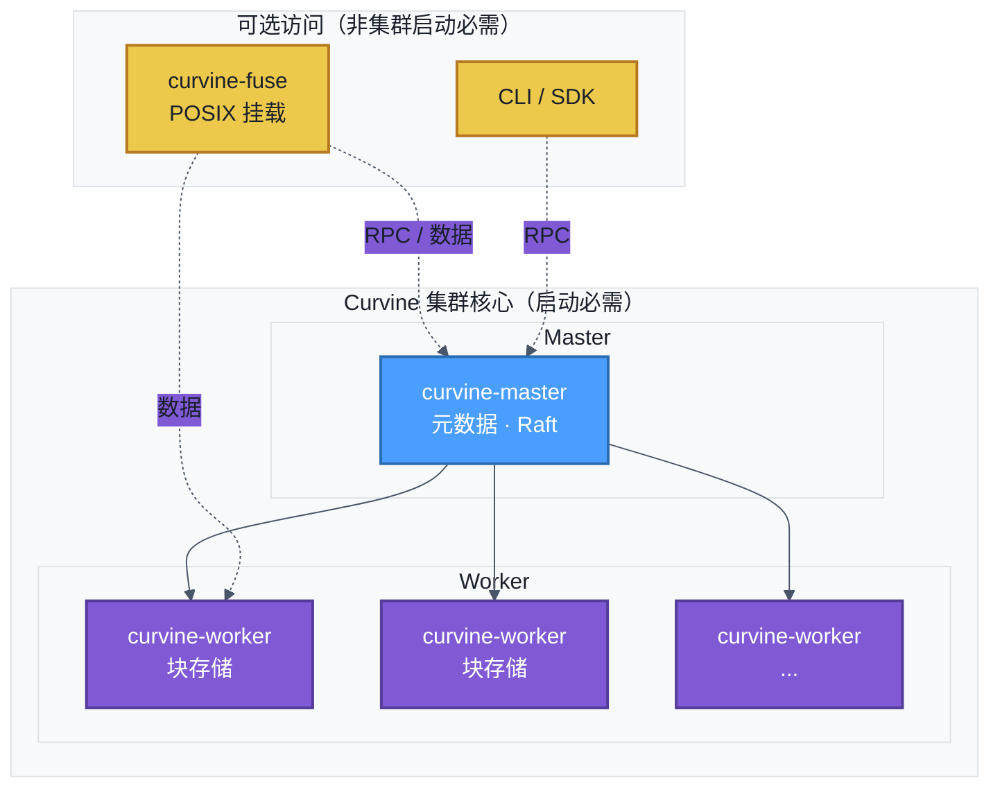

# 裸机部署

部署前需要[创建安装包与修改配置文件](../1-Preparation/03-deployment-setup.md#创建安装包)。

## 逻辑部署架构

下图是 Curvine 裸机部署的逻辑架构。**集群核心**仅由 Master 与 Worker 进程组成，二者启动后集群即可对外服务。FUSE 是**可选的**访问方式，**不参与**集群启动——仅在应用需要 POSIX 挂载点时再启用。



- **集群核心（必选）：** 在规划的主机上启动 `curvine-master` 与 `curvine-worker`。二者就绪后集群即可工作，可通过 CLI（`cv`）或 SDK 访问，**无需先启动 FUSE**。
- **FUSE（可选）：** 仅当需要 POSIX 文件系统挂载（如兼容旧工具、脚本）时再启动 `curvine-fuse`。FUSE 不是核心服务，集群的启动与运行不依赖它。

:::info
**FUSE 不参与集群启动。** Curvine 集群由 Master 与 Worker 组成。FUSE 与 CLI、SDK、S3 网关一样，只是多种访问方式之一，仅在应用需要本地挂载点时才有必要启用。
:::

---

:::warning
每台 Worker 需要有自己确定的 IP。多网卡环境下，建议通过环境变量显式指定 IP，避免自动取到预期外的网卡地址。
:::

## 启动命令

裸机部署需手动启动**集群核心**（master 与 worker）；仅在需要 POSIX 挂载的节点上**按需**启动 FUSE：

```bash
# 启动集群核心（必需）
bin/curvine-master.sh start
bin/curvine-worker.sh start

# 可选：仅当需要 POSIX 挂载点时再启动 FUSE
bin/curvine-fuse.sh start
```