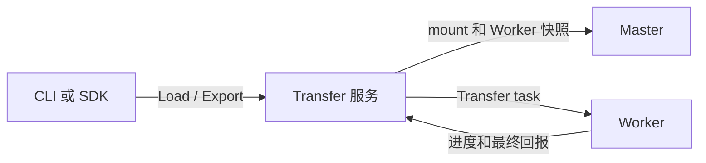

# Transfer 服务

Transfer 是用于 Load 和 Export 任务的独立服务。它持久化任务状态，基于 mount 和
Worker 信息规划任务，向 Worker 下发任务并接收回报。它不会保存完整 Curvine 元数据树
的副本。

应在 Master 和 Worker 健康后再部署 Transfer。它是可选服务：未启用 Transfer 的集群
继续使用原有的 Master Load 和 Export 路径。



## 配置边界

服务端与客户端使用不同的 Transfer 配置。部署 Transfer 时，不要修改正在运行的 Master
或 Worker 配置。

| 组件 | 必需变更 | 说明 |
| --- | --- | --- |
| Transfer 服务 | 配置 `transfer.enabled = true`、持久化 `store_url` 和可访问 endpoint。 | 服务配置还必须包含现有集群的 Master 地址。 |
| CLI 或 SDK 客户端 | 配置 `transfer.enabled = true` 和 `transfer.endpoints`。 | `cv load`、`cv export` 及兼容的查询/取消命令会自动使用 Transfer。 |
| Master | 无。灰度期间保持 Transfer 未启用。 | 启用后 Master 会拒绝旧 Load 和 Export RPC。 |
| Worker | 无。 | Worker 只需使用支持 Transfer task 的版本；回报 endpoint 随任务下发。 |

客户端配置中不需要数据库 URL。状态存储只属于 Transfer 服务端。

## 选择状态存储

| Store | 拓扑 | 适用场景 |
| --- | --- | --- |
| SQLite | 一个 Transfer 实例和一个持久化本地卷。 | 评估、开发或单实例部署。 |
| MySQL | 两个及以上 Transfer 实例共享同一个数据库。 | 生产高可用和滚动升级。 |

不要让多个 Transfer 实例使用彼此独立的 SQLite 文件。它们会持有不同的 Job 状态，无法
正确故障切换。

## 必填配置

Transfer 服务端需要一份完整的集群配置，其中包括 `[client]` 的 Master 地址。只在
Transfer 服务端配置中增加以下段落：

```toml
[transfer]
enabled = true
store_url = "sqlite:///var/lib/curvine-transfer/transfer.db"
hostname = "transfer-1.example.com"
endpoints = ["transfer-1.example.com:9010"]
```

使用 MySQL 时，将 `store_url` 改为共享的 MySQL URL。不要在客户端配置或 ConfigMap
中写入数据库凭据。

客户端只需要路由配置：

```toml
[transfer]
enabled = true
endpoints = ["transfer-1.example.com:9010"]
```

未配置 `endpoints` 时，Curvine 使用 `hostname:rpc_port` 推导一个地址。Kubernetes
或监听地址与访问地址不同的场景应显式配置 endpoint。

## 部署与验证

- [物理机部署](./1-Bare-Metal.md)
- [Kubernetes 部署](./2-Kubernetes.md)
- [Transfer 配置参考](../2-Deploy-Curvine-Cluster/3-Distributed-Mode/03-conf.md#transfer)

部署后，在已启用 Transfer 的客户端执行 `cv transfer list`。再对一个小型已挂载 UFS
文件执行 `cv load <path> --watch`，确认任务进入 `Completed`，并使用
`cv fs --cache-only get` 读取目标。

## 灰度与回滚

按客户端逐步启用 Transfer。`transfer.enabled = false` 的客户端继续调用旧 Master Job
API，因此单独部署 Transfer 不会改变已有工作负载。回滚客户端时只需关闭该客户端的
Transfer；存在运行中任务时，不要删除 Transfer Store。
