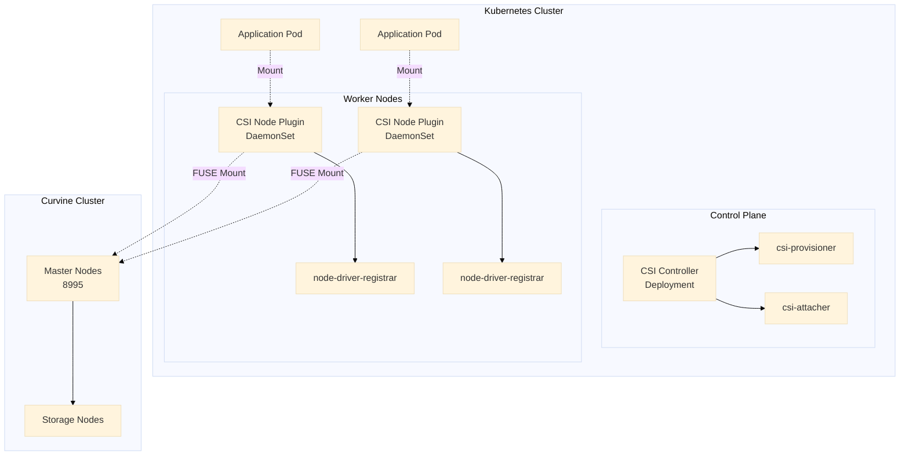

# K8S CSI驱动
为了更方便在云原生环境下快速接入curvine, curinve提供了csi驱动支持, 你的Pod容器可以通过`PV`(Persisit Volume) 的方式来访问curvine, 无需对应用进行改造，即可使用curvine缓存能力；

Curvine CSI驱动遵循标准的CSI规范，包含 
- `CSI Controller`,  以`Deployment`模式或者`Statefuleset`模式部署
- `CSI Node Plugin`， 以`DaemonSet`模式部署

## 架构概述

Curvine CSI 驱动采用标准的 CSI 架构，包含两个主要组件：



### 核心组件

1. **CSI Controller**
   - 运行在 Control Plane
   - 负责 Volume 的创建、删除、Attach/Detach 操作
   - 包含 csi-provisioner 和 csi-attacher sidecar

2. **CSI Node Plugin**
   - 以 DaemonSet 方式运行在每个 Worker Node
   - 负责将 Curvine 存储挂载到 Pod
   - 使用 FUSE 技术实现文件系统挂载

3. **FUSE 挂载机制**
   - 直接挂载 Curvine 文件系统路径
   - 相同路径共享 FUSE 进程，节省资源
   - 支持多个 Pod 并发访问

---

## 前置条件

### 环境要求

- Kubernetes 1.19+
- Helm 3.0+
- 可访问的 Curvine 集群（Master 节点地址和端口）
- 具有集群管理员权限

### 检查环境

```bash
# 检查 Kubernetes 版本
kubectl version --short

# 检查 Helm 版本
helm version --short

# 检查节点状态
kubectl get nodes
```

---

## 一、安装 Curvine CSI

### 1.1 获取 Helm Chart

```bash
helm repo add curvine https://curvineio.github.io/helm-charts
helm repo update
helm search repo curvine --devel
helm install curvine-csi curvine/curvine-csi \ 
    --namespace curvine-system \ 
    --create-namespace --devel \ 
    --version 0.0.1-dev+7ffc6a2
```


:::tip
当前curvine helm仓库提供的为预发版本
- 需要使用`--devel`可以查看到，上述命令`--version` 切换为自己需要的版本， 后续陆续提供正式release版本
- curvine-csi 通过helm 默认安装在`curvine-system` namespace下
:::

### 1.2 配置自定义参数（可选）
curvine-csi支持丰富的自定义参数， 如果您的网络环境有限制，则可以通过自定义镜像等方式来使用。

例如， 创建 `custom-values.yaml` 文件：

```yaml
# 镜像配置
image:
  repository: ghcr.io/curvineio/curvine-csi
  tag: latest
  pullPolicy: IfNotPresent

# Controller 配置
controller:
  replicas: 1
  resources:
    requests:
      cpu: 100m
      memory: 128Mi
    limits:
      cpu: 500m
      memory: 512Mi

# Node 配置
node:
  resources:
    requests:
      cpu: 100m
      memory: 128Mi
    limits:
      cpu: 500m
      memory: 512Mi
```

helm指定自定义参数
```bash
helm install curvine-csi curvine/curvine-csi \ 
    --namespace curvine-system \ 
    --create-namespace --devel \ 
  --values custom-values.yaml

# 查看安装状态
helm status curvine-csi -n curvine-system
```

### 1.4 升级和卸载

```bash
# 升级
helm upgrade curvine curvine/curvine-csi -n curvine-system --devel --version xxxxx

# 卸载
helm uninstall curvine-csi -n curvine-system

# 完全清理（包括 namespace）
kubectl delete namespace curvine-system
```

---

## 二、验证和检查状态

### 2.1 检查 CSI Driver 注册

```bash
# 查看 CSI Driver 是否注册成功
kubectl get csidriver curvine

# 输出示例：
# NAME      ATTACHREQUIRED   PODINFOONMOUNT   STORAGECAPACITY
# curvine   false            false            false
```

**参数说明：**
- `ATTACHREQUIRED: false` - 不需要 Attach 操作（FUSE 直接挂载）
- `PODINFOONMOUNT: false` - 挂载时不需要 Pod 信息

### 2.2 检查 Controller 状态

```bash
# 查看 Controller Deployment
kubectl get deployment -n curvine-system curvine-csi-controller

# 查看 Controller Pod
kubectl get pods -n curvine-system -l app=curvine-csi-controller

# 查看 Controller 日志
kubectl logs -n curvine-system \
  -l app=curvine-csi-controller \
  -c csi-plugin \
  --tail=50

# 查看 Provisioner Sidecar 日志
kubectl logs -n curvine-system \
  -l app=curvine-csi-controller \
  -c csi-provisioner \
  --tail=50
```

### 2.3 检查 Node Plugin 状态

```bash
# 查看 Node DaemonSet
kubectl get daemonset -n curvine-system curvine-csi-node

# 查看所有 Node Plugin Pod
kubectl get pods -n curvine-system -l app=curvine-csi-node -o wide

# 查看特定 Node 的日志
kubectl logs -n curvine-system curvine-csi-node-xxxxx -c csi-plugin

# 查看 Node Registrar 日志
kubectl logs -n curvine-system curvine-csi-node-xxxxx -c node-driver-registrar
```

## 三、StorageClass 详解

StorageClass 是 Kubernetes 中定义存储类型的资源，用于动态 PV 的自动创建。

### 3.1 StorageClass 配置示例

```yaml
apiVersion: storage.k8s.io/v1
kind: StorageClass
metadata:
  name: curvine-sc
provisioner: curvine                      # CSI 驱动名称
reclaimPolicy: Delete                     # 回收策略
volumeBindingMode: Immediate              # 绑定模式
allowVolumeExpansion: true                # 允许扩容
parameters:
  # 必需：Curvine 集群连接信息
  master-addrs: "master1:8995,master2:8995,master3:8995"
  
  # 必需：文件系统路径前缀
  fs-path: "/k8s-volumes"
  
  # 可选：路径创建策略
  path-type: "DirectoryOrCreate"
  
  # 可选：FUSE 参数
  io-threads: "4"
  worker-threads: "8"
```

### 3.2 参数详解

#### 核心参数

| 参数 | 必需 | 说明 | 示例 |
|-----|------|------|------|
| `master-addrs` | ✅ | Curvine Master 节点地址列表，用逗号分隔 | `"10.0.0.1:8995,10.0.0.2:8995"` |
| `fs-path` | ✅ | 动态 PV 的路径前缀，实际路径为 `fs-path + pv-name` | `"/k8s-volumes"` |
| `path-type` | ❌ | 路径创建策略，默认 `Directory` | `"DirectoryOrCreate"` |
| `io-threads` | ❌ | FUSE IO 线程数 | `"4"` |
| `worker-threads` | ❌ | FUSE 工作线程数 | `"8"` |

#### 路径创建策略 (path-type)

- **`Directory`** (默认)
  - 路径必须已存在
  - 推荐用于生产环境
  - 确保路径由管理员预先创建

- **`DirectoryOrCreate`**
  - 路径不存在时自动创建
  - 适合测试和开发环境
  - 注意权限问题

#### 回收策略 (reclaimPolicy)

- **`Delete`** (推荐用于动态 PV)
  - PVC 删除时，自动删除 PV 和存储数据
  - 适合临时数据和测试环境

- **`Retain`**
  - PVC 删除后，PV 保留
  - 数据需要手动清理
  - 适合重要数据保护

#### 绑定模式 (volumeBindingMode)

- **`Immediate`** (默认)
  - PVC 创建后立即绑定 PV
  - 适合单 AZ 集群

- **`WaitForFirstConsumer`**
  - 等到 Pod 调度后再绑定 PV
  - 适合多 AZ 集群，确保 PV 在 Pod 所在节点可用

### 3.3 动态 PV 路径生成规则

```
实际挂载路径 = fs-path + "/" + pv-name
```

**示例：**
```yaml
# StorageClass 配置
fs-path: "/k8s-volumes"

# 自动生成的 PV 名称
pv-name: "pvc-1234-5678-abcd"

# 最终 Curvine 路径
实际路径: "/k8s-volumes/pvc-1234-5678-abcd"
```

### 3.4 创建 StorageClass

```bash
# 创建 StorageClass
kubectl apply -f - <<EOF
apiVersion: storage.k8s.io/v1
kind: StorageClass
metadata:
  name: curvine-sc
provisioner: curvine
reclaimPolicy: Delete
volumeBindingMode: Immediate
allowVolumeExpansion: true
parameters:
  master-addrs: "m0:8995,m1:8995,m2:8995"
  fs-path: "/k8s-volumes"
  path-type: "DirectoryOrCreate"
EOF

# 查看 StorageClass
kubectl get storageclass curvine-sc

# 设置为默认 StorageClass（可选）
kubectl patch storageclass curvine-sc \
  -p '{"metadata": {"annotations":{"storageclass.kubernetes.io/is-default-class":"true"}}}'
```

:::tip
上述示例中的 `master-addrs` 一定要替换为实际的master地址.
:::

### 3.5 多 StorageClass 场景

可以创建多个 StorageClass 用于不同场景：

```yaml
# 生产环境 - 严格模式
---
apiVersion: storage.k8s.io/v1
kind: StorageClass
metadata:
  name: curvine-prod
provisioner: curvine
reclaimPolicy: Retain
volumeBindingMode: WaitForFirstConsumer
parameters:
  master-addrs: "prod-master1:8995,prod-master2:8995"
  fs-path: "/production"
  path-type: "Directory"

# 开发环境 - 宽松模式
---
apiVersion: storage.k8s.io/v1
kind: StorageClass
metadata:
  name: curvine-dev
provisioner: curvine
reclaimPolicy: Delete
volumeBindingMode: Immediate
parameters:
  master-addrs: "dev-master:8995"
  fs-path: "/development"
  path-type: "DirectoryOrCreate"
```

---

## 四、静态 PV 使用方式

静态 PV 用于挂载 Curvine 中已存在的数据目录，适合以下场景：
- 多个集群共享同一数据
- 需要精确控制数据路径

### 4.1 工作原理

```
Curvine 集群已有数据
    ↓
管理员创建 PV，指定 curvine-path
    ↓
用户创建 PVC，绑定到指定 PV
    ↓
Pod 挂载 PVC
```

### 4.2 创建静态 PV

```yaml
apiVersion: v1
kind: PersistentVolume
metadata:
  name: curvine-pv-existing-data
  labels:
    type: curvine-static
spec:
  storageClassName: curvine-sc
  capacity:
    storage: 100Gi                    # 声明容量
  accessModes:
    - ReadWriteMany                   # 支持多 Pod 读写
  persistentVolumeReclaimPolicy: Retain  # 保留数据
  csi:
    driver: curvine
    volumeHandle: "existing-data-volume-001"  # 唯一标识符
    volumeAttributes:
      # 必需：Curvine Master 地址
      master-addrs: "m0:8995,m1:8995,m2:8995"
      
      # 必需：Curvine 中的完整路径
      curvine-path: "/production/user-data"
      
      # 推荐：使用 Directory 确保路径存在
      path-type: "Directory"
      
      # 可选：FUSE 参数
      io-threads: "4"
      worker-threads: "8"
```

**参数说明：**
- `volumeHandle`: 任意唯一字符串，用于标识 PV
- `curvine-path`: Curvine 文件系统中的完整路径，必须已存在
- `path-type: Directory`: 要求路径必须存在（推荐）

### 4.3 创建静态 PVC

```yaml
apiVersion: v1
kind: PersistentVolumeClaim
metadata:
  name: curvine-pvc-existing-data
  namespace: default
spec:
  storageClassName: curvine-sc
  accessModes:
    - ReadWriteMany
  resources:
    requests:
      storage: 100Gi
  # 关键：指定要绑定的 PV 名称
  volumeName: curvine-pv-existing-data
```

### 4.4 验证绑定

```bash
# 查看 PV 状态
kubectl get pv curvine-pv-existing-data
# STATUS 应该是 Bound

# 查看 PVC 状态
kubectl get pvc curvine-pvc-existing-data
# STATUS 应该是 Bound

# 查看详细信息
kubectl describe pvc curvine-pvc-existing-data
```

### 4.5 在 Pod 中使用静态 PV

```yaml
apiVersion: v1
kind: Pod
metadata:
  name: static-pv-test
spec:
  containers:
  - name: app
    image: nginx:alpine
    volumeMounts:
    - name: data
      mountPath: /data
  volumes:
  - name: data
    persistentVolumeClaim:
      claimName: curvine-pvc-existing-data
```

## 五、动态 PV 使用方式

动态 PV 是最常用的方式，由 CSI Controller 自动创建和管理。

### 5.1 工作原理

```
用户创建 PVC，指定 StorageClass
    ↓
CSI Provisioner 自动创建 PV
    ↓
自动生成 Curvine 路径：fs-path + pv-name
    ↓
PVC 自动绑定到 PV
    ↓
Pod 挂载 PVC 使用
```

### 5.2 创建动态 PVC

动态pvc是需要指定storageclass， 无需指定volumeName

```yaml
apiVersion: v1
kind: PersistentVolumeClaim
metadata:
  name: my-dynamic-pvc
  namespace: default
spec:
  storageClassName: curvine-sc    # 指定 StorageClass
  accessModes:
    - ReadWriteOnce               # 或 ReadWriteMany
  resources:
    requests:
      storage: 10Gi               # 请求容量
```

### 5.3 自动路径生成示例

```yaml
# StorageClass 配置
fs-path: "/k8s-volumes"

# PVC 名称
name: my-dynamic-pvc

# 自动生成的 PV
# volumeHandle: pvc-1a2b3c4d-5e6f-7g8h-9i0j-k1l2m3n4o5p6

# 实际 Curvine 路径
# /k8s-volumes/pvc-1a2b3c4d-5e6f-7g8h-9i0j-k1l2m3n4o5p6

# 可以通过curvine的cv命令查看是否正确在curvine集群创建了卷
./bin/cv fs ls /
```

### 5.4 动态 PV 完整示例

```bash
# 1. 创建动态 PVC
kubectl apply -f - <<EOF
apiVersion: v1
kind: PersistentVolumeClaim
metadata:
  name: app-data-pvc
  namespace: default
spec:
  storageClassName: curvine-sc
  accessModes:
    - ReadWriteMany
  resources:
    requests:
      storage: 20Gi
EOF

# 2. 查看 PVC 状态（应该自动 Bound）
kubectl get pvc app-data-pvc
kubectl describe pvc app-data-pvc

# 3. 查看自动创建的 PV
kubectl get pv

# 4. 创建使用 PVC 的 Pod
kubectl apply -f - <<EOF
apiVersion: v1
kind: Pod
metadata:
  name: dynamic-pv-test
spec:
  containers:
  - name: app
    image: nginx:alpine
    volumeMounts:
    - name: data
      mountPath: /usr/share/nginx/html
  volumes:
  - name: data
    persistentVolumeClaim:
      claimName: app-data-pvc
EOF

# 5. 测试写入和读取
kubectl exec dynamic-pv-test -- sh -c 'echo "Hello Curvine" > /usr/share/nginx/html/index.html'
kubectl exec dynamic-pv-test -- cat /usr/share/nginx/html/index.html
```

## 六、Deployment 中使用动态 PV

Deployment 适合无状态应用，多个副本共享同一存储。

### 6.1 架构模式

```
           Deployment (3 replicas)
               /      |      \
            Pod-1  Pod-2  Pod-3
               \      |      /
                Single PVC (RWX)
                      |
              Curvine Volume (Shared)
```

### 6.2 完整示例

```yaml
# deployment-with-pvc.yaml
---
# 1. 创建共享 PVC
apiVersion: v1
kind: PersistentVolumeClaim
metadata:
  name: shared-data-pvc
  namespace: default
spec:
  storageClassName: curvine-sc
  accessModes:
    - ReadWriteMany
  resources:
    requests:
      storage: 10Gi

---
# 2. 创建 Deployment
apiVersion: apps/v1
kind: Deployment
metadata:
  name: web-app
  namespace: default
spec:
  replicas: 3
  selector:
    matchLabels:
      app: web-app
  template:
    metadata:
      labels:
        app: web-app
    spec:
      containers:
      - name: nginx
        image: nginx:alpine
        ports:
        - containerPort: 80
        volumeMounts:
        - name: shared-storage
          mountPath: /usr/share/nginx/html
        command:
        - /bin/sh
        - -c
        - |
          if [ ! -f /usr/share/nginx/html/index.html ]; then
            echo "<h1>App initialized by command</h1>" > /usr/share/nginx/html/index.html
          fi
          exec nginx -g 'daemon off;'
        livenessProbe:
          httpGet:
            path: /
            port: 80
          initialDelaySeconds: 10
        readinessProbe:
          httpGet:
            path: /
            port: 80
          initialDelaySeconds: 5
      volumes:
      - name: shared-storage
        persistentVolumeClaim:
          claimName: shared-data-pvc  # 共享同一 PVC

---
# 3. 创建 Service
apiVersion: v1
kind: Service
metadata:
  name: web-app-service
  namespace: default
spec:
  selector:
    app: web-app
  ports:
  - port: 80
    targetPort: 80
  type: ClusterIP
```

:::tip
对于Devployment应用，kubernetes原生定位于无状态服务，也就是所有的副本pod默认都读写的是同一个pv的路径。 如果你的应用程序又需要在curvine上有不同的路径隔离， 也可以尝试使用 社区的open kruise的`CloneSets` 作为替代，支持VolumeCliamTemplates， 参考 https://openkruise.io/zh/docs/user-manuals/cloneset
:::

### 6.3 部署和验证

```bash
# 1. 部署应用
kubectl apply -f deployment-with-pvc.yaml

# 2. 查看 PVC 状态
kubectl get pvc shared-data-pvc

# 3. 查看所有 Pod
kubectl get pods -l app=web-app -o wide

# 4. 验证所有 Pod 都挂载了同一 PVC
kubectl get pods -l app=web-app -o jsonpath='{range .items[*]}{.metadata.name}{"\t"}{.spec.volumes[0].persistentVolumeClaim.claimName}{"\n"}{end}'

# 5. 在一个 Pod 写入数据
POD1=$(kubectl get pod -l app=web-app -o jsonpath='{.items[0].metadata.name}')
kubectl exec $POD1 -- sh -c 'echo "Hello from Pod 1" > /usr/share/nginx/html/test.html'

# 6. 在另一个 Pod 读取数据（验证共享）
POD2=$(kubectl get pod -l app=web-app -o jsonpath='{.items[1].metadata.name}')
kubectl exec $POD2 -- cat /usr/share/nginx/html/test.html
# 应该输出: Hello from Pod 1

# 7. 验证 Service 访问
kubectl run curl-test --image=curlimages/curl --rm -it --restart=Never -- curl http://web-app-service/test.html
```

## 七、StatefulSet 中使用动态 PV

StatefulSet 适合有状态应用，每个 Pod 拥有独立的持久化存储。

### 7.1 架构模式

```
        StatefulSet (3 replicas)
            |         |         |
         Pod-0     Pod-1     Pod-2
            |         |         |
         PVC-0     PVC-1     PVC-2
            |         |         |
          PV-0      PV-1      PV-2
            |         |         |
     /path/pvc-0  /path/pvc-1  /path/pvc-2
```

### 7.2 完整示例

```yaml
# statefulset-web-app.yaml
---
# 1. Headless Service（必需）
apiVersion: v1
kind: Service
metadata:
  name: web-app-service
  namespace: default
spec:
  clusterIP: None                # Headless Service
  selector:
    app: web-app
  ports:
  - port: 80
    name: web

---
# 2. StatefulSet with VolumeClaimTemplates
apiVersion: apps/v1
kind: StatefulSet
metadata:
  name: web-app
  namespace: default
spec:
  serviceName: web-app-service   # 必须指定 Service
  replicas: 3
  selector:
    matchLabels:
      app: web-app
  template:
    metadata:
      labels:
        app: web-app
    spec:
      containers:
      - name: nginx
        image: nginx:alpine
        ports:
        - containerPort: 80
          name: web
        volumeMounts:
        - name: data                # 必须与 volumeClaimTemplates 名称一致
          mountPath: /usr/share/nginx/html
        command:
        - /bin/sh
        - -c
        - |
          # Write hello world message with pod name
          echo "<h1>Hello from $(hostname)</h1>" > /usr/share/nginx/html/index.html
          echo "<p>This is my persistent storage!</p>" >> /usr/share/nginx/html/index.html
          echo "<p>Created at: $(date)</p>" >> /usr/share/nginx/html/index.html
          # Start nginx
          nginx -g 'daemon off;'
  # 关键：VolumeClaimTemplates
  volumeClaimTemplates:
  - metadata:
      name: data                    # PVC 名称前缀
    spec:
      storageClassName: curvine-sc
      accessModes:
        - ReadWriteOnce             # 每个 Pod 独立存储
      resources:
        requests:
          storage: 1Gi
```

### 7.3 部署和验证

```bash
# 1. 部署 StatefulSet
kubectl apply -f statefulset-web-app.yaml

# 2. 查看 Pod 创建顺序（按序创建）
kubectl get pods -l app=web-app -w

# 3. 查看 PVC（自动创建，每个 Pod 一个）
kubectl get pvc
# 输出示例：
# data-web-app-0   Bound    pvc-xxx   1Gi       RWO
# data-web-app-1   Bound    pvc-yyy   1Gi       RWO
# data-web-app-2   Bound    pvc-zzz   1Gi       RWO

# 4. 查看 PV（自动创建）
kubectl get pv

# 5. 验证每个 Pod 有独立的存储
for i in 0 1 2; do
  echo "=== Pod web-app-$i ==="
  kubectl exec web-app-$i -- cat /usr/share/nginx/html/index.html
done

# 6. 写入自定义数据到 Pod-0
kubectl exec web-app-0 -- sh -c \
  'echo "<p>Custom data from Pod-0</p>" >> /usr/share/nginx/html/index.html'

# 7. 验证 Pod-0 的数据
kubectl exec web-app-0 -- cat /usr/share/nginx/html/index.html

# 8. 验证 Pod-1 没有 Pod-0 的自定义数据（独立存储）
kubectl exec web-app-1 -- cat /usr/share/nginx/html/index.html

# 9. 测试持久化：删除 Pod-0 后数据仍然存在
kubectl delete pod web-app-0
# 等待 Pod 重建
kubectl wait --for=condition=Ready pod/web-app-0 --timeout=60s
# 验证数据依然存在
kubectl exec web-app-0 -- cat /usr/share/nginx/html/index.html
```

### 7.4 StatefulSet 特性

#### PVC 命名规则

```
PVC 名称 = volumeClaimTemplate.name + "-" + StatefulSet.name + "-" + Pod序号

示例：
data-web-app-0
data-web-app-1
data-web-app-2
```

#### Pod 和 PVC 生命周期

```bash
# 1. 删除 Pod，PVC 不会被删除
kubectl delete pod web-app-0
# Pod 重建后会自动绑定回原来的 PVC，数据保留

# 2. 删除 StatefulSet，保留 PVC（推荐）
kubectl delete statefulset web-app --cascade=orphan
# PVC 和数据都保留

# 3. 删除 StatefulSet 和 Pod，但保留 PVC
kubectl delete statefulset web-app
# 需要手动删除 PVC

# 4. 手动删除 PVC
kubectl delete pvc data-web-app-0
```

#### 扩缩容

```bash
# 1. 扩容（增加副本）
kubectl scale statefulset web-app --replicas=5
# 自动创建 web-app-3, web-app-4 和对应的 PVC

# 2. 缩容（减少副本）
kubectl scale statefulset web-app --replicas=2
# web-app-2 被删除，但 PVC data-web-app-2 保留

# 3. 重新扩容
kubectl scale statefulset web-app --replicas=3
# web-app-2 重建并绑定回 data-web-app-2，数据恢复
```

#### FUSE 进程共享

```yaml
# 多个 PV 共享 FUSE 进程的条件：
# 1. 相同的 master-addrs
# 2. 相同的 curvine-path

# 示例：这两个 PV 会共享 FUSE 进程
PV1:
  master-addrs: "10.0.0.1:8995"
  curvine-path: "/shared-data"

PV2:
  master-addrs: "10.0.0.1:8995"
  curvine-path: "/shared-data"

# 这两个 PV 会有独立的 FUSE 进程
PV3:
  curvine-path: "/data-1"

PV4:
  curvine-path: "/data-2"
```

## 附录
### Helm自定义参数
#### 全局配置 (Global Settings)

| 参数路径 | 类型 | 默认值 | 说明 |
|---------|------|--------|------|
| `global.namespace` | string | `curvine-system` | CSI驱动部署的命名空间 |

#### 镜像配置 (Image Settings)

| 参数路径 | 类型 | 默认值 | 说明 |
|---------|------|--------|------|
| `image.repository` | string | `ghcr.io/curvineio/curvine-csi` | CSI驱动镜像仓库地址 |
| `image.tag` | string | `latest` | CSI驱动镜像标签版本 |
| `image.pullPolicy` | string | `Always` | 镜像拉取策略 (Always/IfNotPresent/Never) |

#### CSI驱动配置 (CSI Driver Settings)

| 参数路径 | 类型 | 默认值 | 说明 |
|---------|------|--------|------|
| `csiDriver.name` | string | `curvine` | CSI驱动名称标识 |
| `csiDriver.attachRequired` | boolean | `false` | 是否需要attach操作（卷附加到节点） |
| `csiDriver.podInfoOnMount` | boolean | `false` | 挂载时是否需要Pod信息 |

#### Controller配置 (Controller Settings)

| 参数路径 | 类型 | 默认值 | 说明 |
|---------|------|--------|------|
| `controller.name` | string | `curvine-csi-controller` | Controller Deployment名称 |
| `controller.replicas` | int | `1` | Controller副本数量 |
| `controller.priorityClassName` | string | `system-cluster-critical` | Controller优先级类名（高优先级） |
| `controller.container.name` | string | `csi-plugin` | 主容器名称 |
| `controller.container.command` | array | `["/opt/curvine/csi"]` | 容器启动命令 |
| `controller.container.args` | array | 见values.yaml | 容器启动参数 |
| `controller.container.env.CSI_ENDPOINT` | string | `unix:///csi/csi.sock` | CSI套接字端点地址 |
| `controller.container.livenessProbe.failureThreshold` | int | `5` | 存活探针失败次数阈值 |
| `controller.container.livenessProbe.initialDelaySeconds` | int | `10` | 存活探针初始延迟秒数 |
| `controller.container.livenessProbe.periodSeconds` | int | `10` | 存活探针检查周期（秒） |
| `controller.container.livenessProbe.timeoutSeconds` | int | `3` | 存活探针超时时间（秒） |
| `controller.container.ports.healthz` | int | `9909` | 健康检查端口 |
| `controller.container.securityContext.privileged` | boolean | `true` | 是否以特权模式运行 |
| `controller.container.securityContext.capabilities.add` | array | `[SYS_ADMIN]` | 添加的Linux Capabilities |
| `controller.tolerations` | array | 见values.yaml | Pod容忍度配置（允许CriticalAddons调度） |

#### Controller Sidecar容器配置

| 参数路径 | 类型 | 默认值 | 说明 |
|---------|------|--------|------|
| `controller.sidecars.provisioner.image` | string | `quay.io/k8scsi/csi-provisioner:v1.6.0` | Provisioner sidecar镜像 |
| `controller.sidecars.provisioner.args` | array | 见values.yaml | Provisioner参数（超时60s，日志级别v5） |
| `controller.sidecars.attacher.image` | string | `registry.k8s.io/sig-storage/csi-attacher:v4.5.0` | Attacher sidecar镜像 |
| `controller.sidecars.attacher.args` | array | 见values.yaml | Attacher参数（日志级别v5） |
| `controller.sidecars.livenessProbe.image` | string | `registry.k8s.io/sig-storage/livenessprobe:v2.11.0` | LivenessProbe sidecar镜像 |
| `controller.sidecars.livenessProbe.args` | array | 见values.yaml | LivenessProbe参数 |
| `controller.sidecars.livenessProbe.env.HEALTH_PORT` | string | `"9909"` | 健康检查端口 |

#### Node配置 (Node Settings)

| 参数路径 | 类型 | 默认值 | 说明 |
|---------|------|--------|------|
| `node.name` | string | `curvine-csi-node` | Node DaemonSet名称 |
| `node.priorityClassName` | string | `system-node-critical` | Node优先级类名（节点关键级别） |
| `node.dnsPolicy` | string | `ClusterFirstWithHostNet` | DNS策略（集群优先+主机网络） |
| `node.container.name` | string | `csi-plugin` | 主容器名称 |
| `node.container.command` | array | `["/opt/curvine/csi"]` | 容器启动命令 |
| `node.container.args` | array | 见values.yaml | 容器启动参数 |
| `node.container.env.CSI_ENDPOINT` | string | `unix:///csi/csi.sock` | CSI套接字端点地址 |
| `node.container.livenessProbe.failureThreshold` | int | `5` | 存活探针失败次数阈值 |
| `node.container.livenessProbe.initialDelaySeconds` | int | `10` | 存活探针初始延迟秒数 |
| `node.container.livenessProbe.periodSeconds` | int | `10` | 存活探针检查周期（秒） |
| `node.container.livenessProbe.timeoutSeconds` | int | `3` | 存活探针超时时间（秒） |
| `node.container.ports.healthz` | int | `9909` | 健康检查端口 |
| `node.container.securityContext.privileged` | boolean | `true` | 是否以特权模式运行 |
| `node.container.lifecycle.preStop` | object | 见values.yaml | 容器停止前钩子（清理socket文件） |
| `node.tolerations` | array | `[{operator: Exists}]` | Pod容忍度配置（容忍所有污点） |

#### Node Sidecar容器配置

| 参数路径 | 类型 | 默认值 | 说明 |
|---------|------|--------|------|
| `node.sidecars.nodeDriverRegistrar.image` | string | `quay.io/k8scsi/csi-node-driver-registrar:v2.1.0` | Node驱动注册器镜像 |
| `node.sidecars.nodeDriverRegistrar.args` | array | 见values.yaml | 注册器参数（日志级别v5） |
| `node.sidecars.nodeDriverRegistrar.env.ADDRESS` | string | `/csi/csi.sock` | CSI套接字地址 |
| `node.sidecars.nodeDriverRegistrar.env.DRIVER_REG_SOCK_PATH` | string | `/var/lib/kubelet/csi-plugins/csi.curvine.io/csi.sock` | Kubelet中驱动注册路径 |
| `node.sidecars.livenessProbe.image` | string | `registry.k8s.io/sig-storage/livenessprobe:v2.11.0` | LivenessProbe sidecar镜像 |
| `node.sidecars.livenessProbe.args` | array | 见values.yaml | LivenessProbe参数 |
| `node.sidecars.livenessProbe.env.ADDRESS` | string | `/csi/csi.sock` | CSI套接字地址 |
| `node.sidecars.livenessProbe.env.HEALTH_PORT` | string | `"9909"` | 健康检查端口 |

#### Node主机路径配置

| 参数路径 | 类型 | 默认值 | 说明 |
|---------|------|--------|------|
| `node.hostPaths.pluginDir.path` | string | `/var/lib/kubelet/csi-plugins/csi.curvine.io/` | CSI插件目录路径 |
| `node.hostPaths.pluginDir.type` | string | `DirectoryOrCreate` | 路径类型（不存在则创建） |
| `node.hostPaths.kubeletDir.path` | string | `/var/lib/kubelet` | Kubelet工作目录路径 |
| `node.hostPaths.kubeletDir.type` | string | `DirectoryOrCreate` | 路径类型（不存在则创建） |
| `node.hostPaths.registrationDir.path` | string | `/var/lib/kubelet/plugins_registry/` | 插件注册目录路径 |
| `node.hostPaths.registrationDir.type` | string | `Directory` | 路径类型（必须存在） |

#### 服务账户配置 (Service Account Settings)

| 参数路径 | 类型 | 默认值 | 说明 |
|---------|------|--------|------|
| `serviceAccount.controller.name` | string | `curvine-csi-controller-sa` | Controller服务账户名称 |
| `serviceAccount.node.name` | string | `curvine-csi-node-sa` | Node服务账户名称 |

#### RBAC配置

| 参数路径 | 类型 | 默认值 | 说明 |
|---------|------|--------|------|
| `rbac.create` | boolean | `true` | 是否创建RBAC资源（ClusterRole/ClusterRoleBinding） |

#### ConfigMap配置 (Curvine Cluster Configuration)

| 参数路径 | 类型 | 默认值 | 说明 |
|---------|------|--------|------|
| `configMap.name` | string | `curvine-config` | ConfigMap名称 |
| `configMap.defaultMode` | octal | `0755` | 文件默认权限模式 |
| `configMap.data.curvineClusterToml` | string | 见values.yaml | Curvine集群配置文件（TOML格式） |
| `configMap.data.curvineEnvSh` | string | 见values.yaml | Curvine环境变量脚本 |

#### ConfigMap中的Curvine集群配置参数

| 配置项 | 类型 | 默认值 | 说明 |
|-------|------|--------|------|
| `client.master_addrs` | array | `[{hostname: "localhost", port: 8995}]` | Curvine Master节点地址列表 |
| `log.level` | string | `"info"` | 日志级别 (debug/info/warn/error) |
| `log.log_dir` | string | `"stdout"` | 日志输出目录（stdout表示标准输出） |
| `log.file_name` | string | `"curvine.log"` | 日志文件名 |

#### StorageClass参数 (使用时配置)

| 参数名 | 是否必需 | 类型 | 默认值 | 说明 |
|--------|---------|------|--------|------|
| `master-addrs` | **必需** | string | 无 | Curvine Master节点地址，格式: `host:port,host:port` |
| `fs-path` | **必需** | string | 无 | 文件系统路径前缀，每个PV会创建: `fs-path + pv-name` |
| `path-type` | 可选 | string | `Directory` | 路径创建策略: `DirectoryOrCreate` 或 `Directory` |
| `io-threads` | 可选 | string | 无 | FUSE IO线程数量 |
| `worker-threads` | 可选 | string | 无 | FUSE工作线程数量 |