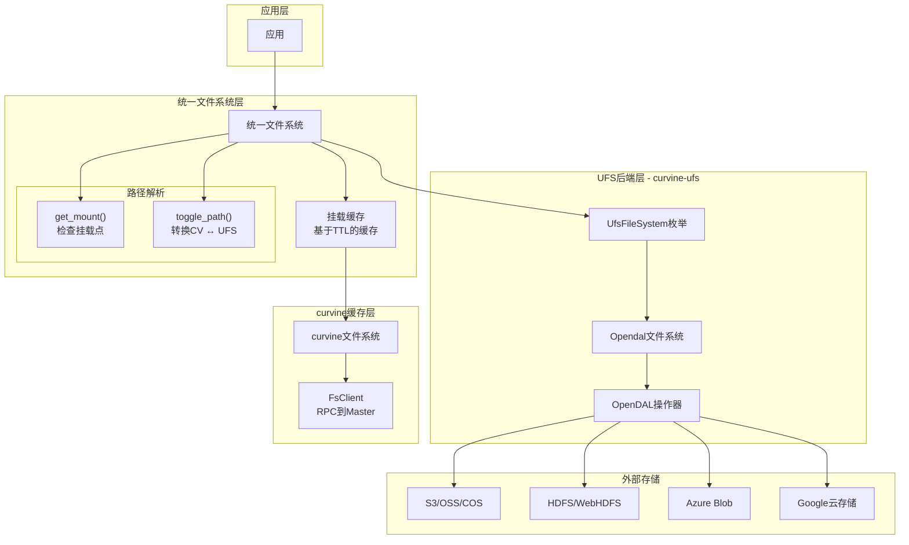
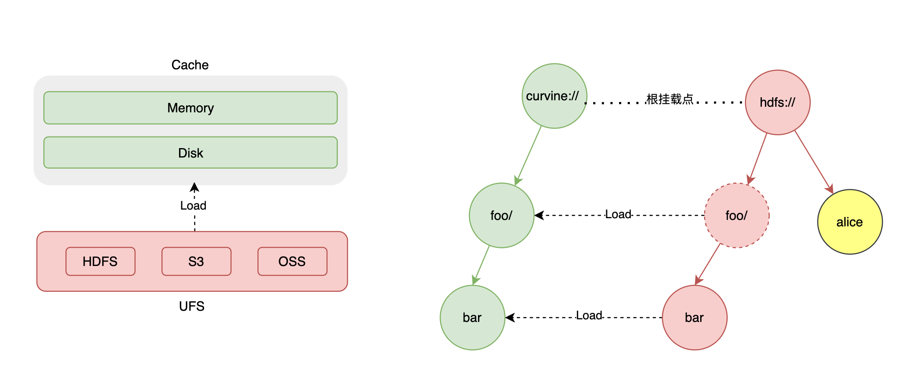

# 数据编排
Curvine 提供 UFS（统一文件系统）视图来管理所有支持分布式存储系统，包括 s3/hdfs 等。

## 挂载
Curvine 支持通过挂载到不同的 Curvine 路径来连接多个 UFS 源。Curvine 不提供默认的 UFS 配置，这意味着如果您要从 UFS 加载数据，必须先挂载 UFS 源。




Curvine 将挂载表持久化到元数据中，因此 Curvine 重启时无需重新挂载。但必须遵循一些规则。
- 不允许挂载到根路径。
- 挂载路径下不允许挂载其他 UFS。
- 相同的挂载路径不能挂载到不同的 UFS。

挂载命令：
```bash
bin/cv mount ufs_path curvine_path [configs]
```

- ufs_path：UFS 路径，例如 s3://bucket/path。
- curvine_path：Curvine 路径，例如 /ufs/path。
- configs：可选参数，例如 access_key_id、secret_access_key、region、endpoint 等。

示例：
```
bin/cv mount s3://ai/xuen-test /s3 \
-c s3.endpoint_url=http://hostname.com \
-c s3.region_name=cn \
-c s3.credentials.access=access_key \
-c s3.credentials.secret=secret_key \
-c s3.path_style=true
```

:::tip
您可以在 UFS 挂载后使用 命令行、API 访问 ufs 目录、文件，但除非您加载特定路径，否则 ufs 数据不会自动同步到 curvine。
:::

### 挂载参数

| 参数 | 类型 | 默认值 | 说明 | 示例 |
|------|------|--------|------|------|
| `--ttl-ms` | duration | `0` | 缓存数据过期时间 | `24h`, `7d`, `30d` |
| `--ttl-action` | enum | `none` | 过期策略：`delete`/`none` | `delete` |
| `--replicas` | int | `1` | 数据副本数（1-5） | `3` |
| `--block-size` | size | `128MB` | 缓存块大小 | `64MB`, `128MB`, `256MB` |
| `--consistency-strategy` | enum | `always` | 一致性策略 | `none`/`always`/`period` |
| `--storage-type` | enum | `disk` | 存储介质类型 | `mem`/`ssd`/`disk` |

### 挂载模式
#### 写缓存
WriteType 控制数据在Curvine缓存和底层存储(UFS)之间的写入行为
| 模式 | 行为(同步/异步) | 一致性 | 适用场景 |
|---|---|---|---|
| Cache模式 | 仅写入Curvine缓存，不同步到UFS | 仅保证缓存内一致性，UFS中无数据 | 临时数据、scratch数据、可丢失的中间结果 |
| Through模式 | 直接写入UFS，绕过缓存 | 强一致性，数据直接持久化到UFS | 写一次读多次场景、缓存无益的数据 |
| AsyncThrough模式（默认） | 先写入缓存，异步同步到UFS，立即返回 | 最终一致性，缓存写入后立即可读，UFS异步更新 | 机器学习训练、平衡性能与持久性的场景 |
| CacheThrough模式 | 同步写入缓存和UFS，等待UFS完成才返回 | 强一致性，确保数据同时存在于缓存和UFS | 共享数据、需要强持久性保证的场景 |

#### 读缓存
ConsistencyStrategy 决定在读取日志时是否需要与底层存储（UFS）进行一致性校验
| 模式 | 行为 | 一致性 | 适用场景 |
|---|---|---|---|
| None | 信任缓存，读取时不进行一致性验证 | 没有一致性保证，可以读取到中期数据 | 高性能读取场景、相对固定的基础数据、临时数据/中间结果 |
| Always | 每次读取时都验证缓存是否与 UFS 匹配 | 强一致性保证，确保数据最新 | 数据间隙更新、多客户端共享数据、强一致性要求场景 |

:::note
TTL在Curvine中控制读缓存行为，通过确定缓存有效性来触发自动缓存刷新或清理操作。
:::

## 统一访问
UFS 挂载后，Curvine 提供了一个统一的文件系统视图，您可以像访问 Curvine 文件系统一样访问 UFS 文件系统；
客户端、命令行工具、fuse等都可以通过统一的路径访问 UFS 文件系统。

:::tip
- Curvine 不缓存 UFS 元数据，因此不存在访问数据一致性问题。从 Curvine访问 UFS 和直接访问 UFS 没有区别。
当 Curvine 缓存数据读取失败时，自动回退到UFS读取数据。
- 如果使用cv命令，可以通过cache-only参数来临时关闭统一访问，以查看仅缓存在curvine中的文件。 详见[fs子命令](../2-Operations/02-cli.md#3-fs-子命令)
:::

## 关闭统一访问
如果您不想使用统一访问，可以添加、修改如下配置：
```
[client]
enable_unified_fs = false
```

