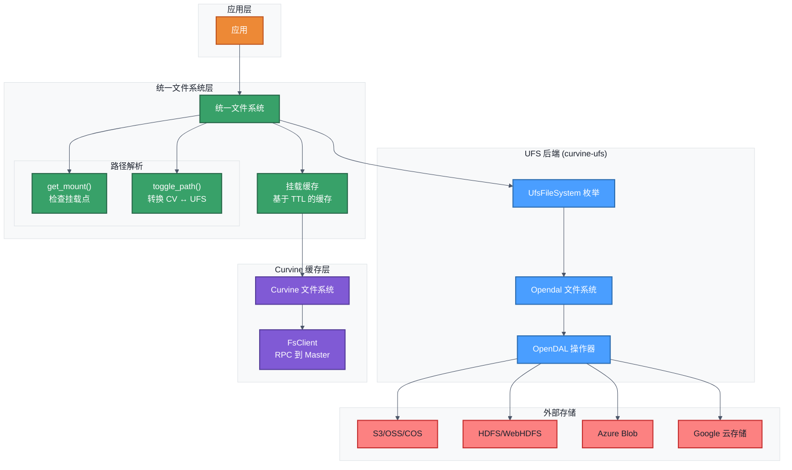

# 数据编排

Curvine 提供 UFS（统一文件系统）视图来管理所有支持的分布式存储系统，包括 S3、HDFS 等。


```mermaid
%%{init: {'theme': 'base', 'themeVariables': { 'background': '#ffffff', 'primaryColor': '#4a9eff', 'primaryTextColor': '#1a202c', 'primaryBorderColor': '#3182ce', 'lineColor': '#4a5568', 'secondaryColor': '#805ad5', 'tertiaryColor': '#38a169', 'mainBkg': '#ffffff', 'nodeBorder': '#4a5568', 'clusterBkg': '#f8f9fa', 'clusterBorder': '#dee2e6', 'titleColor': '#1a202c'}}}%%
flowchart TD
    subgraph Application_Layer["应用层"]
        App[应用]
    end

    subgraph UFS_Backend["UFS 后端 (curvine-ufs)"]
        UEnum[UfsFileSystem 枚举]
        OFS[Opendal 文件系统]
        ODO[OpenDAL 操作器]
    end

    subgraph Unified_FS["统一文件系统层"]
        UFS[统一文件系统]
        subgraph Path_Resolution["路径解析"]
            GM["get_mount()"<br/>检查挂载点]
            TP["toggle_path()"<br/>转换 CV ↔ UFS]
        end
        MC[挂载缓存<br/>基于 TTL 的缓存]
    end

    subgraph External_Storage["外部存储"]
        S3[S3/OSS/COS]
        HDFS[HDFS/WebHDFS]
        Azure[Azure Blob]
        GCS[Google 云存储]
    end

    subgraph Curvine_Cache["Curvine 缓存层"]
        CFS[Curvine 文件系统]
        FSC[FsClient<br/>RPC 到 Master]
    end

    App --> UFS
    UFS --> GM
    UFS --> TP
    UFS --> MC
    UFS --> UEnum
    MC --> CFS
    CFS --> FSC
    UEnum --> OFS
    OFS --> ODO
    ODO --> S3
    ODO --> HDFS
    ODO --> Azure
    ODO --> GCS

    %% 样式（与部署架构 / 裸机部署一致）
    classDef appStyle fill:#ed8936,stroke:#c05621,color:#fff,stroke-width:2px
    classDef ufsStyle fill:#4a9eff,stroke:#2b6cb0,color:#fff,stroke-width:2px
    classDef unifiedStyle fill:#38a169,stroke:#276749,color:#fff,stroke-width:2px
    classDef storageStyle fill:#fc8181,stroke:#c53030,color:#1a202c,stroke-width:2px
    classDef cacheStyle fill:#805ad5,stroke:#553c9a,color:#fff,stroke-width:2px
    class App appStyle
    class UEnum,OFS,ODO ufsStyle
    class UFS,GM,TP,MC unifiedStyle
    class S3,HDFS,Azure,GCS storageStyle
    class CFS,FSC cacheStyle
```
## 挂载
Curvine 支持通过挂载到不同的 Curvine 路径来连接多个 UFS 源。Curvine 不提供默认的 UFS 配置，这意味着如果您要从 UFS 加载数据，必须先挂载 UFS 源。


Curvine 将挂载表持久化到元数据中，因此 Curvine 重启时无需重新挂载。但必须遵循一些规则。
- 不允许挂载到根路径。
- 挂载路径下不允许挂载其他 UFS。
- 相同的挂载路径不能挂载到不同的 UFS。

挂载命令：
```bash
bin/cv mount <UFS_PATH> <CV_PATH> [OPTIONS]
```

- ufs_path：UFS 路径，例如 s3://bucket/path。
- curvine_path：Curvine 路径，例如 /ufs/path。
- options：可选参数，例如 `--config`、`--provider`、`--ttl-ms`、`--write-type` 等。

示例：
```
bin/cv mount s3://ai/xuen-test /s3 \
--config s3.endpoint_url=http://hostname.com \
--config s3.region_name=cn \
--config s3.credentials.access=access_key \
--config s3.credentials.secret=secret_key \
--config s3.path_style=true
```

:::tip
您可以在 UFS 挂载后使用 命令行、API 访问 ufs 目录、文件，但除非您加载特定路径，否则 ufs 数据不会自动同步到 curvine。
:::

### 挂载参数

| 参数 | 类型 | 默认值 | 说明 | 示例 |
|------|------|--------|------|------|
| `--config <key=value>` | repeated | 无 | UFS 后端参数 | `--config s3.endpoint_url=http://...` |
| `--update` | bool | `false` | 更新已存在挂载 | `--update` |
| `--check-path-consist` | bool | `true` | 要求 UFS 路径与 Curvine 路径保持一致映射 | `--check-path-consist=false` |
| `--read-verify-ufs` | bool | `false` | 按 `mtime` / `len` 校验缓存读取结果 | `--read-verify-ufs` |
| `--ttl-ms` | duration | `7d` | 挂载级 TTL | `24h`, `7d`, `30d` |
| `--replicas` | int | 继承默认值 | 副本数覆盖 | `3` |
| `--block-size` | size | 继承默认值 | 块大小覆盖 | `64MB`, `128MB`, `256MB` |
| `--storage-type` | enum | 继承默认值 | 存储介质类型 | `mem` / `ssd` / `disk` |
| `--write-type` | enum | `fs_mode` | 挂载写入模式 | `cache_mode` / `fs_mode` |
| `--provider` | enum | `auto` | 强制指定后端实现 | `auto` / `oss-hdfs` / `opendal` |

### 挂载模式
#### 写入模式

当前 `main` 分支只有两种写入模式：

| 模式 | 行为 | 适用场景 |
|---|---|---|
| `cache_mode` | 写入直接落到底层 UFS，Curvine 主要承担统一访问与缓存读取层 | 数据主存仍在 UFS 的场景 |
| `fs_mode` | 优先写入 Curvine 命名空间；首次挂载 `fs_mode` 路径时可能触发元数据 `resync` | 以 Curvine 管理缓存文件系统视图的场景 |

#### 读取校验

当前用于读侧校验的用户可见开关是 `--read-verify-ufs`：

| 模式 | 行为 |
|---|---|
| 关闭 | 信任缓存与统一文件系统默认回退逻辑 |
| 开启 | 读前按 UFS 元数据（`mtime` 与文件长度）校验缓存 |

:::note
对于 `s3://...` 挂载，CLI 会自动从 URI 提取 `s3.bucket_name`；对于 `hdfs://...` 挂载，CLI 会自动推导 `hdfs.namenode` 与 `hdfs.root`。如果出现 Kerberos 配置但缺少 `hdfs.kerberos.ccache` 或 `KRB5CCNAME`，CLI 会给出警告。
:::

## 统一访问
UFS 挂载后，Curvine 提供了一个统一的文件系统视图，您可以像访问 Curvine 文件系统一样访问 UFS 文件系统；
客户端、命令行工具、fuse等都可以通过统一的路径访问 UFS 文件系统。

:::tip
- Curvine 不缓存 UFS 元数据，因此不存在访问数据一致性问题。从 Curvine访问 UFS 和直接访问 UFS 没有区别。
当 Curvine 缓存数据读取失败时，自动回退到UFS读取数据。
- 如果使用 `cv` 命令，可以通过 `--cache-only` 临时关闭统一访问，只查看已缓存在 Curvine 中的文件。详见 [CLI 页面](/zh-cn/docs/User-Manuals/Operations/cli)。
:::

## 关闭统一访问
如果您不想使用统一访问，可以添加、修改如下配置：
```
[client]
enable_unified_fs = false
```
