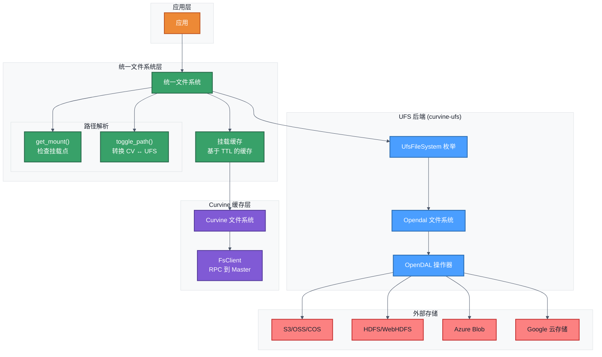

# 统一命名空间

Curvine 提供 UFS（统一文件系统）视图来管理所有支持的分布式存储系统，包括本地文件系统、S3/MinIO、HDFS 等。简单来说，Curvine 的 UFS 挂载，就是做一个“路径映射”，帮你把各种五花八门的外部存储，统一整合到 Curvine 自己的文件系统里，不用再分别记不同存储的访问方式，实现一套接口访问所有存储。


```mermaid
%%{init: {'theme': 'base', 'themeVariables': { 'background': '#ffffff', 'primaryColor': '#4a9eff', 'primaryTextColor': '#1a202c', 'primaryBorderColor': '#3182ce', 'lineColor': '#4a5568', 'secondaryColor': '#805ad5', 'tertiaryColor': '#38a169', 'mainBkg': '#ffffff', 'nodeBorder': '#4a5568', 'clusterBkg': '#f8f9fa', 'clusterBorder': '#dee2e6', 'titleColor': '#1a202c'}}}%%
flowchart TD
    subgraph Application_Layer["应用层"]
        App[应用]
    end

    subgraph UFS_Backend["UFS 后端 (curvine-ufs)"]
        UEnum[UfsFileSystem 枚举]
        OFS[Opendal 文件系统]
        ODO[OpenDAL 操作器]
    end

    subgraph Unified_FS["统一文件系统层"]
        UFS[统一文件系统]
        subgraph Path_Resolution["路径解析"]
            GM["get_mount()"<br/>检查挂载点]
            TP["toggle_path()"<br/>转换 CV ↔ UFS]
        end
        MC[挂载缓存<br/>基于 TTL 的缓存]
    end

    subgraph External_Storage["外部存储"]
        S3[S3/OSS/COS]
        HDFS[HDFS/WebHDFS]
        Azure[Azure Blob]
        GCS[Google 云存储]
    end

    subgraph Curvine_Cache["Curvine 缓存层"]
        CFS[Curvine 文件系统]
        FSC[FsClient<br/>RPC 到 Master]
    end

    App --> UFS
    UFS --> GM
    UFS --> TP
    UFS --> MC
    UFS --> UEnum
    MC --> CFS
    CFS --> FSC
    UEnum --> OFS
    OFS --> ODO
    ODO --> S3
    ODO --> HDFS
    ODO --> Azure
    ODO --> GCS

    classDef appStyle fill:#ed8936,stroke:#c05621,color:#fff,stroke-width:2px
    classDef ufsStyle fill:#4a9eff,stroke:#2b6cb0,color:#fff,stroke-width:2px
    classDef unifiedStyle fill:#38a169,stroke:#276749,color:#fff,stroke-width:2px
    classDef storageStyle fill:#fc8181,stroke:#c53030,color:#1a202c,stroke-width:2px
    classDef cacheStyle fill:#805ad5,stroke:#553c9a,color:#fff,stroke-width:2px
    class App appStyle
    class UEnum,OFS,ODO ufsStyle
    class UFS,GM,TP,MC unifiedStyle
    class S3,HDFS,Azure,GCS storageStyle
    class CFS,FSC cacheStyle
```


## 一、UFS 挂载

两个核心路径概念：

- UFS 路径：外部原始存储地址，必须带专属前缀（scheme），相当于存储的“原生家门牌号”。常见格式包括本地目录 `file://fs/cache_mode`、对象存储 S3/MinIO `s3://bucket/prefix`、大数据存储 HDFS `hdfs://nn/path`。
- Curvine 路径（CV 路径）：集群内部统一的逻辑路径，固定以 `/` 开头，属于 Curvine 专属的 `cv://` 命名空间，在客户端里就是你能直接访问的挂载点目录，相当于给外部存储起了一个“集群内部通用小名”。

挂载的核心价值：挂载完成后，不管底层是本地硬盘、S3 对象存储还是 HDFS，你都只用 Curvine 一套命令操作，完全不用关心底层存储的类型差异，大幅简化多存储访问成本。


Curvine 将挂载表持久化到元数据中，因此 Curvine 重启时无需重新挂载。但必须遵循一些规则：

- 不允许挂载到根路径。
- 挂载路径下不允许挂载其他 UFS。
- 相同的 Curvine 挂载路径不能挂载到不同的 UFS。


## 二、挂载命令 {#挂载}

所有挂载命令都在 Curvine 安装目录下执行，基础命令格式固定：

```bash
bin/cv mount <外部UFS路径> <内部Curvine路径> [附加参数]
```

### 2.1 本地目录挂载（测试）

适合本地测试、快速体验统一命名空间，不用连接外部存储，零配置上手。

```bash
bin/cv mount \
  file://fs/cache_mode /fs/cache_mode \
  --write-type cache_mode
```

命令解释：把本地 `file://fs/cache_mode` 目录挂载到 Curvine 内部 `/fs/cache_mode` 路径，读写模式选用缓存模式（`cache_mode`）。

### 2.2 外部存储挂载

对接 S3、OSS 这类对象存储时，需要额外配置连接地址、账号密码、地域等参数，替换成自己的存储信息即可使用。

```bash
bin/cv mount \
  s3://s3/cache_mode /s3/cache_mode \
  --write-type cache_mode \
  -c s3.endpoint_url=http://localhost:9000 \
  -c s3.credentials.access=admin \
  -c s3.credentials.secret=admin \
  -c s3.region_name=cn
```

参数说明（新手必填项）：

- `s3.endpoint_url`：S3/MinIO 服务的访问地址
- `s3.credentials.access` / `s3.credentials.secret`：存储的访问密钥（账号密码）
- `s3.region_name`：存储所属地域，无特殊需求填 `cn` 即可

:::note
对于 `s3://...` 挂载，CLI 会自动从 URI 提取 `s3.bucket_name`；对于 `hdfs://...` 挂载，CLI 会自动推导 `hdfs.namenode` 与 `hdfs.root`。如果出现 Kerberos 配置但缺少 `hdfs.kerberos.ccache` 或 `KRB5CCNAME`，CLI 会给出警告。
:::

### 2.3 完整 Mount 命令参数表

| 参数名称 | 默认值 | 含义 |
| --- | --- | --- |
| `ufs_path` | 无 | 外部底层存储 URI 路径，必须带 scheme 前缀（`s3://`、`oss://`、`file://`），无前缀命令执行失败 |
| `cv_path` | 无 | Curvine 内部逻辑挂载路径，必须以 `/` 开头，仅支持绝对路径，不支持相对路径 |
| `--write-type` | `fs_mode` | 挂载写入模式，必填核心参数，仅支持 `cache_mode`（缓存加速模式）、`fs_mode`（完整 POSIX 模式） |
| `--update` | `false` | 开关型 flag 参数，挂载点已存在时用于更新配置，挂载路径（`ufs_path` + `cv_path`）不可修改，未传该参数重复挂载会直接报错 |
| `--check-path-consist` | `true` | 布尔值，新建挂载时校验 UFS 路径与 CV 路径 path 部分一致，方便运维对应；设为 `false` 可允许两者路径形状不一致 |
| `--read-verify-ufs` | `false` | 布尔值，仅 `cache_mode` 生效，设为 `true` 时，读取缓存前比对 UFS 文件 `mtime`（修改时间）和文件大小，不一致则判定缓存失效，重新从 UFS 读取数据 |
| `--ttl-ms` | `7d` | 挂载点数据缓存过期时间，支持人性化时间单位：`7d`（7 天）、`1h`（1 小时）、`30m`（30 分钟）、`100s`（100 秒），无需手动换算毫秒 |
| `--replicas` | 无 | 整数类型，文件副本数配置，未设置时，创建文件自动回退至客户端默认副本配置 |
| `--block-size` | 无 | 文件数据块大小配置，未设置时，创建文件自动回退至客户端默认块大小配置 |
| `--storage-type`（简写 `-s`） | 无 | Curvine 本地存储介质类型，可选 `mem`（内存）、`ssd`（固态硬盘）、`hdd`（机械硬盘） |
| `--provider` | 未设置（底层默认 `opendal`） | UFS 底层实现方式选择，可选 `auto`（自动识别）、`oss-hdfs`、`opendal`，默认 `opendal` 适配绝大多数存储类型 |

完整可复制挂载命令模板：

```bash
bin/cv mount \
  <ufs_path> \
  <cv_path> \
  --write-type cache_mode/fs_mode \
  --update \
  --check-path-consist true/false \
  --read-verify-ufs true/false \
  --ttl-ms 7d \
  --replicas 3 \
  --block-size 128M \
  -s ssd \
  --provider opendal \
  -c <存储连接配置>
```

## 三、查看已有挂载点

挂载完成后，想查看集群里所有已配置的挂载点，不用记复杂参数，直接执行极简命令：

```bash
bin/cv mount
```

示例输出：

```text
+------------+----------------+--------------------+------------+----------------+---------+------------+----------+
| ID         | Curvine Path   | UFS Path           | Write Type | Read Verify UFS| Storage | TTL Action | Provider |
+------------+----------------+--------------------+------------+----------------+---------+------------+----------+
| 80640993   | /test/fs_mode  | s3://test/fs_mode  | fs_mode    | no             | -       | free       | -        |
| 4234729426 | /s3/cache_mode | s3://s3/cache_mode | cache_mode | no             | -       | delete     | -        |
+------------+----------------+--------------------+------------+----------------+---------+------------+----------+
```

- `ID`：挂载点唯一标识，系统自动生成
- `Curvine Path` / `UFS Path`：对应内部、外部路径，核对是否和自己配置一致
- `Write Type`：核心读写模式（`cache_mode` / `fs_mode`）
- `TTL Action`：缓存过期处理策略


## 四、两种挂载模式详解 {#挂载模式}

### 4.1 cache_mode（高性能读缓存）

核心定位：给外部存储做缓存加速，目录结构和原始数据以外部 UFS 存储为准，Curvine 只做缓存层，提升读取速度。

核心运行逻辑：

- 目录查询（list）、修改操作：直接查外部 UFS，保证视图最新
- 文件属性查询（getattr）：先查 Curvine 缓存，缓存有效直接返回，无效再回查 UFS
- 固定过期策略：`ttl_action=delete`，缓存到期后，Curvine 里的文件和目录会自动彻底删除，只保留外部 UFS 数据

读操作：

- 缓存未命中：直接读外部 UFS，同时异步后台把数据加载到 Curvine 缓存，下次读取直接走缓存，速度更快
- 缓存已命中：直接读 Curvine 缓存，不用访问 UFS
- 风险提示：缓存有效期内，若外部 UFS 数据被其他工具修改，Curvine 缓存不会自动更新，会读到过期数据
- 解决办法：数据更新频繁的场景，挂载时加参数 `--read-verify-ufs=true`，每次读取前比对 UFS 文件修改时间和大小，不一致就重新拉取，代价是多一次 UFS 查询，读取速度稍慢

写操作：

- 写操作直接穿透到外部 UFS，Curvine 缓存同步失效
- 删除文件会直接删除 UFS 里的原始数据，不是只删缓存，操作需谨慎

能力边界与限制：

- POSIX 文件语义完全依赖外部 UFS 支持，UFS 不支持的操作（比如软链接、文件锁）会直接报错
- 部分高级操作（修改文件属性、软链接、文件锁）受限，以当前版本和 UFS 能力为准

缓存失效条件：

- 缓存达到 TTL 过期时间，自动失效
- 通过 Curvine 执行写入、修改、删除操作，缓存主动失效
- 开启 `--read-verify-ufs` 后，UFS 文件修改时间/大小和 Curvine 记录不一致，缓存失效

### 4.2 fs_mode（分层文件系统）

核心定位：脱离 UFS 语义限制，提供完整的 POSIX 文件系统能力，所有操作先在 Curvine 内部完成，再异步同步到外部 UFS，适合需要标准文件操作的业务场景。

核心运行逻辑：

- 所有数据操作先经过 Curvine，不走客户端直写 UFS，和未挂载外部存储的普通 Curvine 目录用法完全一致
- 操作日志通过 Raft 协议同步到所有 Master 节点，由 Leader 节点统一回放，同步到外部 UFS，保证 Curvine 和 UFS 数据最终一致

核心操作与 UFS 同步规则：

| 操作类型 | 同步到 UFS 的具体行为 |
| --- | --- |
| 创建目录（`mkdir`） | Leader Master 自动访问 UFS，创建对应目录 |
| 删除文件/目录（`delete`） | Leader Master 自动删除 UFS 对应路径数据 |
| 文件写入完成（`complete`） | 启动数据同步任务，把 Curvine 里的文件拷贝到 UFS |
| 重命名（`rename`） | UFS 支持 rename：直接执行；UFS 不支持（如 S3/OSS）：删除源路径，全量拷贝数据到目标路径 |

:::caution
S3、OSS 这类对象存储不支持 rename 操作，严禁对大目录执行 rename！会触发全量数据拷贝，耗时极长、阻塞后续操作，还会产生大量存储和带宽成本。
:::

元数据同步：

`fs_mode` 下，Curvine 不会自动感知外部 UFS 的数据变化，如果直接在 S3/HDFS 后台修改、新增、删除文件，Curvine 目录不会更新。需要手动执行元数据对齐命令：

```bash
bin/cv mount resync /test/fs_mode
```

替换路径为自己的 Curvine 挂载路径即可，生产环境建议定期执行或变更后手动执行。

数据过期规则：

- 数据过期后：只清理 Curvine 里的实际数据，元数据保留，外部 UFS 数据不受影响
- 再次读取：自动从 UFS 把数据加载回 Curvine，正常访问
- 过期后写入：核心原因是绝大多数 UFS（尤其是 S3、OSS、对象存储类）不支持随机写、文件空洞、增量修改等标准 POSIX 文件特性，无法直接在 UFS 底层完成写入操作，因此系统会先自动把 UFS 里的原始数据完整拷贝回 Curvine，再基于 Curvine 完成写入修改，大文件拷贝会产生一定耗时，属于正常机制，并非系统异常

## 五、统一访问

UFS 挂载后，Curvine 提供了一个统一的文件系统视图，客户端、命令行工具、FUSE、API 都可以通过统一的 Curvine 路径访问 UFS 文件系统。

如果使用 `cv` 命令，可以通过 `--cache-only` 临时关闭统一访问，只查看已缓存在 Curvine 中的文件。详见 [CLI 页面](/zh-cn/docs/User-Manuals/Operations/cli)。

## 六、空间释放

`cache_mode` 下删除文件会直接删 UFS 原始数据，如果你只想释放 Curvine 本地缓存空间、保留 UFS 原始数据和元数据，用 `free` 命令，绝对安全，不会误删不符合条件的数据。

```bash
bin/cv fs free -r /fs_mode/data
```

- `-r`：递归清理目录下所有符合条件的缓存
- 适用范围：`fs_mode`、`cache_mode`、未挂载 UFS 的普通目录都能用
- 安全保障：不符合清理条件的文件自动跳过（比如无 TTL、未同步到 UFS 的数据）
- 清理条件：文件同时存在于 Curvine 和 UFS，且 `ttl_action != none`

## 七、关闭统一访问

如果您不想使用统一访问，可以添加、修改如下配置：

```toml
[client]
enable_unified_fs = false
```

## 八、总结

- 先明确场景：读多选 `cache_mode`，写多选 `fs_mode`
- 挂载命令严格遵循：UFS 路径（带 scheme） + Curvine 路径（`/` 开头）
- `cache_mode` 删文件直接删 UFS，谨慎操作；`fs_mode` 别给 S3 大目录 rename
- 外部 UFS 数据变更后，`fs_mode` 必须手动 `resync` 同步元数据
- 释放缓存用 `free` 命令，安全不删原始数据
