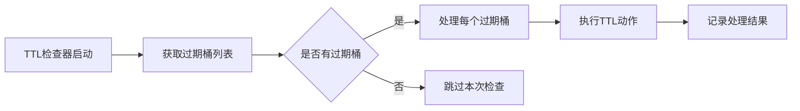

本章节介绍 Curvine 的缓存策略以及如何缓存数据。

## 缓存策略

### 写入策略

写入策略控制文件位于 UFS 挂载点时的数据写入方式

|策略|行为|适用场景|
|:----|:----|:----|
|Cache|仅写入 Curvine 缓存|临时数据、最大性能需求|
|Through|直接写入 UFS，绕过缓存|写一次数据、缓存无益的场景|
|CacheThrough|同步写入缓存和 UFS|强一致性要求的数据共享|
|AsyncThrough|先写缓存，异步同步到 UFS|平衡性能和持久性|

### 一致性策略

Curvine 提供了3种策略校验数据一致性：

* 不校验，数据过期后会自动删除；可能读取到脏数据。

* 定期校验，按照一定的频率检查 UFS 是否变动。

* 强制校验，每次读取文件时都会校验 UFS 是否变动，检查ufs文件的长度、最后修改时间和 Curvine 保存的是否一致。这是默认配置

如果一致性检测失败，会直接从 UFS 读取数据，同时异步缓存数据到 Curvine。

## TTL机制

TTL是Curvine中用于自动管理缓存数据生命周期的核心机制，支持文件和目录的自动过期处理。

### 配置

在客户端配置中，TTL相关参数包括：

|参数|类型|默认值|说明|示例|
|:----|:----|:----|:----|:----|
|--ttl-ms|duration|0|缓存数据过期时间|24h, 7d, 30d|
|--ttl-action|enum|none|过期策略：delete/none|delete|

在Master节点配置中，TTL检查器参数：

|参数|类型|默认值|说明|示例|
|:----|:----|:----|:----|:----|
|--ttl-checker-interval|duration|1h|TTL检查器执行间隔|1h, 30m, 1s|
|--ttl-checker-retry-attempts|u32|3|TTL操作失败时的最大重试次数|3, 5, 10|
|--ttl-bucket-interval|duration|1h|TTL桶时间间隔，用于批量处理过期文件|1h, 30m, 1s|

### 动作类型

TTL支持5种过期动作 ：

|动作|说明|
|:----|:----|
|None|不执行任何操作|
|Delete|删除文件/目录|
|Persist|持久化到UFS|
|Evict|从缓存中驱逐|
|Flush|刷新到后端存储|

### 执行流程


## 缓存方式

### 自动缓存

在挂载 UFS 到 Curvine 后，如果配置了自动缓存，那么在第一次读取 ufs 文件时，curvine 会提交一个异步缓存任务，将数据加载到 Curvine。

 在日志中，可以看如下输出：

```plain
Submit async cache successfully for s3://bucket/cache/test.log, job res CacheJobResult { job_id: 7c00853f-13c8-43c1-8b3f-44740750b5a0, target_path: /s3/cache/test.log }    
```
可用 job_id 查询缓存任务状态：
```plain
bin/cv load-status 7c00853f-13c8-43c1-8b3f-44740750b5a0
```
### 主动缓存

可以是load命令主动加载 UFS 数据到 Curvine，示例如下：

```plain
bin/cv load s3://bucket/cache/test.log
```
自动缓存和主动缓存并不冲突，主动缓存可以减少第一次读取 ufs 文件的时间。
:::tip
 load 数据前，UFS 必须先挂载到 Curvine。  
 无论自动缓存还是主动缓存，文件的缓存路径是固定的，和 UFS 保持相同的目录结构。
 :::

