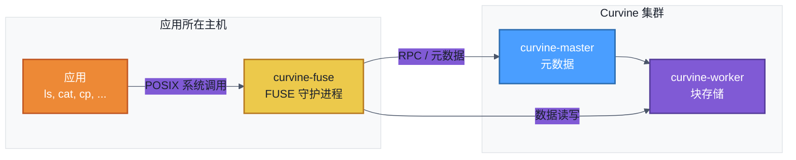

# FUSE 模式访问

除 SDK、S3 网关和 CLI 外，Curvine 提供 **FUSE（用户态文件系统）**，使应用无需修改代码即可将 Curvine 文件系统当作本地目录访问。挂载点下的操作会转换为 Curvine RPC 与数据访问。

在云原生场景下，可通过卷挂载使用 FUSE；Curvine 还提供 [CSI 驱动](../5-K8S-CSI-Driver/01-Setup.md) 用于 Kubernetes。

:::info
**FUSE 是可选接入方式。** 须先启动 Curvine 集群（Master + Worker），FUSE 仅在应用需要 POSIX 挂载点时使用。各组件角色见 [部署架构](../../2-Deploy/2-Deploy-Curvine-Cluster/0-Deployment-Architecture.md)。
:::

## 架构示意



## 前置条件

- **Curvine 集群**已启动（已启动 Master 与 Worker）。参见 [裸机部署](../../2-Deploy/2-Deploy-Curvine-Cluster/3-Distributed-Mode/02-Bare-Metal-Deployment.md) 或 [快速开始](../../2-Deploy/1-quick-start.md)。
- **配置**：运行 FUSE 的节点需能访问集群配置文件（如 `conf/curvine-cluster.toml`），且 Master 地址正确。
- **系统支持**：支持 FUSE2 与 FUSE3，不同发行版行为可能略有差异。详见 [支持的 Linux 发行版](../../2-Deploy/2-Deploy-Curvine-Cluster/1-Preparation/02-compile.md#支持的linux发行版)。

## 使用方法

### 启动 FUSE

在安装目录下执行（如 `build/dist` 或解压后的发布包）：

```bash
# 默认：挂载到 /curvine-fuse，使用 conf/curvine-cluster.toml
bin/curvine-fuse.sh start

# 指定挂载路径
bin/curvine-fuse.sh start --mnt-path /mnt/curvine

# 指定配置文件
bin/curvine-fuse.sh start -c /path/to/curvine-cluster.toml
```

- **默认挂载路径**：`/curvine-fuse`
- **默认配置**：`conf/curvine-cluster.toml`（相对于启动进程时的当前工作目录）
- 使用 `bin/curvine-fuse.sh stop` 停止，`bin/curvine-fuse.sh restart` 重启。

### 使用挂载点

在 FUSE 挂载路径下可使用常规 Linux 文件命令：`ls`、`cat`、`rm`、`mv`、`mkdir`、`du`、`cp` 等。

示例：

```bash
# 假设默认挂载点为 /curvine-fuse
cd /curvine-fuse

echo "hello curvine" > a.txt
cat a.txt
du -h a.txt

mkdir -p b/c
ls -l
tree
# .
# ├── a.txt
# └── b
#     └── c
```

此处写入的数据会落在 Curvine 集群中；也可访问对应 [已挂载 UFS](../../3-User-Manuals/1-Key-Features/01-ufs.md#挂载) 的路径（统一文件系统视图）。

### 可选参数

启动 FUSE 时可传入底层 `curvine-fuse` 的选项，例如：

| 选项 | 说明 | 默认值 |
|------|------|--------|
| `--mnt-path` | 挂载点路径 | `/curvine-fuse` |
| `-c` / `--conf` | 集群配置文件路径 | `conf/curvine-cluster.toml` |
| `--fs-path` | 挂载点对应的 Curvine 根路径 | `/` |
| `--io-threads` | I/O 线程数 | 配置文件中的值 |
| `--worker-threads` | Worker 线程数 | 配置文件中的值 |

完整选项可执行 `bin/curvine-fuse.sh --help`（或在安装目录下 `lib/curvine-fuse --help`）查看。

## FUSE 支持程度

Curvine FUSE 支持：

- 常规文件读写与目录操作
- 用户/组与权限语义
- 扩展属性（xattr）、符号链接（symlink）、硬链接（link）

:::tip
不同发行版与 FUSE 版本（FUSE2 / FUSE3）下行为可能略有差异。已测试版本与依赖见 [支持的 Linux 发行版](../../2-Deploy/2-Deploy-Curvine-Cluster/1-Preparation/02-compile.md#支持的linux发行版)。
:::

在 **ltp-full-20210524** 测试集上，大部分用例通过；当前未通过项主要集中在随机写、文件锁等能力，相关能力在持续迭代中。

| 测试集           | 总数 | 跳过(SKIP) | 失败(FAIL) | 通过(PASS) |
|------------------|------|------------|------------|------------|
| fs_perms_simple  | 18   | 0          | 0          | 18         |
| fsx              | 1    | 0          | 0          | 1          |
| fs_bind          | 1    | 0          | 0          | 1          |
| smoketest        | 13   | 0          | 1          | 12         |
| io               | 2    | 0          | 1          | 1          |
| fs               | 29   | 0          | 13         | 16         |
| syscall          | 1206 | 32         | 300        | 874        |
| **合计**         | 1270 | 32         | 315        | 923        |

欢迎参与改进 FUSE 兼容性与测试覆盖。
