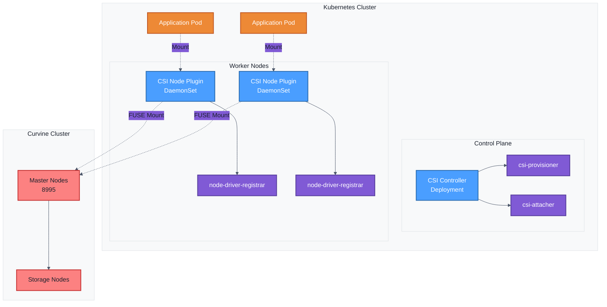
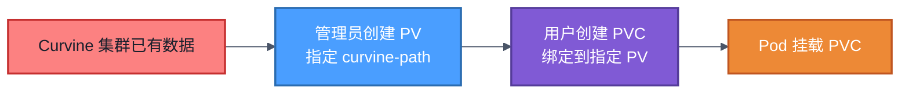

# 安装说明
为了更方便在云原生环境下快速接入curvine, curinve提供了csi驱动支持, 你的Pod容器可以通过`PV`(Persisit Volume) 的方式来访问curvine, 无需对应用进行改造，即可使用curvine缓存能力；

Curvine CSI驱动遵循标准的CSI规范，包含 
- `CSI Controller`,  以`Deployment`模式或者`Statefuleset`模式部署
- `CSI Node Plugin`， 以`DaemonSet`模式部署

## 架构概述

Curvine CSI 驱动采用标准的 CSI 架构，包含两个主要组件：



### 核心组件

1. **CSI Controller**
   - 运行在 Control Plane
   - 负责 Volume 的创建、删除、Attach/Detach 操作
   - 包含 csi-provisioner 和 csi-attacher sidecar

2. **CSI Node Plugin**
   - 以 DaemonSet 方式运行在每个 Worker Node
   - 负责将 Curvine 存储挂载到 Pod
   - 使用 FUSE 技术实现文件系统挂载

3. **FUSE 挂载机制**
   - 直接挂载 Curvine 文件系统路径
   - 相同路径共享 FUSE 进程，节省资源
   - 支持多个 Pod 并发访问

---

## 前置条件

### 环境要求

- Kubernetes 1.19+
- Helm 3.0+
- 可访问的 Curvine 集群（Master 节点地址和端口）
- 具有集群管理员权限

### 检查环境

```bash
# 检查 Kubernetes 版本
kubectl version --short

# 检查 Helm 版本
helm version --short

# 检查节点状态
kubectl get nodes
```

---

## 一、安装 Curvine CSI

### 1.1 获取 Helm Chart

```bash
helm repo add curvine https://curvineio.github.io/helm-charts
helm repo update
helm search repo curvine --devel
helm install curvine-csi curvine/curvine-csi \ 
    --namespace curvine \ 
    --create-namespace --devel \ 
    --version 0.0.1-dev+7ffc6a2
```


:::tip
当前curvine helm仓库提供的为预发版本
- 需要使用`--devel`可以查看到，上述命令`--version` 切换为自己需要的版本， 后续陆续提供正式release版本
- curvine-csi 通过helm 默认安装在`curvine` namespace下
:::

### 1.2 配置自定义参数（可选）
curvine-csi支持丰富的自定义参数， 如果您的网络环境有限制，则可以通过自定义镜像等方式来使用。

例如， 创建 `custom-values.yaml` 文件：

```yaml
# 镜像配置
image:
  repository: ghcr.io/curvineio/curvine-csi
  tag: latest
  pullPolicy: IfNotPresent

# Controller 配置
controller:
  replicas: 1
  resources:
    requests:
      cpu: 100m
      memory: 128Mi
    limits:
      cpu: 500m
      memory: 512Mi

# Node 配置
node:
  mountMode: standalone
  standalone:
    image: ""
    resources:
      requests:
        cpu: 500m
        memory: 512Mi
      limits:
        cpu: 2
        memory: 2Gi
```

helm指定自定义参数
```bash
helm install curvine-csi curvine/curvine-csi \ 
    --namespace curvine \ 
    --create-namespace --devel \ 
  --values custom-values.yaml

# 查看安装状态
helm status curvine-csi -n curvine
```

:::tip
默认情况下，curvine-csi采用`standalone`的模式部署，即fuse挂载在独立的pod中，不受curvine-csi重启影响（推荐模式）， 同时也支持`embedded` 模式，相关架构以及helm配置参数， 可以参考[Curvine CSI架构详解](Framework)
:::

### 1.4 升级和卸载

```bash
# 升级
helm upgrade curvine curvine/curvine-csi -n curvine --devel --version xxxxx

# 卸载
helm uninstall curvine-csi -n curvine

# 完全清理（包括 namespace）
kubectl delete namespace curvine
```
---

## 二、验证和检查状态

### 2.1 检查 CSI Driver 注册

```bash
# 查看 CSI Driver 是否注册成功
kubectl get csidriver curvine

# 输出示例：
# NAME      ATTACHREQUIRED   PODINFOONMOUNT   STORAGECAPACITY
# curvine   false            false            false
```

**参数说明：**
- `ATTACHREQUIRED: false` - 不需要 Attach 操作（FUSE 直接挂载）
- `PODINFOONMOUNT: false` - 挂载时不需要 Pod 信息

### 2.2 检查 Controller 状态

```bash
# 查看 Controller Deployment
kubectl get deployment -n curvine curvine-csi-controller

# 查看 Controller Pod
kubectl get pods -n curvine -l app=curvine-csi-controller

# 查看 Controller 日志
kubectl logs -n curvine \
  -l app=curvine-csi-controller \
  -c csi-plugin \
  --tail=50

# 查看 Provisioner Sidecar 日志
kubectl logs -n curvine \
  -l app=curvine-csi-controller \
  -c csi-provisioner \
  --tail=50
```

### 2.3 检查 Node Plugin 状态

```bash
# 查看 Node DaemonSet
kubectl get daemonset -n curvine curvine-csi-node

# 查看所有 Node Plugin Pod
kubectl get pods -n curvine -l app=curvine-csi-node -o wide

# 查看特定 Node 的日志
kubectl logs -n curvine curvine-csi-node-xxxxx -c csi-plugin

# 查看 Node Registrar 日志
kubectl logs -n curvine curvine-csi-node-xxxxx -c node-driver-registrar
```

## 三、StorageClass 详解

StorageClass 是 Kubernetes 中定义存储类型的资源，用于动态 PV 的自动创建。

### 3.1 StorageClass 配置示例

```yaml
apiVersion: storage.k8s.io/v1
kind: StorageClass
metadata:
  name: curvine-sc
provisioner: curvine                      # CSI 驱动名称
reclaimPolicy: Delete                     # 回收策略
volumeBindingMode: Immediate              # 绑定模式
allowVolumeExpansion: true                # 允许扩容
parameters:
  # 必需：Curvine 集群连接信息
  master-addrs: "master1:8995,master2:8995,master3:8995"
  
  # 必需：文件系统路径前缀
  fs-path: "/k8s-volumes"
  
  # 可选：路径创建策略
  path-type: "DirectoryOrCreate"
  
  # 可选：FUSE 参数
  io-threads: "4"
  worker-threads: "8"
```

### 3.2 参数详解

#### 核心参数

| 参数 | 必需 | 说明 | 示例 |
|-----|------|------|------|
| `master-addrs` | ✅ | Curvine Master 节点地址列表，用逗号分隔 | `"10.0.0.1:8995,10.0.0.2:8995"` |
| `fs-path` | ✅ | 动态 PV 的路径前缀，实际路径为 `fs-path + pv-name` | `"/k8s-volumes"` |
| `path-type` | ❌ | 路径创建策略，默认 `Directory` | `"DirectoryOrCreate"` |
| `io-threads` | ❌ | FUSE IO 线程数 | `"4"` |
| `worker-threads` | ❌ | FUSE 工作线程数 | `"8"` |

#### 路径创建策略 (path-type)

- **`Directory`** (默认)
  - 路径必须已存在
  - 推荐用于生产环境
  - 确保路径由管理员预先创建

- **`DirectoryOrCreate`**
  - 路径不存在时自动创建
  - 适合测试和开发环境
  - 注意权限问题

#### 回收策略 (reclaimPolicy)

- **`Delete`** (推荐用于动态 PV)
  - PVC 删除时，自动删除 PV 和存储数据
  - 适合临时数据和测试环境

- **`Retain`**
  - PVC 删除后，PV 保留
  - 数据需要手动清理
  - 适合重要数据保护

#### 绑定模式 (volumeBindingMode)

- **`Immediate`** (默认)
  - PVC 创建后立即绑定 PV
  - 适合单 AZ 集群

- **`WaitForFirstConsumer`**
  - 等到 Pod 调度后再绑定 PV
  - 适合多 AZ 集群，确保 PV 在 Pod 所在节点可用

### 3.3 动态 PV 路径生成规则

```
实际挂载路径 = fs-path + "/" + pv-name
```

**示例：**
```yaml
# StorageClass 配置
fs-path: "/k8s-volumes"

# 自动生成的 PV 名称
pv-name: "pvc-1234-5678-abcd"

# 最终 Curvine 路径
实际路径: "/k8s-volumes/pvc-1234-5678-abcd"
```

### 3.4 创建 StorageClass

创建 `storageclass.yaml` 文件：

```yaml
apiVersion: storage.k8s.io/v1
kind: StorageClass
metadata:
  name: curvine-sc
provisioner: curvine
reclaimPolicy: Delete
volumeBindingMode: Immediate
allowVolumeExpansion: true
parameters:
  master-addrs: "m0:8995,m1:8995,m2:8995"
  fs-path: "/k8s-volumes"
  path-type: "DirectoryOrCreate"
```

应用配置：

```bash
# 创建 StorageClass
kubectl apply -f storageclass.yaml

# 查看 StorageClass
kubectl get storageclass curvine-sc

# 设置为默认 StorageClass（可选）
kubectl patch storageclass curvine-sc \
  -p '{"metadata": {"annotations":{"storageclass.kubernetes.io/is-default-class":"true"}}}'
```

:::tip
上述示例中的 `master-addrs` 一定要替换为实际的master地址.
:::

### 3.5 多 StorageClass 场景

可以创建多个 StorageClass 用于不同场景：

```yaml
# 生产环境 - 严格模式
---
apiVersion: storage.k8s.io/v1
kind: StorageClass
metadata:
  name: curvine-prod
provisioner: curvine
reclaimPolicy: Retain
volumeBindingMode: WaitForFirstConsumer
parameters:
  master-addrs: "prod-master1:8995,prod-master2:8995"
  fs-path: "/production"
  path-type: "Directory"

# 开发环境 - 宽松模式
---
apiVersion: storage.k8s.io/v1
kind: StorageClass
metadata:
  name: curvine-dev
provisioner: curvine
reclaimPolicy: Delete
volumeBindingMode: Immediate
parameters:
  master-addrs: "dev-master:8995"
  fs-path: "/development"
  path-type: "DirectoryOrCreate"
```

---

## 四、静态 PV 使用方式

静态 PV 用于挂载 Curvine 中已存在的数据目录，适合以下场景：
- 多个集群共享同一数据
- 需要精确控制数据路径

### 4.1 工作原理



### 4.2 创建静态 PV

```yaml
apiVersion: v1
kind: PersistentVolume
metadata:
  name: curvine-pv-existing-data
  labels:
    type: curvine-static
spec:
  storageClassName: curvine-sc
  capacity:
    storage: 100Gi                    # 声明容量
  accessModes:
    - ReadWriteMany                   # 支持多 Pod 读写
  persistentVolumeReclaimPolicy: Retain  # 保留数据
  csi:
    driver: curvine
    volumeHandle: "existing-data-volume-001"  # 唯一标识符
    volumeAttributes:
      # 必需：Curvine Master 地址
      master-addrs: "m0:8995,m1:8995,m2:8995"
      
      # 必需：Curvine 中的完整路径
      curvine-path: "/production/user-data"
      
      # 推荐：使用 Directory 确保路径存在
      path-type: "Directory"
      
      # 可选：FUSE 参数
      io-threads: "4"
      worker-threads: "8"
```

**参数说明：**
- `volumeHandle`: 任意唯一字符串，用于标识 PV
- `curvine-path`: Curvine 文件系统中的完整路径，必须已存在
- `path-type: Directory`: 要求路径必须存在（推荐）

### 4.3 创建静态 PVC

```yaml
apiVersion: v1
kind: PersistentVolumeClaim
metadata:
  name: curvine-pvc-existing-data
  namespace: default
spec:
  storageClassName: curvine-sc
  accessModes:
    - ReadWriteMany
  resources:
    requests:
      storage: 100Gi
  # 关键：指定要绑定的 PV 名称
  volumeName: curvine-pv-existing-data
```

### 4.4 验证绑定

```bash
# 查看 PV 状态
kubectl get pv curvine-pv-existing-data
# STATUS 应该是 Bound

# 查看 PVC 状态
kubectl get pvc curvine-pvc-existing-data
# STATUS 应该是 Bound

# 查看详细信息
kubectl describe pvc curvine-pvc-existing-data
```

### 4.5 在 Pod 中使用静态 PV

```yaml
apiVersion: v1
kind: Pod
metadata:
  name: static-pv-test
spec:
  containers:
  - name: app
    image: nginx:alpine
    volumeMounts:
    - name: data
      mountPath: /data
  volumes:
  - name: data
    persistentVolumeClaim:
      claimName: curvine-pvc-existing-data
```

## 五、动态 PV 使用方式

动态 PV 是最常用的方式，由 CSI Controller 自动创建和管理。

### 5.1 工作原理


### 5.2 创建动态 PVC

动态pvc是需要指定storageclass， 无需指定volumeName

```yaml
apiVersion: v1
kind: PersistentVolumeClaim
metadata:
  name: my-dynamic-pvc
  namespace: default
spec:
  storageClassName: curvine-sc    # 指定 StorageClass
  accessModes:
    - ReadWriteOnce               # 或 ReadWriteMany
  resources:
    requests:
      storage: 10Gi               # 请求容量
```

### 5.3 自动路径生成示例

```yaml
# StorageClass 配置
fs-path: "/k8s-volumes"

# PVC 名称
name: my-dynamic-pvc

# 自动生成的 PV
# volumeHandle: pvc-1a2b3c4d-5e6f-7g8h-9i0j-k1l2m3n4o5p6

# 实际 Curvine 路径
# /k8s-volumes/pvc-1a2b3c4d-5e6f-7g8h-9i0j-k1l2m3n4o5p6

# 可以通过curvine的cv命令查看是否正确在curvine集群创建了卷
./bin/cv fs ls /
```

### 5.4 动态 PV 完整示例

创建 `dynamic-pvc.yaml` 文件：

```yaml
apiVersion: v1
kind: PersistentVolumeClaim
metadata:
  name: app-data-pvc
  namespace: default
spec:
  storageClassName: curvine-sc
  accessModes:
    - ReadWriteMany
  resources:
    requests:
      storage: 20Gi
```

创建 `dynamic-pv-pod.yaml` 文件：

```yaml
apiVersion: v1
kind: Pod
metadata:
  name: dynamic-pv-test
spec:
  containers:
  - name: app
    image: nginx:alpine
    volumeMounts:
    - name: data
      mountPath: /usr/share/nginx/html
  volumes:
  - name: data
    persistentVolumeClaim:
      claimName: app-data-pvc
```

应用配置：

```bash
# 1. 创建动态 PVC
kubectl apply -f dynamic-pvc.yaml

# 2. 查看 PVC 状态（应该自动 Bound）
kubectl get pvc app-data-pvc
kubectl describe pvc app-data-pvc

# 3. 查看自动创建的 PV
kubectl get pv

# 4. 创建使用 PVC 的 Pod
kubectl apply -f dynamic-pv-pod.yaml

# 5. 测试写入和读取
kubectl exec dynamic-pv-test -- sh -c 'echo "Hello Curvine" > /usr/share/nginx/html/index.html'
kubectl exec dynamic-pv-test -- cat /usr/share/nginx/html/index.html
```

## 附录
### Helm自定义参数
#### 全局配置 (Global Settings)

| 参数路径 | 类型 | 默认值 | 说明 |
|---------|------|--------|------|
| `global.namespace` | string | `curvine` | CSI驱动部署的命名空间 |

#### 镜像配置 (Image Settings)

| 参数路径 | 类型 | 默认值 | 说明 |
|---------|------|--------|------|
| `image.repository` | string | `ghcr.io/curvineio/curvine-csi` | CSI驱动镜像仓库地址 |
| `image.tag` | string | `latest` | CSI驱动镜像标签版本 |
| `image.pullPolicy` | string | `Always` | 镜像拉取策略 (Always/IfNotPresent/Never) |

#### CSI驱动配置 (CSI Driver Settings)

| 参数路径 | 类型 | 默认值 | 说明 |
|---------|------|--------|------|
| `csiDriver.name` | string | `curvine` | CSI驱动名称标识 |
| `csiDriver.attachRequired` | boolean | `false` | 是否需要attach操作（卷附加到节点） |
| `csiDriver.podInfoOnMount` | boolean | `false` | 挂载时是否需要Pod信息 |

#### Controller配置 (Controller Settings)

| 参数路径 | 类型 | 默认值 | 说明 |
|---------|------|--------|------|
| `controller.name` | string | `curvine-csi-controller` | Controller Deployment名称 |
| `controller.replicas` | int | `1` | Controller副本数量 |
| `controller.priorityClassName` | string | `system-cluster-critical` | Controller优先级类名（高优先级） |
| `controller.container.name` | string | `csi-plugin` | 主容器名称 |
| `controller.container.command` | array | `["/opt/curvine/csi"]` | 容器启动命令 |
| `controller.container.args` | array | 见values.yaml | 容器启动参数 |
| `controller.container.env.CSI_ENDPOINT` | string | `unix:///csi/csi.sock` | CSI套接字端点地址 |
| `controller.container.livenessProbe.failureThreshold` | int | `5` | 存活探针失败次数阈值 |
| `controller.container.livenessProbe.initialDelaySeconds` | int | `10` | 存活探针初始延迟秒数 |
| `controller.container.livenessProbe.periodSeconds` | int | `10` | 存活探针检查周期（秒） |
| `controller.container.livenessProbe.timeoutSeconds` | int | `3` | 存活探针超时时间（秒） |
| `controller.container.ports.healthz` | int | `9909` | 健康检查端口 |
| `controller.container.securityContext.privileged` | boolean | `true` | 是否以特权模式运行 |
| `controller.container.securityContext.capabilities.add` | array | `[SYS_ADMIN]` | 添加的Linux Capabilities |
| `controller.tolerations` | array | 见values.yaml | Pod容忍度配置（允许CriticalAddons调度） |

#### Controller Sidecar容器配置

| 参数路径 | 类型 | 默认值 | 说明 |
|---------|------|--------|------|
| `controller.sidecars.provisioner.image` | string | `quay.io/k8scsi/csi-provisioner:v1.6.0` | Provisioner sidecar镜像 |
| `controller.sidecars.provisioner.args` | array | 见values.yaml | Provisioner参数（超时60s，日志级别v5） |
| `controller.sidecars.attacher.image` | string | `registry.k8s.io/sig-storage/csi-attacher:v4.5.0` | Attacher sidecar镜像 |
| `controller.sidecars.attacher.args` | array | 见values.yaml | Attacher参数（日志级别v5） |
| `controller.sidecars.livenessProbe.image` | string | `registry.k8s.io/sig-storage/livenessprobe:v2.11.0` | LivenessProbe sidecar镜像 |
| `controller.sidecars.livenessProbe.args` | array | 见values.yaml | LivenessProbe参数 |
| `controller.sidecars.livenessProbe.env.HEALTH_PORT` | string | `"9909"` | 健康检查端口 |

#### Node配置 (Node Settings)

| 参数路径 | 类型 | 默认值 | 说明 |
|---------|------|--------|------|
| `node.name` | string | `curvine-csi-node` | Node DaemonSet名称 |
| `node.priorityClassName` | string | `system-node-critical` | Node优先级类名（节点关键级别） |
| `node.dnsPolicy` | string | `ClusterFirstWithHostNet` | DNS策略（集群优先+主机网络） |
| `node.mountMode` | string | `standalone` | 挂载模式：`standalone`（独立Pod）或 `embedded`（嵌入CSI容器） |
| `node.container.name` | string | `csi-plugin` | 主容器名称 |
| `node.container.command` | array | `["/opt/curvine/csi"]` | 容器启动命令 |
| `node.container.args` | array | 见values.yaml | 容器启动参数 |
| `node.container.env.CSI_ENDPOINT` | string | `unix:///csi/csi.sock` | CSI套接字端点地址 |
| `node.container.livenessProbe.failureThreshold` | int | `5` | 存活探针失败次数阈值 |
| `node.container.livenessProbe.initialDelaySeconds` | int | `10` | 存活探针初始延迟秒数 |
| `node.container.livenessProbe.periodSeconds` | int | `10` | 存活探针检查周期（秒） |
| `node.container.livenessProbe.timeoutSeconds` | int | `3` | 存活探针超时时间（秒） |
| `node.container.ports.healthz` | int | `9909` | 健康检查端口 |
| `node.container.securityContext.privileged` | boolean | `true` | 是否以特权模式运行 |
| `node.container.lifecycle.preStop` | object | 见values.yaml | 容器停止前钩子（清理socket文件） |
| `node.tolerations` | array | `[{operator: Exists}]` | Pod容忍度配置（容忍所有污点） |

#### Standalone Pod配置 (Standalone Pod Settings)

当 `node.mountMode` 设置为 `standalone` 时，以下配置生效：

| 参数路径 | 类型 | 默认值 | 说明 |
|---------|------|--------|------|
| `node.standalone.image` | string | `""` | Standalone Pod镜像，留空则使用CSI镜像 |
| `node.standalone.resources.requests.cpu` | string | `"500m"` | CPU请求量 |
| `node.standalone.resources.requests.memory` | string | `"512Mi"` | 内存请求量 |
| `node.standalone.resources.limits.cpu` | string | `"2"` | CPU限制量 |
| `node.standalone.resources.limits.memory` | string | `"2Gi"` | 内存限制量 |

配置示例：

```yaml
node:
  mountMode: standalone
  standalone:
    image: ""  # 留空使用CSI镜像
    resources:
      requests:
        cpu: "500m"
        memory: "512Mi"
      limits:
        cpu: "2"
        memory: "2Gi"
```

#### Node Sidecar容器配置

| 参数路径 | 类型 | 默认值 | 说明 |
|---------|------|--------|------|
| `node.sidecars.nodeDriverRegistrar.image` | string | `quay.io/k8scsi/csi-node-driver-registrar:v2.1.0` | Node驱动注册器镜像 |
| `node.sidecars.nodeDriverRegistrar.args` | array | 见values.yaml | 注册器参数（日志级别v5） |
| `node.sidecars.nodeDriverRegistrar.env.ADDRESS` | string | `/csi/csi.sock` | CSI套接字地址 |
| `node.sidecars.nodeDriverRegistrar.env.DRIVER_REG_SOCK_PATH` | string | `/var/lib/kubelet/csi-plugins/csi.curvine.io/csi.sock` | Kubelet中驱动注册路径 |
| `node.sidecars.livenessProbe.image` | string | `registry.k8s.io/sig-storage/livenessprobe:v2.11.0` | LivenessProbe sidecar镜像 |
| `node.sidecars.livenessProbe.args` | array | 见values.yaml | LivenessProbe参数 |
| `node.sidecars.livenessProbe.env.ADDRESS` | string | `/csi/csi.sock` | CSI套接字地址 |
| `node.sidecars.livenessProbe.env.HEALTH_PORT` | string | `"9909"` | 健康检查端口 |

#### Node主机路径配置

| 参数路径 | 类型 | 默认值 | 说明 |
|---------|------|--------|------|
| `node.hostPaths.pluginDir.path` | string | `/var/lib/kubelet/csi-plugins/csi.curvine.io/` | CSI插件目录路径 |
| `node.hostPaths.pluginDir.type` | string | `DirectoryOrCreate` | 路径类型（不存在则创建） |
| `node.hostPaths.kubeletDir.path` | string | `/var/lib/kubelet` | Kubelet工作目录路径 |
| `node.hostPaths.kubeletDir.type` | string | `DirectoryOrCreate` | 路径类型（不存在则创建） |
| `node.hostPaths.registrationDir.path` | string | `/var/lib/kubelet/plugins_registry/` | 插件注册目录路径 |
| `node.hostPaths.registrationDir.type` | string | `Directory` | 路径类型（必须存在） |

#### 服务账户配置 (Service Account Settings)

| 参数路径 | 类型 | 默认值 | 说明 |
|---------|------|--------|------|
| `serviceAccount.controller.name` | string | `curvine-csi-controller-sa` | Controller服务账户名称 |
| `serviceAccount.node.name` | string | `curvine-csi-node-sa` | Node服务账户名称 |

#### RBAC配置

| 参数路径 | 类型 | 默认值 | 说明 |
|---------|------|--------|------|
| `rbac.create` | boolean | `true` | 是否创建RBAC资源（ClusterRole/ClusterRoleBinding） |

#### ConfigMap配置 (Curvine Cluster Configuration)

| 参数路径 | 类型 | 默认值 | 说明 |
|---------|------|--------|------|
| `configMap.name` | string | `curvine-config` | ConfigMap名称 |
| `configMap.defaultMode` | octal | `0755` | 文件默认权限模式 |
| `configMap.data.curvineClusterToml` | string | 见values.yaml | Curvine集群配置文件（TOML格式） |
| `configMap.data.curvineEnvSh` | string | 见values.yaml | Curvine环境变量脚本 |

#### ConfigMap中的Curvine集群配置参数

| 配置项 | 类型 | 默认值 | 说明 |
|-------|------|--------|------|
| `client.master_addrs` | array | `[{hostname: "localhost", port: 8995}]` | Curvine Master节点地址列表 |
| `log.level` | string | `"info"` | 日志级别 (debug/info/warn/error) |
| `log.log_dir` | string | `"stdout"` | 日志输出目录（stdout表示标准输出） |
| `log.file_name` | string | `"curvine.log"` | 日志文件名 |

#### StorageClass参数 (使用时配置)

| 参数名 | 是否必需 | 类型 | 默认值 | 说明 |
|--------|---------|------|--------|------|
| `master-addrs` | **必需** | string | 无 | Curvine Master节点地址，格式: `host:port,host:port` |
| `fs-path` | **必需** | string | 无 | 文件系统路径前缀，每个PV会创建: `fs-path + pv-name` |
| `path-type` | 可选 | string | `Directory` | 路径创建策略: `DirectoryOrCreate` 或 `Directory` |
| `io-threads` | 可选 | string | 无 | FUSE IO线程数量 |
| `worker-threads` | 可选 | string | 无 | FUSE工作线程数量 |