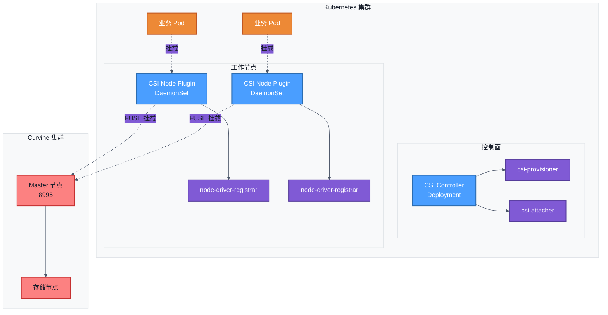
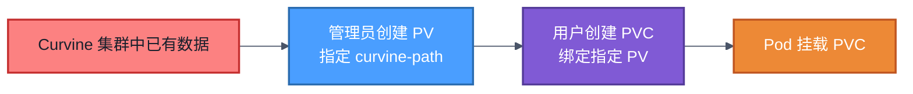

# 安装指南

为便于在云原生环境中快速接入 Curvine，Curvine 提供了 CSI 驱动支持。业务 Pod 可通过 `PV`（Persistent Volume）访问 Curvine 存储，无需修改应用代码，即可使用 Curvine 的缓存能力。

Curvine CSI 驱动遵循标准 CSI 规范，包含：
- `CSI Controller`，以 `Deployment` 或 `StatefulSet` 方式部署
- `CSI Node Plugin`，以 `DaemonSet` 方式部署

## 架构概览

Curvine CSI 驱动采用标准 CSI 架构，主要由两部分组成：


```mermaid
%%{init: {'theme': 'base', 'themeVariables': { 'background': '#ffffff', 'primaryColor': '#4a9eff', 'primaryTextColor': '#1a202c', 'primaryBorderColor': '#3182ce', 'lineColor': '#4a5568', 'secondaryColor': '#805ad5', 'tertiaryColor': '#38a169', 'mainBkg': '#ffffff', 'nodeBorder': '#4a5568', 'clusterBkg': '#f8f9fa', 'clusterBorder': '#dee2e6', 'titleColor': '#1a202c'}}}%%
graph TB
    subgraph "Kubernetes 集群"
        subgraph "控制面"
            Controller[CSI Controller<br/>Deployment]
            Provisioner[csi-provisioner]
            Attacher[csi-attacher]
            Controller --> Provisioner
            Controller --> Attacher
        end
        
        subgraph "工作节点"
            Node1[CSI Node Plugin<br/>DaemonSet]
            Node2[CSI Node Plugin<br/>DaemonSet]
            Registrar1[node-driver-registrar]
            Registrar2[node-driver-registrar]
            Node1 --> Registrar1
            Node2 --> Registrar2
        end
        
        Pod1[业务 Pod]
        Pod2[业务 Pod]
        
        Pod1 -.挂载.-> Node1
        Pod2 -.挂载.-> Node2
    end
    
    subgraph "Curvine 集群"
        Master[Master 节点<br/>8995]
        Storage[存储节点]
        Master --> Storage
    end
    
    Node1 -.FUSE 挂载.-> Master
    Node2 -.FUSE 挂载.-> Master

  classDef csiStyle fill:#4a9eff,stroke:#2b6cb0,color:#fff,stroke-width:2px
  classDef sidecarStyle fill:#805ad5,stroke:#553c9a,color:#fff,stroke-width:2px
  classDef nodeStyle fill:#48bb78,stroke:#276749,color:#fff,stroke-width:2px
  classDef appStyle fill:#ed8936,stroke:#c05621,color:#fff,stroke-width:2px
  classDef storageStyle fill:#fc8181,stroke:#c53030,color:#1a202c,stroke-width:2px
  
  class Controller,Node1,Node2 csiStyle
  class Provisioner,Attacher,Registrar1,Registrar2 sidecarStyle
  class Pod1,Pod2 appStyle
  class Master,Storage storageStyle
```

### 核心组件

1. **CSI Controller**
   - 运行在控制面
   - 负责卷的创建、删除以及 Attach/Detach 操作
   - 包含 csi-provisioner 和 csi-attacher sidecar

2. **CSI Node Plugin**
   - 以 DaemonSet 方式运行在每个工作节点
   - 负责将 Curvine 存储挂载到 Pod
   - 通过 FUSE 技术实现文件系统挂载

3. **FUSE 挂载机制**
   - 直接挂载 Curvine 文件系统路径
   - 相同路径共享 FUSE 进程，节省资源
   - 支持多个 Pod 并发访问

---

## 前置条件

### 环境要求

- Kubernetes 1.19+
- Helm 3.0+
- 可访问的 Curvine 集群（Master 节点地址和端口）
- 集群管理员权限

### 环境检查

```bash
# 检查 Kubernetes 版本
kubectl version --short

# 检查 Helm 版本
helm version --short

# 检查节点状态
kubectl get nodes
```

---

## 一、安装 Curvine CSI

### 1.1 获取 Helm Chart

```bash
helm repo add curvine https://curvineio.github.io/helm-charts
helm repo update
helm search repo curvine --devel
helm install curvine-csi curvine/curvine-csi \
    --namespace curvine \
    --create-namespace --devel \
    --version 0.0.1-dev+7ffc6a2
```

:::tip
当前 Curvine Helm 仓库提供预发布版本：
- 使用 `--devel` 查看可用版本，并将上面命令中的 `--version` 替换为目标版本
- 通过 Helm 安装时，curvine-csi 默认部署在 `curvine` 命名空间
- 正式 release 版本会逐步提供
:::

### 1.2 配置自定义参数（可选）

curvine-csi 支持丰富的自定义参数。若网络环境受限，可自定义镜像等配置。

例如，创建 `custom-values.yaml` 文件：

```yaml
# 镜像配置
image:
  repository: ghcr.io/curvineio/curvine-csi
  tag: latest
  pullPolicy: IfNotPresent

# Controller 配置
controller:
  replicas: 1
  resources:
    requests:
      cpu: 100m
      memory: 128Mi
    limits:
      cpu: 500m
      memory: 512Mi

# Node 配置 - Embedded 模式（默认）
node:
  mountMode: embedded
  container:
    resources:
      requests:
        cpu: 500m
        memory: 512Mi
      limits:
        cpu: 2
        memory: 2Gi
```

如需 FUSE 生命周期隔离，可使用 Standalone 模式：

```yaml
# Node 配置 - Standalone 模式（可选）
node:
  mountMode: standalone
  standalone:
    image: ""
    resources:
      requests:
        cpu: 500m
        memory: 512Mi
      limits:
        cpu: 2
        memory: 2Gi
```

使用自定义参数安装：

```bash
helm install curvine-csi curvine/curvine-csi \
    --namespace curvine \
    --create-namespace --devel \
  --values custom-values.yaml

# 检查安装状态
helm status curvine-csi -n curvine
```

:::tip
Helm Chart 默认使用 `embedded` 模式，FUSE 运行在 CSI node 容器内，部署更简单。若需要 FUSE 在 CSI node Pod 重启或升级后仍能存活，请使用 `standalone` 模式。架构细节和 Helm 参数说明见 [Curvine CSI 架构](04-Framework.md)。
:::

### 1.4 升级与卸载

```bash
# 升级
helm upgrade curvine curvine/curvine-csi -n curvine --devel --version xxxxx

# 卸载
helm uninstall curvine-csi -n curvine

# 完整清理（包括命名空间）
kubectl delete namespace curvine
```

---

## 二、验证与状态检查

### 2.1 检查 CSI 驱动注册

```bash
# 检查 CSI Driver 是否注册成功
kubectl get csidriver curvine

# 示例输出：
# NAME      ATTACHREQUIRED   PODINFOONMOUNT   STORAGECAPACITY
# curvine   false            false            false
```

**参数说明：**
- `ATTACHREQUIRED: false` — 无需 Attach 操作（直接 FUSE 挂载）
- `PODINFOONMOUNT: false` — 挂载时不需要 Pod 信息

### 2.2 检查 Controller 状态

```bash
# 检查 Controller Deployment
kubectl get deployment -n curvine curvine-csi-controller

# 检查 Controller Pod
kubectl get pods -n curvine -l app=curvine-csi-controller

# 检查 Controller 日志
kubectl logs -n curvine \
  -l app=curvine-csi-controller \
  -c csi-plugin \
  --tail=50

# 检查 Provisioner Sidecar 日志
kubectl logs -n curvine \
  -l app=curvine-csi-controller \
  -c csi-provisioner \
  --tail=50
```

### 2.3 检查 Node Plugin 状态

```bash
# 检查 Node DaemonSet
kubectl get daemonset -n curvine curvine-csi-node

# 检查所有 Node Plugin Pod
kubectl get pods -n curvine -l app=curvine-csi-node -o wide

# 检查指定 Node 日志
kubectl logs -n curvine curvine-csi-node-xxxxx -c csi-plugin

# 检查 Node Registrar 日志
kubectl logs -n curvine curvine-csi-node-xxxxx -c node-driver-registrar
```

## 三、StorageClass 说明

StorageClass 是 Kubernetes 中定义存储类型的资源，用于自动创建动态 PV。

### 3.1 StorageClass 配置示例

```yaml
apiVersion: storage.k8s.io/v1
kind: StorageClass
metadata:
  name: curvine-sc
provisioner: curvine                      # CSI 驱动名称
reclaimPolicy: Delete                     # 回收策略
volumeBindingMode: Immediate              # 绑定模式
allowVolumeExpansion: true                # 允许扩容
parameters:
  # 必填：Curvine 集群连接信息
  master-addrs: "master1:8995,master2:8995,master3:8995"
  
  # 必填：文件系统路径前缀
  fs-path: "/k8s-volumes"
  
  # 可选：路径创建策略
  path-type: "DirectoryOrCreate"
  
  # 可选：FUSE 参数
  io-threads: "4"
  worker-threads: "8"
```

### 3.2 参数说明

#### 核心参数

| 参数 | 必填 | 说明 | 示例 |
|-----|------|------|------|
| `master-addrs` | ✅ | Curvine Master 节点地址列表，逗号分隔 | `"10.0.0.1:8995,10.0.0.2:8995"` |
| `fs-path` | ✅ | 动态 PV 的路径前缀，实际路径为 `fs-path + pv-name` | `"/k8s-volumes"` |
| `path-type` | ❌ | 路径创建策略，默认 `Directory` | `"DirectoryOrCreate"`（路径不存在时自动创建）；`"Directory"`（路径必须已存在） |
| `reclaimPolicy` | ❌ | PV 回收策略，默认 `Delete` | `"Delete"`（删除 PVC 时自动删除 PV 和存储数据）；`"Retain"`（删除 PVC 后保留 PV） |
| `Binding Mode` | ❌ | PV 绑定模式，默认 `Immediate` | `"Immediate"`（创建 PVC 后立即绑定 PV）；`"WaitForFirstConsumer"`（等待 Pod 调度后再绑定 PV） |
| `io-threads` | ❌ | FUSE IO 线程数 | `"4"` |
| `worker-threads` | ❌ | FUSE 工作线程数 | `"8"` |

### 3.3 动态 PV 路径生成规则

```
实际挂载路径 = fs-path + "/" + pv-name
```

**示例：**
```yaml
# StorageClass 配置
fs-path: "/k8s-volumes"

# 自动生成的 PV 名称
pv-name: "pvc-1234-5678-abcd"

# 最终 Curvine 路径
实际路径: "/k8s-volumes/pvc-1234-5678-abcd"
```

### 3.4 创建 StorageClass

创建 `storageclass.yaml` 文件：

```yaml
apiVersion: storage.k8s.io/v1
kind: StorageClass
metadata:
  name: curvine-sc
provisioner: curvine
reclaimPolicy: Delete
volumeBindingMode: Immediate
allowVolumeExpansion: true
parameters:
  master-addrs: "m0:8995,m1:8995,m2:8995"
  fs-path: "/k8s-volumes"
  path-type: "DirectoryOrCreate"
```

应用配置：

```bash
# 创建 StorageClass
kubectl apply -f storageclass.yaml

# 查看 StorageClass
kubectl get storageclass curvine-sc

# 设为默认 StorageClass（可选）
kubectl patch storageclass curvine-sc \
  -p '{"metadata": {"annotations":{"storageclass.kubernetes.io/is-default-class":"true"}}}'
```

:::tip
请将示例中的 `master-addrs` 替换为实际的 Master 地址。
:::

### 3.5 多 StorageClass 场景

可为不同场景创建多个 StorageClass：

```yaml
# 生产环境 - 严格模式
---
apiVersion: storage.k8s.io/v1
kind: StorageClass
metadata:
  name: curvine-prod
provisioner: curvine
reclaimPolicy: Retain
volumeBindingMode: WaitForFirstConsumer
parameters:
  master-addrs: "prod-master1:8995,prod-master2:8995"
  fs-path: "/production"
  path-type: "Directory"

# 开发环境 - 宽松模式
---
apiVersion: storage.k8s.io/v1
kind: StorageClass
metadata:
  name: curvine-dev
provisioner: curvine
reclaimPolicy: Delete
volumeBindingMode: Immediate
parameters:
  master-addrs: "dev-master:8995"
  fs-path: "/development"
  path-type: "DirectoryOrCreate"
```

---

## 四、静态 PV 使用

静态 PV 用于挂载 Curvine 中已存在的数据目录，适用于以下场景：
- 多集群共享同一份数据
- 需要精确控制数据路径

### 4.1 工作原理


```mermaid
%%{init: {'theme': 'base', 'themeVariables': { 'background': '#ffffff', 'primaryColor': '#4a9eff', 'primaryTextColor': '#1a202c', 'primaryBorderColor': '#3182ce', 'lineColor': '#4a5568', 'secondaryColor': '#805ad5', 'tertiaryColor': '#38a169', 'mainBkg': '#ffffff', 'nodeBorder': '#4a5568', 'clusterBkg': '#f8f9fa', 'clusterBorder': '#dee2e6', 'titleColor': '#1a202c'}}}%%
flowchart LR
    Start[Curvine 集群中已有数据] --> CreatePV[管理员创建 PV<br/>指定 curvine-path]
    CreatePV --> CreatePVC[用户创建 PVC<br/>绑定指定 PV]
    CreatePVC --> MountPod[Pod 挂载 PVC]
    
    classDef storageStyle fill:#fc8181,stroke:#c53030,color:#1a202c,stroke-width:2px
    classDef adminStyle fill:#4a9eff,stroke:#2b6cb0,color:#fff,stroke-width:2px
    classDef userStyle fill:#805ad5,stroke:#553c9a,color:#fff,stroke-width:2px
    classDef appStyle fill:#ed8936,stroke:#c05621,color:#fff,stroke-width:2px
    
    class Start storageStyle
    class CreatePV adminStyle
    class CreatePVC userStyle
    class MountPod appStyle
```

### 4.2 创建静态 PV

```yaml
apiVersion: v1
kind: PersistentVolume
metadata:
  name: curvine-pv-existing-data
  labels:
    type: curvine-static
spec:
  storageClassName: curvine-sc
  capacity:
    storage: 100Gi                    # 声明容量
  accessModes:
    - ReadWriteMany                   # 支持多 Pod 读写
  persistentVolumeReclaimPolicy: Retain  # 保留数据
  csi:
    driver: curvine
    volumeHandle: "existing-data-volume-001"  # 唯一标识
    volumeAttributes:
      # 必填：Curvine Master 地址
      master-addrs: "m0:8995,m1:8995,m2:8995"
      
      # 必填：Curvine 中的完整路径
      curvine-path: "/production/user-data"
      
      # 推荐：使用 Directory 确保路径已存在
      path-type: "Directory"
      
      # 可选：FUSE 参数
      io-threads: "4"
      worker-threads: "8"
```

**参数说明：**
- `volumeHandle`：任意唯一字符串，用于标识 PV
- `curvine-path`：Curvine 文件系统中的完整路径，必须已存在
- `path-type: Directory`：要求路径已存在（推荐）

### 4.3 创建静态 PVC

```yaml
apiVersion: v1
kind: PersistentVolumeClaim
metadata:
  name: curvine-pvc-existing-data
  namespace: default
spec:
  storageClassName: curvine-sc
  accessModes:
    - ReadWriteMany
  resources:
    requests:
      storage: 100Gi
  # 关键：指定要绑定的 PV 名称
  volumeName: curvine-pv-existing-data
```

### 4.4 验证绑定

```bash
# 检查 PV 状态
kubectl get pv curvine-pv-existing-data
# STATUS 应为 Bound

# 检查 PVC 状态
kubectl get pvc curvine-pvc-existing-data
# STATUS 应为 Bound

# 查看详细信息
kubectl describe pvc curvine-pvc-existing-data
```

### 4.5 在 Pod 中使用静态 PV

```yaml
apiVersion: v1
kind: Pod
metadata:
  name: static-pv-test
spec:
  containers:
  - name: app
    image: nginx:alpine
    volumeMounts:
    - name: data
      mountPath: /data
  volumes:
  - name: data
    persistentVolumeClaim:
      claimName: curvine-pvc-existing-data
```

## 五、动态 PV 使用

动态 PV 是最常用的方式，由 CSI Controller 自动创建和管理。

### 5.1 工作原理


```mermaid
%%{init: {'theme': 'base', 'themeVariables': { 'background': '#ffffff', 'primaryColor': '#4a9eff', 'primaryTextColor': '#1a202c', 'primaryBorderColor': '#3182ce', 'lineColor': '#4a5568', 'secondaryColor': '#805ad5', 'tertiaryColor': '#38a169', 'mainBkg': '#ffffff', 'nodeBorder': '#4a5568', 'clusterBkg': '#f8f9fa', 'clusterBorder': '#dee2e6', 'titleColor': '#1a202c'}}}%%
flowchart LR
    CreatePVC[用户创建 PVC<br/>指定 StorageClass] --> AutoCreatePV[CSI Provisioner<br/>自动创建 PV]
    AutoCreatePV --> GenPath[自动生成 Curvine 路径<br/>fs-path + pv-name]
    GenPath --> AutoBind[PVC 自动绑定 PV]
    AutoBind --> MountPod[Pod 挂载 PVC 使用]
    
    classDef userStyle fill:#805ad5,stroke:#553c9a,color:#fff,stroke-width:2px
    classDef csiStyle fill:#4a9eff,stroke:#2b6cb0,color:#fff,stroke-width:2px
    classDef pathStyle fill:#48bb78,stroke:#276749,color:#fff,stroke-width:2px
    classDef bindStyle fill:#ecc94b,stroke:#b7791f,color:#1a202c,stroke-width:2px
    classDef appStyle fill:#ed8936,stroke:#c05621,color:#fff,stroke-width:2px
    
    class CreatePVC userStyle
    class AutoCreatePV csiStyle
    class GenPath pathStyle
    class AutoBind bindStyle
    class MountPod appStyle
```

### 5.2 创建动态 PVC

动态 PVC 需要指定 StorageClass，不需要指定 `volumeName`：

```yaml
apiVersion: v1
kind: PersistentVolumeClaim
metadata:
  name: my-dynamic-pvc
  namespace: default
spec:
  storageClassName: curvine-sc    # 指定 StorageClass
  accessModes:
    - ReadWriteOnce               # 或 ReadWriteMany
  resources:
    requests:
      storage: 10Gi               # 申请容量
```

### 5.3 自动路径生成示例

```yaml
# StorageClass 配置
fs-path: "/k8s-volumes"

# PVC 名称
name: my-dynamic-pvc

# 自动生成的 PV
# volumeHandle: pvc-1a2b3c4d-5e6f-7g8h-9i0j-k1l2m3n4o5p6

# 实际 Curvine 路径
# /k8s-volumes/pvc-1a2b3c4d-5e6f-7g8h-9i0j-k1l2m3n4o5p6

# 可使用 Curvine 的 cv 命令检查卷是否在集群中正确创建
./bin/cv fs ls /
```

### 5.4 动态 PV 完整示例

创建 `dynamic-pvc.yaml` 文件：

```yaml
apiVersion: v1
kind: PersistentVolumeClaim
metadata:
  name: app-data-pvc
  namespace: default
spec:
  storageClassName: curvine-sc
  accessModes:
    - ReadWriteMany
  resources:
    requests:
      storage: 20Gi
```

创建 `dynamic-pv-pod.yaml` 文件：

```yaml
apiVersion: v1
kind: Pod
metadata:
  name: dynamic-pv-test
spec:
  containers:
  - name: app
    image: nginx:alpine
    volumeMounts:
    - name: data
      mountPath: /usr/share/nginx/html
  volumes:
  - name: data
    persistentVolumeClaim:
      claimName: app-data-pvc
```

应用配置：

```bash
# 1. 创建动态 PVC
kubectl apply -f dynamic-pvc.yaml

# 2. 检查 PVC 状态（应自动变为 Bound）
kubectl get pvc app-data-pvc
kubectl describe pvc app-data-pvc

# 3. 查看自动创建的 PV
kubectl get pv

# 4. 创建使用 PVC 的 Pod
kubectl apply -f dynamic-pv-pod.yaml

# 5. 测试读写
kubectl exec dynamic-pv-test -- sh -c 'echo "Hello Curvine" > /usr/share/nginx/html/index.html'
kubectl exec dynamic-pv-test -- cat /usr/share/nginx/html/index.html
```

## 下一步

- 在 `Deployment` 中共享 PVC，参考 [Deployment](02-Deployment.md)
- 在 `StatefulSet` 中为每个副本分配独立 PVC，参考 [StatefulSet](03-StatefulSet.md)
- 理解 `volumeHandle`、FUSE 复用和挂载路径生成规则，参考 [Framework](04-Framework.md)

## 附录

### Helm 自定义参数

#### 全局配置

| 参数路径 | 类型 | 默认值 | 说明 |
|---------|------|--------|------|
| `global.namespace` | string | `curvine` | CSI 驱动部署的命名空间 |

#### 镜像配置

| 参数路径 | 类型 | 默认值 | 说明 |
|---------|------|--------|------|
| `image.repository` | string | `ghcr.io/curvineio/curvine-csi` | CSI 驱动镜像仓库地址 |
| `image.tag` | string | `latest` | CSI 驱动镜像标签 |
| `image.pullPolicy` | string | `Always` | 镜像拉取策略（Always/IfNotPresent/Never） |

#### CSI 驱动配置

| 参数路径 | 类型 | 默认值 | 说明 |
|---------|------|--------|------|
| `csiDriver.name` | string | `curvine` | CSI 驱动名称 |
| `csiDriver.attachRequired` | boolean | `false` | 是否需要 Attach 操作 |
| `csiDriver.podInfoOnMount` | boolean | `false` | 挂载时是否需要 Pod 信息 |

#### Controller 配置

| 参数路径 | 类型 | 默认值 | 说明 |
|---------|------|--------|------|
| `controller.name` | string | `curvine-csi-controller` | Controller Deployment 名称 |
| `controller.replicas` | int | `1` | Controller 副本数 |
| `controller.priorityClassName` | string | `system-cluster-critical` | Controller 优先级类 |
| `controller.container.name` | string | `csi-plugin` | 主容器名称 |
| `controller.container.command` | array | `["/opt/curvine/csi"]` | 容器启动命令 |
| `controller.container.args` | array | 见 values.yaml | 容器启动参数 |
| `controller.container.env.CSI_ENDPOINT` | string | `unix:///csi/csi.sock` | CSI 套接字端点 |
| `controller.container.livenessProbe.failureThreshold` | int | `5` | 存活探针失败阈值 |
| `controller.container.livenessProbe.httpGet.path` | string | `"/healthz"` | 存活探针 HTTP 路径 |
| `controller.container.livenessProbe.httpGet.port` | string | `healthz` | 存活探针 HTTP 端口名 |
| `controller.container.livenessProbe.initialDelaySeconds` | int | `10` | 存活探针初始延迟（秒） |
| `controller.container.livenessProbe.periodSeconds` | int | `10` | 存活探针检查周期（秒） |
| `controller.container.livenessProbe.timeoutSeconds` | int | `3` | 存活探针超时（秒） |
| `controller.container.ports.healthz` | int | `9909` | 健康检查端口 |
| `controller.container.securityContext.privileged` | boolean | `true` | 是否以特权模式运行 |
| `controller.container.securityContext.capabilities.add` | array | `[SYS_ADMIN]` | 添加的 Linux Capabilities |
| `controller.tolerations` | array | 见 values.yaml | Pod 容忍度配置 |

#### Controller Sidecar 配置

| 参数路径 | 类型 | 默认值 | 说明 |
|---------|------|--------|------|
| `controller.sidecars.provisioner.image` | string | `quay.io/k8scsi/csi-provisioner:v1.6.0` | Provisioner sidecar 镜像 |
| `controller.sidecars.provisioner.args` | array | 见 values.yaml | Provisioner 参数 |
| `controller.sidecars.attacher.image` | string | `registry.k8s.io/sig-storage/csi-attacher:v4.5.0` | Attacher sidecar 镜像 |
| `controller.sidecars.attacher.args` | array | 见 values.yaml | Attacher 参数 |
| `controller.sidecars.livenessProbe.image` | string | `registry.k8s.io/sig-storage/livenessprobe:v2.11.0` | LivenessProbe sidecar 镜像 |
| `controller.sidecars.livenessProbe.args` | array | 见 values.yaml | LivenessProbe 参数 |
| `controller.sidecars.livenessProbe.env.HEALTH_PORT` | string | `"9909"` | 健康检查端口 |

#### Node 配置

| 参数路径 | 类型 | 默认值 | 说明 |
|---------|------|--------|------|
| `node.name` | string | `curvine-csi-node` | Node DaemonSet 名称 |
| `node.priorityClassName` | string | `system-node-critical` | Node 优先级类 |
| `node.dnsPolicy` | string | `ClusterFirstWithHostNet` | DNS 策略 |
| `node.fuseDebugEnabled` | boolean | `false` | 是否启用 FUSE 调试模式 |
| `node.mountMode` | string | `embedded` | 挂载模式：`embedded`（FUSE 在 CSI 容器内，默认）或 `standalone`（独立 FUSE Pod） |
| `node.container.name` | string | `csi-plugin` | 主容器名称 |
| `node.container.command` | array | `["/opt/curvine/csi"]` | 容器启动命令 |
| `node.container.args` | array | 见 values.yaml | 容器启动参数 |
| `node.container.env.CSI_ENDPOINT` | string | `unix:///csi/csi.sock` | CSI 套接字端点 |
| `node.container.livenessProbe.failureThreshold` | int | `5` | 存活探针失败阈值 |
| `node.container.livenessProbe.httpGet.path` | string | `"/healthz"` | 存活探针 HTTP 路径 |
| `node.container.livenessProbe.httpGet.port` | string | `healthz` | 存活探针 HTTP 端口名 |
| `node.container.livenessProbe.initialDelaySeconds` | int | `10` | 存活探针初始延迟（秒） |
| `node.container.livenessProbe.periodSeconds` | int | `10` | 存活探针检查周期（秒） |
| `node.container.livenessProbe.timeoutSeconds` | int | `3` | 存活探针超时（秒） |
| `node.container.ports.healthz` | int | `9909` | 健康检查端口 |
| `node.container.securityContext.privileged` | boolean | `true` | 是否以特权模式运行 |
| `node.container.lifecycle.preStop` | object | 见 values.yaml | 容器停止前钩子 |
| `node.tolerations` | array | `[{operator: Exists}]` | Pod 容忍度配置 |

#### Embedded 模式配置

当 `node.mountMode` 为 `embedded`（默认）时，资源限制作用于 CSI node 容器：

| 参数路径 | 类型 | 默认值 | 说明 |
|---------|------|--------|------|
| `node.container.resources.requests.cpu` | string | `"500m"` | CPU 请求 |
| `node.container.resources.requests.memory` | string | `"512Mi"` | 内存请求 |
| `node.container.resources.limits.cpu` | string | `"2"` | CPU 限制 |
| `node.container.resources.limits.memory` | string | `"2Gi"` | 内存限制 |

示例配置：

```yaml
node:
  mountMode: embedded
  container:
    resources:
      requests:
        cpu: "500m"
        memory: "512Mi"
      limits:
        cpu: "2"
        memory: "2Gi"
```

#### Standalone Pod 配置

当 `node.mountMode` 设为 `standalone` 时，适用以下配置：

| 参数路径 | 类型 | 默认值 | 说明 |
|---------|------|--------|------|
| `node.standalone.image` | string | `""` | Standalone Pod 镜像，为空则使用 CSI 镜像 |
| `node.standalone.resources.requests.cpu` | string | `"500m"` | CPU 请求 |
| `node.standalone.resources.requests.memory` | string | `"512Mi"` | 内存请求 |
| `node.standalone.resources.limits.cpu` | string | `"2"` | CPU 限制 |
| `node.standalone.resources.limits.memory` | string | `"2Gi"` | 内存限制 |

示例配置：

```yaml
node:
  mountMode: standalone
  standalone:
    image: ""
    resources:
      requests:
        cpu: "500m"
        memory: "512Mi"
      limits:
        cpu: "2"
        memory: "2Gi"
```

#### Node Sidecar 配置

| 参数路径 | 类型 | 默认值 | 说明 |
|---------|------|--------|------|
| `node.sidecars.nodeDriverRegistrar.image` | string | `quay.io/k8scsi/csi-node-driver-registrar:v2.1.0` | Node 驱动注册器镜像 |
| `node.sidecars.nodeDriverRegistrar.args` | array | 见 values.yaml | 注册器参数 |
| `node.sidecars.nodeDriverRegistrar.env.ADDRESS` | string | `/csi/csi.sock` | CSI 套接字地址 |
| `node.sidecars.nodeDriverRegistrar.env.DRIVER_REG_SOCK_PATH` | string | `/var/lib/kubelet/csi-plugins/csi.curvine.io/csi.sock` | Kubelet 中驱动注册路径 |
| `node.sidecars.livenessProbe.image` | string | `registry.k8s.io/sig-storage/livenessprobe:v2.11.0` | LivenessProbe sidecar 镜像 |
| `node.sidecars.livenessProbe.args` | array | 见 values.yaml | LivenessProbe 参数 |
| `node.sidecars.livenessProbe.env.ADDRESS` | string | `/csi/csi.sock` | CSI 套接字地址 |
| `node.sidecars.livenessProbe.env.HEALTH_PORT` | string | `"9909"` | 健康检查端口 |

#### Node 主机路径配置

| 参数路径 | 类型 | 默认值 | 说明 |
|---------|------|--------|------|
| `node.hostPaths.pluginDir.path` | string | `/var/lib/kubelet/csi-plugins/csi.curvine.io/` | CSI 插件目录路径 |
| `node.hostPaths.pluginDir.type` | string | `DirectoryOrCreate` | 路径类型 |
| `node.hostPaths.kubeletDir.path` | string | `/var/lib/kubelet` | Kubelet 工作目录 |
| `node.hostPaths.kubeletDir.type` | string | `DirectoryOrCreate` | 路径类型 |
| `node.hostPaths.registrationDir.path` | string | `/var/lib/kubelet/plugins_registry/` | 插件注册目录 |
| `node.hostPaths.registrationDir.type` | string | `Directory` | 路径类型 |

#### 服务账号配置

| 参数路径 | 类型 | 默认值 | 说明 |
|---------|------|--------|------|
| `serviceAccount.controller.name` | string | `curvine-csi-controller-sa` | Controller 服务账号名称 |
| `serviceAccount.node.name` | string | `curvine-csi-node-sa` | Node 服务账号名称 |

#### RBAC 配置

| 参数路径 | 类型 | 默认值 | 说明 |
|---------|------|--------|------|
| `rbac.create` | boolean | `true` | 是否创建 RBAC 资源 |

#### StorageClass 参数（使用时配置）

| 参数名 | 必填 | 类型 | 默认值 | 说明 |
|--------|---------|------|--------|------|
| `master-addrs` | **必填** | string | 无 | Curvine Master 节点地址，格式：`host:port,host:port` |
| `fs-path` | **必填** | string | 无 | 文件系统路径前缀，每个 PV 创建：`fs-path + pv-name` |
| `path-type` | 可选 | string | `Directory` | 路径创建策略：`DirectoryOrCreate` 或 `Directory` |
| `io-threads` | 可选 | string | 无 | FUSE IO 线程数 |
| `worker-threads` | 可选 | string | 无 | FUSE 工作线程数 |
