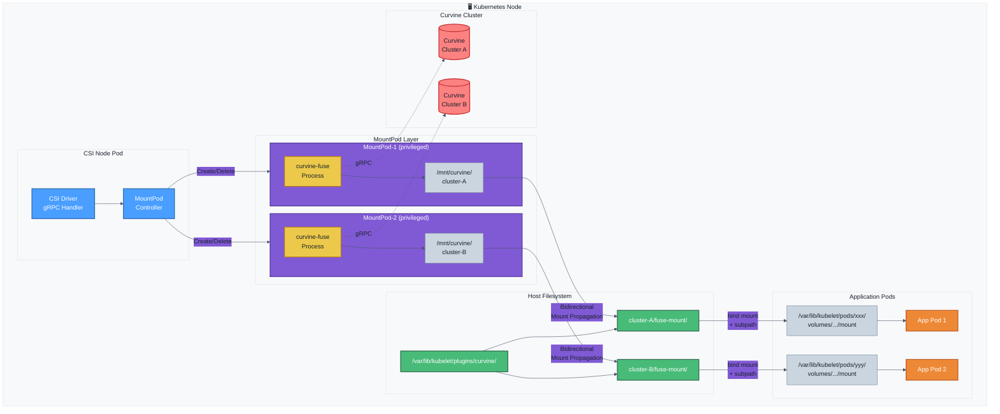
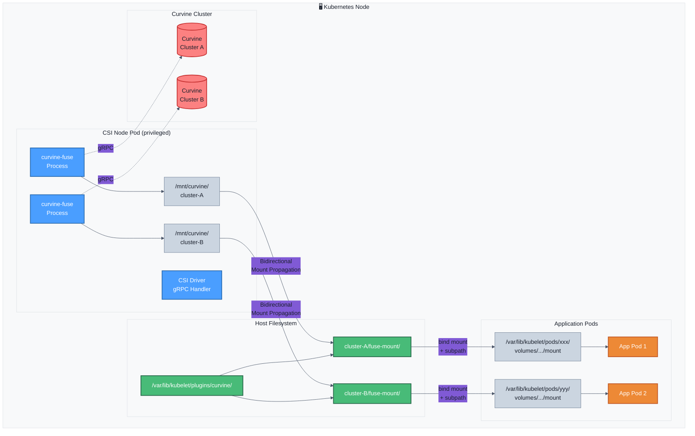

# Curvine CSI 架构详解

`curvine-csi` 基于fuse实现，在csi-node中通过fuse挂载的方式和curvine集群建立关联。 


## 架构
**如果仅需要使用csi，可以略过本章**， 直接参考[K8S CSI驱动](Setup) 这一章节。

curvine-csi的主要服务包含两个
| 组件 | 职责 |
|------|------|
| CSI Node | 处理 CSI gRPC 调用，负责卷的挂载等|
| CSI Controller | 创建/删除/监控 PV|
| Standalone POD | 在 `standalone` 模式下独立负责fuse进程管理 | 


## 挂载方式
大多csi的挂载管理是直接在`csi-node`中实现，通过将远程存储挂载到hosts上，并最终bind mount到pod容器中。  curvine-csi基于fuse实现，当csi组件重启之后，fuse进程会中断，为了避免csi drvier的升级或者重启等场景导致fuse终端，curvine-csi 支持standalone和 embedded 两种挂载模式。

- StandAlone： 将 FUSE进程从 csi-node pod 中解耦，放入独立的Pod 运行
- Embedded： FUSE进程在csi-node plugin的pod中进行挂历

### Standalone

默认模式。Helm 安装时使用以下参数：

```bash
helm install curvine-csi ./curvine-csi \
  --set mountMode=standalone
```

#### 资源配置

通过 Helm values 配置 Standalone Pod 的资源限制：

```bash
helm install curvine-csi ./curvine-csi \
  --set node.mountMode=standalone \
  --set node.standalone.resources.requests.cpu=500m \
  --set node.standalone.resources.requests.memory=512Mi \
  --set node.standalone.resources.limits.cpu=2 \
  --set node.standalone.resources.limits.memory=2Gi
```

或使用 values 文件：

```yaml
node:
  mountMode: standalone
  standalone:
    image: ""  # 留空使用CSI镜像
    resources:
      requests:
        cpu: "500m"
        memory: "512Mi"
      limits:
        cpu: "2"
        memory: "2Gi"
```

默认配置：
- CPU: requests 500m, limits 2
- Memory: requests 512Mi, limits 2Gi

架构示意图：




### Embedded

Helm 安装时使用以下参数：

```bash
helm install curvine-csi ./curvine-csi \
  --set mountMode=embedded \
  --set node.resources.requests.memory=2Gi \
  --set node.resources.requests.cpu=1000m \
  --set node.resources.limits.memory=4Gi \
  --set node.resources.limits.cpu=2000m
```

架构示意图：


:::warning
Embedded模式下，如果curvine-csi重启或者升级等，fuse进程会中断，会导致POD无法正常使用Curvine，请谨慎根据您的场景选择使用。
:::

## FUSE生命周期管理

### 概述

Curvine CSI 采用FUSE进程复用机制，通过 **ClusterID** 作为唯一标识，实现多个 PV 共享同一个 FUSE 进程（Standalone Pod）。这种设计显著提升了资源利用率和系统性能。

### 核心概念

#### ClusterID 生成规则

ClusterID 是 FUSE 进程复用的核心标识，由 `master-addrs` 的 SHA256 哈希前 8 位生成：

```go
// 示例：master-addrs 生成 ClusterID
masterAddrs := "10.0.0.1:8995,10.0.0.2:8995,10.0.0.3:8995"
clusterID := SHA256(masterAddrs)[:8]  // 例如：0893a5f6
```

**关键特性**：
- 相同的 `master-addrs` → 相同的 ClusterID → 共享 Standalone Pod
- 不同的 `master-addrs` → 不同的 ClusterID → 独立 Standalone Pod
- 支持多集群：同一节点可运行多个 Standalone Pod，访问不同 Curvine 集群

#### Standalone Pod 命名

```bash
curvine-standalone-{clusterID}-{randomSuffix}
# 示例：curvine-standalone-0893a5f6-aefd8804
```

### FUSE 进程复用机制

#### 复用场景示例


**说明**：
- PV-1、PV-2、PV-3 使用相同的 `master-addrs`，共享 **Standalone-0893a5f6**
- PV-4 使用不同的 `master-addrs`，使用独立的 **Standalone-1a2b3c4d**
- Standalone-0893a5f6 的引用计数为 3（三个 PV 共享）
- Standalone-1a2b3c4d 的引用计数为 1

**自动清理机制**：
- **触发条件**：RefCount 降至 0（无任何 PV 引用）
- **优雅关闭**：30 秒优雅期，确保 FUSE 正确卸载
- **preStop Hook**：5 秒等待，让进行中的 I/O 完成
- **状态持久化**：引用计数保存在 ConfigMap，节点重启后恢复

### RBAC 权限要求

Standalone 模式需要以下权限：

| 资源 | 权限 | 用途 |
|------|------|------|
| `pods` | `create`, `delete`, `get`, `list`, `watch` | 管理 Standalone Pod |
| `configmaps` | `create`, `delete`, `get`, `list`, `update`, `watch` | 状态持久化 |
| `persistentvolumes` | `get`, `list`, `watch` | PV Watch 兜底清理 |
| `events` | `create`, `patch` | 事件记录和调试 |