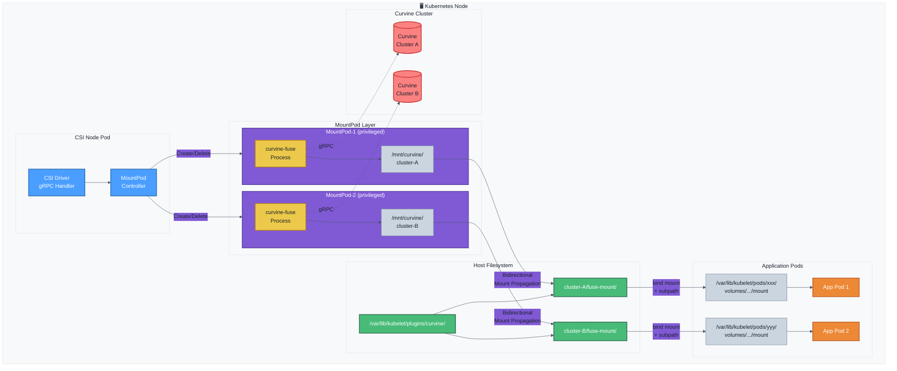
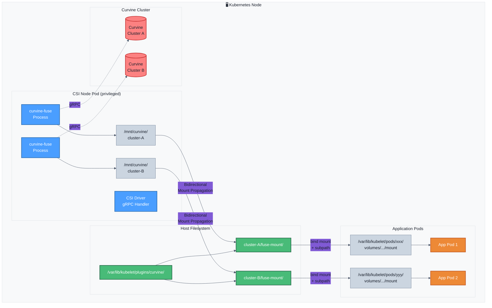
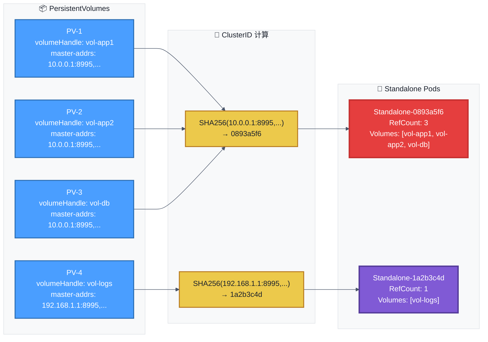
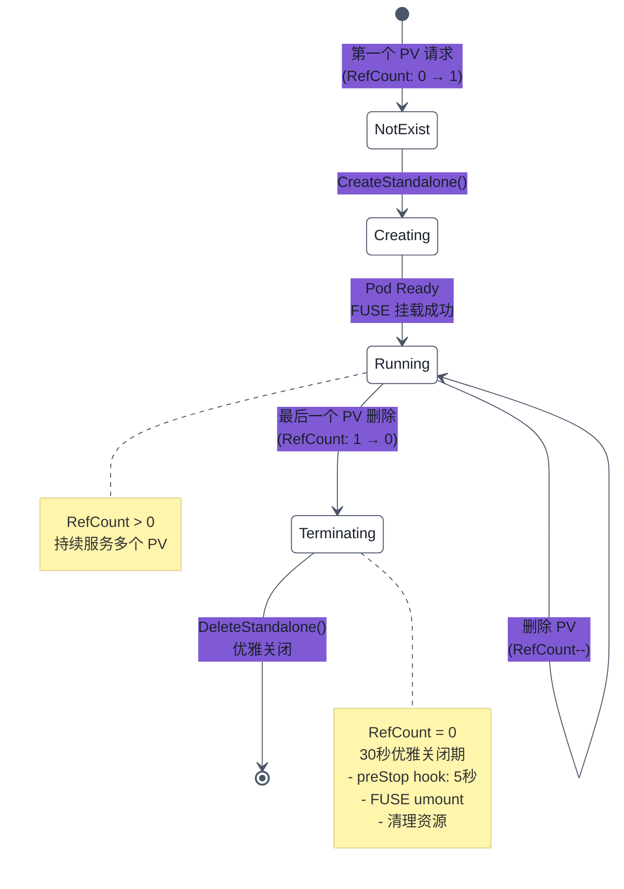
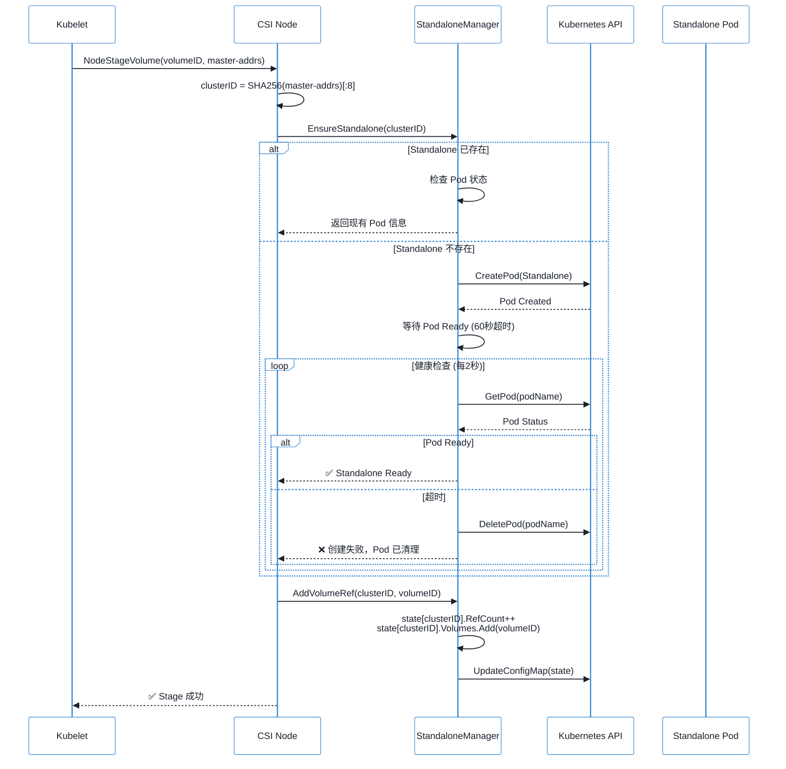
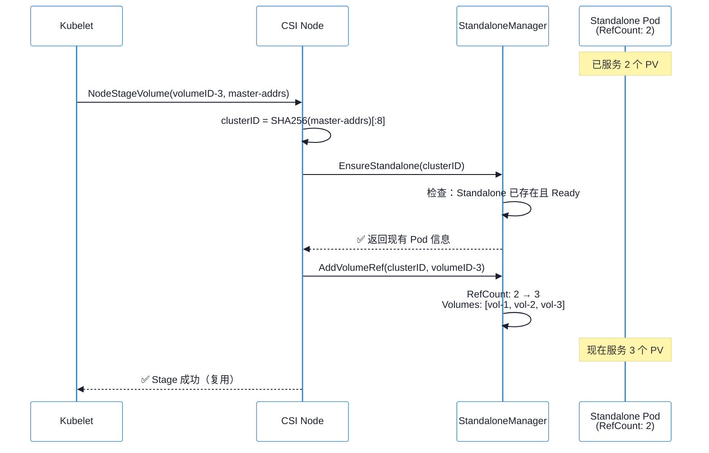
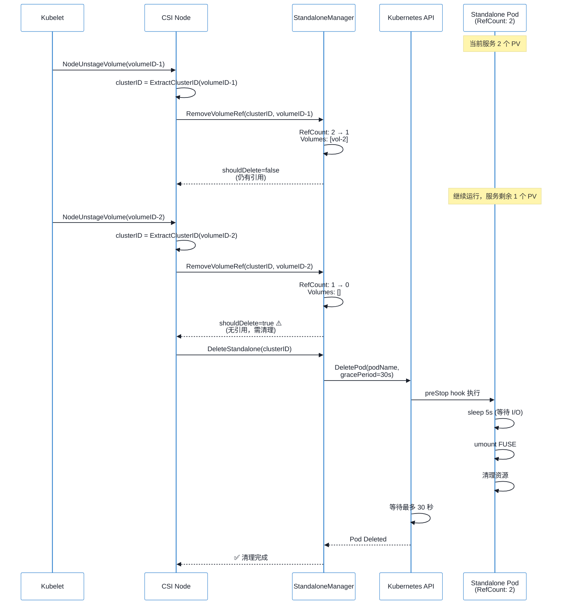
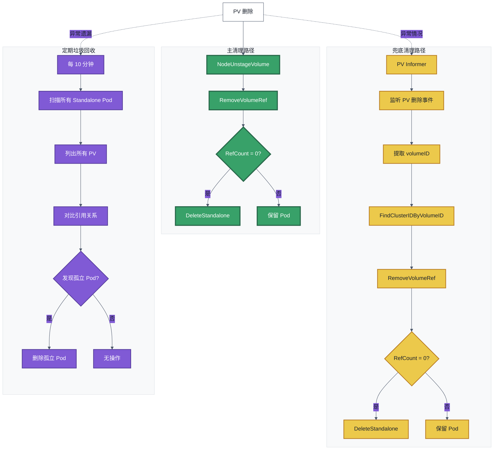

# Curvine CSI 架构详解

`curvine-csi` 基于fuse实现，在csi-node中通过fuse挂载的方式和curvine集群建立关联。 


## 架构
下图为curvine-csi的整体设计架构， **如果仅需要使用csi，可以略过本章**， 直接参考[K8S CSI驱动](Setup) 这一章节。


curvine-csi的主要服务包含两个
| 组件 | 职责 |
|------|------|
| CSI Node Service | 处理 CSI gRPC 调用，管理 MountPod 生命周期 |
| MountPod Controller | 创建/删除/监控 MountPod |


## 挂载方式
大多csi的挂载管理是直接在csi-node中实现，通过将远程存储挂载到hosts上，并最终bind mount到pod容器中。  curvine-csi基于fuse实现，当csi组件重启之后，fuse进程会中断， 为了避免csi drvier的升级或者重启等场景导致fuse终端，curvine-csi 支持standalone和 embedded 两种挂载模式。

- StandAlone： 将 FUSE进程从 csi-node pod 中解耦，放入独立的Pod 运行
- Embedded： FUSE进程在csi-node plugin的pod中进行挂历

### Standalone

默认模式。Helm 安装时使用以下参数：

```bash
helm install curvine-csi ./curvine-csi \
  --set mountMode=standalone
```

架构示意图：




### Embedded

Helm 安装时使用以下参数：

```bash
helm install curvine-csi ./curvine-csi \
  --set mountMode=embedded \
  --set node.resources.requests.memory=2Gi \
  --set node.resources.requests.cpu=1000m \
  --set node.resources.limits.memory=4Gi \
  --set node.resources.limits.cpu=2000m
```

架构示意图：




## FUSE 进程复用与生命周期管理

### 概述

Curvine CSI 采用智能的 FUSE 进程复用机制，通过 **ClusterID** 作为唯一标识，实现多个 PV 共享同一个 FUSE 进程（Standalone Pod）。这种设计显著提升了资源利用率和系统性能。

### 核心概念

#### ClusterID 生成规则

ClusterID 是 FUSE 进程复用的核心标识，由 `master-addrs` 的 SHA256 哈希前 8 位生成：

```go
// 示例：master-addrs 生成 ClusterID
masterAddrs := "10.0.0.1:8995,10.0.0.2:8995,10.0.0.3:8995"
clusterID := SHA256(masterAddrs)[:8]  // 例如：0893a5f6
```

**关键特性**：
- 相同的 `master-addrs` → 相同的 ClusterID → 共享 Standalone Pod
- 不同的 `master-addrs` → 不同的 ClusterID → 独立 Standalone Pod
- 支持多集群：同一节点可运行多个 Standalone Pod，访问不同 Curvine 集群

#### Standalone Pod 命名

```bash
curvine-standalone-{clusterID}-{randomSuffix}
# 示例：curvine-standalone-0893a5f6-aefd8804
```

### FUSE 进程复用机制

#### 复用场景示例



**说明**：
- PV-1、PV-2、PV-3 使用相同的 `master-addrs`，共享 **Standalone-0893a5f6**
- PV-4 使用不同的 `master-addrs`，使用独立的 **Standalone-1a2b3c4d**
- Standalone-0893a5f6 的引用计数为 3（三个 PV 共享）
- Standalone-1a2b3c4d 的引用计数为 1

### 生命周期管理

#### 引用计数机制

Curvine CSI 使用精确的引用计数来管理 Standalone Pod 的生命周期：



#### 生命周期详细流程

##### 1. 创建阶段



**关键点**：
- 首次创建时，RefCount 从 0 增加到 1
- 后续相同 ClusterID 的请求，直接复用现有 Pod，RefCount++
- 创建失败（如连接不上集群）时，会自动清理失败的 Pod

##### 2. 复用阶段



**优势**：
- 无需创建新 Pod，响应快速
- 节省资源：3 个 PV 仅用 1 个 Pod
- 共享连接：到 Curvine 集群的 gRPC 连接复用

##### 3. 删除阶段（自动清理）



**自动清理机制**：
- **触发条件**：RefCount 降至 0（无任何 PV 引用）
- **优雅关闭**：30 秒优雅期，确保 FUSE 正确卸载
- **preStop Hook**：5 秒等待，让进行中的 I/O 完成
- **状态持久化**：引用计数保存在 ConfigMap，节点重启后恢复

#### PV Watch 兜底机制

为了处理异常情况（如 PV 直接删除，未调用 Unstage），CSI 实现了 PV Watch 机制：



**三重保障**：
1. **主路径**：正常 Unstage 调用（最快，0 延迟）
2. **PV Watch**：监听 PV 删除事件（秒级响应）
3. **定期 GC**：扫描孤立 Pod（10 分钟兜底）

#### 状态持久化

引用计数和 Volume 列表保存在 ConfigMap 中，确保节点重启后状态不丢失：

```yaml
apiVersion: v1
kind: ConfigMap
metadata:
  name: curvine-standalone-state-minikube
  namespace: curvine-system
data:
  state.json: |
    {
      "mounts": {
        "0893a5f6": {
          "clusterID": "0893a5f6",
          "podName": "curvine-standalone-0893a5f6-aefd8804",
          "refCount": 3,
          "volumes": ["vol-app1", "vol-app2", "vol-db"],
          "createdAt": "2025-12-22T10:00:00Z"
        },
        "1a2b3c4d": {
          "clusterID": "1a2b3c4d",
          "podName": "curvine-standalone-1a2b3c4d-xyz123",
          "refCount": 1,
          "volumes": ["vol-logs"],
          "createdAt": "2025-12-22T10:05:00Z"
        }
      }
    }
```

### RBAC 权限要求

Standalone 模式需要以下权限：

| 资源 | 权限 | 用途 |
|------|------|------|
| `pods` | `create`, `delete`, `get`, `list`, `watch` | 管理 Standalone Pod |
| `configmaps` | `create`, `delete`, `get`, `list`, `update`, `watch` | 状态持久化 |
| `persistentvolumes` | `get`, `list`, `watch` | PV Watch 兜底清理 |
| `events` | `create`, `patch` | 事件记录和调试 |

### 监控与调试

#### 查看 Standalone Pod 状态

```bash
# 查看所有 Standalone Pod
kubectl get pods -n curvine-system -l app=curvine-standalone

# 查看特定 ClusterID 的 Pod
kubectl get pods -n curvine-system -l curvine.io/cluster-id=0893a5f6

# 查看引用计数状态
kubectl get configmap curvine-standalone-state-$(hostname) -n curvine-system -o yaml
```

#### 日志关键信息

```log
# 创建 Standalone
I1222 10:00:00 Creating Standalone for cluster 0893a5f6
I1222 10:00:05 Standalone curvine-standalone-0893a5f6-aefd8804 is ready

# 增加引用
I1222 10:01:00 Added volume ref vol-app1 for cluster 0893a5f6, refCount=1
I1222 10:02:00 Added volume ref vol-app2 for cluster 0893a5f6, refCount=2

# 删除引用
I1222 10:10:00 Removed volume ref vol-app1 for cluster 0893a5f6, refCount=1

# 自动清理
I1222 10:15:00 Removed volume ref vol-app2 for cluster 0893a5f6, refCount=0
I1222 10:15:00 No more volume refs for cluster 0893a5f6, deleting Standalone
I1222 10:15:01 Standalone curvine-standalone-0893a5f6-aefd8804 deleted
```

### 最佳实践

1. **使用 Standalone 模式**（默认推荐）
   - FUSE 进程独立，CSI 升级不影响业务
   - 资源隔离，问题域清晰

2. **相同集群使用相同 master-addrs**
   - 确保 PV 的 `master-addrs` 格式一致
   - 最大化 FUSE 进程复用

3. **合理规划 StorageClass**
   - 不同集群使用不同 StorageClass
   - 避免手动修改 master-addrs

4. **监控 Standalone Pod**
   - 定期检查 Pod 状态和引用计数
   - 关注异常重启和 OOM

