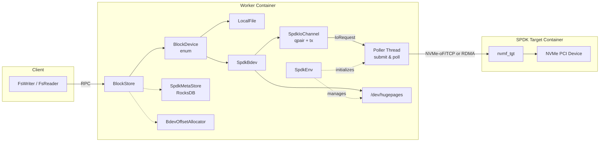
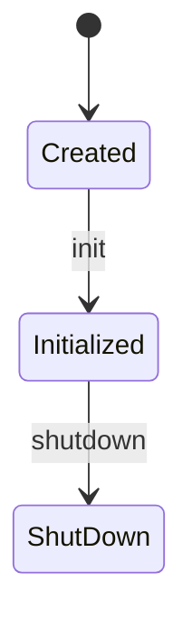
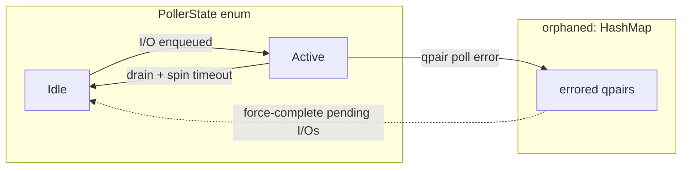
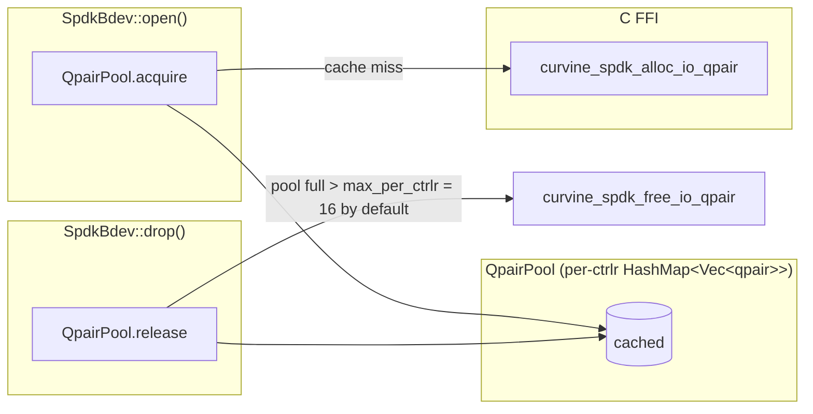
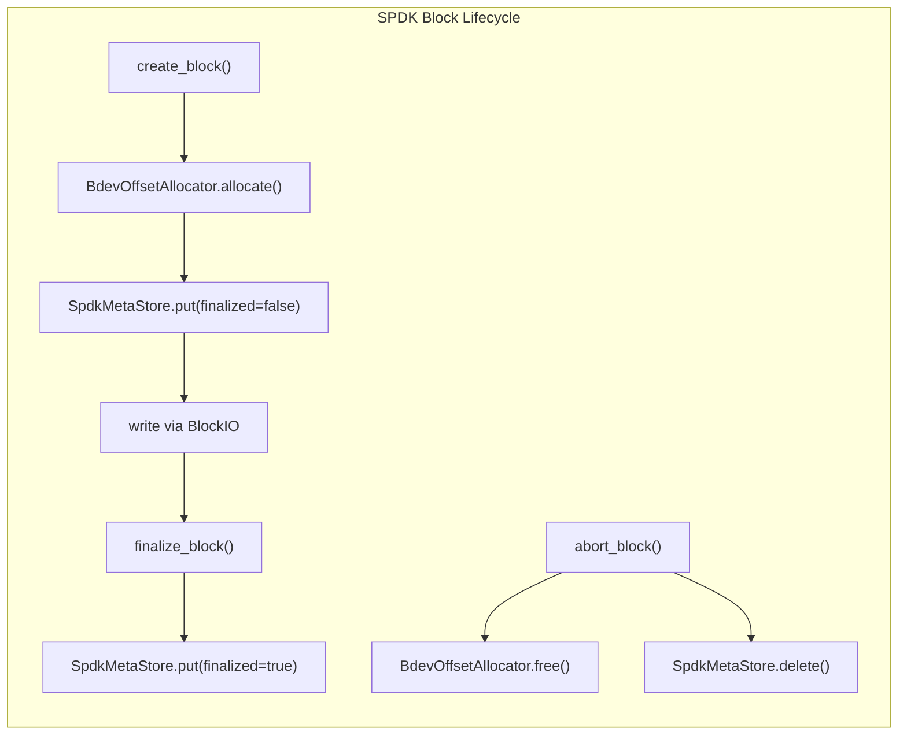

# SPDK 集成架构

## 概述

SPDK（Storage Performance Development Kit）让 Curvine 能够绕过内核，在用户态执行 NVMe I/O。Worker 不再通过内核 VFS（`pread`/`pwrite`）读写数据，而是通过 TCP 或 RDMA 直接访问 NVMe-oF target，并配合专用 poller 线程和基于 hugepage 的 DMA 缓冲区，将延迟降到最低。

Curvine 将 SPDK 作为一种**远程块设备**使用。NVMe-oF target 可以是同一主机上的物理 NVMe 盘、专用的 SPDK target 容器，也可以是远程存储节点。Worker 会打开 `SpdkBdev` 句柄（类似 `LocalFile`），并通过 `BlockIO` trait 发起读写 I/O。

## 什么时候使用 SPDK

SPDK 原生可以在单核上达到超过 1000 万 IOPS[[1]](#ref-spdk-iops)。Curvine 的 SPDK 路径面向内核 VFS 开销成为瓶颈的工作负载。当你需要比 LocalFile 更低的延迟或更高的吞吐时，就适合启用 SPDK。

## 系统架构



## 核心组件

### SpdkEnv（全局环境）

`orpc/src/io/spdk_env.rs`

`SpdkEnv` 是初始化 SPDK 应用框架的单例，负责 DPDK EAL、hugepage 和 reactor mask 等全局资源。启动时它会执行以下操作：

1. 为 DMA 缓冲区分配 hugepage
2. 通过 `reactor_mask` 设置 CPU 亲和性
3. 发现 NVMe-oF target 及其 namespace
4. 创建 `SpdkPoller` 线程
5. 为每个 controller 维护 qpair 池

每个 Worker 进程只会存在一个 `SpdkEnv`，并从 `SpdkConf` 初始化。

#### SpdkEnvState

`orpc/src/io/spdk_env.rs`

`SpdkEnvState` 是控制 `SpdkEnv` 初始化和关闭的三状态生命周期状态机：



它以 `AtomicU8` 存储，支持无锁读取。该状态会限制句柄获取流程（`acquire_handle` 先增加计数，再校验状态为 `Initialized`），并通过 CAS 将 `Initialized → ShutDown`，防止并发关闭。

### SPDK FFI 层

`orpc/src/io/spdk_ffi.rs`

Curvine 通过一层很薄的 FFI 与 SPDK C 库交互，从而将 Rust 代码与 SPDK 的 C ABI 隔离开。这里主要使用三种技术：

- **不透明 ZST 指针**：`spdk_nvme_ctrlr` 等 SPDK 类型在 Rust 中声明为零大小 enum，仅用于编译期类型安全；运行时仍是直接传给 C 的原始指针。
- **固定大小字节缓冲区**：SPDK C 结构体（异步上下文、namespace 数据等）用带有 `#[repr(C, align(8))]` 的 `[u8; N]` 表示，而不是逐字段复刻 C 布局。这样可以避免不同 SPDK 版本之间的结构体布局差异。
- **`curvine_*` C 辅助函数**：用小型 C wrapper 在已知偏移处设置结构体字段。例如 Rust 调用 `curvine_spdk_async_ctx_init(...)`，而不是直接操作 C 结构体字段。初始化时会通过运行时 `sizeof()` 检查比较 Rust 缓冲区大小和真实 C 结构体大小，一旦 ABI 漂移就能立即发现。

### SpdkPoller（专用 I/O 线程）

`orpc/src/io/spdk_poller.rs`

SPDK 要求所有 NVMe 命令提交和完成处理都在持有 SPDK reactor 上下文的同一个线程上执行。`SpdkPoller` 用来连接发起 I/O 的异步 handler 线程和同步的 SPDK 轮询循环。



- **Idle**：poller 阻塞在 `eventfd` 上，避免空转消耗 CPU。handler 线程在入队新请求时会通知 `eventfd`，将 poller 唤醒到 Active 状态。
- **Active**：从请求 channel 中取出待处理请求，通过 `spdk_nvme_ns_cmd_read`/`write` 提交 NVMe 命令，轮询 qpair 完成队列，并调用每个 I/O 的回调。队列为空后，它会先自旋 `spin_iter` 次再切回 Idle。这种 **spin-before-park** 策略避免了下一个 I/O 紧接到来时产生一次 `eventfd` 唤醒往返，使 poller 保持在低开销轮询循环中，而不是频繁执行 park/unpark 系统调用。
- **Orphaned（HashMap）**：当 `curvine_spdk_qpair_poll` 返回错误时，对应 qpair 会从 Active 转入 `orphaned` HashMap。poller 会通过 `force_complete_qpair` 强制完成该 qpair 上所有挂起 I/O，并用错误状态唤醒阻塞的 handler 线程。orphaned 记录会保留，用来接住后续迟到的 SPDK 回调。

### I/O 请求协议

`orpc/src/io/spdk_poller.rs`

handler 线程通过三种类型与 poller 通信：

- **IoOp**：操作枚举。`Read` 和 `Write` 携带 namespace、qpair、DMA buffer、offset 和 length；`Flush` 作用于 namespace；`UnregisterQpair` 用于通知清理。
- **IoRequest**：封装 `IoOp`、`Arc<IoCompletion>` 以及每个 bdev 的 inflight 计数器，通过 crossbeam channel 发送。
- **IoCompletion**：连接 handler 和 poller 线程。handler 在 `wait(timeout)` 上阻塞；poller 的 C 回调通过 `complete(status)` 唤醒它。

### SpdkBdev（块设备句柄）

`orpc/src/io/spdk_bdev.rs`

`SpdkBdev` 是每个 bdev 的句柄，类似 `LocalFile`。它持有：

- 原始 NVMe namespace 和 qpair 指针
- DMA 读写缓冲区（基于 hugepage、固定大小，由 `dma_buf_size` 控制，默认 1 MB，并在 I/O 间复用）
- 发送到 poller 线程的 I/O channel
- 当前偏移（`pos`）、设备大小、block size

大 I/O 会被**分块**：拆成 `dma_buf_size` 大小的 chunk，并串行提交。

`BlockDevice`（位于 `orpc/src/io/block_io.rs`）将 `SpdkBdev` 和 `LocalFile` 包装到同一个 enum 中，并实现 `BlockIO`。handler 代码在运行时通过 trait 分发，不需要知道底层使用哪个 backend。

### NVMe Queue Pair（Qpair）

`orpc/src/io/spdk_env.rs`

NVMe I/O queue pair（qpair）是主机与 NVMe-oF target 之间的通信通道。命令（read/write/flush）提交到 submission queue（SQ），完成事件从 completion queue（CQ）返回。poller 会轮询 CQ 来发现已完成的 I/O。

每个 `SpdkBdev` 都持有一个 qpair，并绑定到 target 的 namespace。qpair **不是线程安全的**，所有提交和轮询都必须在同一个线程上完成，这也是为什么需要一个专用 `SpdkPoller` 线程。

#### Qpair Pool

`orpc/src/io/spdk_env.rs`

分配和释放 qpair 需要通过 C FFI 调用 SPDK，而 SPDK 可能会进一步向 controller 发送 NVMe admin 命令。为了避免每次打开/关闭 bdev 都产生这类开销，`QpairPool` 会按 controller 缓存空闲 qpair：



- **Acquire**：弹出一个缓存 qpair（零 FFI）。如果池为空，则调用 `curvine_spdk_alloc_io_qpair` 分配新 qpair。
- **Release**：将 qpair 放回池中。如果池超过上限（默认每个 controller 16 个），则通过 `curvine_spdk_free_io_qpair` 释放多余 qpair，以限制 controller 侧内存占用。
- **Drain**：关闭时，`drain_all()` 会释放所有缓存 qpair。

### SpdkIoChannel

`orpc/src/io/spdk_bdev.rs:27`

`SpdkIoChannel` 是 `SpdkBdev` 和 `SpdkPoller` 之间的桥梁。每个 bdev 持有一个 channel，其中包含：

- **qpair**：用于发起命令的 NVMe queue pair
- **poller_tx**：用于向 poller 线程提交 `IoRequest` 的 crossbeam sender
- **eventfd**：用于从 Idle 状态唤醒 poller 的文件描述符
- **poller_is_sleeping**：由 poller 在 idle 时置为 true 的共享 `AtomicBool`；bdev 会检查它，从而跳过不必要的 eventfd write 系统调用

`SpdkIoChannel` 不直接保存 `SpdkPoller` 引用，所有通信都通过 channel 和 eventfd 完成，因此 bdev 可以做到线程安全。

### DmaBuf（DMA 缓冲区）

`orpc/src/io/spdk_bdev.rs`

`DmaBuf` 是一个预分配、固定大小、基于 hugepage 的 NVMe DMA 缓冲区。

- **Hugepage 支持**：通过 `curvine_spdk_dma_malloc` 分配，返回物理连续且固定的内存，满足 NVMe controller 的 DMA 要求，并减少大 I/O 中的 TLB miss。
- **预分配和复用**：每个 `SpdkBdev` 在打开时通过 `curvine_spdk_dma_malloc` 分配两个缓冲区（读 + 写），并在所有 I/O 中复用。这样避免了每次 I/O 都 malloc/free，首次分配之后使用成本很低。
- **关闭时清理**：在 `SpdkBdev::drop` 中通过 `curvine_spdk_dma_free` 释放缓冲区。如果 drop 截止时间前 inflight I/O 未清空，则将缓冲区指针置空，避免 use-after-free（以安全泄漏换取正确性）。
- **通过分块复用**：大 I/O 会被拆成 `dma_buf_size` 大小的 chunk，并通过同一个固定缓冲区串行处理，不需要动态大小的 DMA 内存。
- **块对齐**：所有 offset 都会向下对齐到设备 block size。这是 NVMe 规范要求，未对齐 DMA 地址会导致 controller 错误。

### BdevOffsetAllocator

`curvine-server/src/worker/storage/dir_state.rs`

使用 `LocalFile` 存储时，内核文件系统会为每个文件分配磁盘 block 并追踪空闲空间。使用 SPDK 时，多个 Curvine block 共享同一个原始 bdev，中间没有内核文件系统，NVMe 设备暴露的是扁平字节地址空间。`BdevOffsetAllocator` 用来替代内核 block allocator：它为每个 block 在 bdev 上分配唯一的字节范围，并在 block 删除时回收该范围。

它通过 bump cursor 管理新分配，并通过 free-list 记录已回收范围，同时合并相邻范围来减少碎片。该分配器是线程安全的。Worker 重启后，会通过 `SpdkMetaStore` 从 RocksDB 快照恢复 cursor 位置和 free-list，确保不会重复分配。当前实现是直接的 bump-and-free-list 设计，后续仍需要继续优化。

### SpdkMetaStore

`curvine-server/src/worker/storage/spdk_meta_store.rs`

`SpdkMetaStore` 是基于 RocksDB 的持久化 map：`block_id → (dir_id, offset, size, len, finalized)`。block 创建和 finalize 时会写入 metadata，Worker 重启时会从中恢复。

## 读路径

handler 调用 `SpdkBdev::read_region(enable_send_file, len)`，从 bdev 当前偏移开始读取。底层 `spdk_read()` 会将大读请求拆成 DMA buffer 大小的 chunk（默认 1 MB），并通过 poller 逐个处理：

1. 通过 crossbeam channel 向 poller 线程提交 `IoRequest`。如果 poller 处于 idle 状态，则通过 `eventfd` 唤醒它。
2. handler 阻塞在条件变量上等待完成。
3. poller 向 NVMe-oF target 提交 `spdk_nvme_ns_cmd_read`，轮询完成事件，然后通知 handler。
4. handler 将数据从 DMA buffer 拷贝到堆上的 `BytesMut`，再进入下一个 chunk。

所有 I/O 都会按块对齐（向下对齐到设备 block size）。未对齐读会读取完整的对齐 block，再把请求范围内的字节提取到结果中。

## 写路径

NVMe 命令要求 offset 和 length 都按块对齐。当写 offset 或 length 未对齐设备 block size 时，需要执行一次**读-改-写**流程：

1. 将完整的对齐 block 读入 DMA buffer（例如，在 offset 7 写入时，会从 offset 0 读取 4096 字节）
2. 将用户数据拷贝到 DMA buffer 中正确的位置，并保留写入范围之外的字节
3. 对完整的对齐 block 提交写命令

对于对齐写，只需要执行第 3 步，即直接提交 NVMe write 命令。

## Block 生命周期



## DMA 缓冲区管理

- 读写缓冲区默认都是 `dma_buf_size` 1 MB，在 `SpdkBdev::open()` 时预分配
- 更大的 I/O 会拆成 `dma_buf_size` 大小的 chunk，并串行处理
- 每个 chunk 都需要一次 DMA memcpy：读路径是 `DmaBuf → heap BytesMut`，写路径是 `heap → DmaBuf`

### 对齐约束

NVMe 命令要求 offset 和 length 都按块对齐：

```
Example: block_size = 4096, user wants to read 100 bytes at offset 7

aligned_off = 0         (align down)
head_skip  = 7          (unaligned prefix)
aligned_len = 4096      (round up)

NVMe reads 4096 bytes at offset 0
We copy only bytes [7..107] into the result
```

对于写入，未对齐 offset 或 length 会触发读-改-写流程（见写路径）。

## 配置

待补充

## 快速开始

待补充

## 优化实验：下一步

- **Target 侧混合模式**：将 active/idle 状态切换应用到 SPDK NVMe-oF target，在空闲时降低 CPU 使用率。
- **分配器改进**：在高负载下提升性能，减少碎片、锁竞争和时间复杂度。
- **I/O 提交与轮询**：尝试批量提交和多 poller 方案，以扩展吞吐能力。

## 代码参考

| 文件 | 作用 |
|---|---|
| `orpc/src/io/spdk_env.rs` | 全局 SPDK 环境初始化、SpdkEnvState 生命周期 |
| `orpc/src/io/spdk_poller.rs` | Poller 线程、I/O 提交、完成回调、IoOp/IoRequest/IoCompletion |
| `orpc/src/io/spdk_bdev.rs` | SpdkBdev 读写、SpdkIoChannel、DmaBuf、分块 I/O |
| `orpc/src/io/spdk_ffi.rs` | SPDK C 库的原始 FFI 绑定 |
| `orpc/csrc/spdk_opts_helper.c` | SPDK opts 初始化的 C 辅助函数 |
| `orpc/src/io/block_io.rs` | BlockIO trait 和 BlockDevice enum |
| `curvine-server/src/worker/storage/dir_state.rs` | BdevOffsetAllocator |
| `curvine-server/src/worker/storage/spdk_meta_store.rs` | 基于 RocksDB 的 block metadata |
| `curvine-server/src/worker/storage/vfs_dataset.rs` | 支持 SPDK create/finalize/abort 的 VfsDataset |
| `curvine-docker/deploy/spdk/curvine-cluster-spdk.toml` | SPDK worker 配置 |

<a id="ref-spdk-iops"></a>
[[1]] [10.39M Storage I/O Per Second From One Thread](https://spdk.io/news/2019/05/06/nvme/)